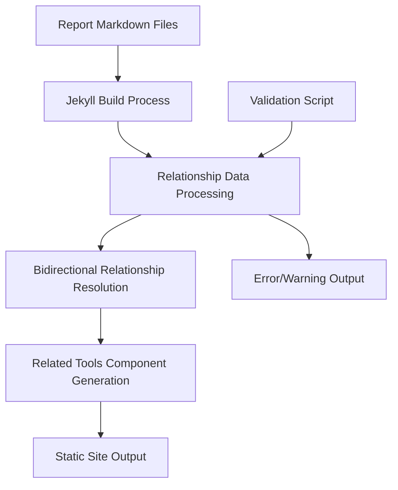

# Design Document

## Overview

レポート間の関係性をフロントマターで管理し、相互参照リンクを自動生成するシステムを設計します。このシステムは既存のJekyllベースのサイト構造を活用し、最小限の変更で関係性機能を実現します。

## Architecture

### System Components

1. **Front Matter Extensions**: 既存のフロントマターに関係性フィールドを追加
2. **Relationship Processing**: Jekyllのビルド時に関係性データを処理
3. **UI Components**: 関係性を表示するためのHTMLコンポーネント
4. **Validation System**: 関係性の整合性をチェックする仕組み

### Data Flow



## Components and Interfaces

### 1. Front Matter Schema

各レポートファイルのフロントマターに以下のフィールドを追加：

```yaml
# 既存のフィールド
title: "GitHub Actions 調査レポート"
tool_name: "GitHub Actions"
category: "CI/CD"
# ... 他の既存フィールド

# 新規追加フィールド
relationships:
  parent: "github"  # 親ツール（tool_nameで参照）
  children:         # 子ツール（tool_nameで参照）
    - "github-copilot"
  related_tools:    # 関連ツール（tool_nameで参照）
    - "gitlab-duo"
    - "jenkins"
```

### 2. Relationship Processing Logic

Jekyll Liquidテンプレートで関係性を処理：

```liquid
 関係性データの収集と処理 


  
     親子関係の処理 
     兄弟関係の処理 
  

```

### 3. Related Tools Component

新しいインクルードファイル `_includes/related-tools.html` を作成：

```html
<div class="related-tools-section">
  <h3>関連ツール</h3>
  
  
  <div class="parent-tool">
    <h4>親ツール</h4>
    <a href="{{ parent_tool.url }}">{{ parent_tool.title }}</a>
  </div>
  
  
  
  <div class="child-tools">
    <h4>子ツール</h4>
    <ul>
      
      <li><a href="{{ child.url }}">{{ child.title }}</a></li>
      
    </ul>
  </div>
  
  
  
  <div class="sibling-tools">
    <h4>関連ツール</h4>
    <ul>
      
      <li><a href="{{ sibling.url }}">{{ sibling.title }}</a></li>
      
    </ul>
  </div>
  
</div>
```

### 4. Integration Point

`_layouts/report.html` の既存の関連レポートセクションの前に新しいコンポーネントを挿入：

```html
<!-- 既存のreport-footerセクション内 -->
<footer class="report-footer">
  <!-- 既存のナビゲーション -->
  
  
  
  <!-- 既存の関連レポートセクション -->
  
  <div class="related-reports">
    <!-- 既存のタグベース関連レポート -->
  </div>
  
</footer>
```

## Data Models

### Relationship Data Structure

```yaml
# 内部的に処理される関係性データ構造
relationships_map:
  github:
    children: [github-actions, github-copilot]
    related: []
  github-actions:
    parent: github
    related: [gitlab-duo, jenkins]
  github-copilot:
    parent: github
    related: [cursor, kiro]
```

### Tool Reference Resolution

```liquid
 tool_nameからレポートオブジェクトを解決 


  
  

```

## Error Handling

### 1. Missing Reference Detection

```liquid
 存在しないtool_nameの参照をチェック 


  
    
    
      
        
        
      
    
    
      
    
  

```

### 2. Circular Reference Detection

```liquid
 循環参照の検出ロジック 

 親子関係の循環をチェック 
```

### 3. Inconsistency Warnings

- 親が子を認識していない場合の警告
- 双方向の関係性が一致しない場合の警告

## Testing Strategy

### 1. Unit Testing Approach

- 各Liquidテンプレートの個別テスト
- 関係性解決ロジックのテスト
- エラーハンドリングのテスト

### 2. Integration Testing

- 実際のレポートファイルを使用したエンドツーエンドテスト
- ビルドプロセス全体のテスト
- 生成されたHTMLの検証

### 3. Validation Testing

- 不正なフロントマターの処理テスト
- 存在しない参照の処理テスト
- 循環参照の検出テスト

### 4. Performance Testing

- 大量のレポートファイルでのビルド時間測定
- 関係性処理のパフォーマンス評価

## CSS Styling

### Related Tools Section Styling

```scss
.related-tools-section {
  margin: 2rem 0;
  padding: 1.5rem;
  border: 1px solid #e2e8f0;
  border-radius: 0.5rem;
  background-color: #f8fafc;
  
  h3 {
    margin-top: 0;
    color: #2d3748;
    border-bottom: 2px solid #4299e1;
    padding-bottom: 0.5rem;
  }
  
  .parent-tool, .child-tools, .sibling-tools {
    margin: 1rem 0;
    
    h4 {
      font-size: 1rem;
      color: #4a5568;
      margin-bottom: 0.5rem;
    }
    
    ul {
      list-style: none;
      padding: 0;
      
      li {
        margin: 0.25rem 0;
        
        a {
          color: #3182ce;
          text-decoration: none;
          
          &:hover {
            text-decoration: underline;
          }
        }
      }
    }
  }
  
  .parent-tool {
    border-left: 4px solid #48bb78;
    padding-left: 1rem;
  }
  
  .child-tools {
    border-left: 4px solid #ed8936;
    padding-left: 1rem;
  }
  
  .sibling-tools {
    border-left: 4px solid #9f7aea;
    padding-left: 1rem;
  }
}
```

## Migration Strategy

### Phase 1: Core Implementation
1. 関係性フィールドの定義
2. 基本的な関係性処理ロジックの実装
3. シンプルなUI コンポーネントの作成

### Phase 2: Enhanced Features
1. バリデーション機能の追加
2. エラーハンドリングの強化
3. スタイリングの改善

### Phase 3: Advanced Features
1. 関係性の可視化（グラフ表示）
2. 管理ツールの作成
3. パフォーマンス最適化

## Backward Compatibility

- 既存のフロントマターフィールドは変更しない
- 新しい関係性フィールドはオプショナル
- 既存のレポートは関係性なしでも正常に表示
- 既存のタグベース関連レポート機能は維持