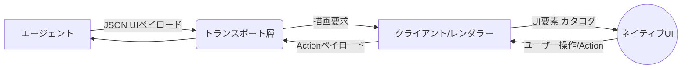

# **A2UI 調査レポート**

## **1. 基本情報**

* **ツール名**: A2UI (Agent-to-User Interface)
* **ツールの読み方**: エーツーユーアイ
* **開発元**: Google
* **公式サイト**: [https://a2ui.org/](https://a2ui.org/)
* **関連リンク**:
  * GitHub: [https://github.com/google/A2UI](https://github.com/google/A2UI)
* **カテゴリ**: Developer Tools
* **概要**: AIエージェントが、テキストだけでなくリッチでインタラクティブなUIを生成し、操作するためのオープンな宣言型UIプロトコル。セキュリティを確保しつつ、ネイティブなコンポーネントを用いた柔軟なUI描画を可能にする。

## **2. 目的と主な利用シーン**

* **解決する課題**: LLMを用いたエージェントはテキストやコードの生成には優れているが、リモートや異なるトラストバウンダリを越えてリッチなUIを提供することには課題があった（任意のコード実行リスクやiframeによる制約など）。A2UIはこれを解決し、安全かつネイティブなUI生成を可能にする。
* **想定利用者**: AIエージェント開発者、フロントエンドエンジニア、プラットフォーム開発者
* **利用シーン**:
  * 動的なデータ収集: 会話の文脈に合わせて、専用のフォーム（日付選択、スライダー、入力欄など）を動的に生成する。
  * リモートサブエージェント: メインのオーケストレーターが専門エージェント（旅行予約など）にタスクを委譲し、その結果をメインチャット画面内にUIペイロードとして描画する。
  * アダプティブワークフロー: ユーザーの要求に応じて、承認ダッシュボードやデータ可視化UIを即座に生成する。

## **3. 主要機能**

* **宣言型UI記述**: UIの構造をJSONフォーマットで表現し、LLMが段階的に生成・更新しやすい形式を提供する。
* **セキュアなコンポーネント呼び出し**: エージェントはクライアントが持つ「カタログ（事前承認されたUIコンポーネントのリスト）」から描画をリクエストするのみであり、任意のコード実行を防ぐ。
* **フレームワーク非依存**: A2UIのJSONペイロードは、Lit、Angular、React（Web）、Flutter、SwiftUI（モバイル）など、複数の異なるフレームワーク・クライアントで描画可能。
* **データバインディング**: UI構造、アプリケーション状態（データモデル）、クライアント描画を分離し、データバインディングによるリアクティブな更新を実現する。
* **カスタムコンポーネントの統合**: 既存のUIコンポーネントやレガシーコンテンツ向けのセキュアなiframeラッパーなどを、A2UIのデータバインディングやイベントシステムに接続可能。

## **4. 動作原理・システム構成**

* **アーキテクチャ**: クライアント・サーバー型プロトコル（エージェントとクライアント間のUIメッセージングプロトコル）
* **主要コンポーネントとデータフロー**:
  * **エージェント（サーバー側）**: ユーザーの入力やタスクに応じ、テキストと共にUIを構築・更新するメッセージ（JSONペイロード）を生成。
  * **クライアント（レンダラー側）**: エージェントから受け取ったメッセージを解釈し、事前定義された「カタログ（利用可能なコンポーネントのリスト）」に基づいてネイティブUIを描画。ユーザー操作によるイベント（Action）をエージェントに送信。
* **特筆すべき要素技術**:
  * **宣言型プロトコル**: HTML/JSなどのコードではなく、データのみを通信することでセキュアなUI生成を実現。
  * **ストリーミング描画**: 段階的にUIを生成・更新し、AIの生成プロセスと同期してリアルタイムな体験を提供。



## **5. 開始手順・セットアップ**

* **前提条件**:
  * Node.js (Webクライアント用)
  * Python (エージェントサンプル用)
  * Gemini API Key (サンプルの実行に必要)
* **インストール/導入**:

  ```bash
  # リポジトリのクローン
  git clone https://github.com/google/A2UI.git
  cd A2UI
  ```

* **初期設定**:
  * APIキーの設定: `export GEMINI_API_KEY="your_gemini_api_key"`
* **クイックスタート**:
  * エージェント（バックエンド）の実行:

    ```bash
    cd samples/agent/adk/restaurant_finder
    uv run .
    ```

  * クライアント（フロントエンド）のビルドと実行:

    ```bash
    cd renderers/markdown/markdown-it && npm install && npm run build
    cd ../../web_core && npm install && npm run build
    cd ../lit && npm install && npm run build
    cd ../../samples/client/lit/shell && npm install && npm run dev
    ```

## **6. 特徴・強み (Pros)**

* セキュリティファースト: コードではなくデータを送信するため、LLMによる任意のコード生成・実行リスクがない。
* ネイティブな使い心地: iframeに依存せず、クライアントのネイティブコンポーネントを使用するため、アプリケーションのスタイリング、アクセシビリティ、パフォーマンスを引き継げる。
* 高い移植性: 同一のA2UI JSONペイロードで、Web、モバイル、デスクトップなど様々なプラットフォーム向けに描画が可能。
* LLM親和性: ID参照を用いたフラットなコンポーネントリスト構造により、LLMが段階的に生成・修正・ストリーミングしやすい設計。

## **7. 弱み・注意点 (Cons)**

* アーリーステージ: 現在はv0.9.1（Stable）およびv1.0（Candidate）が公開されているが、まだエコシステム全体としては発展途上であり、将来的な仕様変更の可能性がある。
* 堅牢なスタイリングシステムの非サポート: 意図的にスタイリングはクライアント側に委ねており、サーバーサイドからの柔軟なスタイリングには制限がある。
* エコシステムの発展途上: React、iOS (SwiftUI)、Jetpack Composeなどの公式レンダラーサポートは今後のロードマップとなっている。

## **8. 料金プラン**

| プラン名 | 料金 | 主な特徴 |
|---------|------|---------|
| **オープンソース** | 無料 | Apache License 2.0 に基づき全機能が無料で利用可能 |

* **課金体系**: なし (オープンソース)
* **無料トライアル**: なし (全体が無料)

## **9. 導入実績・事例**

* **導入企業**: 現在はパブリックプレビュー段階のため、大規模な公開事例は限定的。
* **導入事例**: CopilotKitによるA2UI Widget Builderの提供など、エージェントプラットフォームでの実験的統合が進んでいる。
* **対象業界**: AI開発、SaaS開発、エンタープライズツール

## **10. サポート体制**

* **ドキュメント**: 公式サイト (a2ui.org) にて、概念からセットアップガイド、リファレンスまで包括的なドキュメントが提供されている。
* **コミュニティ**: GitHubのIssueやDiscussionsを通じたオープンソースコミュニティでのやり取り。
* **公式サポート**: オープンソースプロジェクトのため、企業向けの専用サポート窓口は提供されていない。

## **11. エコシステムと連携**

### **11.1 API・外部サービス連携**

* **API**: A2A ProtocolやAG UIなどのトランスポートレイヤーと互換性がある。
* **外部サービス連携**: JSON出力が可能な任意のLLM（Geminiなど）で生成可能。GenUI SDK (Flutter) などでも内部的に活用されている。

### **11.2 技術スタックとの相性**

| 技術スタック | 相性 | メリット・推奨理由 | 懸念点・注意点 |
|:---|:---:|:---|:---|
| **Lit / Web Components** | ◎ | 公式レンダラーが提供されており、サンプルも充実 | 特になし |
| **Flutter** | ◎ | GenUI SDKを通じて統合可能 | 特になし |
| **React** | ◯ | コミュニティによる対応または今後の公式サポート予定 | 現在は公式のフルサポート前 |
| **SwiftUI / Jetpack Compose** | △ | ロードマップに含まれているが未提供 | 自前でレンダラーの実装が必要 |

## **12. セキュリティとコンプライアンス**

* **認証**: A2UIはUIプロトコルであり、認証・認可はトランスポート層およびクライアント・サーバーのアプリケーション層で実装する前提。
* **データ管理**: セキュリティファーストを掲げ、実行可能コードではなく宣言的なデータをやり取りすることで、XSSなどのリスクを根源的に排除している。
* **準拠規格**: オープンソースソフトウェアとしての一般的な基準に準ずる。

## **13. 操作性 (UI/UX) と学習コスト**

* **UI/UX**: クライアント側のネイティブコンポーネントを使用するため、アプリケーションとシームレスに統合された優れたUXを提供できる。
* **学習コスト**: A2UIのプロトコル仕様自体（Surface、Component、Data Modelなど）を理解する必要がある。クライアント側でのレンダラー統合や、サーバー側でのエージェント開発には一定の学習コストが伴う。

## **14. ベストプラクティス**

* **効果的な活用法 (Modern Practices)**:
  * クライアント側で事前に承認されたコンポーネントの「カタログ」を定義し、エージェントにはそのカタログに基づく描画のみを許可する。
  * UIの構造変更とデータモデルの更新を明確に分離してメッセージングを行う。
* **陥りやすい罠 (Antipatterns)**:
  * A2UIを用いて静的なWebサイトを構築しようとする（A2UIはエージェント主導の動的インターフェース向け）。
  * サーバー側から過度に複雑なスタイリングを強制しようとする（スタイリングはクライアント側に委ねるべき）。

## **15. ユーザーの声（レビュー分析）**

* **調査対象**: GitHub、X (Twitter)、技術ブログなど
* **総合評価**: オープンソースのプレビュー段階のため、商用レビューサイト等でのスコア化はなし。
* **ポジティブな評価**:
  * 「AIが生成したUIを安全に描画できる宣言型アプローチは、セキュリティ面で非常に優れている」
  * 「iframeの制約から解放され、ネイティブアプリにスムーズに組み込める点が素晴らしい」
* **ネガティブな評価 / 改善要望**:
  * 「Reactなど、より多くの主要フレームワーク向けの公式レンダラーサポートを早く提供してほしい」
  * 「仕様がまだ流動的なため、本番環境への導入には慎重になる」
* **特徴的なユースケース**:
  * エージェントベースのチャットインターフェース内で、複雑なフォームやダッシュボードを動的に生成するユースケース。

## **16. 直近半年のアップデート情報**

* **2026-09-09**: A2UI v1.0 (Candidate) 仕様の公開。クライアントからサーバーへのRPC（`actionResponse`）の追加、アクションIDの導入、`theme`から`surfaceProperties`への名称変更など。
* **2026-08-XX**: A2UI v0.9.1 (Stable) リリースの公開。`application/a2ui+json` MIMEタイプの標準化、および`surfaceId`の制約緩和を含む小規模な改善。
* **2026-XX-XX**: A2UI v0.9 (Previous Stable) 仕様の公開。プロンプトファーストな設計への哲学的なシフト、`createSurface`の導入、クライアントサイド関数、カスタムカタログ、検証エラーフォーマットなどを導入。
* **202X-XX-XX**: A2UI v0.8 Public Preview版のリリース。

(出典: [A2UI Specifications](https://a2ui.org/specification/v0.9.1-a2ui/)、[GitHub Releases](https://github.com/a2ui-project/a2ui/releases))

## **17. 類似ツールとの比較**

### **17.1 機能比較表 (星取表)**

| 機能カテゴリ | 機能項目 | 本ツール (A2UI) | Vercel AI SDK | CopilotKit | iframeアプローチ |
|:---:|:---|:---:|:---:|:---:|:---:|
| **基本機能** | UI生成 | ◎<br><small>宣言型</small> | ◎<br><small>Reactコンポーネントストリーミング</small> | ◎<br><small>Reactコンポーネント連携</small> | ◯<br><small>HTML生成</small> |
| **セキュリティ** | コード実行防止 | ◎<br><small>データのみでセキュア</small> | ◯<br><small>実装依存</small> | ◯<br><small>実装に依存</small> | ×<br><small>スクリプト実行リスク</small> |
| **プラットフォーム** | クロスプラットフォーム | ◎<br><small>Web/Mobile対応</small> | △<br><small>主にReact/Web</small> | △<br><small>React中心</small> | △<br><small>Web中心</small> |
| **開発体験** | 標準化 | ◎<br><small>プロトコルとして標準化</small> | ◎<br><small>Next.js環境で強力</small> | ◯<br><small>エコシステム内で標準化</small> | ◯<br><small>既存技術</small> |

### **17.2 詳細比較**

| ツール名 | 特徴 | 強み | 弱み | 選択肢となるケース |
|---------|------|------|------|------------------|
| **本ツール (A2UI)** | プロトコルベースの宣言型UI | セキュア、クロスプラットフォーム対応 | エコシステムが発展途上 | 複数の異なるプラットフォームでネイティブUIを描画したい場合 |
| **Vercel AI SDK** | 汎用的なAIアプリケーション構築フレームワーク | Next.js/Reactとの強力な統合、豊富なモデルサポート | Reactエコシステムに強く依存 | React/Next.jsを中心に開発している場合 |
| **CopilotKit** | アプリケーションへのAIコパイロット組み込みフレームワーク | 既存アプリへの組み込みが容易、豊富なバックエンド連携 | 基本的にReact中心 | 既存のReactアプリにAIアシスタントを素早く組み込みたい場合 |
| **iframeアプローチ** | LLMにHTML/JSを生成させる | 既存のWeb技術をそのまま使える | セキュリティリスク、ネイティブ感の欠如 | プロトタイプや、隔離された環境での描画が許容される場合 |

## **18. 総評**

* **総合的な評価**:
  * A2UIは、AIエージェントとユーザーの対話において、テキストだけでは限界があった「リッチなUIの提供」という課題に対し、宣言型のデータプロトコルという本質的かつセキュアな解決策を提示しています。アーリーステージながらも、そのアーキテクチャは非常に強力です。
* **推奨されるチームやプロジェクト**:
  * AIエージェントを自社のWeb/モバイルアプリケーションにネイティブな形で組み込みたい開発チームや、マルチエージェントプラットフォームの構築を目指すプロジェクトに最適です。
* **選択時のポイント**:
  * 現状はReactのみに依存するならVercel AI SDKやCopilotKitなども強力な選択肢ですが、クロスプラットフォーム（Flutterやその他のWebフレームワーク）への対応や、独自の「カタログ」による厳密なセキュリティ制御を求める場合は、A2UIが有力な選択肢となります。
