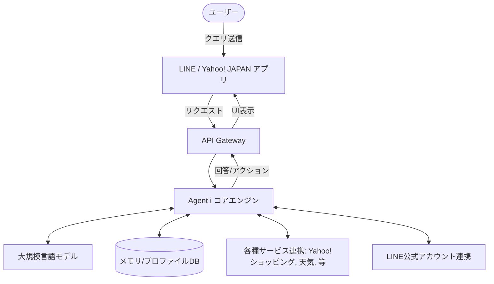

# **Agent i 調査レポート**

## **1. 基本情報**

* **ツール名**: Agent i
* **ツールの読み方**: エージェント アイ
* **開発元**: LINEヤフー株式会社
* **公式サイト**: [https://events.yahoo.co.jp/agent-i/](https://events.yahoo.co.jp/agent-i/)
* **関連リンク**:
  * ドキュメント (ガイドライン): [https://search.yahoo.co.jp/guidelines/generativeaiguideline](https://search.yahoo.co.jp/guidelines/generativeaiguideline)
* **カテゴリ**: 汎用パーソナルアシスタント
* **概要**: これまで提供していた「Yahoo! JAPAN」の「AIアシスタント」と「LINE」の「LINE AI」を統合し、「毎日のそばに、だれでも使えるAIを。」をコンセプトとしたAIエージェント。「LINE」と「Yahoo! JAPAN」の両サービスからワンタップでシームレスにアクセスでき、さまざまな疑問解決や提案を行う。

## **2. 目的と主な利用シーン**

* **解決する課題**: 日常生活における調べ物、意思決定のサポート、タスク代行
* **想定利用者**: LINE、Yahoo! JAPANの一般ユーザー
* **利用シーン**:
  * 「新しい家電がほしい」時の商品選びサポート
  * 「京都の観光モデルコースを作って」といったおでかけプラン作成
  * 毎日の献立提案や食材活用レシピの相談

## **3. 主要機能**

* **ジャンル特化型の領域エージェント**: 「お買い物」「おでかけ」「天気」など、特定のタスクに特化したエージェント機能（自動車、人間関係、仕事関係、レシピなども提供）。
* **シームレスなアクセス**: 「LINE」の各タブや「Yahoo! JAPAN」の検索窓横にアイコンが表示され、ワンタップでアクセス可能。
* **ワンタップ入力 (UI/UX)**: 複雑なプロンプトの入力が不要で、興味関心に応じた選択肢をタップするだけで必要な情報にたどり着ける。
* **最適化された提案**: LINEヤフーの100を超えるサービスから得られるデータと連携し、ユーザーの状況に合わせた提案を実施。
* **タスク代行機能**: LINE公式アカウントとの連携で、予約や購入からアフターフォローまで一貫して支援。
* **メモリ機能**: ユーザーの利用状況や設定に応じて、プライバシーに配慮しながら最適化された回答ができるメモリ機能。

## **4. 動作原理・システム構成**

* **アーキテクチャ**: クラウド完結型SaaS (LINE/Yahoo! JAPANアプリ統合型プラットフォーム)
* **主要コンポーネントとデータフロー**:
  * ユーザーのクエリはLINE/Yahoo! JAPANのインターフェースから送信され、LINEヤフーの共通基盤で処理される。
  * 100以上の自社サービス（Yahoo!ショッピング、Yahoo!天気など）のAPIと連携して情報を取得し、LLMを通じて回答を生成。
* **特筆すべき要素技術**:
  * LINE公式アカウント連携によるアクション実行の自動化。

## **5. 開始手順・セットアップ**

* **前提条件**:
  * Yahoo! JAPANアプリ (iOS 4.132.0以上、Android 3.187.0以上)、またはLINEアプリ (iOS 18以上、Android 12以上)、PC/スマホブラウザ
  * ヤフーサービスからの利用で自由入力を行う場合はYahoo! JAPAN IDでのログインが必要
  * 13歳以上
* **インストール/導入**:
  * アプリ（LINE、Yahoo! JAPAN）のインストールまたはアップデートのみで利用可能。
* **初期設定**:
  * 特になし。既存のアカウント（LINE、Yahoo! JAPAN ID）で利用。
* **クイックスタート**:
  * LINEアプリのタブまたはYahoo! JAPANの検索窓横の「Agent i」アイコンをタップする。

## **6. 特徴・強み (Pros)**

* **圧倒的なアクセスのしやすさ**: 多くの人が日常的に利用するLINEやYahoo! JAPANからワンタップで起動できるため、導入のハードルが極めて低い。
* **LINEヤフーの経済圏との連携**: Yahoo!ショッピング、Yahoo!天気などの自社サービスと深く連携し、具体的なアクション（購入、予約など）に直結しやすい。
* **直感的なUI**: プロンプトエンジニアリングを意識させない、選択肢タップ型のUIで初心者でも簡単に使いこなせる。

## **7. 弱み・注意点 (Cons)**

* **AIの不確実性**: ガイドラインにも記載がある通り、AIが生成する回答には不正確な情報が含まれる可能性がある。
* **利用制限**: 13歳未満は利用不可。自由入力など一部機能はYahoo! JAPAN IDのログインが必須。
* **高度な業務・専門タスクへの適応性**: 生活密着型に特化しているため、複雑なプログラミングや専門的業務には不向き。

## **8. 料金プラン**

| プラン名 | 料金 | 主な特徴 |
|---------|------|---------|
| **無料プラン** | 無料 | 基本的なAIエージェント機能（お買い物、おでかけ、天気など）の利用が可能。 |

* **課金体系**: 無料
* **無料トライアル**: なし

## **9. 導入実績・事例**

* **導入企業**: BtoC向けの一般サービスのため、特定の企業導入事例はなし。BtoB向け「Agent i Biz」は順次展開中。
* **導入事例**: BtoC向けの一般サービスのため、特定の事例はなし。
* **対象業界**: 一般消費者向け

## **10. サポート体制**

* **ドキュメント**: [生成AIガイドライン](https://search.yahoo.co.jp/guidelines/generativeaiguideline)
* **コミュニティ**: 特になし
* **公式サポート**: [LINEヤフー株式会社 ヘルプ・お問い合わせ](https://support.yahoo-net.jp/PccHelpcenter/s/)

## **11. エコシステムと連携**

### **11.1 API・外部サービス連携**

* **API**: 一般公開されているAPIは現状なし。企業向けには「Agent i Biz」および「LINE OA AIモード」が提供。
* **外部サービス連携**: Yahoo!ショッピング、Yahoo!天気など、LINEヤフーが提供する100以上のサービスとの連携が中心。また、LINE公式アカウント情報との連携によるタスク代行が可能。

### **11.2 技術スタックとの相性**

本ツールは一般ユーザー向けのWeb/アプリサービスであり、開発者向けのSDKなどは提供されていないため、技術スタックとの相性評価は該当しない。

## **12. セキュリティとコンプライアンス**

* **認証**: Yahoo! JAPAN ID、LINEアカウント連携。ログインは「パスキー」に一本化。
* **データ管理**: LINEヤフーのプライバシーポリシーに準拠。入力データの扱いについてはガイドラインに基づく。
* **準拠規格**: 公式サイトで公開されていない。

## **13. 操作性 (UI/UX) と学習コスト**

* **UI/UX**: プロンプト（指示文）の入力に不慣れなユーザーでも使えるよう、ボタンタップで目的の情報にたどり着ける直感的なUIを提供。
* **学習コスト**: 極めて低い。日常的に使っているアプリの中に組み込まれているため、新たなツールの使い方を覚える必要がない。

## **14. ベストプラクティス**

* **効果的な活用法 (Modern Practices)**:
  * 単なる調べ物だけでなく、「比較して」「予定を作って」といった具体的な目的を持って領域エージェントを活用する。
* **陥りやすい罠 (Antipatterns)**:
  * 個人情報や機密情報を入力すること（ガイドラインで注意喚起されている一般的な生成AI利用の注意点）。

## **15. ユーザーの声（レビュー分析）**

* **調査対象**: 主要なアプリストアおよびSNS上の口コミ
* **総合評価**: 該当なし（独立したアプリではないため、各プラットフォームの評価に依存）
* **ポジティブな評価**:
  * アプリを切り替えずにLINE/Yahoo内でそのままAIに相談できる手軽さが評価されている。
* **ネガティブな評価 / 改善要望**:
  * 専門的な質問に対しては他のLLMと比較して回答の深さが足りないとの声。
* **特徴的なユースケース**:
  * 毎日の献立作成や、週末の短いお出かけプランの生成など、生活に密着した気軽な利用。

## **16. 直近半年のアップデート情報**

* **2026-08-XX**: 企業向けエージェント「Agent i Biz」の提供開始。
* **2026-06-XX**: タスク代行機能、およびユーザーの好みに応じたメモリ機能の実装。
* **2026-04-20**: AIエージェントの新ブランド「Agent i」の提供開始。「お買い物」「おでかけ」「天気」など7種類の領域エージェントが利用可能に。

(出典: [LINEヤフー プレスリリース一覧](https://www.lycorp.co.jp/ja/news/release/))

## **17. 類似ツールとの比較**

### **17.1 機能比較表 (星取表)**

| 機能カテゴリ | 機能項目 | 本ツール | ChatGPT | Microsoft 365 Copilot | Gemini |
|:---:|:---|:---:|:---:|:---:|:---:|
| **基本機能** | 対話型AI応答 | ◯ <small>日常利用に特化</small> | ◎ <small>汎用的・高度</small> | ◎ <small>汎用的・高度</small> | ◎ <small>汎用的・高度</small> |
| **カテゴリ特定** | サービス連携（独自エコシステム） | ◎ <small>LINE/Yahoo圏内と強力に連携</small> | △ <small>各種プラグイン</small> | ◎ <small>Microsoft 365圏内</small> | ◎ <small>Google Workspace</small> |
| **カテゴリ特定** | タスク代行（エージェント） | ◯ <small>LINE OA等と連携した代行</small> | ◯ <small>限定的</small> | ◯ <small>Office作業自動化</small> | ◯ <small>限定的</small> |
| **非機能要件** | 日本語対応 | ◎ <small>完全対応・国内特化</small> | ◯ <small>対応</small> | ◯ <small>対応</small> | ◯ <small>対応</small> |

### **17.2 詳細比較**

| ツール名 | 特徴 | 強み | 弱み | 選択肢となるケース |
|---------|------|------|------|------------------|
| **本ツール** | 国内最大級のプラットフォーム統合AI | LINE/Yahooの日常アプリからシームレスに利用可能 | 高度なプログラミングや専門的業務には不向き | 日常の買い物、お出かけ、天気など生活密着型のタスク |
| **ChatGPT** | 汎用性の高いLLMチャット | 幅広い知識と高度な推論能力 | 国内の特定のサービス（購買など）との直接連動は弱い | 複雑なテキスト生成、要約、コーディング、専門知識の検索 |
| **Microsoft 365 Copilot** | Microsoftエコシステム統合AI | Office製品やWindowsとの深い連携 | Microsoftアカウントや製品の利用が前提、有償 | 業務での文書作成、データ分析、情報検索 |
| **Gemini** | GoogleのマルチモーダルAI | Google検索やGoogle Workspaceとの強力な連携 | 特定機能は有料プランが必要 | Web検索を伴う調査、Googleドキュメント等での作業 |

## **18. 総評**

* **総合的な評価**:
  * Agent iは、高度な専門性を追求するのではなく、「毎日のそばに、だれでも使えるAI」というコンセプトを体現したツール。国内の強力なプラットフォームであるLINEとYahoo! JAPANのアセットを最大限に活かし、ユーザーが意識せずに生成AIの恩恵を受けられる仕組み作りが優れている。
* **推奨されるチームやプロジェクト**:
  * 業務チームへの一括導入よりは、個人の日常生活・コンシューマー領域における利便性向上に推奨される。
* **選択時のポイント**:
  * 業務用の高度なタスクや開発作業にはChatGPT等の他のLLMを使い、日々の献立決定、週末の予定決め、ちょっとした買い物相談など、スマートフォンでのスキマ時間の「意思決定サポート」として本ツールを利用するのが最適。
