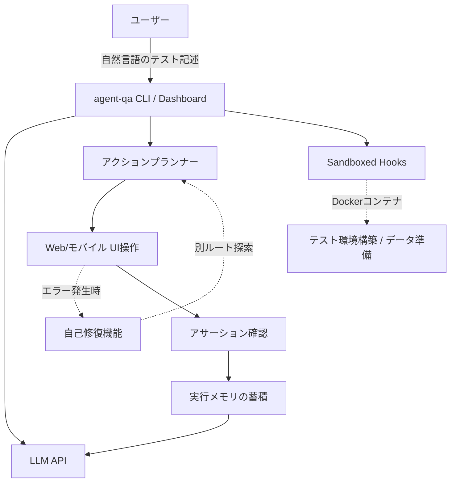

# **agent-qa 調査レポート**

## **1. 基本情報**

* **ツール名**: agent-qa
* **ツールの読み方**: エージェントキューエー
* **開発元**: Vostride AI
* **公式サイト**: [https://vostride.com/docs/agent-qa](https://vostride.com/docs/agent-qa)
* **関連リンク**:
  * GitHub: [https://github.com/vostride/agent-qa](https://github.com/vostride/agent-qa)
  * ドキュメント: [https://vostride.com/docs/agent-qa](https://vostride.com/docs/agent-qa)
* **カテゴリ**: AIテスト自動化
* **概要**: 自然言語でWeb・モバイルアプリのテストを記述し、実行のたびに自己改善するオープンソースのAIエージェント型QAツール。

## **2. 目的と主な利用シーン**

* **解決する課題**: 従来のE2Eテストでは、UIの変更（IDやクラス名、要素の配置変更）が発生するたびにテストコードを修正する必要があり、メンテナンスコストが高かった課題を解決する。
* **想定利用者**: アジャイル開発チームの開発者、QAエンジニア、テスト自動化エンジニア。
* **利用シーン**:
  * 自然言語でのE2Eテストの作成および自動実行。
  * WebアプリケーションおよびモバイルアプリケーションのUI回帰テスト。
  * フリートライアルやログインなどの複雑な状態を含むユーザーテストフローの自動化。

## **3. 主要機能**

* **自然言語によるテスト記述**: アクションやアサーションを自然言語で定義し、人間が見て理解できるテストスクリプトを作成。
* **自己修復機能 (Self-healing test execution)**: クリックや入力などのサブアクションが失敗した場合、エージェントが再度UIを観察し、別ルートを探索してテストを継続する。
* **実行メモリの蓄積と学習 (Self-improves with Memory)**: 実行ごとのプロダクトの振る舞いやスイートのコンテキストをメモリとして蓄積し、次回のテストで失敗を回避するように学習する。
* **アクションキャッシュ (Accelerate runs with smart Cache)**: 検証済みのアクションプランをキャッシュし、2回目以降の実行を高速化（トークン消費量や時間を削減）。
* **サンドボックスフックの実行**: Dockerコンテナ（Node, Bun, Python, Bash等）内で、テスト前後の環境構築、API呼び出し、データ準備（シード）、クリーンアップを安全に実行。
* **モデルの選択自由 (Bring your own LLM)**: OpenAI, Anthropic, Gemini, Codex, Claude CodeやローカルLLMなど、任意のモデルを選択可能。
* **認証状態の管理 (Auth state)**: ログイン状態を一度キャプチャし、論理名で再利用可能。

## **4. 動作原理・システム構成**

* **アーキテクチャ**: クライアント・サーバー型およびコンテナ環境（Docker）を利用したローカルテスト実行アーキテクチャ。
* **主要コンポーネントとデータフロー**:
  * ユーザーが自然言語で記述したYAMLファイル（テストスクリプト）をagent-qaのCLIやDashboardが読み込む。
  * エージェントはLLM APIと連携し、対象のWeb/モバイルアプリのUI状態（ロール、ラベルなど）を分析、実行計画を生成する。
  * アクションが成功すれば結果を評価し、エラーが起きれば自己修復機能が働き、再度UIを読み取り別経路を探る。
  * 実行のたびに「メモリ」としてプロダクトの動作や修復履歴を記録し、次回から再利用する。
* **特筆すべき要素技術**:
  * **Docker**: フック実行のための分離されたサンドボックス環境として利用。
  * **Playwright等のブラウザ制御エンジン**: 背後でのブラウザ操作に利用。
  * **MCP / LLM API連携**: 外部ツールやLLMとの通信。



## **5. 開始手順・セットアップ**

* **前提条件**:
  * Node.js環境（npm / npx利用）
  * Docker（フック実行のためのサンドボックスとして必須）
* **インストール/導入**:

  ```bash
  npm install -D agent-qa
  ```

  Codexなどのサブスクリプション認証を利用する場合は以下もインストールする:
  ```bash
  npm install -D @vostride/agent-qa-subscription-auth
  ```

* **初期設定**:
  * 初期化とブラウザのインストール:
    ```bash
    npx agent-qa init
    npx agent-qa install-browsers --chromium
    ```
* **クイックスタート**:
  * ダッシュボードの起動:
    ```bash
    npx agent-qa dashboard --open
    ```
  * CLIでのテスト実行:
    ```bash
    npx agent-qa run tests/example.yaml
    ```

## **6. 特徴・強み (Pros)**

* **UI変更に強い自動修復**: 従来のテストツールのようにセレクタ（CSSやXPath）に依存しないため、ボタンの色や配置が変更されても自動的に要素を見つけ出してテストを完了できる。
* **自己改善するメモリ機能**: 一度つまずいた箇所や自己修復で解決した手順を記憶し、将来のテスト実行をより高速かつ確実にできる。
* **コードベースの管理**: テストスクリプトがYAML形式で記述されるため、Gitなどのバージョン管理システムで差分（Diff）をレビューしやすい。
* **ローカルでの高い拡張性**: サンドボックス化されたDockerコンテナで任意のスクリプト（Python, Nodeなど）を実行でき、CI/CDとの統合も容易。

## **7. 弱み・注意点 (Cons)**

* **実行コストと速度**: LLMを経由してUIの判断を行うため、従来のプログラム型E2Eテスト（Playwrightなど）と比べて1ステップあたりの実行時間が長く、API利用料（トークンコスト）も発生する（ただしキャッシュ機能で軽減可能）。
* **Docker環境の必須化**: フック機能などを利用するにはローカルやCI環境でDockerが動作している必要があり、環境構築のハードルが少し上がる場合がある。
* **日本語ドキュメントの不足**: 現状、公式ドキュメントやUIが英語主体である可能性が高く、日本語でのトラブルシューティング情報が少ない。

## **8. 料金プラン**

| プラン名 | 料金 | 主な特徴 |
|---------|------|---------|
| **オープンソース (OSS)** | 無料 | パッケージをローカルにインストールし、すべての機能を利用可能。ただしLLMのAPI利用料は別途ユーザー負担。 |

* **課金体系**: ツール自体は無料（FSL-1.1-ALv2ライセンス等）。利用するLLM（OpenAI, Anthropic等）のAPIトークン課金が別途必要。
* **無料トライアル**: オープンソースであるため、制限なく利用可能。

## **9. 導入実績・事例**

* **導入企業**: 2026年リリース時点での公開導入事例はまだ少ないが、オープンソースコミュニティやGitHub上で注目を集めている。
* **導入事例**: 具体的な企業名は公開されていないが、GitHubプロジェクトとしてWebやモバイルアプリのアジャイル開発チームによる導入・検証が進んでいる。
* **対象業界**: ソフトウェア開発、QAチーム。

## **10. サポート体制**

* **ドキュメント**: [公式ドキュメントサイト](https://vostride.com/docs/agent-qa)にて、設定、フック、メモリ、キャッシュなどの詳細なガイドが提供されている。
* **コミュニティ**: GitHubのIssuesを通じてバグ報告や機能要望が可能。
* **公式サポート**: 公式サイトの問い合わせフォームなど。

## **11. エコシステムと連携**

### **11.1 API・外部サービス連携**

* **API**: MCP (Model Context Protocol) サーバーとして動作し、コーディングエージェントからの連携が可能。
* **外部サービス連携**: OpenAI, Anthropic, Gemini, Codex, Claude Code 等のLLM APIと連携可能。

### **11.2 技術スタックとの相性**

| 技術スタック | 相性 | メリット・推奨理由 | 懸念点・注意点 |
|:---|:---:|:---|:---|
| **Webフロントエンド (React/Vue等)** | ◎ | UIベースでの自然言語テストが可能 | LLMによる解釈のため動的すぎるUIでは工夫が必要 |
| **モバイルアプリ** | ◯ | モバイルのドライバー対応でテスト可能 | 環境構築（Appium等）が別途必要な場合がある |
| **CI/CD (GitHub Actions等)** | ◎ | CLIで動作しYAML管理のためCIと親和性が高い | Docker環境とLLMのAPIキーの受け渡しが必要 |
| **Docker** | ◎ | フックの実行環境として標準サポート | 必須要件となるため環境による制約に注意 |

## **12. セキュリティとコンプライアンス**

* **認証**: サブスクリプション認証（Codex, Claude Code用）のプラグインや、テスト対象サイトの認証状態管理機能が存在。
* **データ管理**: 基本的にローカル環境およびユーザーが設定したLLM API間で処理されるため、機密情報は環境変数などで管理可能。
* **準拠規格**: 公式サイトでは特に公開されていない。個別の問い合わせが必要。

## **13. 操作性 (UI/UX) と学習コスト**

* **UI/UX**: `npx agent-qa dashboard --open` により直感的なダッシュボードUIからテストの実行や履歴確認が可能。
* **学習コスト**: テストを自然言語（英語/日本語等）で記述できるため、テストコードを書いたことがない担当者でも記述しやすい。ただし、フックの構築やメモリ管理の仕組みを理解するにはドキュメントの熟読が必要。

## **14. ベストプラクティス**

* **効果的な活用法 (Modern Practices)**:
  * 頻繁にUIが変わるプロトタイプやアジャイル開発の初期段階で導入し、UI変更によるテスト修正コストを最小化する。
  * `agent-qa` のキャッシュ機能を有効活用し、安定しているテストについてはLLMのトークン消費と実行時間を節約する。
  * Dockerフックを利用し、テスト実行前にクリーンなDB状態やダミーデータをセットアップすることで、テストの冪等性を保つ。
* **陥りやすい罠 (Antipatterns)**:
  * 極端に曖昧な自然言語でテストを書きすぎる。ある程度明確に「何を検証したいか」を記述しないと、LLMの解釈ブレによりFlakyなテストになる可能性がある。
  * APIキーをコードベースにハードコーディングする（必ず `.env` 等で管理すべき）。

## **15. ユーザーの声（レビュー分析）**

* **調査対象**: GitHubのスター数やX(Twitter)などのコミュニティ反応。
* **総合評価**: GitHubで約800以上のスターを獲得しており、注目度が高い。G2等のエンタープライズレビューサイトにはまだ登録がない。
* **ポジティブな評価**:
  * 「自然言語で記述できるため、テスト作成が非常に楽」
  * 「UIが変更されても自動的に直してくれるのが強力」
  * 「ダッシュボードが見やすく、実行履歴やLLMの判断理由がわかりやすい」
* **ネガティブな評価 / 改善要望**:
  * 「LLMのAPIコストがかかるため、全テストをこれに置き換えるのは躊躇する」
  * 「複雑なドラッグ＆ドロップなどの操作にはまだ改善の余地がある」
* **特徴的なユースケース**:
  * コーディングアシスタント（CursorやCopilot）と一緒に使い、実装変更後に自然言語テストツールで素早く回帰テストを行う使い方。

## **16. 直近半年のアップデート情報**

* **2026-08-03**: demo-projectの実行エラーを修正し、`hooks.yaml`やweb testファイルの設定が改善された。
* **2026-06-14**: v0.1.21 などのリリースが行われ、`glama.json` の作成やリリースパイプラインの修正など、初期のバージョンアップが頻繁に行われている。

(出典: [agent-qa GitHub リリース・コミット履歴](https://github.com/vostride/agent-qa/commits/main/))

## **17. 類似ツールとの比較**

### **17.1 機能比較表 (星取表)**

| 機能カテゴリ | 機能項目 | agent-qa | Playwright | Selenium | mabl |
|:---:|:---|:---:|:---:|:---:|:---:|
| **基本機能** | テスト作成方法 | ◎<br><small>自然言語</small> | ◯<br><small>コード/レコーディング</small> | △<br><small>コード</small> | ◎<br><small>ローコード/自然言語</small> |
| **保守性** | 自己修復機能 | ◎<br><small>LLMによる動的修復</small> | ×<br><small>基本非対応</small> | ×<br><small>基本非対応</small> | ◯<br><small>自動修復あり</small> |
| **エコシステム** | CI/CD連携 | ◯<br><small>CLIで可能</small> | ◎<br><small>充実</small> | ◎<br><small>充実</small> | ◯<br><small>連携可能</small> |
| **コスト** | ライセンス・費用 | ◯<br><small>OSS（別途LLM代）</small> | ◎<br><small>完全無料</small> | ◎<br><small>完全無料</small> | △<br><small>エンタープライズ価格</small> |
| **非機能要件** | 実行速度 | △<br><small>LLM経由で遅め</small> | ◎<br><small>非常に高速</small> | ◯<br><small>普通</small> | ◯<br><small>クラウド実行</small> |

### **17.2 詳細比較**

| ツール名 | 特徴 | 強み | 弱み | 選択肢となるケース |
|---------|------|------|------|------------------|
| **agent-qa** | 自然言語で記述できるAIエージェント型QA | UI変更に強く、テストコードが不要 | 実行速度が遅く、APIコストがかかる | 頻繁にUIが変わるプロジェクトや、非エンジニアがテストを書く場合 |
| **Playwright** | Microsoft製の高速なE2Eテストフレームワーク | 実行が速く、複数ブラウザ対応、デバッグ機能が強力 | プログラミングの知識が必要 | 高速で安定したE2Eテスト環境を構築したい場合 |
| **Selenium** | 最も歴史のあるブラウザ自動化ツール | 言語サポートが豊富で、情報量が多い | セットアップが煩雑で、実行が遅い場合がある | レガシーな環境や特殊なブラウザでテストが必要な場合 |
| **mabl** | ローコード/ノーコードのSaaS型テストプラットフォーム | インストール不要で学習コストが低く、修復機能がある | ランニングコストが高価 | 予算があり、非エンジニア主体でSaaSとして導入したい場合 |

## **18. 総評**

* **総合的な評価**:
  agent-qaは、最新のLLMを活用してE2Eテストの最大の課題であった「メンテナンスコストの高さ」を解決しようとする野心的なオープンソースプロジェクトである。自己修復機能や過去の失敗を学習するメモリ機能は、従来のテストツールにはない大きな強みである。一方で、LLMを利用するためのトークンコストや実行速度の面ではトレードオフがあり、適材適所での導入が求められる。
* **推奨されるチームやプロジェクト**:
  UIの変更が頻繁に行われるアジャイル開発チームや、QAエンジニアとフロントエンドエンジニアが密に連携して自然言語でテスト仕様を共有したいチームに推奨できる。
* **選択時のポイント**:
  既存のPlaywrightやSeleniumによるテストが「UI変更によってすぐ壊れる」ことに悩んでいる場合、agent-qaを導入することでメンテナンス工数を大幅に削減できる可能性がある。ただし、高速なCIフィードバックループが絶対条件のプロジェクトでは、agent-qaのキャッシュ機能をうまく活用するか、Playwright等との併用を検討すべきである。