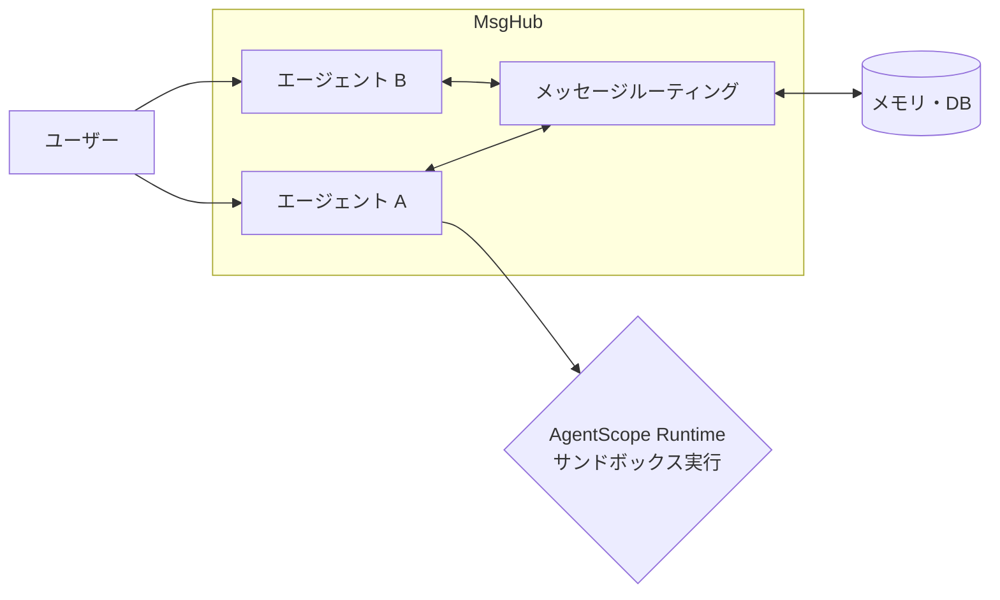

# **AgentScope 調査レポート**

## **1. 基本情報**

* **ツール名**: AgentScope
* **ツールの読み方**: エージェントスコープ
* **開発元**: Alibaba
* **公式サイト**: [https://doc.agentscope.io/](https://doc.agentscope.io/)
* **関連リンク**:
  * GitHub: [https://github.com/agentscope-ai/agentscope](https://github.com/agentscope-ai/agentscope)
  * ドキュメント: [https://doc.agentscope.io/tutorial/index.html](https://doc.agentscope.io/tutorial/index.html)
* **カテゴリ**: マルチエージェントフレームワーク
* **概要**: AgentScopeは、Alibabaがオープンソースとして公開している、マルチエージェントAIアプリケーションを構築するための本番環境向けフレームワークです。単純なReActエージェントから複雑なマルチエージェントワークフローまで、柔軟なメッセージルーティング（MsgHub）と豊富なツール・メモリ抽象化を用いて構築できます。

## **2. 目的と主な利用シーン**

* **解決する課題**: 複数のAIエージェントが協調・議論して問題を解決する複雑なシステムを構築する際、エージェント間の通信、状態管理、耐障害性、評価、本番デプロイメントの複雑さを解消する。
* **想定利用者**: AIアプリケーションエンジニア、データサイエンティスト、AI研究者
* **利用シーン**:
  * 複数の役割（プランナー、コーダー、レビュアー等）を持たせたマルチエージェントによるソフトウェア自動開発
  * 人狼ゲームなどのマルチエージェントによる戦略的ゲームやシミュレーション
  * Human-in-the-loop（人間の介入）を必要とする複雑なカスタマーサポートや業務ワークフロー
  * 音声認識・合成（TTS）を活用したリアルタイムの音声対話システム

## **3. 主要機能**

* **マルチエージェント・オーケストレーション**: `MsgHub` や `sequential_pipeline` といった機構を提供し、複数のエージェント間のメッセージのブロードキャストや動的な参加・退出を容易に制御。
* **Agent Team**: 複数のエージェントをグループ化し、統一されたインターフェースで管理・実行できるチーム機能を提供。
* **RAGおよび分散RAG**: 基本的なRAGモジュールに加え、マルチテナント・マルチセッション対応の分散RAGサービスをサポートし、大規模データへのアクセスを効率化。
* **メモリ・コンテキスト管理（Mem0連携）**: 短期メモリ、長期メモリ（ReMe等）の充実に加え、外部記憶プロバイダである「Mem0」との連携をネイティブにサポート。
* **強力なエージェントモデル**: `ReActAgent`、`UserAgent`、`A2A Agent`（Agent-to-Agentプロトコル）などを組み込みでサポートし、リアルタイムの音声対話(`Realtime Voice Agent`)にも対応。
* **ツール・MCP連携**: 様々なツール（Pythonコード実行、シェル等）を登録できる`Toolkit`を提供し、Model Context Protocol (MCP) や Anthropic Agent Skill の統合も標準対応。
* **Agentic RL (強化学習)**: LLMエージェントの強化学習（Trinity-RFTライブラリ等を用いたRLチューニング）をシームレスに統合し、特定のタスク（数学、検索など）の精度を向上させることが可能。
* **AgentScope Studio & Runtime & Workspace**: エージェントの挙動監視UI（Studio）や、Docker/Kubernetes/Daytona/OpenSandboxを用いた分離環境（Workspace/Sandbox）での安全なコード実行環境をフルサポート。

## **4. 動作原理・システム構成**

* **アーキテクチャ**: メッセージ駆動型のマルチエージェント・オーケストレーション基盤
* **主要コンポーネントとデータフロー**:
  * エージェント間の通信はすべて「メッセージ」として抽象化され、`MsgHub` などのルーティング機構を介してやり取りされる。
  * メモリはセッションごとに管理され、短期メモリや長期メモリ（ReMe等）をサポート。SQLite等のデータベースをバックエンドに使用可能。
* **特筆すべき要素技術**:
  * **MsgHub / Pipeline**: 複雑なエージェントの会話フロー（直列、並列、条件分岐）をコードで柔軟に定義するための基盤技術。
  * **AgentScope Runtime**: DockerやKubernetesを用いた分離環境（サンドボックス）を提供し、安全なコード実行やVNCベースのGUI環境をサポート。
  * **Agentic Memory**: 2026年のアップデートで追加されたエージェント向け記憶システム。Mem0連携など拡張性が高い。



## **5. 開始手順・セットアップ**

* **前提条件**:
  * Python 3.10以上
  * 利用するLLM（DashScope、OpenAIなど）のAPIキー
* **インストール/導入**:

  ```bash
  # pipを使ったインストール
  pip install agentscope

  # uvを使ったインストールも推奨されている
  uv pip install agentscope
  ```

* **初期設定**:
  環境変数にAPIキーを設定します。

  ```bash
  export DASHSCOPE_API_KEY="your-api-key"
  ```

* **クイックスタート**:

  ```python
  from agentscope.agent import ReActAgent, UserAgent
  from agentscope.model import DashScopeChatModel
  from agentscope.memory import InMemoryMemory
  import asyncio

  async def main():
      agent = ReActAgent(
          name="Friday",
          sys_prompt="You're a helpful assistant.",
          model=DashScopeChatModel(model_name="qwen-max"),
          memory=InMemoryMemory(),
      )
      user = UserAgent(name="user")

      msg = None
      while True:
          msg = await agent(msg)
          msg = await user(msg)
          if msg.get_text_content() == "exit":
              break

  asyncio.run(main())
  ```

## **6. 特徴・強み (Pros)**

* **高い拡張性と柔軟なアーキテクチャ**: 厳格なプロンプト制約を課すのではなく、LLMの推論能力とツール使用能力を最大限に引き出す設計。メッセージングの抽象化により、あらゆるパターンの対話フロー（シーケンシャル、並行、非同期など）を実現できる。
* **最新機能への迅速な対応**: Realtime Voice、MCP (Model Context Protocol)、TTS、エージェントの強化学習（Agentic RL）など、LLMエージェント領域の最新トレンドが急速にフレームワークへ統合されている。
* **本番デプロイメントの考慮**: ローカル実行だけでなく、クラウド上のサーバーレスやKubernetesクラスタでの実行を想定。OpenTelemetry (OTel) サポートや、AgentScope RuntimeによるVNCベースのGUIサンドボックスなどが用意されている。

## **7. 弱み・注意点 (Cons)**

* **学習曲線**: LangChain等の既存フレームワークとは異なる「メッセージ中心」のアプローチ（MsgHub等）をとるため、独自概念の理解と非同期処理（asyncio）の実装スキルが求められる。
* **日本語情報の不足**: 開発元がAlibabaであることもあり、公式ドキュメントは英語と中国語が中心。エラー時のトラブルシューティング等において日本語の情報源は限られている。
* **エコシステムの発展途上**: LangChainほどプラグインや連携サービスのエコシステムが巨大ではなく、マイナーなツールと連携する際は自分でラッパー（Toolkit）を実装する必要がある。

## **8. 料金プラン**

AgentScope自体はオープンソース（Apache License 2.0）であり、無料で利用可能です。

| プラン名 | 料金 | 主な特徴 |
|---------|------|---------|
| **オープンソース版** | 無料 | すべてのフレームワーク機能、AgentScope Studio、Runtime環境が利用可能。 |

* **課金体系**: フレームワークは無料。LLMプロバイダー（OpenAI, Qwen, Anthropic等）のAPI利用料や、デプロイ先のクラウドインフラ費用は別途必要。
* **無料トライアル**: 該当なし。

## **9. 導入実績・事例**

* **導入企業**: オープンソースであるため詳細な企業リストは非公開だが、Alibaba社内やコミュニティでの利用実績がある。
* **導入事例**:
  * **データ処理エージェント**: データクリーニングや加工を自律的に行う `Data-Juicer Agent` としての応用。
  * **リアルタイム音声アシスタント**: Webインターフェースを通じた、低遅延の音声対話型マルチエージェントシステム。
  * **ゲームシミュレーション**: 9人のAIエージェントが複雑な戦略を用いて対戦する「人狼ゲーム」のシミュレーション環境。
* **対象業界**: 研究機関、AI開発企業、ソフトウェア開発全般。

## **10. サポート体制**

* **ドキュメント**: 公式ドキュメントサイト（Tutorial, FAQ, API Docs）が提供されている（英語・中国語）。
* **コミュニティ**: DiscordサーバーおよびDingTalkグループが用意されており、開発者やユーザー間での活発なコミュニケーションが行われている。隔週でのコミュニティミーティングも開催されている。
* **公式サポート**: OSSのためエンタープライズ向けの公式SLAサポートは明記されていない。バグ報告や機能要望はGitHub Issuesを利用。

## **11. エコシステムと連携**

### **11.1 API・外部サービス連携**

* **API**: 任意のREST APIをPython関数として定義し、ツールキットに登録することで連携可能。
* **外部サービス連携**:
  * **LLMモデル**: OpenAI, DashScope (Qwen), Anthropic, Gemini 等。
  * **外部記憶プロバイダ**: Mem0をネイティブに統合し、高度な記憶管理が可能。
  * **ツール連携標準**: Model Context Protocol (MCP), Anthropic Agent Skill。これにより、MCP対応サーバーをローカル関数として呼び出すことが可能。
  * **その他ツール**: Web検索、コード実行、ファイル操作等。

### **11.2 技術スタックとの相性**

| 技術スタック | 相性 | メリット・推奨理由 | 懸念点・注意点 |
|:---|:---:|:---|:---|
| **Python** | ◎ | ネイティブな開発言語。asyncioを活用した高い並行処理性能を引き出せる。 | 非同期プログラミングの理解が必須。 |
| **Docker / Kubernetes / Daytona** | ◎ | `AgentScope Runtime` および Workspace サポートにより、高度に分離された安全なサンドボックス実行が可能。 | クラウドネイティブな運用や環境構築のスキルが必要。 |
| **OpenTelemetry (OTel)** | ◎ | 分散トレーシングが組み込まれており、本番環境での可観測性が高い。 | 特になし。 |

## **12. セキュリティとコンプライアンス**

* **認証**: AgentScope自体はミドルウェアであり、LLM API等の認証は各プロバイダーのAPIキーや環境変数を用いて開発者が管理する。
* **データ管理**: メモリ（InMemory, SQLite等）はローカル環境や指定したDBに保存される。
* **サンドボックス**: Pythonコードやシェルコマンドを実行するツールを利用する場合、`AgentScope Runtime` の機能を用いてDocker等の分離された環境で実行可能であり、ホスト環境へのセキュリティリスクを低減できる。
* **準拠規格**: オープンソースソフトウェアとしての提供であり、特定のセキュリティ規格（SOC2等）の認証はプロダクトとしては取得していない。

## **13. 操作性 (UI/UX) と学習コスト**

* **UI/UX**: 基本的にコード（Python）で構築するが、監視用GUIである `AgentScope Studio` を用いることで、エージェント間のメッセージフローや実行ログをグラフィカルに確認できる。
* **学習コスト**: 中〜高。Pythonの非同期処理(`async/await`)と、MsgHub等のメッセージ駆動アーキテクチャの概念理解に一定の学習が必要。

## **14. ベストプラクティス**

* **効果的な活用法 (Modern Practices)**:
  * **MsgHubの活用**: 3つ以上のエージェントが参加するフロー（ディベート、会議等）では、手動でメッセージを渡し合うのではなく `MsgHub` コンテキストマネージャを使用してブロードキャストを管理する。
  * **MCPの利用**: 外部システムとの連携には、可能な限り Model Context Protocol (MCP) を使用し、既存のMCPサーバーを活用することで独自ツールの開発工数を削減する。
  * **Agentic RLでの最適化**: 特定ドメイン（数学解法など）のエージェント精度を上げたい場合、提供されているRL（強化学習）連携機能を用いてモデルをチューニングする。
* **陥りやすい罠 (Antipatterns)**:
  * **安全でないコード実行**: ユーザー入力をそのまま `execute_python_code` やシェル実行ツールに渡す。必ずAgentScope Runtime等のサンドボックス環境内で実行させるべき。
  * **同期ブロック**: `async` 関数内で重い同期処理（I/O等）を実行し、イベントループをブロックして全体のパフォーマンスを低下させる。

## **15. ユーザーの声（レビュー分析）**

* **調査対象**: GitHub Issues, Discussions, X(Twitter), 技術ブログ (2025〜2026年)
* **総合評価**: 該当するレビューサイト（G2等）への登録はないが、GitHubのStar数（20k以上）から開発者からの高い支持が伺える。
* **ポジティブな評価**:
  * 「メッセージ指向の設計が、マルチエージェントシステムの実装において非常に理にかなっている。」
  * 「Realtime VoiceやA2Aプロトコルなど、エージェント技術の最先端機能が素早く取り込まれる点が素晴らしい。」
  * 「AgentScope Studioによって、複雑なマルチエージェントの会話ログが視覚的に追いやすくなった。」
* **ネガティブな評価 / 改善要望**:
  * 「LangChainのLCELのような手軽さがなく、簡単な処理を書く場合でもコード量が少し多くなる。」
  * 「中国語でのIssueやDiscussionが多く、英語/日本語ユーザーにとって情報が追いづらいことがある。」
* **特徴的なユースケース**:
  * 複雑なデータパイプラインを自律的に構築・検証する「Data-Juicer Agent」や、RL(強化学習)を用いたエージェントチューニングといった高度な研究・開発用途での活用。

## **16. 直近半年のアップデート情報**

* **2026-07-xx**: DaytonaベースおよびK8s、OpenSandboxベースのWorkspace/Sandboxサポート追加。ReMe長期メモリサポート追加。
* **2026-06-xx**: Agentic Memory、分散（Multi-Tenancy & Multi-Session）RAGサービス、Mem0連携、Agent Team機能の追加。
* **2026-05-xx**: AgentScope 2.0 リリース。
* **2026-02-xx**: Realtime Voice Agentサポートの追加。
* **2026-01-xx**: DBサポートおよびメモリモジュールにおけるメモリ圧縮機能の追加。隔週のコミュニティミーティングを開始。
* **2025-12-xx**: A2A (Agent-to-Agent) プロトコルのサポート。TTS (Text-to-Speech) サポートの追加。
* **2025-11-xx**: Anthropic Agent Skillサポート。Agentic RL（Trinity-RFTライブラリ経由）の統合。長期メモリ強化（ReMe）。Docker/K8sデプロイメント対応のRuntimeアップグレード。
* **2025-09-xx**: RAGモジュール、Planモジュールのリリース。AgentScope RuntimeおよびStudioのオープンソース化。
* **2025-08-xx**: 非同期実行を完全に採用したAgentScope v1.0のリリース。

(出典: [製品アップデート情報 (NEWS.md)](https://github.com/agentscope-ai/agentscope/blob/main/docs/NEWS.md))

## **17. 類似ツールとの比較**

### **17.1 機能比較表 (星取表)**

| 機能カテゴリ | 機能項目 | 本ツール (AgentScope) | LangChain | AutoGPT |
|:---:|:---:|:---:|:---:|:---:|
| **基本機能** | マルチエージェント制御 | ◎<br><small>MsgHub・Agent Team等</small> | ◎<br><small>LangGraphによる精密制御</small> | △<br><small>単一エージェント自律性が主</small> |
| **統合機能** | MCPサポート | ◎<br><small>ビルトイン対応</small> | ◯<br><small>拡張パッケージ等で対応</small> | △<br><small>一部連携に留まる</small> |
| **最新技術** | 音声/TTS統合 | ◎<br><small>Realtime Voice対応</small> | △<br><small>基本はテキスト入出力</small> | ×<br><small>非対応</small> |
| **運用支援** | 本番デプロイメント | ◎<br><small>Runtime (Docker/K8s/Daytona)</small> | ◎<br><small>LangServe提供</small> | ◯<br><small>DockerComposeベース</small> |

### **17.2 詳細比較**

| ツール名 | 特徴 | 強み | 弱み | 選択肢となるケース |
|---------|------|------|------|------------------|
| **AgentScope** | メッセージ駆動型のマルチエージェント基盤 | 複数エージェントの会話管理（MsgHub）やチーム機能（Agent Team）、サンドボックス環境（Workspace）など機能が豊富。 | エコシステム規模や日本語情報量ではLangChainに劣る。 | 大規模なマルチエージェントシステム、音声対話、強化学習を含むエージェント開発。 |
| **LangChain** | エコシステム最大のLLMフレームワーク | 圧倒的なツール連携数とLangGraphによるグラフベースの精密なフロー制御、LangSmithによる監視。 | 学習コストの高さと機能の過多。 | 既存の多種多様なSaaS・DBと連携する汎用的なエンタープライズアプリケーション開発。 |
| **AutoGPT** | ゴール駆動型の自律エージェント | GUIビルダーによる直感的なワークフロー構築、目標を与えるだけで自律的に行動。 | 複雑なタスクでの挙動制御が難しく、APIコストが膨らむリスクがある。 | プログラミング不要で自律的なタスク自動化を行いたい場合。 |

## **18. 総評**

* **総合的な評価**:
  AgentScopeは、Alibabaがオープンソースで提供する、非常に意欲的かつ強力なマルチエージェントフレームワークです。単純なLLM呼び出しを超え、MsgHubを用いた高度なオーケストレーション、Realtime Voice、Agentic RL、そして本番環境を見据えたAgentScope Runtimeなど、次世代のAIアプリケーションに求められる機能をいち早く実装しています。
* **推奨されるチームやプロジェクト**:
  非同期Pythonの開発スキルを持ち、複数のエージェントが連携して動作する複雑なシステム（シミュレーション、高度なRAG、自動コーディングシステム、音声対話AI）を構築したい研究・開発チームに最適です。
* **選択時のポイント**:
  既存の多種多様なAPIと手軽に連携したいだけならLangChainの方が適している場合があります。しかし、エージェント同士の「会話」や「協調」をシステムの中核に据えたい場合や、音声ベースのエージェントを構築したい場合、AgentScopeのメッセージ駆動アーキテクチャは強力な選択肢となります。
