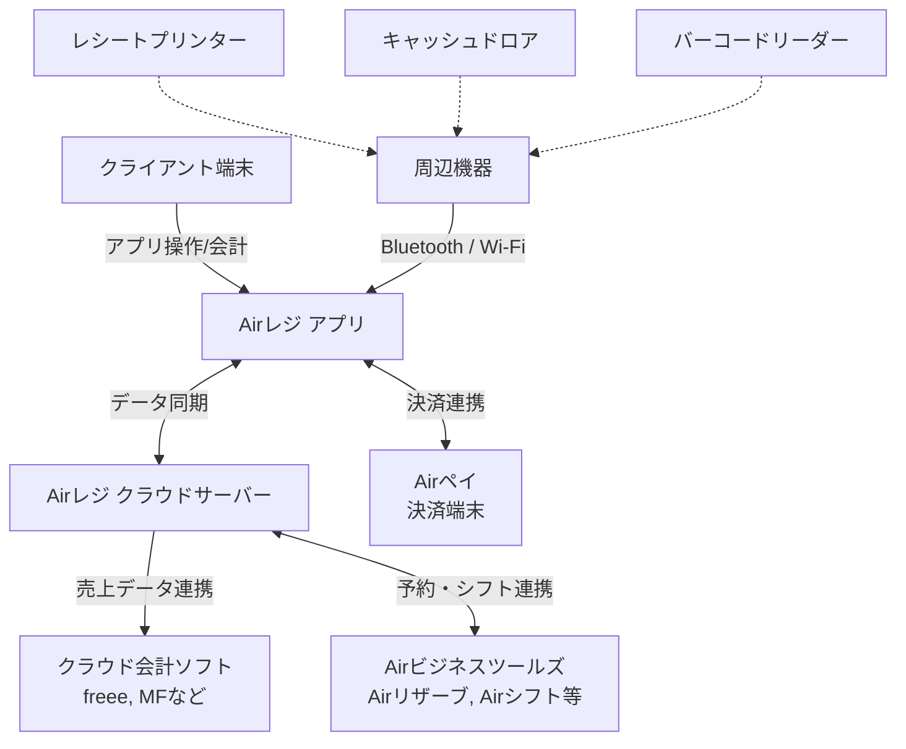

# **Airレジ 調査レポート**

## **1. 基本情報**

* **ツール名**: Airレジ
* **ツールの読み方**: エアレジ
* **開発元**: 株式会社リクルート
* **公式サイト**: [https://airregi.jp/](https://airregi.jp/)
* **関連リンク**:
  * ドキュメント: [https://faq.airregi.jp/hc/ja](https://faq.airregi.jp/hc/ja)
* **カテゴリ**: ビジネス/業務ツール
* **概要**: Airレジは、iPadまたはiPhoneとインターネット環境があれば、0円でカンタンに使えるPOSレジアプリ。注文入力・会計などの基本機能に加え、売上管理・分析、在庫管理、顧客管理などを包括的に提供し、店舗運営の煩雑な業務を効率化する。

## **2. 目的と主な利用シーン**

* **解決する課題**:
  * 高額な初期費用や保守費用によるPOSレジ導入のハードル
  * 手作業による売上集計・日報作成の煩雑さ
  * 他システム（会計ソフトや予約管理など）との連携不足による二度手間
* **想定利用者**:
  * 飲食店、小売店、美容サロン、医療機関などのオーナーやスタッフ
  * 初めてPOSレジを導入する個人事業主や中小規模事業者
* **利用シーン**:
  * **店舗での対面会計**: バーコード読み取りやタッチ操作で迅速に注文入力と会計を行う。
  * **売上分析と日報作成**: 自動集計された売上データをPCやスマホからいつでも確認し、店舗の経営状況を分析する。
  * **他サービスとの連携**: Airペイを用いたキャッシュレス決済や、クラウド会計ソフトとの自動連携による経理業務の効率化。

## **3. 主要機能**

* **注文入力と会計**: 個別会計、割引設定、非課税対応、バーコード読み取りなど、業種に合わせた柔軟な会計機能。
* **点検・精算機能**: レジ締め時の現金の過不足チェックや精算処理をカンタンに行う。
* **商品・在庫管理**: 商品の登録・編集、在庫数の管理・棚卸機能により、品切れや発注漏れを防ぐ。
* **売上管理・分析**: 売上、客数、客単価などの自動集計と、商品別・時間帯別の詳細な分析機能。
* **顧客管理**: 顧客情報の登録と購買履歴の追跡により、リピーター向けサービスを強化。
* **店舗管理 (複数店舗)**: 本部システムとの連携により、複数店舗の売上データや商品情報を一元管理する。

## **4. 動作原理・システム構成**

* **アーキテクチャ**: クラウドベースのSaaS型POSシステム。クライアント端末（iPad/iPhone）上のアプリと、クラウドサーバーが常時通信しデータを同期する。
* **主要コンポーネントとデータフロー**:
  * アプリ（フロントエンド）で入力された売上や在庫データは、インターネット経由でリクルートのセキュアなクラウド環境に保存・集計される。
  * オフライン時でも一部機能を利用可能で、オンライン復帰後にデータが同期される。
  * 外部サービス（Airペイ、クラウド会計ソフト等）とはAPIを通じてデータフローが構築されている。

* **特筆すべき要素技術**:
  * iOS（iPad/iPhone）向けに最適化されたネイティブアプリケーションアーキテクチャ。
  * 周辺機器とのシームレスなBluetooth/Wi-Fi通信機能。

## **5. 開始手順・セットアップ**

* **前提条件**:
  * iPad または iPhone とインターネット環境
  * AirID（無料アカウント）の作成
* **インストール/導入**:
  * App Storeから「Airレジ」アプリをダウンロード。
* **初期設定**:
  * アプリまたはWeb管理画面からAirIDでログイン。
  * お店の基本情報、税率設定、レシート設定を行う。
  * 商品（メニュー）やカテゴリを登録する。
* **クイックスタート**:
  1. 周辺機器（キャッシュドロアやプリンター）を利用する場合はBluetooth/Wi-Fiで接続設定を行う。
  2. アプリ画面で商品をタップ（またはバーコード読み取り）し、カートに追加。
  3. 「会計に進む」をタップし、支払い方法（現金・クレジットカード等）を選択して会計完了。

## **6. 特徴・強み (Pros)**

* **0円でカンタンに導入可能**: 基本レジ機能、売上分析、サポート全般がすべて初期費用・月額費用無料で利用でき、専用の高額なレジ端末を購入する必要がない。
* **直感的で洗練されたUI**: 誰でもすぐに使いこなせる見やすいデザインで、スタッフの教育コストを大幅に削減できる。
* **Airビジネスツールズとの強力な連携**: Airペイ（キャッシュレス）、Airレジ オーダー（モバイルオーダー）、Airシフト（勤怠管理）などと同系統のサービスであるため、シームレスに機能拡張が可能。
* **万全のサポート体制**: オンラインFAQやチャットだけでなく、ビックカメラ店頭の「Airレジ サービスカウンター」で実機を触りながら対面相談ができる。

## **7. 弱み・注意点 (Cons)**

* **対応OSの制限**: アプリはiOS（iPad/iPhone）専用であり、Android端末やWindowsタブレットでは利用できない。
* **高度な機能は別サービスへの依存**: 高度な予約管理や勤怠管理などが必要な場合、AirリザーブやAirシフトなど別のツールを追加で利用・連携する必要がある。
* **大規模チェーン向けのカスタマイズ制限**: 中小規模向けのパッケージ化されたSaaSであるため、独自要件が多い大規模エンタープライズ向けの細かな個別カスタマイズには向かない場合がある。

## **8. 料金プラン**

| プラン名 | 料金 | 主な特徴 |
|---------|------|---------|
| **Airレジ 基本機能** | 無料 | 商品登録・会計、売上・在庫・顧客管理、各種サポートなどがすべて0円で利用可能。 |

* **課金体系**: アプリ自体の利用は完全無料（Airペイ等のキャッシュレス決済を利用する場合のみ決済手数料が発生する）。
* **ハードウェア費用**: 必要に応じて周辺機器（レシートプリンター、キャッシュドロア、自動つり銭機など）の購入費用が別途かかる。

## **9. 導入実績・事例**

* **導入企業**: ルンゴカーニバル（飲食店）、サトウサンプル（小売店）、HOTEL SHE, OSAKA（サービス業）など。
* **導入事例**:
  * 飲食店では、Airレジ オーダー（モバイルオーダー）との併用により、注文から会計までの業務を大幅に効率化し、レジ締め作業の時間も短縮。
  * 小売店では、数千種類に及ぶ商品の在庫管理やバーコード読み取りを活用し、正確な在庫把握と販売分析を実現。
* **対象業界**: 飲食業（カフェ、居酒屋、レストラン）、小売業（アパレル、パン屋）、サービス・美容業（美容室、ネイルサロン）、医療機関（クリニック、薬局）など多岐にわたる。

## **10. サポート体制**

* **ドキュメント**: 公式ヘルプセンター（FAQ）に設定ガイドやトラブルシューティングが豊富に掲載されている。
* **コミュニティ**: ユーザー間のフォーラムよりは、リクルートが運営する公式の「Airレジ マガジン」などで活用事例やノウハウが共有されている。
* **公式サポート**:
  * メール・チャットによる専用窓口でのサポート。
  * 電話でのオンライン導入相談。
  * 全国のビックカメラ等にある「Airレジ サービスカウンター」での対面サポート。

## **11. エコシステムと連携**

### **11.1 API・外部サービス連携**

* **API**: 外部システムと連携するための「Airレジ API」が用意されており、本部システムや独自ツールとのデータ連携が可能。
* **外部サービス連携**:
  * クラウド会計ソフト（freee会計、マネーフォワード クラウド会計、弥生など）
  * 飲食店向けシステム（レストランボード、アスピットなど）
  * その他のAirビジネスツールズ（Airペイ、Airレジ オーダーなど）

### **11.2 技術スタックとの相性**

| 技術スタック | 相性 | メリット・推奨理由 | 懸念点・注意点 |
|:---|:---:|:---|:---|
| **iOS / iPadOS** | ◎ | ネイティブアプリとして提供されており、最高のパフォーマンスとUI体験が得られる。 | Android等の他OSには非対応 |
| **REST API連携 (外部システム)** | ◯ | Airレジ側の売上・在庫データを自社システムに統合可能。 | API利用には事前の申請や仕様確認が必要 |

## **12. セキュリティとコンプライアンス**

* **認証**: AirIDによるシングルサインオン機能、パスワード管理。
* **データ管理**: リクルートの基準を満たしたクラウドサーバーでデータを安全に保存・管理し、端末の紛失時にもデータ消失のリスクを防ぐ。
* **準拠規格**: プライバシーポリシーや利用規約において、個人情報保護法等の関連法規に準拠したデータ取り扱いを明記。また、軽減税率やインボイス制度、電子帳簿保存法などの最新の制度にも自動で対応している。

## **13. 操作性 (UI/UX) と学習コスト**

* **UI/UX**: ボタンの配置や文字の大きさが計算されており、レジ業務に不慣れなスタッフでも直感的に操作できる優れたデザイン（グッドデザイン賞受賞）。
* **学習コスト**: 初期設定のステップもわかりやすくガイドされており、導入から実際の会計処理まで数十分〜数時間で習得可能。操作教育にかかる時間を最小限に抑えられる。

## **14. ベストプラクティス**

* **効果的な活用法 (Modern Practices)**:
  * **Airペイとの併用**: AirレジとAirペイを連携させることで、金額の二度打ちを防ぎ、会計ミスをなくしつつスムーズなキャッシュレス対応を実現する。
  * **クラウド会計ソフト連携**: 毎日の売上データを自動で会計ソフトに取り込む設定にすることで、経理の入力業務を実質ゼロにする。
* **陥りやすい罠 (Antipatterns)**:
  * **iPadOSのアップデート遅延**: OSやアプリのバージョンが古いままだと周辺機器の接続不具合などが起きる可能性があるため、常に最新版を保つよう運用ルールを設けること。
  * **オフライン状態の放置**: オフラインでも会計は可能だが、クラウドへの同期が行われないため、ネットワーク異常が発生した際は速やかにWi-Fiルーター等の復旧を行うこと。

## **15. ユーザーの声（レビュー分析）**

* **調査対象**: 公式導入事例、利用率No.1調査（マクロミル）、一般的なユーザーの評判
* **総合評価**: POSレジアプリの中で国内利用率No.1の評価を獲得。
* **ポジティブな評価**:
  * 「月額無料でこれだけの機能が使えるのは非常にありがたい。初期費用も端末代程度で済んだ。」
  * 「直感的な操作感で、新人アルバイトのトレーニングがほとんど不要になった。」
  * 「freee会計との連携により、毎日の売上集計や帳簿入力の手間が完全に省けた。」
* **ネガティブな評価 / 改善要望**:
  * 「Android端末に対応していないため、手持ちの端末が使えずiPadを新規購入する必要があった。」
  * 「無料ゆえに、カスタマーサポートの電話がつながりにくい時間帯がある。」
* **特徴的なユースケース**:
  * イベントや催事の臨時店舗において、iPadとモバイルWi-Fiルーターだけを持ち込み、即席の高機能レジとして活用するケース。

## **16. 直近半年のアップデート情報**

* **2026-03-24**: iPhoneアプリに「分析」メニューが追加され、手元で手軽に売上分析が可能になった。
* **2026-03-04**: 「分析」画面に「リピーター分析」機能が追加された。
* **2026-02-18**: 商品一括編集用のCSVファイルがより使いやすい形式に改善された。
* **2025-11-18**: カスタマーディスプレイにおいて、顧客向けに注文内容の詳細を表示できるようになった。
* **2025-10-02**: 連携するAirペイ アプリでQRコード決済が利用可能になり、決済手段の拡充が図られた。

(出典: [Airレジ お知らせ](https://airregi.jp/jp/news/) )

## **17. 類似ツールとの比較**

### **17.1 機能比較表 (星取表)**

| 機能カテゴリ | 機能項目 | 本ツール (Airレジ) | Square | Shopify POS | スマレジ |
|:---:|:---|:---:|:---:|:---:|:---:|
| **基本機能** | 対面決済・レジ | ◎ <small>直感的で使いやすいUI</small> | ◎ <small>自社製ハードとの統合</small> | ◯ <small>ECとの連携が強み</small> | ◎ <small>高機能なレジ機能</small> |
| **基本機能** | 導入コスト(初期/月額) | ◎ <small>基本機能完全無料</small> | ◎ <small>無料プランあり</small> | × <small>Shopify契約必須</small> | ◯ <small>無料プランあり</small> |
| **拡張連携** | 会計・周辺ツール連携 | ◎ <small>Airシリーズ・外部会計連携</small> | ◯ <small>API連携が豊富</small> | ◎ <small>Shopifyエコシステム</small> | ◎ <small>充実したAPI</small> |
| **非機能要件** | Android対応 | × <small>iOS専用</small> | ◎ <small>iOS/Android対応</small> | ◎ <small>iOS/Android対応</small> | ◎ <small>iOS/Android対応</small> |

### **17.2 詳細比較**

| ツール名 | 特徴 | 強み | 弱み | 選択肢となるケース |
|---------|------|------|------|------------------|
| **本ツール (Airレジ)** | 無料で手軽に始められる国内シェアNo.1のPOSレジ | 初期費用・月額無料、圧倒的な使いやすさ、Airツールとの連携 | iOS端末（iPad/iPhone）専用 | 初めてPOSレジを導入する店舗、経費を抑えたい中小店舗。 |
| **Square** | 決済機能から発展したグローバルなPOSプラットフォーム | ハードウェアの美しさ、無料のオンラインストア機能 | 国内特有の商習慣サポートでは国産ツールに譲る場合も | デザイン性の高いレジ周りを構築したい店舗、簡単なECサイトも同時に始めたい場合。 |
| **Shopify POS** | ECプラットフォームに紐づくPOSシステム | ECサイトと実店舗の完全なデータ（在庫・顧客）一元管理 | 利用にはShopify本体の月額プラン契約が必要 | 本格的なECサイトを運営しており、実店舗のPOSと完全に統合したい場合。 |
| **スマレジ** | 高機能で拡張性の高いクラウドPOSレジ | 高度な在庫管理やAPIによる柔軟なシステム連携 | 全機能を利用するには有料プランが必要 | 複数店舗展開や、より高度な在庫管理・分析機能が必要な中規模以上の企業。 |

## **18. 総評**

* **総合的な評価**:
  Airレジは、POSレジとしての基本機能はもちろんのこと、売上分析から他システム連携までを「0円」で提供している点が最大の魅力である。洗練されたUIにより誰でも直感的に操作でき、POSレジ導入のハードルを極限まで下げた秀逸なツールである。
* **推奨されるチームやプロジェクト**:
  初めてPOSレジを導入する個人事業主、個人経営の飲食店や小売店、小〜中規模の美容サロンなど。
* **選択時のポイント**:
  導入コストを最小限に抑えつつ、使いやすさを重視する場合はAirレジが最良の選択となる。手持ちのAndroid端末を使いたい場合はSquareやスマレジを検討する必要がある。また、ECサイトとの完全統合を最優先するならShopify POS、より高度で複雑な在庫管理が必要ならスマレジの有料プランなど、自店舗の今後の成長計画に合わせて選択することが望ましい。
