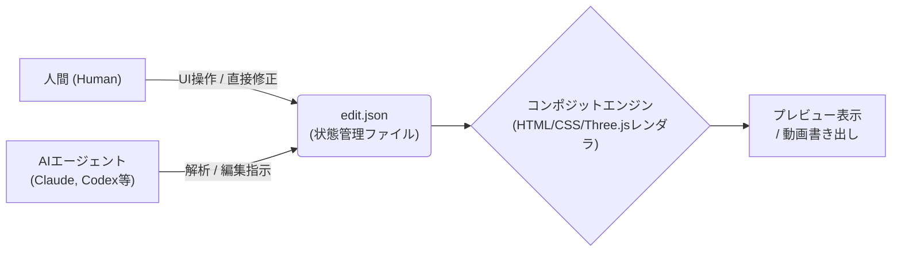

# **AKARI Video 調査レポート**

## **1. 基本情報**

* **ツール名**: AKARI Video
* **ツールの読み方**: アカリビデオ
* **開発元**: Akari Labs
* **公式サイト**: [https://akari.video/](https://akari.video/)
* **関連リンク**:
  * GitHub: [https://github.com/AkariLabs/akari-video](https://github.com/AkariLabs/akari-video)
  * ドキュメント: [https://github.com/AkariLabs/akari-video/blob/main/docs/README.md](https://github.com/AkariLabs/akari-video/blob/main/docs/README.md)
* **カテゴリ**: 動画編集
* **概要**: AKARI Videoは、日本語で話しかけるだけでAIが編集を進める動画編集アプリです。完全無料のオープンソース（MITライセンス）で提供されており、面倒な文字起こしやカット作業をAIに任せつつ、人間は最終的な微調整に集中できる革新的な設計が特徴です。

## **2. 目的と主な利用シーン**

* **解決する課題**: 動画編集における高い学習コストや、文字起こし・無音カット作業に奪われる多大な時間と労力を削減します。
* **想定利用者**: 動画で発信したいが編集の手間を省きたい個人事業主やクリエイター、AIを活用して動画制作を自動化したいエンジニア。
* **利用シーン**:
  * 対談や解説動画などの不要な間の自動カットや、高精度なテロップの自動挿入
  * プロンプトによる指示で動画のドラフトを一気に作成し、人間が最終仕上げを行うハイブリッド編集
  * CI/CDパイプラインやAIエージェント環境（Claude Code等）に組み込んだ、ヘッドレスでの動画全自動生成

## **3. 主要機能**

* **AIとの対話型編集**: 「いらない間をカットしてテロップをつけて」など日本語でチャットするだけで、文字起こし・カット・テロップ追加・BGM配置等をAIが自動で実行します。
* **台本ベースの直感的な編集**: 自動で文字起こしされた台本のテキストを消すだけで、該当する部分の映像ごとカットできる直感的な操作を提供します。
* **シームレスな手動調整**: AIによる編集結果に対し、プレビュー画面上で直接文字を打ち直したり、ドラッグで位置やサイズを直したりする従来の編集ソフトと同様の操作が可能です。
* **AIエージェント・パートナー連携**: Claude Code、Codex（ChatGPT）、Antigravity（Gemini）、opencode、Cursorなど、使い慣れたAIアカウントをアプリに接続し、強力な編集パートナーとして利用できます。
* **AKARI Video Lab連携**: アプリ内で直接利用できるAI向けの素材ライブラリ機能を搭載。「意味」や「調整可能な値」が付与された素材をAIがネイティブに活用できます。
* **高品質な書き出し**: 最大4K解像度、H.264 / HEVC / ProRes 422 HQ / 連番PNGでのGPU書き出しに対応しており、XやYouTube等への共有もスムーズです。

## **4. 動作原理・システム構成**

* **アーキテクチャ**: ローカルファーストのクライアント・サーバー構成（デスクトップアプリとしてTheiaベースのシェルを採用）。
* **主要コンポーネントとデータフロー**:
  * 編集の全状態は `edit.json` という単一の保存ファイル（ファイルコントラクト）として管理されます。
  * 人間によるUI操作と、AIエージェントによる編集の両方がこの `edit.json` をSingle Source of Truth (SSOT) として直接読み書きするため、処理が高速で差分管理が容易な構造となっています。
  * テロップや図形などの表現はAIがHTML/CSS/Three.jsを用いて自由に生成し、アプリ内蔵のエンジンがそれらを映像とコンポジット（合成）して出力します。
* **特筆すべき要素技術**:
  * **Headless-first設計**: opencodeやClaude Codeなどのエージェントツールと組み合わせることで、UIを一切開かずに計画から書き出しまでをCLIベースで完結させることが可能です。



## **5. 開始手順・セットアップ**

* **前提条件**:
  * macOS (Apple Silicon) または Windows (x64)
  * 高度なAIパートナーを利用する場合は、ClaudeやChatGPT等の各AIサービスのAPI/サブスクリプションが必要（無料AIモデルの利用も可能）。
* **インストール/導入**:

  ```bash
  # Windows (PowerShellの場合)
  irm https://raw.githubusercontent.com/AkariLabs/akari-video/main/install.ps1 | iex

  # macOS / Linux (CLIインストール)
  curl -fsSL https://raw.githubusercontent.com/AkariLabs/akari-video/main/install.sh | bash
  # または npm i -g akari-video
  ```

* **初期設定**:
  * アプリ起動後、画面右側の「パートナーを追加」から利用したいAI（Claude Code、Codex等）を選択し、ブラウザ経由でアカウント認証を行います。
* **クイックスタート**:
  * ホーム画面の「＋新しい動画を始める」へ動画や音声ファイルをドラッグ＆ドロップし、チャット欄から「いらない間をカットして」と指示するだけで自動編集が開始されます。

## **6. 特徴・強み (Pros)**

* **人間の意図とAIの実務の完全な分業**: 人間は「やりたいことの指示」と「最後の仕上げ」に専念し、時間のかかる作業はすべてAIに任せられる革新的な設計思想です。
* **高度なエンジニアフレンドリー設計**: CLI経由での利用や `edit.json` を介したハックが容易であり、スクリプトを用いた動画の大量生成や自動化ワークフローの構築に極めて適しています。
* **完全無料でオープンソース**: これほど強力なAI連携機能を持ちながら、透かし等もなく完全無料のMITライセンスで提供されています。

## **7. 弱み・注意点 (Cons)**

* **高度なVFXやグレーディングの制限**: 従来のプロ向け編集ソフト（Premiere Pro等）に備わっているような、複雑な手動マスキングやカラーグレーディング機能は限定的です。
* **外部AIサービスへの依存**: ツール自体は無料ですが、最高精度の編集体験を得るためにClaudeやChatGPTといった強力なAIモデルを利用する場合、それらのサービスの利用料金（サブスクリプション）が別途発生します。
* **Linux版はCLIのみ**: UIを備えた使いやすいデスクトップアプリはWindowsとmacOS向けに提供されており、Linux環境では上級者向けのコマンドライン操作に限定されます。

## **8. 料金プラン**

アプリ自体は完全無料のオープンソースです。利用するAIモデルや追加素材によってのみ費用が発生します。

| プラン名 | 料金 | 主な特徴 |
|---------|------|---------|
| **基本利用 (オープンソース)** | 無料 | アプリの全機能（文字起こし、編集、VOICEVOXナレーション、書き出し等）をローカルで制限なく利用可能 |
| **外部AI連携** | 各サービスの料金に準ずる | Claude Code、Codex(ChatGPT)等の利用には各サービスのアカウント/契約が必要 |
| **AKARI Video Lab パス** | 要確認 | 高品質なAI対応素材ライブラリの永続利用権（数量限定で販売） |

* **課金体系**: アプリ自体は無料（MIT License）、外部AIモデルや特定素材集のみ個別契約
* **無料トライアル**: アプリ全体が永続無料で利用可能

## **9. 導入実績・事例**

* **導入企業**: 商用のエンタープライズSaaSではないため公式な大規模導入事例の公開はありませんが、多数の個人クリエイターやエンジニアに活用されています。
* **導入事例**:
  * 企業向けの紹介PV作成（AddnessがClaude Opusで生成し、AKARI Videoで編集を完結）
  * YouTube向け英語学習動画の自動編集（Asahi's English）
  * Blenderを活用した3D映像や、DeepSeekに関するインフォグラフィック解説動画の自動制作
* **対象業界**: 動画発信を行う個人事業主、エンジニア、スタートアップ、YouTuber。

## **10. サポート体制**

* **ドキュメント**: GitHubリポジトリ内に導入ガイド、設計思想、アーキテクチャの解説が詳細に記載されています。
* **コミュニティ**: Discordサーバー（メインでお知らせ・質問・作例の共有）やLINEオープンチャット（開発者からの発信）、X（Twitter）での活発な情報発信が行われています。
* **公式サポート**: オープンソースコミュニティベース（DiscordやGitHub Issues）でのサポートが主となります。

## **11. エコシステムと連携**

### **11.1 API・外部サービス連携**

* **API**: 編集データを司る `edit.json` ファイルが実質的なAPI（ファイルコントラクト）として機能し、外部ツールからの読み書きが容易です。CLIツールとしての顔も持ち、完全なヘッドレス実行が可能です。
* **外部サービス連携**: Claude Code、Cursor、GitHub Copilot、Codex (OpenAI)、Antigravity (Gemini)、opencode、Grok Build、Command Code など、主要なAIエージェントと標準でシームレスに連携できます。

### **11.2 技術スタックとの相性**

| 技術スタック | 相性 | メリット・推奨理由 | 懸念点・注意点 |
|:---|:---:|:---|:---|
| **Claude Code / Cursor Agent** | ◎ | プラグインとして連携可能。開発環境内でコードを書くように動画の全自動編集パイプラインを構築できる | 特になし |
| **Node.js (CLI連携)** | ◎ | `npm install -g akari-video` で即座に導入でき、JSエコシステムとの連携が非常に容易 | 特になし |
| **Python / シェルスクリプト** | ◯ | `edit.json` を操作・生成するスクリプトを記述することで、外部システムとの強力な連携が可能 | Web APIとしての提供ではないためファイル操作が中心となる |

## **12. セキュリティとコンプライアンス**

* **認証**: デスクトップアプリ内で各AIサービスのアカウントへのOAuth認証等を実行し、セッションを管理します。
* **データ管理**: 基本的にローカル完結型（ローカルファースト）であり、動画素材や編集データ（`edit.json`）はユーザーのPC上に保存されます。API連携時のみ、指定したAIサーバーにプロンプト等のテキストデータが送信されます。
* **準拠規格**: 公式サイトでは特定のセキュリティ認証（SOC2など）の取得については公開されていませんが、オープンソース（MITライセンス）のため、ソースコードを自ら監査可能です。

## **13. 操作性 (UI/UX) と学習コスト**

* **UI/UX**: 従来の動画編集ソフトに似たプレビュー画面やタイムラインを持ちつつ、「AIとのチャット」や「プレビューに丸をつけて指示する」といった直感的な操作が主軸となっており、非常に先進的かつスマートなUIを実現しています。
* **学習コスト**: 動画編集の専門知識（タイムラインの複雑な操作やエフェクト設定など）がなくても、日本語で話しかけるだけで大半の作業が完了するため、学習コストは極めて低く抑えられています。

## **14. ベストプラクティス**

* **効果的な活用法 (Modern Practices)**:
  * AIには「ラフカット、不要な間の削除、文字起こし、テロップのベース生成」を一任し、人間はプレビュー上でタイミングの微調整や誤字修正のみを行う役割分担が推奨されます。
  * Claude CodeやCursorと連携させ、テキスト記事から動画を全自動で生成・書き出しするワークフローを組むことで、コンテンツの量産化が可能です。
* **陥りやすい罠 (Antipatterns)**:
  * 初めからすべてを手動で編集しようとすると、AIを活用する本来のメリットが薄れます。
  * Premiere Proのような専用の高度なエフェクトプリセットをAIに無茶振りすると、HTML/CSSベースのレンダリング仕様と合わず意図通りにならない場合があります。

## **15. ユーザーの声（レビュー分析）**

* **調査対象**: 公式サイトの事例、X(Twitter)、GitHub（Star数: 190+）
* **総合評価**: 一般のレビューサイトへの登録はまだ見られませんが、オープンソースコミュニティやエンジニア層からは極めて高い注目を集めています。
* **ポジティブな評価**:
  * 「面倒なカットやテロップ挿入が一瞬で終わるので作業時間が激減した」
  * 「完全無料でローカルで動くのに機能が強力すぎる」
  * 「edit.jsonによるファイルベースのアーキテクチャが開発者にとって拡張しやすくて素晴らしい」
* **ネガティブな評価 / 改善要望**:
  * 「AIエージェントのフル活用には結局各サービスの課金が必要になる」
  * 「まだ開発中の部分（Under Construction）もあり、今後の安定性向上に期待」
* **特徴的なユースケース**:
  * 技術解説ブログの記事をClaudeに読ませて、自動的に解説動画の台本と編集をAKARI Videoで生成させる自動化パイプラインの構築。

## **16. 直近半年のアップデート情報**

* **2026-10-XX**: AKARI Video Lab（AI向け素材ライブラリ）の公開。素材に「意味」と「調整可能な値」が付与され、AIがネイティブに活用しやすくなった。
* **2026-09-XX**: 多数のAIエージェント（Claude Code、Codex、Antigravity、Cursorなど）との公式連携サポートの強化およびプラグインの拡充。

(出典: [GitHub Releases](https://github.com/AkariLabs/akari-video/releases))

## **17. 類似ツールとの比較**

### **17.1 機能比較表 (星取表)**

| 機能カテゴリ | 機能項目 | 本ツール | Vrew | CapCut (PC) | Premiere Pro |
|:---:|:---|:---:|:---:|:---:|:---:|
| **基本機能** | 文字起こし・自動カット | ◎<br><small>外部AIを活用し高精度</small> | ◎<br><small>音声認識に特化</small> | ◯<br><small>標準機能として搭載</small> | ◯<br><small>文字ベース編集に対応</small> |
| **編集手法** | 対話型AI編集 | ◎<br><small>自然言語で完全対応</small> | △<br><small>台本生成等の補助</small> | △<br><small>一部AI補助機能あり</small> | ×<br><small>非対応</small> |
| **開発者向け** | CI/CD・ヘッドレス利用 | ◎<br><small>CLI・エージェント連携可</small> | ×<br><small>GUI操作メイン</small> | ×<br><small>GUI操作メイン</small> | △<br><small>ExtendScriptで自動化可</small> |
| **非機能要件** | オープンソース・価格 | ◎<br><small>完全無料 (MIT)</small> | △<br><small>基本無料・有料プランあり</small> | △<br><small>基本無料・Pro版あり</small> | ×<br><small>高価なサブスクリプション</small> |

### **17.2 詳細比較**

| ツール名 | 特徴 | 強み | 弱み | 選択肢となるケース |
|---------|------|------|------|------------------|
| **本ツール** | 自然言語とAIエージェントによる自動編集に特化したOSS。 | 圧倒的な自動化性能、完全無料、CLI/ヘッドレス利用が可能。 | 複雑なVFXや手動での高度なエフェクト処理には向かない。 | 動画編集を極力自動化したいエンジニアや、AIを活用して量産したい場合。 |
| **Vrew** | 音声認識と文字起こしをベースにしたテロップ作成特化ツール。 | テロップの精度と操作性が高く、日本語対応も完璧。 | 汎用的な動画編集ソフトとしての機能は限定的。 | 手軽にテロップだけを素早く付けたいYouTuberや個人クリエイター。 |
| **CapCut (PC)** | スマホ向けから進化した多機能で手軽な動画編集ソフト。 | 豊富なテンプレート、エフェクト、トランジションが魅力。 | AI機能は内蔵のものに限られ、外部エージェントとの柔軟な連携は不可。 | トレンドに合わせたショート動画やVlogを簡単に作りたい場合。 |
| **Premiere Pro** | 業界標準のプロ向け動画編集ソフトウェア。 | あらゆる高度な編集、他Adobe製品とのシームレスな連携が可能。 | 学習コストが高く、動作が重い。またサブスクリューションが高価。 | 映像制作のプロフェッショナルとして、細部までこだわり抜いた作品を作る場合。 |

## **18. 総評**

* **総合的な評価**:
  AKARI Videoは、動画編集のプロセスを「AIに指示する」アプローチで根本から変革する非常に野心的なオープンソースプロジェクトです。テキストベースの自動編集だけでなく、CLIやエージェント連携による「ヘッドレス動画生成」を実現している点は、特にエンジニアや自動化を志向するユーザーにとって革命的と言えます。
* **推奨されるチームやプロジェクト**:
  エンジニアリングチーム、個人開発者、AIを活用して情報発信を自動化したい小規模ビジネスやマーケターに強く推奨されます。
* **選択時のポイント**:
  従来のタイムライン編集に時間を取られたくない場合や、Claude等のLLMエージェントを使って動画生成パイプラインを構築したい場合に最適です。一方で、Premiere Proのような緻密な手動エフェクトや複雑なカラーグレーディングを求めるプロジェクトには適していません。
