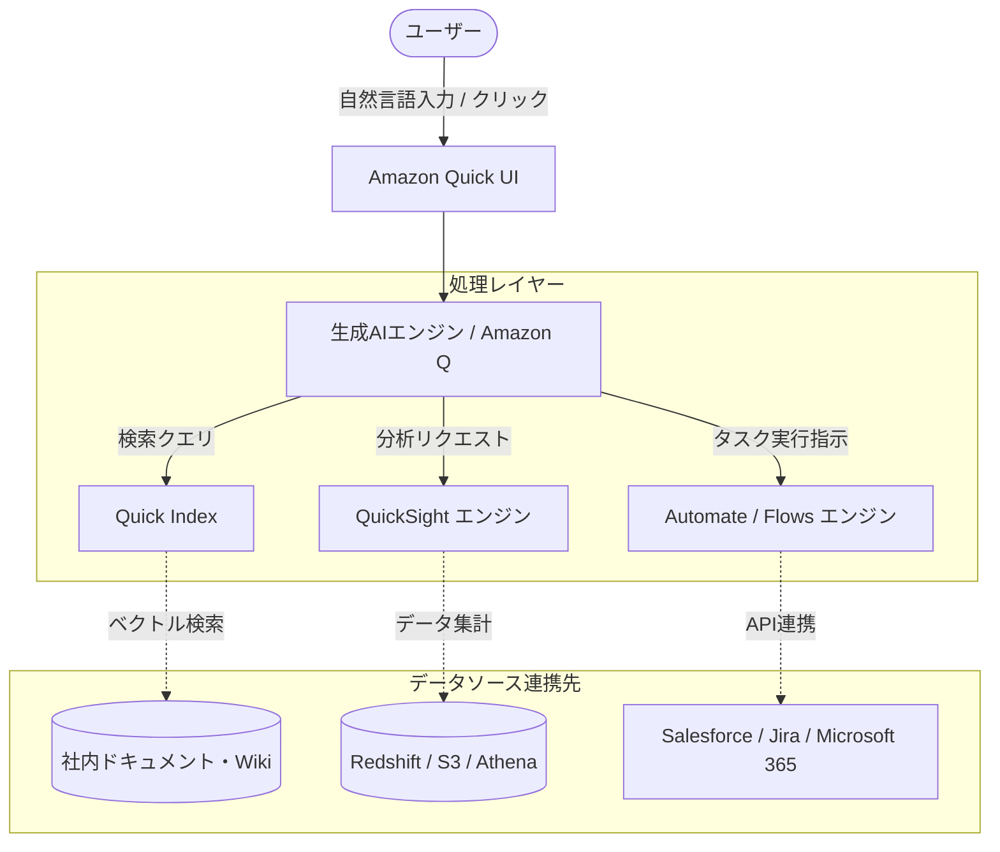

# **Amazon Quick 調査レポート**

## **1. 基本情報**

* **ツール名**: Amazon Quick (Amazon Quick Suite)
* **ツールの読み方**: アマゾン クイック
* **開発元**: Amazon Web Services (AWS)
* **公式サイト**: [https://aws.amazon.com/quicksuite/](https://aws.amazon.com/quicksuite/)
* **関連リンク**:
  * ドキュメント: [https://docs.aws.amazon.com/quicksuite/latest/userguide/](https://docs.aws.amazon.com/quicksuite/latest/userguide/)
* **カテゴリ**: 自律型AIエージェント
* **概要**: Amazon Quick（またはQuick Suite）は、ビジネスインテリジェンス（BI）と高度なリサーチ、ワークフローの自動化を組み合わせた生成AI搭載のデジタルワークスペースです。従来のBIツール（QuickSight）を進化させ、データを可視化するだけでなく、AIエージェントに自律的にタスクを処理させることができるプラットフォームです。

## **2. 目的と主な利用シーン**

* **解決する課題**: レポート作成、データ分析、情報検索、チーム内でのコミュニケーションといった業務が複数のツールに分散し、生産性が低下している問題。
* **想定利用者**: 営業担当者、ITリーダー（CIO）、ビジネスアナリスト、オペレーションマネージャーなど。
* **利用シーン**:
  * 売上低下の原因をデータダッシュボードで確認しつつ、同時にAIエージェントに社内メールや市場トレンドを調査させ、結果をまとめてチームに通知する。
  * 営業担当者が商談前にCRMや社内Wikiを横断検索し、顧客ごとのアカウントプランを数分で自動作成する。
  * 毎週月曜日にJiraのチケットを要約し、ToDoリストとしてメールで自動送信する個人のルーティンワークの自動化。

## **3. 主要機能**

* **Amazon Quick Sight**: 従来のBI機能を進化させた機能。自然言語のプロンプトからダッシュボードや経営陣向けサマリーを作成し、What-If分析などを実行します。
* **Amazon Quick Research**: 社内のエンタープライズデータ（Wiki、イントラネット等）と外部ソース（パブリックWeb、サードパーティデータ）を統合して横断検索し、引用元を明記した高度なリサーチ結果を数分で生成するAIアシ ঘোষアシスタント。
* **Amazon Quick Flows**: 非技術職の従業員でも日常的なタスクを自然言語で記述するだけで自動化できる個人レベルのワークフロー自動化機能。
* **Amazon Quick Automate**: 企業全体向けの複雑で反復的なプロセスをオーケストレーションする機能。「Human-in-the-loop（人間の介在）」機能を備え、承認フローなどを組み込んだ高度な自動化が可能です。
* **Quick Index & Spaces**: セキュアで検索可能な統合ナレッジリポジトリ（Index）と、チームが特定のプロジェクト（例:「Q4予算」）に関する文書やデータソースを集約し、AIエージェントにコンテキストとして提供するコラボレーション環境（Spaces）。
* **エンタープライズ統合コネクタ**: 2026年下半期のアップデートにより、SaaSやオンプレミスシステムに対する双方向のAPI実行コネクタが拡充され、エージェントがより多くのシステムへ自律的にアクセス・操作可能になりました。

## **4. 動作原理・システム構成**

* **アーキテクチャ**: クラウド完結型SaaS（AWSネイティブアーキテクチャ）
* **主要コンポーネントとデータフロー**:
  * ユーザーからの自然言語プロンプトを受け取り、Amazon Q (Bedrock基盤) が解析し、必要な情報をQuick Index (ベクトルデータベース) から検索するか、データソース（S3、Salesforceなど）へクエリを発行します。
  * 取得した結果をもとに、QuickSightエンジンでダッシュボードを生成するか、Automate/Flowsエンジンでタスク（メール送信やJiraチケット作成など）を実行します。
* **特筆すべき要素技術**:
  * LLMによる意図理解とエージェント推論
  * RAG (Retrieval-Augmented Generation) アーキテクチャ
  * APIオーケストレーション

## **5. 開始手順・セットアップ**

* **前提条件**:
  * メールアドレス、またはGoogle, Apple, GitHub, Amazonなどの既存のアカウント（※2026年4月よりAWSアカウント不要でサインアップ可能に）。
* **インストール/導入**:
  * [https://quick.aws.com/](https://quick.aws.com/) にアクセスし、アカウントを作成します。
* **初期設定**:
  * Quick Indexにデータソース（AWS S3、Google Drive、Microsoft SharePointなど）を連携させます。
  * 組織内のロール（Sales, Marketing, Financeなど）に応じたワークフローの初期設定を行います。
* **クイックスタート**:
  * チャットプロンプトから自然言語で質問（例：「先月の配送コストが上昇した理由は？」）を入力し、データの分析と関連ドキュメントの検索をAIに実行させます。

## **6. 特徴・強み (Pros)**

* **BIとAIの真の統合**: パッシブな（受動的な）ダッシュボードを見るだけでなく、そこから得たインサイトを基に、同じUI上で直ちにアクション（メール送信やチケット作成）をAIに指示できる「Agentic AI（自律型AI）」の強みがあります。
* **アクセスの容易さ**: AWSのインフラに詳しくないビジネスユーザーでも、個人メールアドレス等で数分で利用開始できる設計になっています。
* **プログラミング不要**: 自然言語によるインターフェースを通じて、データサイエンティストでなくても高度なエージェントや自動化フローを構築できます。

## **7. 弱み・注意点 (Cons)**

* **料金体系の複雑さ**: ユーザーごとの月額ライセンス費用とは別に、アカウントごとに月額の「インフラストラクチャ料金」が発生し、さらに「エージェント利用時間（Agent Hours）」による消費ベースの課金が組み合わさるため、事前のコスト見積もりがやや複雑です。
* **固定のインフラストラクチャ料金**: アカウント単位で毎月$250（Proユーザー等が利用する場合）のベース料金が発生するため、少人数のスタートアップなどには負担になる可能性があります。
* **エコシステムのロックイン**: 外部SaaSとも連携できますが、基本的にAWSエコシステム内で最大のパフォーマンスと最適化を発揮するよう設計されています。

## **8. 料金プラン**

※料金体系は「サブスクリプション」＋「インフラストラクチャ費用」＋「超過利用分」の組み合わせです。2026年4月に無料プランが新設され、2026年下半期からは一部プランでの連携先SaaSが無制限になるなどの改定が行われました。

| プラン名 | 料金 | 主な特徴 |
|---------|------|---------|
| **Free / Plus** | 無料・小規模向け | 詳細は公式要確認。AWSアカウント不要で開始可能。 |
| **Professional** | $20/月 | 一般的なビジネスユーザー向け。チャットエージェント、Spaces、Quick Sight (BI)、Quick Research、Quick Flows。エージェント利用時間4時間/月を含む。 |
| **Enterprise** | $40/月 | パワーユーザー、アナリスト、開発者向け。ダッシュボードの作成権限、Quick Automateによる高度な自動化。エージェント利用時間8時間/月を含む。 |

* **課金体系**:
  * **インフラストラクチャ料金**: 1アカウントにつき月額$250の固定費（AI基盤の利用料）。
  * **エージェント時間超過**: プランに付帯する時間（Agent Hours）を超えた場合、$3〜$6/時間の追加料金（タスクの種類による）。
  * **Quick Index ストレージ**: 最初の50MB（テキスト）は無料。超過分は$1/MB/月。
* **無料トライアル**: 最大25ユーザーで30日間の無料トライアルあり（期間中はインフラ料金も免除）。

## **9. 導入実績・事例**

* **導入企業**: 公開事例はまだ少ないが、AWS環境を利用する企業で導入が進んでいる。
* **導入事例**:
  * セールスチームでの活用：CRMデータや社内Wikiを分析し、顧客へのパーソナライズされたアウトリーチ文案やアカウントプランを数分で作成。
  * オペレーション部門での活用：Quick Automateを用い、数ヶ月かかるカスタムツールの開発を待たずに、サプライチェーンや人事プロセスの複雑なワークフローを構築。
* **対象業界**: 営業、マーケティング、財務、オペレーション部門など、データ分析と定型業務が混在する部門。

## **10. サポート体制**

* **ドキュメント**: AWS公式の包括的なドキュメントが提供されています。
* **コミュニティ**: AWS re:Postなどの開発者・ユーザーコミュニティ。
* **公式サポート**: AWSの標準サポートプラン（Developer, Business, Enterprise）に基づくサポート体制。

## **11. エコシステムと連携**

### **11.1 API・外部サービス連携**

* **API**: AWS環境との統合APIが提供されています。
* **外部サービス連携**: Salesforce, Google Drive, Microsoft SharePoint, Microsoft Teams, Outlook, OneDrive, Confluence, Jira, Box, Zendesk, Slackなど、多数のビジネスアプリケーションやデータソース（S3, Athena, Redshift, Snowflake等）とシームレスに接続可能です。

### **11.2 技術スタックとの相性**

| 技術スタック | 相性 | メリット・推奨理由 | 懸念点・注意点 |
|:---|:---:|:---|:---|
| **AWS (S3, Redshift等)** | ◎ | セキュアなVPC内接続やIAM統合によるシームレスなデータ連携が可能。 | 特になし |
| **Microsoft 365** | ◯ | SharePointやTeams, Outlook等との強力な連携コネクタを提供。 | 組織の権限設定との連携（SSOなど）の事前設計が必要 |
| **Salesforce** | ◯ | CRMデータを直接読み込み、営業のアカウントプラン等の自動生成に活用可能。 | APIリミット等の考慮が必要 |

## **12. セキュリティとコンプライアンス**

* **認証**: AWS IAM、IAM Identity Center（SSO連携）、および個人の外部アカウント（Google, Apple, GitHub等）によるサインイン。
* **データ管理**: SPICEに保存されるデータは保存時に暗号化されます。VPC経由で社内のプライベートネットワークやオンプレミス環境のデータソースへ安全に接続可能です。
* **準拠規格**: AWSのエンタープライズグレードのセキュリティ基準に基づいており、行レベルのセキュリティ（Row Level Security: RLS）や、きめ細かいアクセス制御が可能です。

## **13. 操作性 (UI/UX) と学習コスト**

* **UI/UX**: 単一のチャットインターフェースを中心とし、データ分析、情報検索、ワークフロー設定までを対話形式でシームレスに行える直感的なデザインです。
* **学習コスト**: プログラミングやSQLの知識が不要なため、一般的なビジネスユーザーでも導入のハードルは低いです。ただし、複雑なエンタープライズ向けの「Quick Automate」を構築する際や、IAM権限の設計等には一定のシステム理解が必要です。

## **14. ベストプラクティス**

* **効果的な活用法 (Modern Practices)**:
  * **ガバナンスの先行設定**: Spaces（プロジェクトごとの作業空間）や権限を事前に定義し、AWS IAM Identity Centerを活用して、ユーザーがアクセス権を持つデータのみをAIが利用するように設定する。
  * **価値の高いデータソースの優先接続**: SalesforceやS3、SharePointなど、業務に直結する重要データを優先的にQuick Indexに接続し、AIエージェントの回答精度と有用性を高める。
* **陥りやすい罠 (Antipatterns)**:
  * **静的なダッシュボードとしての利用**: Quickを従来のBIツールのように単なる「可視化ツール」としてのみ使い、自動化やリサーチ機能（Agentic機能）を活用しないこと。
  * **コスト管理の軽視**: エージェントの利用時間（Agent Hours）やインデックスのストレージ容量による従量課金を監視せず、想定外のコスト超過を招くこと。

## **15. ユーザーの声（レビュー分析）**

* **調査対象**: IT系メディア、技術ブログ
* **総合評価**: 概ね好意的な評価（※新サービスのためG2等の定量スコアは発展途上）
* **ポジティブな評価**:
  * 「BIツールとドキュメント検索、自動化が1つのタブで完結するため、作業の分断が防げる」
  * 「機械学習やSQLの専門知識がなくても、ビジネスユーザー自身で自律型AIエージェントを構築できるのが素晴らしい」
* **ネガティブな評価 / 改善要望**:
  * 「基本インフラストラクチャ料金（月額$250）が少人数のチームやスタートアップには割高に感じる」
  * 「ライセンス費用と利用量（時間・ストレージ）の従量課金が組み合わさるため、予算の予測が少し難しい」
* **特徴的なユースケース**:
  * 営業チームが商談前にクライアント情報を集める際、AIエージェントに社内システムを横断検索させ、要約と提案プランを作成させることで、準備時間を大幅に削減。

## **16. 直近半年のアップデート情報**

* **2026-09-15**: エンタープライズ向けの双方向APIコネクタが拡充され、エージェントが連携できる外部SaaSが大幅に増加。より高度な「Human-in-the-loop」フローが構築可能に。
* **2026-08-01**: Amazon Q (Bedrock基盤) の推論モデルが最新版にアップデートされ、複雑なマルチステップタスクの実行精度が向上。
* **2026-04-28**: FreeプランおよびPlusプランが発表され、AWSアカウント不要（Google, Apple, GitHub, Amazonアカウントでのログイン）でサインアップし、数分で利用開始できるようになった。

(出典: [AWS What's New](https://aws.amazon.com/about-aws/whats-new/2026/04/amazon-quick-free-plus/))

## **17. 類似ツールとの比較**

### **17.1 機能比較表 (星取表)**

| 機能カテゴリ | 機能項目 | 本ツール | Amazon QuickSight | Microsoft 365 Copilot | Tableau |
|:---:|:---|:---:|:---:|:---:|:---:|
| **基本機能** | BI・データ可視化 | ◎ <small>QuickSightの機能を内包</small> | ◎ <small>高度なBI</small> | ◯ <small>Power BI等と連携</small> | ◎ <small>業界最高水準のBI</small> |
| **自律型AI** | ワークフロー自動化 | ◎ <small>Flows/Automateでタスク実行</small> | × <small>可視化中心</small> | ◯ <small>Office連携中心</small> | × <small>自動化機能は限定的</small> |
| **情報検索** | 外部・内部横断検索 | ◎ <small>Quick Researchで高度な検索</small> | × <small>非対応</small> | ◎ <small>Web・社内データ検索</small> | × <small>データ分析に特化</small> |
| **エンタープライズ** | SSO/IAM統合 | ◎ <small>AWS IAMと強力に連携</small> | ◎ <small>AWS IAMと強力に連携</small> | ◎ <small>Entra IDと連携</small> | ◯ <small>標準的なSSO対応</small> |

### **17.2 詳細比較**

| ツール名 | 特徴 | 強み | 弱み | 選択肢となるケース |
|---------|------|------|------|------------------|
| **本ツール** | BIと自律型AIエージェントの統合ワークスペース | データの可視化から、調査、タスクの実行までを一気通貫で行える点 | インフラ固定費が発生し、小規模にはコスト高になる場合がある | AWS環境を既に利用しており、データ分析だけでなく業務プロセスの自動化までAIに任せたい場合。 |
| **Amazon QuickSight** | サーバーレスBIサービス | ダッシュボードによる高度な可視化とSPICEによる高速処理 | アクションの自動実行など、Agenticな能力は持たない | 純粋にデータの可視化やレポーティング機能（BI）のみが必要な場合。 |
| **Microsoft 365 Copilot** | Microsoft製品に統合されたAIアシスタント | Word, Excel, Teams等の日常的な業務ツールとのシームレスな連携 | AWSのデータソースや高度なBI基盤との直接的な連携はカスタマイズが必要 | 組織の基盤がMicrosoftエコシステムで統一されている場合。 |
| **Tableau** | 業界標準の高度なBIプラットフォーム | 圧倒的な表現力と、自由度の高い探索的分析能力 | ライセンスが高価で、アクション実行の自律型エージェント機能は弱い | データの探索的分析を極めたい、あるいは複雑なダッシュボード要件がある場合。 |

## **18. 総評**

* **総合的な評価**:
  Amazon Quickは、単なるBIツール（QuickSight）の進化版にとどまらず、ナレッジ検索、データ分析、そしてアクション（ワークフロー自動化）までをひとつの対話型インターフェースで統合した強力なAgentic AIプラットフォームです。「分析して終わり」ではなく「分析結果から自律的に行動する」という次世代のAI活用を体現しています。
* **推奨されるチームやプロジェクト**:
  AWSエコシステムを基盤とし、営業、マーケティング、オペレーションなどでデータ収集やレポート作成、それに伴う定型タスクに多くの時間を奪われているエンタープライズの各部門。
* **選択時のポイント**:
  月額250ドルのベースインフラ費用と、利用時間に基づく従量課金を受け入れられる規模・用途であるかが鍵となります。純粋な可視化のみなら従来のQuickSight等で十分ですが、「インサイトの獲得」から「業務の実行」までのサイクルをシームレスに自動化したい場合に最適な選択肢となります。新設された無料プランでスモールスタートし、自社の業務フローに適合するか検証することが推奨されます。
