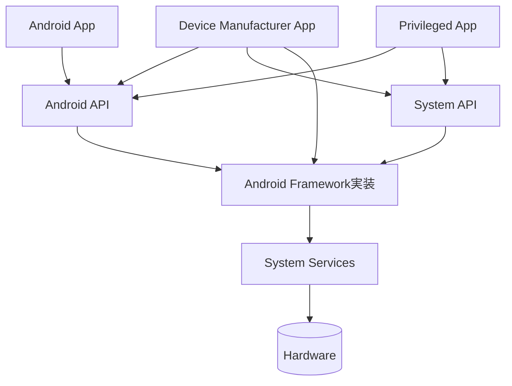

# **Android 調査レポート**

## **1. 基本情報**

* **ツール名**: Android (Android Open Source Project)
* **ツールの読み方**: アンドロイド
* **開発元**: Google (Open Handset Alliance)
* **公式サイト**: [https://source.android.com/](https://source.android.com/)
* **関連リンク**:
  * ドキュメント: [https://source.android.com/docs](https://source.android.com/docs)
  * リポジトリ: [https://android.googlesource.com/](https://android.googlesource.com/)
* **カテゴリ**: OS/プラットフォーム
* **概要**: Linuxカーネルをベースとしたオープンソースのモバイルオペレーティングシステム。スマートフォンやタブレットだけでなく、時計（Wear OS）、テレビ（Android TV）、自動車（Android Automotive）など、多様なデバイスの基盤として採用されている。

## **2. 目的と主な利用シーン**

* **解決する課題**: 多様なハードウェア上で動作する、統一された機能豊富なアプリケーション実行環境とユーザーインターフェースを提供する。
* **想定利用者**: スマートフォンメーカー（OEM）、組込み機器開発者、カスタムROM開発者、アプリ開発者。
* **利用シーン**:
  * **コンシューマー向けデバイス**: スマートフォン、タブレットのOSとして。
  * **産業用・専用デバイス**: ハンディターミナル、POSレジ、サイネージ、キオスク端末のOSとして。
  * **車載システム**: カーナビやインフォテインメントシステム（IVI）のOSとして。

## **3. 主要機能**

* **マルチプラットフォーム対応**: ARM, x86, RISC-V（実験的）など複数のアーキテクチャで動作。
* **強力なセキュリティモデル**: サンドボックス化されたアプリ実行環境、SELinuxによる強制アクセス制御、Verified Boot。
* **Trunk Stable開発モデル**: 最新の開発ブランチを常に安定状態に保ち、迅速な機能提供を可能にする開発手法への移行（2026年より本格化）。
* **互換性定義 (CDD/CTS)**: デバイス間の互換性を保証するための厳格な定義ドキュメント(CDD)とテストスイート(CTS)。
* **Project Treble**: OSフレームワークとデバイス固有の実装（ベンダー実装）を分離し、OSアップデートを容易にするアーキテクチャ。
* **APEX (Android Pony EXpress)**: システムコンポーネントをPlayストア経由で単独アップデート可能にする仕組み。

## **4. 動作原理・システム構成**

* **アーキテクチャ**: Linuxカーネルを基盤とするソフトウェアスタックアーキテクチャ。
* **主要コンポーネントとデータフロー**:
  * **Android App**: Android APIのみを使用して作成されたアプリ。Google Play Storeなどで配布される。
  * **Privileged App**: Android APIとSystem APIを組み合わせて作成され、デバイスにプリインストールされるアプリ。
  * **Device Manufacturer App**: Android API、System API、およびAndroidフレームワーク実装への直接アクセスを使用して作成されたアプリ。
  * **System API**: パートナーおよびOEMがバンドルアプリケーションに含めるために利用可能なAPI（ソースコードでは `@SystemApi` とマークされる）。
  * **Android API**: サードパーティの開発者向けに公開されているAPI。
  * **Android Framework**: アプリが構築される基盤となるJavaクラスやインターフェースのグループ。Android APIを通じて公開される部分と、System APIを通じてOEMのみに公開される部分がある。アプリのプロセス内で実行される。
  * **System Services**: `system_server`、`SurfaceFlinger`、`MediaService`などのモジュール化されたコンポーネント。Android Framework APIから呼び出され、基盤となるハードウェアにアクセスする。
* **特筆すべき要素技術**:
  * OSフレームワークとデバイス固有の実装を分離するProject Trebleや、コンポーネントごとのアップデートを可能にするAPEXなど、OSのモジュール化技術が多数導入されている。

## **5. 開始手順・セットアップ**

* **前提条件**:
  * Linux (Ubuntu LTS推奨)
  * 少なくとも400GB以上のディスク空き容量（ビルドにはさらに必要）
  * 64GB以上のRAM推奨
* **ソースコード取得**:

* **ビルド**:

* **実行**:
  Cuttlefishなどの仮想デバイス、またはPixelシリーズなどの実機にフラッシュして実行。

## **6. 特徴・強み (Pros)**

* **圧倒的なシェアとエコシステム**: 世界で最も使われているモバイルOSであり、対応アプリや開発者リソースが豊富。
* **オープンソース**: 誰でもソースコードを閲覧・修正・利用できるため、透明性が高く、独自のカスタマイズが可能。
* **ハードウェアの柔軟性**: 高価なハイエンド機から安価なエントリー機まで、あらゆるスペックのハードウェアに対応可能。
* **Googleサービスとの連携**: GMS (Google Mobile Services) と組み合わせることで、Googleの強力なクラウドサービスやAPIを利用可能（※GMSはプロプライエタリ）。

## **7. 弱み・注意点 (Cons)**

* **フラグメンテーション**: 多くのメーカーが独自のカスタマイズを行うため、OSバージョンや挙動の統一が難しく、開発者の検証コストが増大する。
* **アップデートの遅延**: Pixel以外のデバイスでは、最新OSの提供まで時間がかかる（または提供されない）ことが多い。
* **セキュリティのばらつき**: ベンダーによるパッチ適用状況に差があり、すべての端末で同等のセキュリティレベルが保証されない場合がある。

## **8. 料金プラン**

| プラン名 | 料金 | 主な特徴 |
|---|---|---|
| **AOSP (Open Source)** | 無料 | OSのソースコード自体は無料で利用可能。 |
| **GMSライセンス** | 要問合せ | Google PlayなどのGoogleアプリを搭載する場合は、Googleとの契約（MADA）が必要。 |

* **課金体系**: OS自体は無料。GMS利用や特定の特許利用に関しては契約が必要な場合がある。

## **9. 導入実績・事例**

* **導入企業**: Samsung, Xiaomi, OPPO, Sony, Sharp, Motorolaなど多数。
* **導入事例**:
  * **スマートフォン**: 世界中の数十億台の端末で稼働。
  * **Automotive**: Volvo, GM, HondaなどがAndroid Automotive OSを採用。
* **対象業界**: 通信、家電、自動車、流通、医療など全方位。

## **10. サポート体制**

* **ドキュメント**: [source.android.com](https://source.android.com/) に詳細な技術ドキュメントが整備されている。
* **コミュニティ**: Google Groups (android-platform, android-buildingなど) や Stack Overflow で活発な議論が行われている。
* **公式サポート**: パートナー企業（SoCベンダーや大手OEM）向けにはGoogleからの直接的なサポートがあるが、一般開発者向けにはコミュニティベース。

## **11. エコシステムと連携**

### **11.1 API・外部サービス連携**

* **HAL (Hardware Abstraction Layer)**: カメラ、オーディオ、センサーなどのハードウェア機能を標準化されたインターフェースで利用可能。
* **NDK (Native Development Kit)**: C/C++による高性能なアプリ開発をサポート。

### **11.2 技術スタックとの相性**

| 技術スタック | 相性 | メリット・推奨理由 | 懸念点・注意点 |
|:---|:---:|:---|:---|
| **Linux Kernel** | ◎ | AndroidはLinuxカーネル（ACK）をベースにしているため、Linuxのドライバ資産を活用可能。 | 通常のLinuxディストリビューションとはユーザー空間が大きく異なる。 |
| **Kotlin** | ◎ | アプリ開発の第一言語として公式に採用されており、最もサポートが手厚い。 | システムレベル（フレームワーク）の開発にはJavaやC++が依然として主流。 |
| **Rust** | ◎ | セキュアなシステムプログラミング言語として、Android OS内での採用が急速に進んでいる。 | 既存のC++コードとの相互運用には一定の知識が必要。 |

## **12. セキュリティとコンプライアンス**

* **認証**: デバイス暗号化（FBE）、生体認証フレームワーク（BiometricPrompt）。
* **データ管理**: アプリごとのSandbox化により、データの不正アクセスを防止。
* **準拠規格**: CC (Common Criteria) や FIPS 140-2 などの認証を取得した構成が可能。

## **13. 操作性 (UI/UX) と学習コスト**

* **UI/UX**: Material Design 3 (Material You) を採用し、ユーザーの好みに合わせたダイナミックな色調変更などが可能。
* **学習コスト**: アプリ開発は容易だが、OS自体のビルドやカスタマイズ（Platform開発）には、ビルドシステム（Soong/Bazel）、SELinux、HALなどの深い知識が必要であり、学習コストは高い。

## **14. ベストプラクティス**

* **効果的な活用法**:
  * **AOSPの変更は最小限に**: アップデート追従を容易にするため、コアフレームワークへの変更は避け、可能な限りアプリ層やHAL層でカスタマイズを行う。
  * **GSI (Generic System Image) でのテスト**: 互換性を確認するために、標準的なシステムイメージでの動作検証を行う。

## **15. ユーザーの声（レビュー分析）**

* **調査対象**: 開発者フォーラム、技術ブログ
* **総合評価**: レビューサイト（G2, Capterra）に該当なし
* **ポジティブな評価**:
  * 「ソースコードが公開されているため、問題発生時に原因を突き止めやすい。」
  * 「自由度が高く、どんなデバイスにも移植できるのが素晴らしい。」
* **ネガティブな評価 / 改善要望**:
  * 「ビルドシステムが複雑で、環境構築だけで一苦労する。」
  * 「ドキュメントが追いついていない部分があり、ソースコードを読むしかないことがある。」
* **特徴的なユースケース**:
  * 開発者コミュニティにおいて、カスタムROMの開発や、組み込み機器への移植など、柔軟性を活かした独自のハードウェア構築に役立てられている。

## **16. 直近半年のアップデート情報**

* **2026-09-09**: **Introducing Fast and Reliable Wireless Debugging with Android Debug Bridge (ADB) Wi-Fi 2.0 リリース**
  * 開発者向けに、高速かつ信頼性の高いワイヤレスデバッグツールである ADB Wi-Fi 2.0 がリリースされた。
* **2026-09-01**: **Leverage Android skills and Gemma 4 in Android Studio Quail 4**
  * Android Studio Quail 4 において、Gemma 4 の連携によるAI開発支援機能が強化された。
* **2026-08-24**: **AAOS SDV - Secure by Design**
  * Android Automotive OS における Software-Defined Vehicle 向けのセキュリティバイデザイン（自動スキャン、ペネトレーションテスト、APEX更新など）の強化策が発表された。
* **2026-02-03**: **Trunk Stableモデルへの移行**
  * 開発モデルの変更により、AOSPへのソースコード公開スケジュールが四半期ごと（Q2/Q4）に変更されることが案内された。
* **2026-01-XX**: **Android 16 QPR2 リリース**
  * 新機能の追加とバグ修正を含む四半期プラットフォームリリース。
* **2025-XX-XX**: **Android 16 正式リリース**
  * パフォーマンス向上、プライバシー機能の強化、Rust採用範囲の拡大などが盛り込まれたメジャーアップデート。

(出典: [Android Developers Blog](https://android-developers.googleblog.com/))

## **17. 類似ツールとの比較**

### **17.1 機能比較表 (星取表)**

| 機能カテゴリ | 機能項目 | Android (AOSP) | AluminiumOS | Ubuntu | iOS |
|:---:|:---|:---:|:---:|:---:|:---:|
| **オープン性** | ソースコード公開 | ◎ <small>OSS</small> | × <small>プロプライエタリ</small> | ◎ <small>OSS</small> | × <small>プロプライエタリ</small> |
| **ハードウェア** | 対応デバイス幅 | ◎ <small>極めて広い</small> | ◯ <small>PC等に対応予定</small> | ◯ <small>PC/サーバー主体</small> | △ <small>Apple製品のみ</small> |
| **カスタマイズ** | OS改造 | ◎ <small>自由自在</small> | × <small>不可</small> | ◎ <small>自由自在</small> | × <small>不可</small> |
| **アプリ** | エコシステム | ◎ <small>最大級(モバイル)</small> | ◎ <small>Android/Webアプリ連携</small> | △ <small>デスクトップ向</small> | ◎ <small>最大級</small> |

### **17.2 詳細比較**

| ツール名 | 特徴 | 強み | 弱み | 選択肢となるケース |
|---|---|---|---|---|
| **Android** | モバイル標準OSS | 圧倒的なシェア、ハードウェアの自由度、カスタマイズ性。 | フラグメンテーション、セキュリティ更新のタイムラグ。 | 自社ハードウェア向けOS、汎用モバイルアプリ開発。 |
| **AluminiumOS** | AndroidとChromeOSの融合 | モバイルアプリ資産とAI統合、シームレスなデバイス連携。 | デスクトップ専用ソフトの互換性、未成熟な部分あり。 | Androidエコシステムを活用した新しいデスクトップ体験を構築する場合。 |
| **Ubuntu** | 代表的なLinuxディストリビューション | サーバーからデスクトップまで対応、完全な自由。 | モバイル向けUI/UXや省電力機能はAndroidに劣る。 | サーバー、デスクトップ、組み込みLinuxなどで堅牢な環境が必要な場合。 |
| **iOS** | Appleプロプライエタリ | 高いセキュリティ、統一されたUX、長期アップデート。 | Apple製ハードウェア以外で動作しない、カスタマイズ不可。 | 高品質なUXやセキュリティが最優先される場合（ただしHW選択肢なし）。 |

## **18. 総評**

* **総合的な評価**:
  Androidは、モバイルコンピューティングの世界を変革したプラットフォームであり、その地位は揺るぎないものとなっている。オープンソースであることの強みを最大限に活かし、スマートフォンを超えて車や家電へと領域を広げている。開発者にとっては、その巨大なエコシステムと自由度が最大の魅力であるが、同時にフラグメンテーションという永遠の課題とも向き合う必要がある。
* **推奨されるチームやプロジェクト**:
  * 独自のハードウェア製品を開発し、リッチなGUIとアプリ環境を必要とするメーカー。
  * モバイル向けのサービスを展開する全ての開発チーム。
* **選択時のポイント**:
  * ハードウェアを自由に選びたい、あるいは自社専用デバイスを作りたい場合はAndroidが最強の選択肢である。
  * 逆に、ハードウェア開発を行わず、特定の高セキュリティ・高品質な環境のみをターゲットにするならiOSも検討されるが、ビジネスの規模を考えるならAndroid対応は必須である。
