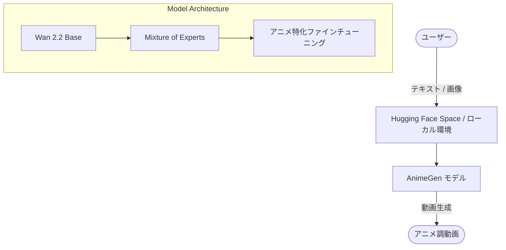

# **AnimeGen 調査レポート**

## **1. 基本情報**

* **ツール名**: AnimeGen
* **ツールの読み方**: アニメジェン
* **開発元**: 株式会社AIdeaLab
* **公式サイト**: [https://animegen.jp/](https://animegen.jp/)
* **関連リンク**:
  * Hugging Face (Text to Video): [https://huggingface.co/aidealab/AnimeGen-T2V](https://huggingface.co/aidealab/AnimeGen-T2V)
  * Hugging Face (Image to Video): [https://huggingface.co/aidealab/AnimeGen-I2V](https://huggingface.co/aidealab/AnimeGen-I2V)
  * 開発元ノート: [https://note.com/aidealab/n/nf73e7091ec95](https://note.com/aidealab/n/nf73e7091ec95)
* **カテゴリ**: 動画生成AI
* **概要**: 株式会社AIdeaLabが開発した、アニメ表現に特化した商用利用可能な動画生成AIモデル。Alibaba社の「Wan 2.2」をベースに開発され、テキストや画像から高品質なアニメ動画を生成できる。

## **2. 目的と主な利用シーン**

* **解決する課題**: アニメ制作現場における深刻な人材不足や長時間労働などの課題解決、および制作工程の効率化。
* **想定利用者**: アニメ制作者、イラストレーター、映像クリエイター、AI研究者・開発者。
* **利用シーン**:
  * アニメ制作における中割の補助
  * ムービーコンテの作成、背景や構図案のたたき台の検討
  * 色や構図のバリエーション出しなどの映像表現の試作

## **3. 主要機能**

* **Text to Video (テキストから動画生成)**: 入力したテキストプロンプト（例：「桜並木を歩く少女」）に従って、アニメ調の動画を生成する機能。
* **Image to Video (画像から動画生成)**: 既存の画像を入力とし、そのビジュアルをもとにしたアニメ動画（例：静止画のキャラクターが振り向く動作など）を生成する機能。
* **Frame Interpolation (フレーム補間)**: 動画の最初と最後の2枚の画像を指定し、その間を補間する動画を生成する機能。
* **商用利用可能なモデル**: クリエイターや企業が自社のプロジェクトや商用作品に利用できるライセンス形態での提供。
* **ブラウザ上でのデモ体験**: Hugging Face Spaceを通じて、環境構築不要で各モデル（T2V, I2V, フレーム補間）を直接ブラウザ上で試すことができる。

## **4. 動作原理・システム構成**

* **アーキテクチャ**: クラウドデモ（Hugging Face Spaces）およびローカルで推論可能なオープンソースモデル。
* **主要コンポーネントとデータフロー**:
  * ユーザーがテキストや画像を入力する。
  * ベースモデルとしてAlibaba社の「Wan 2.2」のアーキテクチャを利用し、Mixture of Experts（専門家モデルの使い分け）によって処理が行われる。
  * アニメ表現に特化してファインチューニングされた重みデータを使用して動画が出力される。
* **特筆すべき要素技術**:
  * **Wan 2.2 / Mixture of Experts (MoE)**: 単一のモデルではなく、複数の専門家モデルを使い分けることで、高品質な動画生成を実現するアーキテクチャ。
  * **Hugging Face エコシステム**: モデルの配布やデモ環境のホスティングにHugging Faceを活用しており、既存のAI開発ツールや推論環境との親和性が高い。

## **5. 開始手順・セットアップ**

* **前提条件**:
  * ブラウザから試す場合はHugging Faceのアカウント（一部機能）やインターネット環境があれば可能。
  * ローカルで実行する場合は、PyTorchなどの機械学習環境と、動画生成モデルを動かすための十分なVRAMを搭載したGPUが必要。
* **インストール/導入**:
  * Hugging Faceからモデルをダウンロードして利用する。
* **クイックスタート**:
  * 最も簡単な方法は、AIdeaLabが公開しているHugging Face Spaceのデモページにアクセスすること。
  * [Text to Video Demo](https://huggingface.co/spaces/aidealab/AnimeGen-T2V) にアクセスし、プロンプトを入力して「Generate」ボタンを押すだけで動画が生成される。

## **6. 特徴・強み (Pros)**

* 国内企業が主導して開発・公開した、日本発のアニメ表現に特化した動画生成AIモデルである点。
* オープンソースかつ商用利用可能であり、クリエイターが自身のプロジェクトに自由に組み込める点。
* 世界初のMoE採用動画生成モデルである「Wan 2.2」をベースにしており、高い生成品質を誇る点。
* 単なる生成モデルの公開にとどまらず、実際の制作現場での活用を想定し、クリエイターからのフィードバックを積極的に求めている点。

## **7. 弱み・注意点 (Cons)**

* 特定キャラクターの再現など、細かなシーンの指定や意図した通りのアニメ生成にはまだ課題がある。
* オープンソースモデルであるため、ローカルで実行するにはハイスペックな計算資源（GPU）が必要となる。
* まだベータ版を終えて初期公開された段階であり、発展途上の技術であること。

## **8. 料金プラン**

| プラン名 | 料金 | 主な特徴 |
|---------|------|---------|
| **オープンソース版** | 無料 | モデルのダウンロードや商用利用が可能 |
| **デモ環境** | 無料 | Hugging Face Spaces上での試験的な利用 |

* **課金体系**: 完全無料（オープンソース）
* **無料トライアル**: デモ環境で即座にテスト可能。

## **9. 導入実績・事例**

* **導入企業**: 2026年7月13日に公開されたばかりであり、具体的な導入企業名は未公開。
* **導入事例**: 現在、クリエイターや制作会社と連携して、制作フローの中でどこに役立つか（ラフの発想出し、背景案、キャラクター案など）の検証が進められている段階。
* **対象業界**: アニメ制作会社、映像制作会社、インディーズのクリエイター、AI開発企業。

## **10. サポート体制**

* **ドキュメント**: Hugging Face上のモデルカードや、開発元のnote記事（[AnimeGen公開の背景](https://note.com/aidealab/n/nf73e7091ec95)）で詳細が解説されている。
* **コミュニティ**: Hugging FaceのCommunityタブなどでディスカッションが可能。また、AIdeaLabはクリエイターからの率直なフィードバックを歓迎している。
* **公式サポート**: 株式会社AIdeaLabの公式サイトより、動画生成AIを活用した開発やアニメ制作工程へのDX導入に関する法人向け相談窓口が用意されている。

## **11. エコシステムと連携**

### **11.1 API・外部サービス連携**

* **API**: Hugging Face Inference APIなどを介してAPI連携が可能。
* **外部サービス連携**: Hugging Faceのエコシステム（Gradioなど）とシームレスに連携。

### **11.2 技術スタックとの相性**

| 技術スタック | 相性 | メリット・推奨理由 | 懸念点・注意点 |
|:---|:---:|:---|:---|
| **Python / PyTorch** | ◎ | AIモデルの標準的な推論環境であり、実装が容易 | GPU環境の構築が必要 |
| **Hugging Face / Gradio** | ◎ | デモがGradioで作成されており、UIのカスタマイズが容易 | 複雑な機能追加には改修が必要 |

## **12. セキュリティとコンプライアンス**

* **認証**: オープンソースとして公開されているため、利用環境に依存。
* **データ管理**: 学習データは日本国内の著作権法（主に第30条の4）に則り、適法に収集・学習されている。
* **準拠規格**: 経済産業省およびNEDOが実施する「GENIAC」プロジェクトの支援を受けて開発されており、透明性の高いAI開発が行われている。

## **13. 操作性 (UI/UX) と学習コスト**

* **UI/UX**: Hugging Face Spacesのデモは直感的であり、プロンプト入力や画像アップロードだけで簡単に操作可能。
* **学習コスト**: デモを利用するだけの学習コストは非常に低い。一方、ローカル環境にデプロイして独自のシステムに組み込む場合は、PyTorchや動画生成モデルに関する専門知識が必要となる。

## **14. ベストプラクティス**

* **効果的な活用法 (Modern Practices)**:
  * アニメ制作の初期段階で、ムービーコンテの作成や背景・構図案のたたき台として活用し、アイデア出しを加速させる。
  * フレーム補間機能を活用して、手作業の中割作業の補助として試験的に利用する。
* **陥りやすい罠 (Antipatterns)**:
  * 現在のモデルで特定キャラクターの完全な再現を期待しすぎること。現時点では雰囲気や構図の指示に適している。
  * 出力された動画の著作権等の扱いについて、文化庁の見解や第三者の権利を確認せずにそのまま商用作品のメインとして利用すること（あくまで補助ツールとしての利用を推奨）。

## **15. ユーザーの声（レビュー分析）**

* **調査対象**: 公式発表、note記事、SNSなど
* **総合評価**: リリース直後のため定量的なスコアはないが、国内発の取り組みとして高い関心を集めている。
* **ポジティブな評価**:
  * 「日本発のアニメ特化のオープンなモデルが公開されたことは大きな一歩である。」
  * 「商用利用可能であるため、様々なプロジェクトに組み込みやすい。」
* **ネガティブな評価 / 改善要望**:
  * 「特定キャラクターの維持が難しく、実制作に投入するにはまだ工夫が必要。」
  * 「参考画像をもとにした意図通りのアニメ生成には改善の余地がある。」
* **特徴的なユースケース**:
  * クリエイターが自身の描いたイラストを動画化し、動きのバリエーションを確認するためのツールとして活用。

## **16. 直近半年のアップデート情報**

* **2026-07-13**: アニメ特化の動画生成AIモデル「AnimeGen」を商用利用可能な形で無償公開。Text to Video、Image to Video、フレーム補間のデモおよびモデルをHugging Faceで公開。
* **2025-10**: 「AnimeGen」のベータ版を公開し、安全性や実用性のテストを開始。

(出典: [AIdeaLab プレスリリース](https://prtimes.jp/main/html/rd/p/000000026.000084222.html) )

## **17. 類似ツールとの比較**

### **17.1 機能比較表 (星取表)**

| 機能カテゴリ | 機能項目 | AnimeGen | Luma Dream Machine | Runway Gen-3 Alpha | Sora (OpenAI) |
|:---:|:---|:---:|:---:|:---:|:---:|
| **基本機能** | Text to Video | ◯ <small>アニメ表現に特化</small> | ◎ <small>実写・アニメ問わず高品質</small> | ◎ <small>非常に高品質で高速</small> | ◎ <small>業界最高水準の品質と一貫性</small> |
| **基本機能** | Image to Video | ◯ <small>アニメ表現に特化</small> | ◎ <small>高品質な動画生成</small> | ◎ <small>高品質な動画生成</small> | ◯ <small>対応している</small> |
| **独自性** | アニメ特化 | ◎ <small>アニメ表現に特化して学習</small> | △ <small>プロンプト次第だが汎用モデル</small> | △ <small>プロンプト次第だが汎用モデル</small> | △ <small>プロンプト次第だが汎用モデル</small> |
| **提供形態** | オープンソース | ◎ <small>無償でモデル公開、商用可</small> | × <small>SaaS提供のみ</small> | × <small>SaaS提供のみ</small> | × <small>SaaS提供のみ</small> |

### **17.2 詳細比較**

| ツール名 | 特徴 | 強み | 弱み | 選択肢となるケース |
|---------|------|------|------|------------------|
| **AnimeGen** | 国内発のアニメ特化モデル | オープンソースで商用利用可能。アニメの作画タッチに特化。 | キャラクターの一貫性など細かな制御は発展途上。 | アニメ制作の補助ツールとして自社環境に組み込みたい場合。 |
| **Luma Dream Machine** | 高速・高品質な汎用動画生成AI | 生成スピードが速く、自然な動きを表現可能。 | アニメ表現専用ではないため、意図したタッチにならない場合がある。 | 手軽に高品質な動画をSaaSで生成したい場合。 |
| **Runway Gen-3 Alpha** | クリエイター向けの多機能動画生成プラットフォーム | 制御機能が豊富で、高品質な映像生成が可能。 | クローズドなSaaSであり、API利用等でコストがかかる。 | 映像制作のプロが細かくコントロールして動画を作りたい場合。 |
| **Sora (OpenAI)** | 物理法則を理解した最先端の動画生成AI | 圧倒的な一貫性とリアリティ、長尺動画の生成。 | 一般公開が限定的であり、SaaSとしての利用のみ。 | 予算があり、最高品質の実写寄り動画を生成したい場合。 |

## **18. 総評**

* **総合的な評価**:
  AnimeGenは、日本が強みを持つアニメーション領域において、AIを活用した制作支援を目指す非常に意義深いオープンソースプロジェクトである。Alibabaの「Wan 2.2」をベースにしたことで基礎的な生成能力は高く、商用利用可能な形で無償公開されたことは、国内のAIコミュニティやクリエイターにとって大きな恩恵となる。現時点ではキャラクターの完全な維持などに課題を残すが、制作現場のフィードバックを取り入れながら進化していくプラットフォームとしてのポテンシャルは極めて高い。
* **推奨されるチームやプロジェクト**:
  アニメ制作会社、映像制作者、インディゲーム開発者、動画生成AIを用いた独自サービスを開発したいAI研究者・開発チーム。
* **選択時のポイント**:
  SaaS型で手軽に動画を生成したい場合はRunwayやLumaが適しているが、自社のインフラに組み込んで独自のツールを開発したい場合や、アニメ表現に特化したオープンなモデルを求めている場合は、AnimeGenが有力な選択肢となる。
