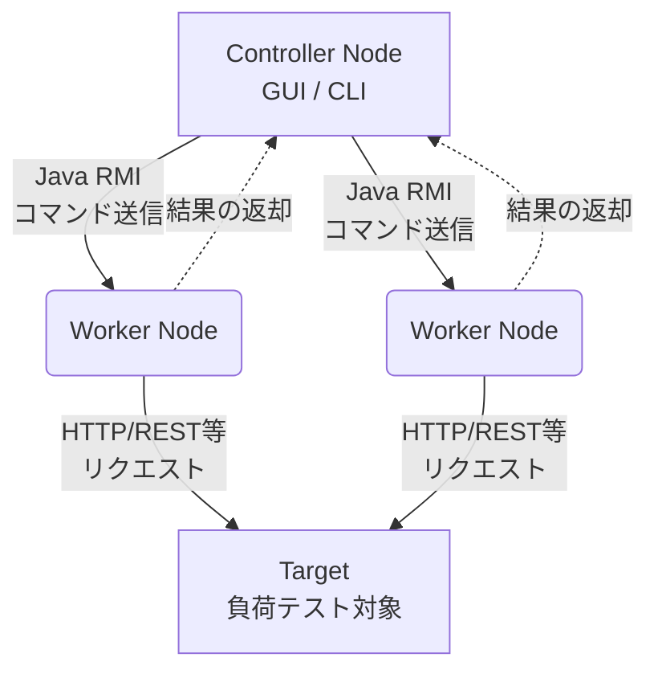

# **Apache JMeter 調査レポート**

## **1. 基本情報**

* **ツール名**: Apache JMeter™
* **ツールの読み方**: アパッチ ジェイメーター
* **開発元**: Apache Software Foundation
* **公式サイト**: [https://jmeter.apache.org/](https://jmeter.apache.org/)
* **関連リンク**:
  * GitHub: [https://github.com/apache/jmeter](https://github.com/apache/jmeter)
  * CodeWiki: [https://codewiki.google/github.com/apache/jmeter](https://codewiki.google/github.com/apache/jmeter)
  * ドキュメント: [https://jmeter.apache.org/usermanual/index.html](https://jmeter.apache.org/usermanual/index.html)
* **カテゴリ**: テスト/QA
* **概要**: Webアプリケーションや多様なサービスに対し、機能的な振る舞いの負荷テストとパフォーマンス測定を行うために設計された、100% Pure Javaのオープンソースソフトウェアです。

## **2. 目的と主な利用シーン**

* **解決する課題**: サーバー、ネットワーク、またはオブジェクトに重い負荷をかけ、その強度をテストしたり、さまざまな負荷タイプの下での全体的なパフォーマンスを分析したりする。
* **想定利用者**: ソフトウェア開発者、QAエンジニア、パフォーマンスエンジニア。
* **利用シーン**:
  * WebサイトやAPIのローンチ前のパフォーマンステスト
  * 新機能リリース後のリグレッションパフォーマンステスト
  * データベースサーバーへの高負荷状態のシミュレーション
  * 多数の同時接続ユーザーがいる状態でのアプリケーションの動作検証

## **3. 主要機能**

* **多様なプロトコル対応**: HTTP, HTTPS, SOAP/REST, FTP, Database (JDBC), LDAP, JMS, Mail (SMTP, POP3, IMAP), TCPなど、非常に幅広いプロトコルに対応。
* **テストIDE**: テスト計画の記録（ブラウザからの記録も可能）、構築、デバッグを迅速に行えるフル機能のGUIを提供。
* **CLIモード**: GUIを介さないコマンドラインでのテスト実行が可能で、CI/CDツールとの連携が容易。
* **動的HTMLレポート**: テスト結果から、グラフを含む詳細でインタラクティブなHTMLレポートを生成。
* **高い拡張性**: プラグイン機構により、サンプラー、タイマー、可視化プラグインなどを追加でき、テスト能力を無制限に拡張可能。
* **マルチスレッドフレームワーク**: 多数のスレッドによる同時サンプリングと、異なるスレッドグループによる複数機能の同時サンプリングを実現。
* **スクリプト対応**: JSR223互換言語（Groovy, Kotlinなど）を使用して、高度で複雑なテストロジックを実装可能。

## **4. 動作原理・システム構成**

* **アーキテクチャ**: 分散テストをサポートするクライアント・サーバーアーキテクチャ。
* **主要コンポーネントとデータフロー**:
  * **Controller Node (クライアント)**: テストの実行を制御するGUIまたはCLIノード。
  * **Worker Node (サーバー)**: Controllerからのコマンドを受け取り、Targetに対してリクエストを送信する。
  * **Target**: 負荷テストの対象となるWebサーバーなどのシステム。
* **特筆すべき要素技術**:
  * Java RMI (Remote Method Invocation) を使用してControllerとWorker間の通信を行う。
  * 100% Pure Javaで実装されており、JVM上でマルチスレッド動作する。



## **5. 開始手順・セットアップ**

* **前提条件**:
  * Java 8以降 (最新版ではJava 17以降推奨)
  * アカウント作成は不要
* **インストール/導入**:
  公式サイトからバイナリ(zipまたはtgz)をダウンロードし、解凍します。またはパッケージマネージャを使用します。

  ```bash
  # Homebrew (macOS)
  brew install jmeter
  ```

* **初期設定**:
  * 特に必須の設定はありませんが、大規模テストを行う場合はヒープメモリの設定(`bin/jmeter`または`bin/jmeter.bat`)を調整します。
* **クイックスタート**:

  ```bash
  # GUIモードの起動
  jmeter
  # CLIモードでのテスト実行
  jmeter -n -t test_plan.jmx -l log.jtl -e -o report_folder
  ```

## **6. 特徴・強み (Pros)**

* **オープンソース**: ライセンス費用が不要で、誰でも自由に利用、改変が可能。
* **プラットフォーム非依存**: 100% Javaで開発されているため、Javaが動作するあらゆるOS（Windows, macOS, Linux）で利用可能。
* **強力な拡張性と柔軟性**: 豊富なプラグインと、Groovyなどのスクリプト言語に対応しているため、非常に複雑で特殊なテストシナリオも構築可能。
* **巨大なコミュニティ**: 長い歴史を持ち、豊富なドキュメント、チュートリアル、活発なユーザーコミュニティが存在するため、問題解決が比較的容易。

## **7. 弱み・注意点 (Cons)**

* **ブラウザではない**: プロトコルレベルで動作するため、ブラウザのようにJavaScriptを実行したりHTMLページをレンダリングしたりはしない。そのため、クライアントサイドのパフォーマンス測定には不向き。
* **リソース消費**: GUIモードは多くのメモリを消費するため、大規模な負荷テストを実行する際はCLIモードの使用が推奨される。
* **学習コスト**: 機能が豊富で柔軟性が高い反面、UIが現代的ではなく、「スレッドグループ」「サンプラー」「リスナー」といったJMeter独自の概念を理解する必要があり、初心者が使いこなすには相応の学習が必要。
* **日本語対応**: UIは日本語化されているが、公式ドキュメントや最新情報は主に英語で提供される。

## **8. 料金プラン**

Apache JMeterはオープンソースソフトウェアであり、Apache License 2.0の下で完全に無料で利用できます。有料プランやライセンス費用は存在しません。

| プラン名 | 料金 | 主な特徴 |
|---|---|---|
| **オープンソース** | 無料 | 全機能を利用可能 |

* **課金体系**: なし
* **無料トライアル**: なし (常に無料)

## **9. 導入実績・事例**

* **導入企業**: オープンソースであるため公式な導入企業リストはないが、世界中のスタートアップから大企業まで、Webサービスを提供する多くの企業で業界標準の負荷テストツールとして広く利用されている。
* **導入事例**: 具体的な企業名は公開されていないが、eコマースサイトのセール時負荷テスト、APIサーバーの性能評価、新規システムのパフォーマンステストなど、多様な事例が技術ブログ等で報告されている。
* **対象業界**: IT、金融、製造、小売など、業界を問わず幅広く利用されている。

## **10. サポート体制**

* **ドキュメント**: [公式サイト](https://jmeter.apache.org/usermanual/index.html)に詳細なユーザーマニュアル、コンポーネントリファレンス、FAQ、Wikiが整備されている。
* **コミュニティ**: Apacheプロジェクトのメーリングリストや、Stack Overflowなどの技術コミュニティで活発な情報交換が行われている。
* **公式サポート**: 商用ツールのような公式の有償サポートはなく、サポートはコミュニティベースとなる。

## **11. エコシステムと連携**

### **11.1 API・外部サービス連携**

* **API**: Javaで独自のプラグインや関数を開発することで、機能を拡張可能。
* **外部サービス連携**:
  * CI/CDツール: Jenkins, Gradle, Maven, GitHub Actions
  * 監視・可視化: Grafana, Prometheus, Datadog
  * クラウド負荷テスト: BlazeMeter, Azure Load Testing

### **11.2 技術スタックとの相性**

| 技術スタック | 相性 | メリット・推奨理由 | 懸念点・注意点 |
|:---|:---:|:---|:---|
| **Java** | ◎ | Java製ツールであるため親和性が高く、Groovyスクリプト等でJavaライブラリを直接利用可能。 | 特になし。 |
| **HTTP/REST API** | ◎ | プロトコルレベルでのテストに特化しており、REST APIのテストに最適。 | JavaScriptの実行が必要なSPAのE2Eテストには不向き。 |
| **SOAP/JDBC/JMS** | ◎ | Web以外のレガシープロトコルやDB、ミドルウェアのテストにも幅広く対応。 | 設定が複雑になる場合がある。 |

## **12. セキュリティとコンプライアンス**

* **認証**: JMeter自体は認証機能を必要としない。テスト対象のシステムが要求する各種認証方式（Basic, Digest, Kerberos, NTLMなど）に対応している。
* **データ管理**: ユーザー自身の環境で実行されるソフトウェアであり、サービスではないため、データはローカルまたは指定した場所に保存される。
* **準拠規格**: JMeterを運用する組織の環境とポリシーに依存する。

## **13. 操作性 (UI/UX) と学習コスト**

* **UI/UX**: UIはJava Swingで構築されており、現代的なWebアプリケーションと比較すると古風で、操作が直感的でないと感じられることがある。
* **学習コスト**: 比較的高め。「スレッドグループ」「サンプラー」「リスナー」といったJMeter独自の概念を理解する必要がある。ただし、一度習熟すれば非常に強力なテストを設計できる。

## **14. ベストプラクティス**

* **効果的な活用法 (Modern Practices)**:
  * GUIモードはテスト作成・デバッグ時のみ使用し、実際の負荷テスト実行はCLIモードで行う。
  * 「View Results Tree」リスナーはデバッグ時のみ有効にし、本番テストでは無効化してリソース消費を抑える。
  * テスト計画をモジュール化し、「Test Fragment」や「Include Controller」を使用して再利用性を高める。
* **陥りやすい罠 (Antipatterns)**:
  * GUIモードで高負荷テストを実行し、JMeter自体がメモリ不足でクラッシュする。
  * 必要なアサーション（検証）を省略し、エラーが発生していることに気づかずに「成功」と誤認する。
  * テスト対象のシステムではなく、JMeterを実行しているマシンのリソース不足がボトルネックになる。

## **15. ユーザーの声（レビュー分析）**

* **調査対象**: G2, Capterra, ITreview
* **総合評価**:
  * 4.4/5.0 (G2, 90+ reviews) (G2より引用)
  * 4.6/5.0 (Capterra, 80+ reviews) (Capterraより引用)
  * 4.2/5.0 (ITreview, 20+ reviews) (ITreviewより引用)
* **ポジティブな評価**:
  * オープンソースで無料にも関わらず、エンタープライズ級の非常に高機能なテストができる点が最も評価されている。
  * HTTP/HTTPSだけでなく、JDBCやJMSなど、対応プロトコルの幅広さが強力。
  * スクリプトやプラグインによるカスタマイズ性が高く、複雑なシナリオにも対応できる柔軟性がある。
* **ネガティブな評価 / 改善要望**:
  * UIが古く、現代的なツールに比べて直感的ではないため、学習コストが高いという意見が多い。
  * 大規模なテストでは多くのメモリを消費するため、CLIモードでの実行や適切なチューニングが必須となる点。
  * クライアントサイドのパフォーマンスを測定できないため、体感パフォーマンスの測定には別のツールが必要。
* **特徴的なユースケース**:
  * CI/CDツールと連携し、ビルド・デプロイパイプラインの一部としてパフォーマンスリグレッションテストを自動化するケースが多く報告されている。

## **16. 直近半年のアップデート情報**

* **2026-08-27**: Apache Tika 4.0.0 への移行および、Groovy 5.1.1へのアップデート。
* **2026-07-08**: `AGENTS.md` が追加され、AIコーディングエージェント向けのビルド・テストのガイドラインが整備された。
* **2026-06-05**: セキュリティのモデルを示す `SECURITY.md` および `THREAT_MODEL.md` が追加され、セキュリティポリシーとAIアシスタント向けのガイドが強化された。
* **2024-01-20 (v5.6.3)**:
  * バグ修正と依存ライブラリの更新が中心のメンテナンスリリース。
  * GUIコンポーネントでの変数の利用箇所の拡大。
  * サマリーレポートのバグ修正やタイマーの改善。

(出典: [Release Notes](https://jmeter.apache.org/changes.html) / [GitHub Commits](https://github.com/apache/jmeter/commits/master))

## **17. 類似ツールとの比較**

### **17.1 機能比較表 (星取表)**

| 機能カテゴリ | 機能項目 | Apache JMeter | Karate | Playwright | Cypress |
|:---:|:---|:---:|:---:|:---:|:---:|
| **基本機能** | 負荷テスト | ◎<br><small>多機能・高拡張</small> | ◯<br><small>Gatling連携で可能</small> | ×<br><small>専用ツールが必要</small> | ×<br><small>専用ツールが必要</small> |
| **テスト対象** | API/プロトコル | ◎<br><small>HTTP, DB, JMS等多数</small> | ◎<br><small>統合DSLで強力</small> | ◯<br><small>補助機能</small> | △<br><small>主機能ではない</small> |
| **UIテスト** | ブラウザ操作 | ×<br><small>非対応</small> | ◯<br><small>WebDriver/CDP対応</small> | ◎<br><small>全主要ブラウザ対応・高機能</small> | ◎<br><small>GUIデバッガ・タイムトラベル</small> |
| **作成方法** | テスト構築 | ◎<br><small>GUIベース・設定中心</small> | ◎<br><small>Gherkin記法</small> | ◎<br><small>コードベース(TS/JS/Py等)</small> | ◎<br><small>コードベース(JS/TS)</small> |

### **17.2 詳細比較**

| ツール名 | 特徴 | 強み | 弱み | 選択肢となるケース |
|---------|------|------|------|------------------|
| **Apache JMeter** | JavaベースのOSS負荷テストツール。 | 幅広いプロトコル対応、GUIでのシナリオ作成、巨大なコミュニティ。 | ブラウザ上でのUIテストはできない。GUIのメモリ消費が大きい。 | サーバーの限界を測定する大規模な負荷テストや、多様なプロトコル(DB, JMS等)をテストしたい場合。 |
| **Karate** | API/UI/負荷テスト統合型ツール。 | 単一DSLでAPIからUI、負荷テスト(Gatling経由)までカバーできる高い生産性。 | 高度なデバッグ機能などは有償プランとなる。 | バックエンド(API)とフロントエンド(UI)の両方を同じツールで自動化・管理したい場合。 |
| **Playwright** | モダンE2Eテストツール。 | 全エンジン対応の強力なブラウザ操作、AIエージェント対応機能、Trace Viewer。 | 負荷テスト機能はない。 | 高速で安定したUIのE2Eテストを行いたい場合や、最新のWeb技術へ対応したい場合。 |
| **Cypress** | 開発者体験に優れるE2Eテストツール。 | タイムトラベル機能や強力なGUIデバッガによる使いやすさ。 | Safari対応が実験的、負荷テストは不可。 | フロントエンド開発者が中心となって、視覚的・直感的にE2Eテストを実装・デバッグしたい場合。 |

## **18. 総評**

* **総合的な評価**:
  Apache JMeterは、無料で利用できる負荷テストツールとして、長年にわたり業界のデファクトスタンダードであり続けている。その高い柔軟性、拡張性、そして幅広いプロトコルへの対応力は、多くの商用ツールと比較しても遜色がない。技術的な専門知識を持つチームが、コストをかけずに複雑なパフォーマンス測定を行いたい場合に最適な選択肢である。
* **推奨されるチームやプロジェクト**:
  * 予算が限られており、オープンソースツールを活用したいチーム。
  * 多様なプロトコル（Web、DB、JMSなど）のテストが必要なプロジェクト。
  * CI/CDパイプラインにパフォーマンステストを組み込みたい開発・QAチーム。
* **選択時のポイント**:
  * 学習コストの高さやUIの古さを許容できるかどうかが一つの判断基準となる。
  * より手軽さや洗練された開発体験を求める場合はk6やGatling、大規模なテスト実行の管理・分析の手間を削減したい場合はBlazeMeterなどの商用SaaSが有力な選択肢となる。
  * サーバーサイドのプロトコルレベルでの詳細なテストにおいて特に強力なため、そのような要件がある場合に推奨される。
