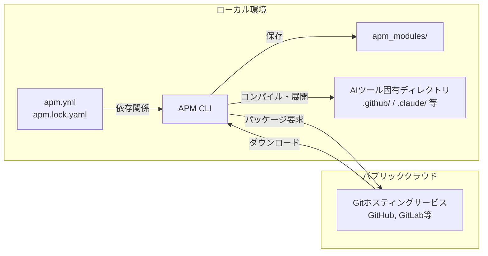

# **APM 調査レポート**

## **1. 基本情報**

* **ツール名**: APM (Agent Package Manager)
* **ツールの読み方**: エーピーエム / エージェント パッケージ マネージャー
* **開発元**: Microsoft
* **公式サイト**: [https://microsoft.github.io/apm/](https://microsoft.github.io/apm/)
* **関連リンク**:
  * GitHub: [https://github.com/microsoft/apm](https://github.com/microsoft/apm)
* **カテゴリ**: AI開発ライブラリ / パッケージマネージャー
* **概要**: AIエージェントのコンテキスト（指示、スキル、プロンプト、MCPサーバーなど）を管理するためのオープンソースのパッケージマネージャーです。JavaScriptの`npm`やPythonの`pip`のように、`apm.yml`で依存関係を定義し、プロジェクト間で共有・再現可能なAIエージェントの設定を構築できます。

## **2. 目的と主な利用シーン**

* **解決する課題**: チーム開発において、AIコーディングツール（GitHub Copilot, Claude, Cursor等）に提供するコーディング規約、プロンプト、スキル設定が開発者間でばらつく問題を解決します。
* **想定利用者**: AIコーディングツールを活用している開発者、開発チーム、プラットフォームエンジニア。
* **利用シーン**:
  * チーム全体で一貫したコーディング規約（Instructions）をAIエージェントに提供したい場合
  * 新規参画者がリポジトリをクローンした際に、コマンド一つで環境に応じた最適なAIプロンプトやスキルを設定したい場合
  * セキュリティ要件を満たす社内標準のMCPサーバーやプラグインを配布・構成する場合

## **3. 主要機能**

* **パッケージ管理と依存関係解決**: `apm.yml`で定義された依存関係に基づき、必要なパッケージを取得・配置します。推移的な依存関係（パッケージが依存するパッケージ）の解決もサポートします。
* **7つのプリミティブの管理**: Instructions（規約）、Skills（スキル）、Prompts（プロンプト）、Agents（エージェント）、Hooks（フック）、Plugins（プラグイン）、MCP Serversの7種の設定要素を管理できます。
* **ロックファイルによる再現性**: `apm.lock.yaml`を生成し、特定のコミットに依存関係を固定することで、すべての開発者が同一のAIエージェント構成を利用できるよう保証します。
* **マルチツールコンパイル出力**: ダウンロードした設定を、GitHub Copilot（`.github/`）、Claude（`.claude/`）、Cursor（`.cursor/`）など、各ツールがネイティブに読み込める形式・ディレクトリに配置またはコンパイルします（`apm compile`）。
* **柔軟なインストール元**: GitHub、GitLab、Bitbucket、Azure DevOpsなど、HTTPSやSSHをサポートする任意のGitホストからパッケージをインストール可能です。
* **依存関係の競合解決・優先順位付け**: 同名のプリミティブが存在する場合、ローカル（`.apm/`）を最優先とし、依存パッケージは宣言順に基づいて競合を解決・追跡します。

## **4. 動作原理・システム構成**

* **アーキテクチャ**: クライアント完結型のCLIパッケージマネージャ (必要に応じてGitホストなどと通信)
* **主要コンポーネントとデータフロー**:
  * 開発者が `apm install` を実行すると、CLIが `apm.yml` および `apm.lock.yaml` の依存関係を読み込む。
  * 必要なパッケージ（指示、スキル、プロンプト、MCPサーバーなど）をGitホスト（GitHub、GitLab等）からダウンロードし、ローカルの `apm_modules/` またはキャッシュに配置する。
  * 各AIコーディングエージェント（Copilot、Claude、Cursorなど）が読み込めるネイティブフォーマット（`.github/`、`.claude/` 等）へとコンパイル・出力する。



* **特筆すべき要素技術**:
  * Gitを用いたパッケージ配布（専用レジストリが不要）
  * 複数AIツールへのトランスパイル・コンパイル機能

## **5. 開始手順・セットアップ**

* **前提条件**:
  * Gitのインストール
  * 対象となるAIコーディングツール（Cursor, Copilot, Claudeなど）
* **インストール/導入**:

  ```bash
  # macOS / Linux
  curl -sSL https://aka.ms/apm-unix | sh
  # または homebrew
  brew install microsoft/apm/apm
  ```

* **初期設定**:
  * `apm init` コマンドでプロジェクトを初期化し、`apm.yml` を生成します。
* **クイックスタート**:
  * パッケージのインストール例

    ```bash
    apm install microsoft/apm-sample-package#v1.0.0
    ```

## **6. 特徴・強み (Pros)**

* **AIの「動作環境」をコードとして管理可能（IaC化）**: 属人的になりがちなプロンプトやAIへの指示をコードとしてリポジトリに含め、バージョン管理できます。
* **ベンダーロックインの排除**: APM自体は設定を各ツールのネイティブフォーマット（`AGENTS.md`や`CLAUDE.md`等）に出力するだけであり、APMの使用をやめても出力されたファイルはそのまま機能します。
* **チーム開発への高い親和性**: 新入社員が`git clone`後に`apm install`を実行するだけで、チーム共通のAIナレッジが反映された環境が即座に構築されます。
* **エコシステム・コミュニティ統合**: 任意のGitリポジトリをパッケージとして扱えるため、専用のレジストリなしにコミュニティで公開されたベストプラクティスを簡単に取り込めます。

## **7. 弱み・注意点 (Cons)**

* **ツールの仕様変更への依存**: GitHub CopilotやClaude Codeなどの対象ツール側で読み込みの仕様変更があった場合、APM側の対応アップデートを待つ必要があります。
* **コンセプトの学習コスト**: パッケージマネージャーの概念（依存関係、推移的依存、コンパイル等）に馴染みのないユーザーにとっては、最初の理解に少しハードルがあるかもしれません。
* **日本語情報の少なさ**: 英語の公式ドキュメントが中心であり、日本語での利用上の注意点は手探りで解決する必要があります。

## **8. 料金プラン**

| プラン名 | 料金 | 主な特徴 |
|---------|------|---------|
| **オープンソース (MIT)** | 無料 | すべての機能を利用可能。自身でパッケージを公開・利用可能。 |

* **課金体系**: 無料
* **無料トライアル**: -

## **9. 導入実績・事例**

* **導入企業**: オープンソースプロジェクトとして開発現場での利用が進行中。
* **導入事例**: CopilotやClaudeを利用するチームにおいて、コーディング標準の統一や、特定のAPI利用ルールをエージェントに事前学習させる目的での利用が想定されています。
* **対象業界**: ソフトウェア開発チーム全般

## **10. サポート体制**

* **ドキュメント**: [公式ドキュメントサイト](https://microsoft.github.io/apm/)にて、クイックスタート、アーキテクチャ、CLIリファレンスが充実しています。
* **コミュニティ**: GitHub上のDiscussionsやIssuesを活用したサポートが行われています。
* **公式サポート**: オープンソースプロジェクトとしての提供であるため、コミュニティベースの対応となります。

## **11. エコシステムと連携**

### **11.1 API・外部サービス連携**

* **API**: CLIツールであり、REST APIは提供されていません。
* **外部サービス連携**: 各種Gitホスティングサービス（GitHub, GitLab, Bitbucket, Azure DevOps等）からの直接パッケージダウンロードに対応しています。

### **11.2 技術スタックとの相性**

| 技術スタック | 相性 | メリット・推奨理由 | 懸念点・注意点 |
|:---|:---:|:---|:---|
| **GitHub Copilot** | ◎ | `.github/`配下にネイティブ設定（`AGENTS.md`等）を出力可能。 | 特になし。 |
| **Claude / Cursor** | ◎ | `.claude/`や`.cursor/`等へ直接設定を展開し、高い親和性。 | 特になし。 |
| **Node.js / Python等** | ◎ | `npm`や`pip`といった各言語のパッケージマネージャと共存し、設定ファイルをリポジトリ内に保持できる。 | `.gitignore`への`apm_modules/`追加が必要。 |

## **12. セキュリティとコンプライアンス**

* **認証**: Gitホストからのダウンロード時にHTTPSやSSHを用いた認証を利用します。
* **データ管理**: サプライチェーン攻撃対策として、エージェントが実行・読み込む設定ファイルに対して、インストール前にスキャン（Unicodeの隠し文字検出等）を行うセキュリティ機構（`apm audit`等）が備わっています。
* **準拠規格**: オープンソースプロジェクトであり、固有のコンプライアンス認証は取得していません。

## **13. 操作性 (UI/UX) と学習コスト**

* **UI/UX**: ターミナルから操作するCLIツールです。`apm init`や`apm install`といったコマンド体系は`npm`等と共通しているため、直感的です。
* **学習コスト**: 既存のパッケージマネージャに慣れている開発者であれば、学習コストは低いです。

## **14. ベストプラクティス**

* **効果的な活用法 (Modern Practices)**:
  * 組織全体の標準ルールを共通のAPMパッケージとして社内Gitリポジトリに切り出し、各プロジェクトの`apm.yml`でインポートする。
  * `apm.yml`と`apm.lock.yaml`、および各エージェント向けの出力設定ファイル（`.github/`等）はコミットし、`apm_modules/`は`.gitignore`で除外する。
* **陥りやすい罠 (Antipatterns)**:
  * パッケージのバージョンを指定せずに運用し、予期せぬエージェントの挙動変更を引き起こすこと。
  * コンフリクトを無視して重複する指示を複数取り込むこと。

## **15. ユーザーの声（レビュー分析）**

* **調査対象**: GitHubリポジトリ
* **総合評価**: Star数 3.8k+ (GitHub)
* **ポジティブな評価**:
  * チーム内でCopilotの指示を統一できる画期的な仕組み。
  * AIエージェント界隈における`package.json`の登場。
* **ネガティブな評価 / 改善要望**:
  * Windows環境でのエンコーディング対応など、特定環境での動作についての課題報告。
* **特徴的なユースケース**:
  * `agentrc`などのツールでコードベースから抽出したAI向けルールを、APM経由で配布するパイプラインでの利用。

## **16. 直近半年のアップデート情報**

* **2026-09-07**: v0.30.0 - Homebrew coreをmacOSの主要なインストールパスに設定、キャッシュやライフサイクルの堅牢性強化などを実施。
* **2026-09-06**: v0.29.1 - Copilotフックのエンドポイント修正、Claude用LSP対応強化など多数の不具合修正。
* **2026-08-30**: v0.29.0 - Agent Pluginsのv1基盤追加、GitHub Copilot等へのプラグインネイティブ対応強化、Windows Defender対策など。
* **2026-08-06**: v0.28.0 - Kiroエージェントへの出力対応（`.kiro/agents/`）、ローカルでのプラグイン監査機能追加など。
* **2026-08-02**: v0.27.0 - Triageダッシュボード等のバグ修正、VS Codeフック・LSP等の展開に関する仕様改善。
* **2026-04-06**: v0.8.11 - 同名のネイティブスキルを展開するパッケージが存在した場合の警告処理修正、Windows環境でのエンコーディング対応修正など。

(出典: [apm Releases](https://github.com/microsoft/apm/releases))

## **17. 類似ツールとの比較**

### **17.1 機能比較表 (星取表)**

| 機能カテゴリ | 機能項目 | APM | npm | pip | 各AIツールの独自プラグイン機能 |
|:---:|:---|:---:|:---:|:---:|:---:|
| **基本機能** | 依存解決 | ◎<br><small>AIのコンテキストに特化</small> | ◯<br><small>コードのライブラリに特化</small> | ◯<br><small>コードのライブラリに特化</small> | ×<br><small>-</small> |
| **カテゴリ特定** | 複数AIへの出力 | ◎<br><small>Copilot, Claude, Cursor対応</small> | ×<br><small>-</small> | ×<br><small>-</small> | △<br><small>そのツール専用のみ</small> |
| **エンタープライズ** | 再現性 | ◯<br><small>apm.lock.yamlで固定</small> | ◎<br><small>強固なバージョン管理</small> | △<br><small>手動更新またはアドオン必要</small> | ×<br><small>-</small> |
| **非機能要件** | 学習コスト | ◯<br><small>npm等と同じコマンド体系</small> | ◎<br><small>広く普及</small> | ◎<br><small>広く普及</small> | ◯<br><small>GUI操作が中心</small> |

### **17.2 詳細比較**

| ツール名 | 特徴 | 強み | 弱み | 選択肢となるケース |
|---------|------|------|------|------------------|
| **APM** | AIコンテキスト専用のパッケージマネージャ | 複数ツール向けに依存関係を解決して出力できる | 新しい概念であり、AI開発ライブラリ自体の普及度合に依存する | チームで設定を統一・配布したい場合 |
| **npm** | JavaScript/Node.jsの標準パッケージ管理 | エコシステムが巨大で安定性が高い | AIのコンテキスト設定を出力・管理する機能はない | Node.js環境構築時。APMの代替にはならない |
| **pip** | Pythonの標準パッケージ管理 | デファクトスタンダードとしての圧倒的な普及率 | 依存解決の複雑さ、AIコンテキスト出力の欠如 | Python環境構築時。APMの代替にはならない |
| **各AIツールの独自設定機能** | CursorのRulesなど | GUI等から簡単に設定できる | ツール間での設定の使い回しが難しい | 特定のAIツールしか使用しない場合 |

## **18. 総評**

* **総合的な評価**:
  ソフトウェアエンジニアリングで培われた「パッケージ管理」の概念をAI分野に持ち込み、複数のAIツールに透過的に対応できる画期的なツールです。
* **推奨されるチームやプロジェクト**:
  GitHub Copilot、Claude Code、Cursor等のAIコーディングエージェントをチーム規模で導入しているプロジェクトに強く推奨されます。
* **選択時のポイント**:
  設定ファイルがローカルやリポジトリで散逸し始めている、または新規メンバーの環境セットアップに手間がかかっている場合に導入を検討すべきソリューションです。
