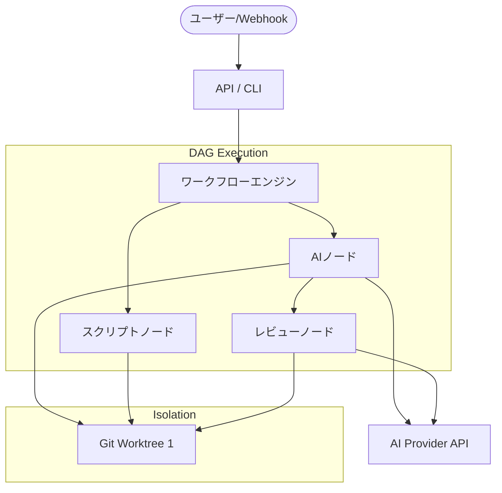

# **Archon 調査レポート**

## **1. 基本情報**

* **ツール名**: Archon
* **ツールの読み方**: アルコン
* **開発元**: Coleam00 (オープンソース)
* **公式サイト**: [https://archon.diy](https://archon.diy)
* **関連リンク**:
  * GitHub: [https://github.com/coleam00/Archon](https://github.com/coleam00/Archon)
  * DeepWiki: [https://deepwiki.com/coleam00/Archon](https://deepwiki.com/coleam00/Archon)
* **カテゴリ**: 自律型AIエージェント
* **概要**: ArchonはAIコーディングエージェントのためのワークフローエンジンである。プランニング、実装、検証、コードレビュー、PR作成といった開発プロセスをYAMLベースで定義し、AIを使ったコーディングを決定論的かつ再現可能なものにする。

## **2. 目的と主な利用シーン**

* **解決する課題**: AIエージェントにコーディングを依頼する際、モデルの機嫌によってプランニングをスキップしたりテストを忘れたりする不確実性（毎回結果が異なる問題）を解決する。
* **想定利用者**: 開発者、開発チーム
* **利用シーン**:
  * バグ修正や機能追加の自動化とプルリクエスト作成
  * 既存プロジェクトのコードベース分析とリファクタリング
  * コードレビューの自動化

## **3. 主要機能**

* **YAMLベースのワークフロー定義**: 開発プロセス全体をYAMLのワークフローとして定義でき、ループ処理や条件分岐を含むDAG（有向非巡回グラフ）として構成可能。
* **分離された実行環境**: ワークフローの実行ごとに独立したGitワークツリーを作成し、コンフリクトなしに複数タスクの並列実行を実現。
* **Fire and forget（自動実行）**: ワークフローを起動するだけで、AIが自律的にタスクをこなし、最終的にプルリクエストの作成までを完了させる。
* **ハイブリッドノード構成**: AIによるコード生成やレビュー（AIノード）と、Bashスクリプトやテスト実行など（決定論的ノード）を自由に組み合わせることが可能。
* **マルチプラットフォーム対応**: CLI、Web UI、Slack、Telegram、Discord、GitHubなど多様なインターフェースからの操作に対応している。

## **4. 動作原理・システム構成**

* **アーキテクチャ**: クライアント・サーバー型アーキテクチャを持ち、ローカル環境またはサーバー環境で動作する。エンジンはDAG（有向非巡回グラフ）としてワークフローを処理し、Gitワークツリーを使用してタスク間のコンフリクトを回避する分離された実行環境を提供する。
* **主要コンポーネントとデータフロー**:
  * **Workflow Engine**: YAMLで定義されたワークフロー（DAG）を解析し、各ノード（AI、Bash、スクリプト等）を適切な順序で実行する。
  * **Isolation Environments**: 各ワークフローの実行ごとに新しいGitワークツリーを作成し、他の実行と干渉しないサンドボックス環境を提供する。
  * **Provider Adapters**: Claude Code等のAIエージェントや、Discord/Slack等のメッセージングプラットフォームと連携するためのアダプター。
* **特筆すべき要素技術**:
  * **Git Worktrees**: 並行タスクの安全な実行を実現するための基盤技術。



## **5. 開始手順・セットアップ**

* **前提条件**:
  * Bun
  * GitHub CLI (`gh`)
  * Claude Code (`claude`) 等のサポート対象CLI
* **インストール/導入**:

  ```text
  # macOS / Linux (Quick Install)
  curl -fsSL https://archon.diy/install | shell

  # Homebrew
  brew install coleam00/archon/archon
  ```

* **初期設定**:
  インストール完了後、対象のプロジェクトディレクトリに移動してセットアップコマンド（例: `archon setup`）を実行し、プロジェクトの設定を行う。
* **クイックスタート**:

  ```text
  cd /path/to/your/project
  # ワークフローを実行してバグ修正を依頼
  archon workflow run "Use archon to fix issue #42"
  ```

## **6. 特徴・強み (Pros)**

* AIエージェントの行動を決定論的（再現可能）にするアプローチ。CI/CDのGitHub Actionsのような位置づけで安定した出力が期待できる。
* ループ処理（例: テストが通るまで修正を繰り返す）や、人間の承認待ちゲートをワークフローに組み込める。
* デフォルトで17種類のワークフロー（PR作成、自動レビュー、コンフリクト解消など）が組み込まれており、すぐに実務に投入可能。
* `fan_out`のような動的並列実行やパラメータ化された`include`ブロックなど、高度なワークフロー構成をサポート。

## **7. 弱み・注意点 (Cons)**

* ドキュメントやWeb UIは英語がベースであり、日本語によるサポートが限定的。
* ベースとしてClaude CodeなどのAIエージェント、およびBunの動作環境に依存している。
* 複雑な独自ワークフローを作成する場合、YAMLでの記述とプロンプトエンジニアリングの学習コストがかかる。
* クラウド環境で利用する場合、AIプロバイダーのAPI利用料が重くなる可能性がある。

## **8. 料金プラン**

| プラン名 | 料金 | 主な特徴 |
|---------|------|---------|
| **無料プラン** | 無料 | オープンソース（MITライセンス）。すべての機能が利用可能。 |

* **課金体系**: ツール自体は無料だが、背後で利用するLLM（Claude APIなど）のAPI利用料は別途発生する。
* **無料トライアル**: なし（完全無料）

## **9. 導入実績・事例**

* **導入企業**: オープンソースコミュニティを中心に利用されている（公開事例は少ない）。
* **導入事例**: GitHubのスター数は23.3kを超えており（2026年8月時点）、個人開発者からチームまで幅広く関心を集めている。
* **対象業界**: ソフトウェア開発全般

## **10. サポート体制**

* **ドキュメント**: [公式ドキュメントサイト](https://archon.diy) にて、チュートリアルやCLIリファレンスが提供されている。
* **コミュニティ**: GitHub上のIssueやDiscussionsが活発。
* **公式サポート**: オープンソースであるため、有償の公式サポート窓口は提供されていない。

## **11. エコシステムと連携**

### **11.1 API・外部サービス連携**

* **API**: 内部的にはSQLite/PostgreSQLを用いたデータ管理を行い、API経由でWeb UIやCLIから操作可能。
* **外部サービス連携**: Slack, Telegram, Discord, GitHub (Webhooks) との連携用アダプターが標準提供されている。

### **11.2 技術スタックとの相性**

| 技術スタック | 相性 | メリット・推奨理由 | 懸念点・注意点 |
|:---|:---:|:---|:---|
| **TypeScript / Bun** | ◎ | ツール自体がTypeScript/Bunで構築されており、親和性が極めて高い。 | 特になし |
| **Node.js** | ◯ | 一般的なJS環境でも動作。 | ランタイムとしてBunのインストールが必須。 |
| **Python** | ◯ | 任意のスクリプトコマンドを実行できるため、テストノード等への組み込みが容易。 | AIノードがPython文脈をどれだけ理解できるかに依存。 |

## **12. セキュリティとコンプライアンス**

* **認証**: Web UIへのアクセス制限や各種プラットフォーム連携でのトークン認証（Slack/Telegram等）に対応。GitHub App認証によるボット操作もサポート。
* **データ管理**: 会話履歴やセッション情報はローカル（または自己ホスト環境）のSQLite/PostgreSQLに保存される。
* **準拠規格**: オープンソースプロジェクトであり、特定のセキュリティ認証（SOC2等）の取得は明記されていない。

## **13. 操作性 (UI/UX) と学習コスト**

* **UI/UX**: CLIツールとしての直感的な操作に加え、リッチなWebダッシュボードが提供されており、進行中のワークフローの監視やドラッグ＆ドロップによるワークフロー作成が可能。Slack上のUIもインタラクティブボタンに対応している。
* **学習コスト**: デフォルトのワークフローを使う分には容易だが、独自のDAGワークフローを作成するにはYAMLの記述ルールやパラメータ化（`inputs`, `returns`）の理解が必要。

## **14. ベストプラクティス**

* **効果的な活用法 (Modern Practices)**:
  * チーム全体で `.archon/workflows/` ディレクトリ（またはパッケージ化されたフォルダ）をGitリポジトリにコミットし、共有のAI開発プロセスを標準化する。
  * `archon-idea-to-pr` などの標準ワークフローを出発点として、自社プロジェクトに特化した検証スクリプトを追加する。
  * ワークフローの入力（`inputs`）と出力（`returns`）を明確に定義し、再利用可能なサブDAGとして構成する。
* **陥りやすい罠 (Antipatterns)**:
  * ワークフローにテストや検証（Validation）の決定論的ノードを組み込まずに、AIのみに頼り切ること。
  * 未知の副作用を持つコマンドを承認ゲートなしでAIに実行させること。

## **15. ユーザーの声（レビュー分析）**

* **調査対象**: GitHub (Issue, Discussions), X(Twitter)
* **総合評価**: GitHubスター数 23.3k
* **ポジティブな評価**:
  * AIコーディングにおける「再現性のなさ」というペインをYAMLベースのワークフロー定義で見事に解決している。
  * 分離されたワークツリーで複数のタスクを並行してAIに任せられる点が画期的。
  * ローコード/ノーコードでのエージェント開発環境として非常に強力。
* **ネガティブな評価 / 改善要望**:
  * セットアップに複数のツールを要求するため、最初のハードルがやや高い。
  * 日本語ドキュメントやUIが不足している。
* **特徴的なユースケース**:
  * SlackからAIエージェントに命令を出し、非同期でPRが作成・レビューされるまでの全自動パイプラインとしての利用。

## **16. 直近半年のアップデート情報**

* **2026-08-17**: Archon CLI v0.9.0 リリース。ワークフローのコンポーザビリティ強化（`inputs:`, `returns:` の追加）、`--dry-run` シミュレーターの追加、パッケージ化されたワークフローフォルダ構造のサポート。
* **2026-08-06**: Archon CLI v0.8.0 リリース。実行出力のレポジトリ外への移動（`~/.archon/workspaces/`）、`workflow: ` ノードでの動的ファンアウト（並行実行）機能、パラメータ化された `include:` ブロックのサポート。
* **2026-08-04**: Archon CLI v0.7.1 リリース。実行コンテキストの保存強化（アシスタント、モデル、ベースブランチ等の記録）、ツール呼び出しごとの遅延・失敗追跡の改善。
* **2026-08-01**: Archon CLI v0.7.0 リリース。実行時サブラン（`workflow:`）、Archon Studio（ビジュアルビルダー）の連携モード追加、エビデンス検証ゲートポリシーの追加。
* **2026-07-20**: Archon CLI v0.6.0 リリース。フォルダプロジェクト対応、Dockerコンテナ分離機能の追加、`include:` および `loop_group:` などの構成プリミティブの追加。
* **2026-06-26**: Archon CLI v0.5.0 リリース。ユーザーごとのAI認証（APIキー・OAuth）のサポート、Console UIのデフォルト化、モデルのティア分けとエイリアス機能。
* **2026-05-28**: Archon CLI v0.4.0 リリース。GitHub App認証サポート、Slack UXの改善（インタラクティブボタン等）、OpenCodeおよびGitHub Copilotのコミュニティプロバイダー追加。

(出典: [GitHub Releases](https://github.com/coleam00/Archon/releases))

## **17. 類似ツールとの比較**

### **17.1 機能比較表 (星取表)**

| 機能カテゴリ | 機能項目 | 本ツール (Archon) | Roo Code | Cline | AutoGPT |
|:---:|:---|:---:|:---:|:---:|:---:|
| **基本機能** | 自律的コーディング | ◯<br><small>ワークフローベースで動作</small> | ◎<br><small>IDE統合の高度な機能</small> | ◎<br><small>Plan/Actループ</small> | ◎<br><small>完全自律型</small> |
| **カテゴリ特定** | ワークフロー定義 | ◎<br><small>YAMLによる高度なDAG構成</small> | △<br><small>カスタムプロンプトによる</small> | △<br><small>カスタムプロンプトによる</small> | ◎<br><small>GUIによるフロー作成</small> |
| **エンタープライズ** | 並行タスク実行 | ◎<br><small>Gitワークツリー分離/ファンアウト</small> | ×<br><small>非対応</small> | ×<br><small>非対応</small> | △<br><small>手動での分離が必要</small> |
| **非機能要件** | オープンソース | ◯<br><small>MITライセンス</small> | ◯<br><small>MITライセンス</small> | ◯<br><small>MITライセンス</small> | ◯<br><small>一部制限あり</small> |

### **17.2 詳細比較**

| ツール名 | 特徴 | 強み | 弱み | 選択肢となるケース |
|---------|------|------|------|------------------|
| **本ツール (Archon)** | AIエージェント用のワークフローエンジン | 再現性の高さ、並行実行(ファンアウト)、カスタマイズ可能なパイプライン、再利用可能なワークフロー | セットアップがやや複雑、IDEの強力なUIは持たない | チームでAI開発プロセスを標準化し、CI/CDのように自動化したい場合 |
| **Roo Code** | VS Code用AIコーディングアシスタント | 完全自由なモデル選択（GPT-5.5, Opus 4.7等）、強力なIDE統合、CLI対応 | プロセスがAIの機嫌に左右されやすい、Webアプリ版の終了 | ローカル環境で最先端のモデルを使い、エディタ内でインタラクティブに開発を進めたい場合 |
| **Cline** | IDE/CLIで動作する協調型AIエージェント | オープンソースで高いセキュリティ、Plan/Actループによる複雑タスクの処理 | 学習コストが高く、API料金が変動する | 複雑なリファクタリングなど、コード全体を理解した高度なタスクを依頼したい場合 |
| **AutoGPT** | 汎用的な自律型AIエージェント | GUIビルダーによるノーコード/ローコードでのエージェント構築、汎用性が高い | 意図せぬループや高額なAPIコストリスク、コーディング特化の機能では劣る | コーディング以外の様々なタスクを自動化したい、独自のワークフローを持つエージェントを作りたい場合 |

## **18. 総評**

* **総合的な評価**:
  ArchonはAIコーディングの課題である「再現性の欠如」に正面から取り組んだ画期的なワークフローエンジンである。YAMLでプロセスを定義し、サブランやパラメータ、ファンアウトといった高度な機能をサポートする進化は「CI/CDのAI版」と呼ぶにふさわしく、チーム開発におけるプロセス標準化に大きく寄与する。
* **推奨されるチームやプロジェクト**:
  開発プロセスが定着しており、そのプロセスにAIを効率的に組み込んで自律化させたい中規模以上の開発チーム。特にレビューやテストなど、複数のステップを確実に行わせたいプロジェクトに最適。
* **選択時のポイント**:
  VSCode等のエディタ内で対話しながら開発を進める（Roo Code / Cline等）か、ワークフローとしてタスクを非同期に自動処理させる（Archon）かで、用途に合わせて選択するのが良い。また、ノーコードで汎用タスクを自動化したい場合はAutoGPTも比較対象となるが、コーディングタスクにおける再現性と隔離環境（Git Worktree）を重視するならArchonが優れている。
