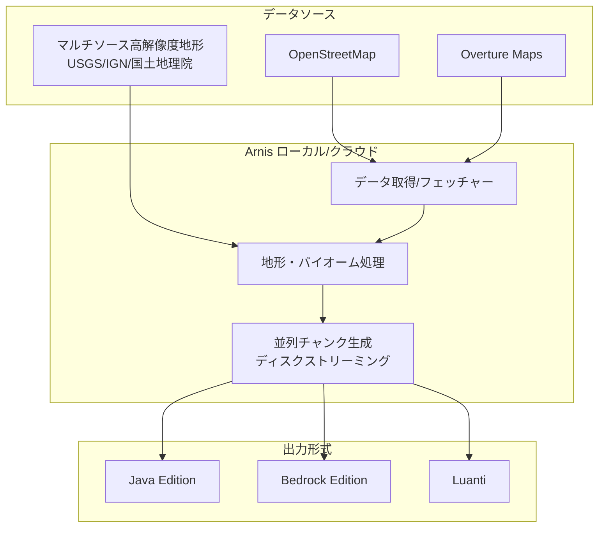

# **Arnis 調査レポート**

## **1. 基本情報**

* **ツール名**: Arnis
* **ツールの読み方**: アーニス
* **開発元**: Louis Erbkamm
* **公式サイト**: [https://arnismc.com/](https://arnismc.com/)
* **関連リンク**:
  * GitHub: [https://github.com/louis-e/arnis](https://github.com/louis-e/arnis)
* **カテゴリ**: 開発ユーティリティ
* **概要**: 現実世界の地理データ（OpenStreetMapや標高データ）を元に、Minecraftのワールド（Java版およびBedrock版）を自動生成するオープンソースのデスクトップアプリケーション。直感的なUIで地図上のエリアを選択するだけで、建物、道路、地形をMinecraft内に再現できる。

## **2. 目的と主な利用シーン**

* **解決する課題**: 現実の街並みや地形をMinecraft内で手作業で再現する膨大な手間と時間を削減する。
* **想定利用者**:
  * 現実の街を探索・建築したいMinecraftプレイヤー
  * 大規模な都市マップを作成するサーバー運営者・マップ製作者
  * 地理や都市計画の学習にMinecraftを活用する教育関係者（例: Floodcraftプロジェクトでの活用）
* **利用シーン**:
  * 自分の住んでいる街や有名な観光地をMinecraft内で再現して探索する
  * 現実の都市データをベースにしたRPGやサバイバルサーバーのマップ作成
  * 洪水シミュレーションなど、現実世界の地形データを用いた教育・研究用途

## **3. 主要機能**

* **インタラクティブなエリア選択**: 内蔵されたマップ画面から、生成したい現実世界のエリアを矩形で直感的に選択できる。最大150km²の広大なエリアの生成に対応。
* **マルチプラットフォーム・複数フォーマット対応**: Java版（1.17以降）、Bedrock版の直接出力に加えて、Luanti (Mineclonia) 向け出力（実験的）にも対応。
* **高精度な地形・建物生成**: OpenStreetMap (OSM) に加え、Overture Mapsとの連携による建物形状の高精度化を実現。
* **気候・マルチソース地形パイプライン**: AWS Terrain Tilesに加え、高解像度な地域別地形データ(USGS 3DEP, IGN France, IGN Spain, 日本の国土地理院(GSI))と統合。気候に応じたバイオームや植生（500種以上の木）を再現する。
* **ディスクストリーミング生成**: RAM上にすべて保持せずディスクストリーミングで生成し、マルチコア並列処理を行うことで、より巨大なマップ作成と低メモリ化・高速化に対応。
* **MapSmith（オンライン生成）**: デスクトップアプリをインストールせずに、ブラウザ上からクラウドのサーバーリソースを利用して高速にワールドを生成・ダウンロードできる機能（モバイルデバイスにも対応）。

## **4. 動作原理・システム構成**

* **アーキテクチャ**: ローカル生成を主軸としたRust製デスクトップアプリケーション、およびクラウド生成オプション（MapSmith）。
* **主要コンポーネントとデータフロー**:
  * **地図データフェッチ**: OpenStreetMap (Overpass API) と Overture Maps から、建物や道路、ランドマークのデータを並行して取得。
  * **地形処理 (マルチソースパイプライン)**: ベースのAWS Terrain Tilesに加え、高解像度な地域データ(USGS 3DEP, IGN, 国土地理院等)を合成し、実際の気候データを加味してバイオームを決定。
  * **チャンク並列処理 & ディスクストリーミング**: データをRAMにすべて保持せず、複数コアでチャンクごとに並行処理し、Minecraftのセーブ形式（Java/Bedrock/Luanti）へディスクストリーミングで直接保存することで、巨大エリア生成のメモリ消費を抑制。
* **特筆すべき要素技術**:
  * **Rust**: 高速かつ並行処理に優れた言語特性を活かし、生成時間の大幅な短縮と安定性を実現している。
  * **Sutherland-Hodgman アルゴリズム**: OSMのポリゴンデータを効率よく処理・クリッピングする。

## **5. 開始手順・セットアップ**

* **前提条件**:
  * Windows, macOS, LinuxのいずれかのOS（デスクトップ版の場合）
  * Minecraft Java Edition（1.17以降）または Bedrock Edition
* **インストール/導入**:
  1. [公式GitHubのリリースページ](https://github.com/louis-e/arnis/releases)からOSに合わせたインストーラー（または実行ファイル）をダウンロードする。
  2. インストーラーを実行してアプリケーションをインストールする（環境を汚さないポータブル版も利用可能）。
* **初期設定**:
  * 特別なAPIキーの登録やアカウント作成は不要。
  * Java版の場合は、生成先として自動的にMinecraftの `saves` フォルダが認識される。
* **クイックスタート**:
  1. Arnisを起動し、内蔵マップから生成したいエリアを矩形で選択する。
  2. 出力形式（Java版の新規ワールド、既存ワールドへの上書き、またはBedrock版）を選択する。
  3. 「Start Generation」をクリックして完了を待つ。生成されたワールドはMinecraftのワールド一覧に「Arnis World」として表示される。

## **6. 特徴・強み (Pros)**

* **完全無料・オープンソース**: Apache 2.0ライセンスで公開されており、誰でも無料で使用、コードの閲覧、改変が可能。
* **設定不要の即時利用**: 地図データや標高データのAPIキーをユーザーが用意する必要がなく、インストールしてすぐに生成を開始できる。
* **プラットフォームを問わない柔軟性**: Java版とBedrock版の両方に出力できるため、PC、スマホ、コンソール機など様々な環境のプレイヤーが恩恵を受けられる。
* **高速なオンライン生成オプション**: スペックの低いPCやモバイルユーザー向けに、クラウド上で生成を行う「MapSmith」が提供されている。

## **7. 弱み・注意点 (Cons)**

* **OSMデータの精度への依存**: 建物の形状や道路の配置はOpenStreetMapのデータに依存するため、OSMの編集が活発でない地域（地方や郊外）では、のっぺりとした地形になったり、建物が生成されないことがある。
* **ローカルマシンのスペック要求**: 大規模なエリア（都市全体など）をローカルで生成する場合、多くのRAMを消費し、生成に数分からそれ以上の時間がかかる場合がある。
* **UIの日本語化**: 現状、公式サイトおよびアプリケーションのUIは英語が基本となっている。

## **8. 料金プラン**

| プラン名 | 料金 | 主な特徴 |
|---------|------|---------|
| **ローカル生成（デスクトップ版）** | 無料 | PCのスペックを利用して無制限に生成可能。Windows, macOS, Linux対応。 |
| **MapSmith（オンライン生成）** | 無料 / 寄付制 | ブラウザ経由で高速なサーバーを利用して生成。モバイル端末からでも利用可能。（※運営費用のための寄付を募っている） |

* **課金体系**: 完全無料（寄付ベース）
* **無料トライアル**: なし（全機能が無料で利用可能）

## **9. 導入実績・事例**

* **導入企業**: 個人開発のオープンソースプロジェクトのため、企業単位の導入というよりはコミュニティでの利用が主。
* **導入事例**:
  * ユーザーによる世界中の名所（ニューヨーク、ミュンヘン、タージ・マハル、アルプス山脈など）の再現。
  * **学術・教育利用**: 2024年10月に発表された「Floodcraft」（Minecraftを用いたK-12教育向けの洪水緩和・防災学習環境）などのプロジェクトで、現実の地形をインポートするツールとしてArnisが活用されている。
* **対象業界**: ゲーマーコミュニティ、教育機関、研究機関

## **10. サポート体制**

* **ドキュメント**: GitHubのREADMEおよびWikiにて、インストール方法やトラブルシューティングが提供されている。
* **コミュニティ**: 公式Discordサーバーが存在し、ユーザー同士の交流や開発者へのフィードバック、生成したワールドの共有が行われている。
* **公式サポート**: GitHub Issuesでのバグ報告・機能要望の受付。個人開発のためベストエフォートでの対応となる。

## **11. エコシステムと連携**

### **11.1 API・外部サービス連携**

* **API**: 外部からプログラム的に操作するための公式APIは公開されていない。
* **外部サービス連携**:
  * OpenStreetMap (Overpass API): 地図データ、建物、道路情報の取得。
  * Overture Maps: 建物データの高精度化。
  * 標高・地形データ: AWS Terrain Tilesに加え、USGS 3DEP(北米)、IGN France(フランス)、IGN Spain(スペイン)、国土地理院/Japan GSI(日本)などの高解像度ローカルデータを動的に切り替えて利用。

### **11.2 技術スタックとの相性**

本ツールはスタンドアロンのデスクトップアプリ/Webサービスであり、開発者が組み込んで利用するフレームワーク・SDKとしての性質を持たないため、技術スタックとの相性評価は該当しない。

## **12. セキュリティとコンプライアンス**

* **認証**: アカウント登録なしで利用可能。
* **データ管理**: ローカルアプリの場合、地図データのフェッチ以外はすべてユーザーのPC上で完結し、外部に個人データは送信されない。
* **準拠規格**: オープンソース（Apache-2.0）であり、コードの透明性が担保されている。ウイルス対策ソフトの誤検知（False Positive）が起こる場合があることがFAQで言及されている。

## **13. 操作性 (UI/UX) と学習コスト**

* **UI/UX**: モダンで非常にシンプル。Googleマップのような地図画面で生成したい場所をズームし、四角形の選択ツールで範囲を囲むだけという直感的な操作性を実現している。
* **学習コスト**: 非常に低い。Minecraftのワールドフォルダの場所を理解していれば、数クリックで完了する。

## **14. ベストプラクティス**

* **効果的な活用法 (Modern Practices)**:
  * まずは小さなエリア（近所の数ブロックなど）で生成をテストし、マシンスペックと生成時間の感覚を掴む。
  * 限界まで広いエリアを生成したい場合は、クラウドの強力なリソースを利用できるMapSmith（オンライン版）を活用する。
* **陥りやすい罠 (Antipatterns)**:
  * いきなり広大すぎるエリア（都市全体など）を選択すると、メモリ不足でアプリケーションがクラッシュする可能性がある。
  * 田舎や山間部など、OpenStreetMapに建物のデータがほとんど登録されていないエリアを選択し、「何も生成されない」と誤認すること。

## **15. ユーザーの声（レビュー分析）**

* **調査対象**: メディア記事（Tom's Hardware, Hackaday等）、YouTubeレビュー
* **総合評価**: 該当なし（G2等のB2Bレビューサイトへの登録なし）
* **ポジティブな評価**:
  * 「Minecraftでの建築を永遠に変えるツール。現実世界のスケールレプリカを簡単に作れる。」（Tom's Hardware等の記事より要約）
  * 面倒な設定ファイルや地図データのダウンロードを手動で行う必要がなく、シームレスな体験が称賛されている。
* **ネガティブな評価 / 改善要望**:
  * OSMのデータ不足による建物の未生成や、形状の単調さに関する指摘。（ツールの問題というよりデータソースの限界）
* **特徴的なユースケース**:
  * 教育分野において、ハザードマップや災害シミュレーション（洪水の浸水範囲など）を、子どもたちが馴染み深いMinecraftの画面で視覚的に学ぶための基盤構築に利用されている。

## **16. 直近半年のアップデート情報**

* **2026-07-11**: v3.0.0 リリース（Contour Update）。高解像度地形データ（20カ国以上対応）、気候に応じたバイオーム、3D地形プレビューなど大幅なメジャーアップデート。
* **2026-06-16**: v2.9.0 リリース（Mosaic Update）。ディスクストリーミング生成によるメモリ節約、マルチコア最適化、道路幅の現実スケール化。
* **2026-05-19**: v2.8.0 リリース（Landmark Update）。有名なモニュメントの3Dレンダリング、橋の構造化、Luanti (Mineclonia) エクスポートへの実験的対応。
* **2026-04-24**: v2.7.0 リリース（Meridian Update）。マルチソース地形パイプライン（USGS, IGN, GSI等）、地下鉄トンネル生成。
* **2026-04-06**: v2.6.0 リリース（Compass Update）。Overture Maps連携による建物データの拡充、屋根アルゴリズムの刷新、マップの回転機能。

(出典: [GitHub Releases](https://github.com/louis-e/arnis/releases))

## **17. 類似ツールとの比較**

### **17.1 機能比較表 (星取表)**

| 機能カテゴリ | 機能項目 | Arnis |
|:---:|:---|:---:|
| **基本機能** | OSMデータ利用 | ◎ |
| **基本機能** | Overture Maps利用 | ◎ |
| **基本機能** | 高解像度地形データ(USGS/IGN等) | ◎ |
| **出力対応** | Java Edition対応 | ◎ |
| **出力対応** | Bedrock Edition対応 | ◎ |
| **出力対応** | Luanti (Mineclonia) 対応 | ◯ <small>実験的対応</small> |
| **利用形態** | ローカル生成アプリ | ◎ <small>ディスクストリーミング対応</small> |
| **利用形態** | クラウド生成機能 | ◯ |

※現状、同等の手軽さと高機能さを併せ持つGUIベースの競合ツールが見当たらないため、Arnis単独の評価。

### **16.2 詳細比較**

| ツール名 | 特徴 | 強み | 弱み | 選択肢となるケース |
|---------|------|------|------|------------------|
| **Arnis** | 地図データからMinecraftワールドを全自動生成するGUIツール。 | 圧倒的な手軽さ、Java/Bedrock両対応。 | OSMデータ依存による精度のばらつき。 | 現実の街をMinecraftで探索したい、マップの土台を自動で作りたいすべてのケース。 |

## **18. 総評**

* **総合的な評価**:
  Arnisは、現実の地理データとMinecraftを繋ぐ、非常に完成度の高いオープンソースツールである。これまで専門的な知識や複数のツールの組み合わせが必要だった「現実世界のMinecraftへのインポート」を、誰でも使える直感的なGUIアプリに落とし込んだ点が最大の功績である。
* **推奨されるチームやプロジェクト**:
  * リアルな都市マップを制作したいMinecraftクリエイターやサーバー運営者。
  * 地理空間情報や都市計画を学ぶためのゲーミフィケーション教材を探している教育関係者。
* **選択時のポイント**:
  対象エリアのOpenStreetMapのデータ充実度を事前に確認することが重要。データさえ充実していれば、数分で驚くほど精密なワールド基盤を手に入れることができる。
