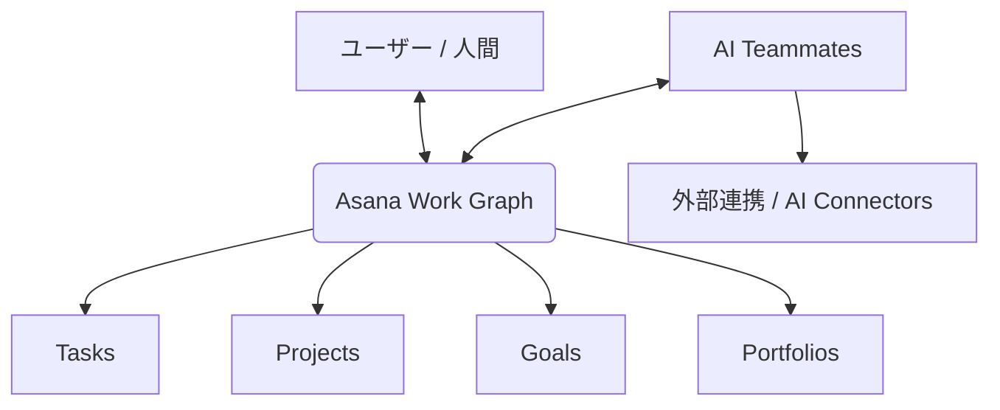

# **Asana 調査レポート**

## **1. 基本情報**

* **ツール名**: Asana
* **ツールの読み方**: アサナ
* **開発元**: Asana, Inc.
* **公式サイト**: [https://asana.com/](https://asana.com/)
* **関連リンク**:
  * ドキュメント: [https://help.asana.com/](https://help.asana.com/)
  * レビューサイト: [G2](https://www.g2.com/products/asana/reviews) | [Capterra](https://www.capterra.com/p/184581/Asana-PM/reviews/) | [TrustRadius](https://www.trustradius.com/products/asana/reviews)
* **カテゴリ**: プロジェクト管理
* **概要**: Asanaは、チームのタスクやプロジェクトを一元管理するための高機能なワークマネジメントプラットフォームです。AIを活用したエージェント機能（AI Teammates）などを搭載し、組織全体の目標から個々のタスクまでをつなぎ、業務の効率化と可視化を実現します。

## **2. 目的と主な利用シーン**

* **解決する課題**: チーム間のコミュニケーション不足、タスクの進捗状況の不透明さ、部門横断的なプロジェクトでの連携の難しさ。
* **想定利用者**: プロジェクトマネージャー、マーケティングチーム、IT部門、経営層など、すべてのビジネス部門。
* **利用シーン**:
  * 全社的な目標の管理と進捗トラッキング
  * マーケティングキャンペーンの企画から実行までの管理
  * ソフトウェア開発のタスク管理とリリース計画
  * IT部門でのヘルプデスク・サービス管理

## **3. 主要機能**

* **プロジェクト管理**: タスク、プロジェクト、ポートフォリオなどの階層構造で仕事を整理。リスト、ボード（カンバン）、カレンダー、タイムライン、ガントチャートなど多様なビューを提供。
* **Asana Goals**: 個人のタスクと全社的な目標を紐付け、進捗をトラッキング。
* **Agentic Work Management (AI機能)**:
  * **AI Teammates**: 人間とともにワークフローに参加する自律型AIエージェント。ルーチン作業や情報収集を代行。
  * **AI Studio**: ノーコードでAIを組み込んだ強力な自動化ワークフローを構築可能。
  * **Asana Dash**: メッセージやタスクから重要な情報を要約し、優先すべきアクションを提案するパーソナルAIアシスタント。
* **リソース管理**: ワークロード機能により、チームメンバーの負荷状況を可視化し、適切なリソース配分（キャパシティプランニング）を支援。
* **タイムトラッキング**: 作業にかかる時間を管理する機能を提供。
* **ワークフロー自動化（Rules / Bundles）**: トリガーとアクションを組み合わせたルールの設定により、ルーチンワークを自動化。プロジェクト横断でプロセスを標準化する「Bundles」も利用可能。

## **4. 動作原理・システム構成**

* **アーキテクチャ**: クラウド完結型SaaS
* **主要コンポーネントとデータフロー**:
  * **Asana Work Graph®**: 組織内のすべてのタスク、プロジェクト、目標、依存関係をニューラルネットワークのように接続する独自データモデル。これにより、人間とAIが同じ文脈（コンテキスト）を共有し、効率的に協働できる。
* **特筆すべき要素技術**:
  * **マルチプレイヤー（Multiplayer）**: 人間とAIエージェントが同じ計画、同じコンテキストで行動し、インタラクションを通じてAIが学習していく仕組み。
  * **共有メモリ（Shared memory）**: AI Teammatesが過去の完了タスクやフィードバックを記憶し、次のワークフローで活用する。
  * **エンタープライズガバナンス**: すべてのAIエージェントにはIDが割り当てられ、スコープ化された権限、監査証跡、コスト制限が適用される。

## **5. 開始手順・セットアップ**

* **前提条件**:
  * Webブラウザ、またはデスクトップアプリ（macOS, Windows）、モバイルアプリ（iOS, Android）
  * アカウント作成（Google、Microsoftアカウント対応）
* **インストール/導入**:
  クラウドサービスのためインストールは不要。Webブラウザからアクセス可能。アプリを利用する場合は公式サイトやアプリストアからダウンロード。
* **初期設定**:
  1. ワークスペースまたは組織（Organization）の作成。
  2. チームメンバーの招待。
  3. 初めてのプロジェクト作成（豊富なテンプレートを利用可能）。
* **クイックスタート**:
  無料プラン（Personal）で基本的なタスク管理をすぐに開始でき、プロジェクトをリストやボードビューで可視化可能。

## **6. 特徴・強み (Pros)**

* **AIと人間の高度な協働**: Asana Work Graphに基づき、AIエージェントがチームのメンバーとして自律的にタスクを処理できる。
* **組織全体の可視性向上**: 日々のタスクが上位の目標（Goals）と直接リンクしているため、自分が何の目的で仕事をしているかが明確になる。
* **柔軟で多様なビュー切り替え**: 同じデータソースをリスト、ボード、タイムライン、カレンダーなど、用途に合わせた最適なビューで確認可能。
* **エンタープライズ水準のセキュリティとガバナンス**: 大規模組織でも安心して利用できる強力なアクセス制御と監査機能。

## **7. 弱み・注意点 (Cons)**

* **高度な機能の学習コスト**: ポートフォリオ、目標管理、AI Studioなどの高度な機能をフル活用するには、チーム全体での運用ルールの策定や学習が必要。
* **高度な機能は上位プランが必要**: AI機能（AI Studioやより多くのクレジット）、ポートフォリオ、タイムラインビューなどの機能は、StarterやAdvanced以上の有料プランが必要。

## **8. 料金プラン**

| プラン名 | 料金 | 主な特徴 |
|---------|------|---------|
| **Personal** | 無料 | 最大2名まで。無制限のタスクとプロジェクト。リスト、ボード、カレンダービュー。 |
| **Starter** | $10.99/月 (年払い) | 無制限のユーザー。タイムラインビュー、Ganttビュー、無制限の自動化、AI Studio Basic (50Kクレジット/月)。 |
| **Advanced** | $24.99/月 (年払い) | ポートフォリオ、Goals（目標）、ワークロード、タイムトラッキング、AI Studio Basic (75Kクレジット/月)。 |
| **Enterprise / Enterprise+** | 要問い合わせ | SAML認証、SCIMプロビジョニング、高度な管理者コントロール、ユニバーサルワークロード、AI Studio Basic (200Kクレジット/月)。 |

* **課金体系**: ユーザー単位の月額/年額課金
* **無料トライアル**: StarterとAdvancedプランで無料トライアルを提供。

## **9. 導入実績・事例**

* **導入企業**: Amazon, Accenture, Johnson & Johnson, Dell, Merck など。
* **導入事例**:
  * **COS**: スケーラブルなワークフローとAIの活用により、可視性とスピードを向上させ、戦略的な実行にエネルギーを注ぐことが可能に。
  * **Morningstar**: Asana AIをワークフローに直接組み込むことで、手作業によるやり取りの時間を削減し、リクエストの確認時間を大幅に短縮。
* **対象業界**: 金融サービス、教育、ヘルスケア、政府、製造業など。

## **10. サポート体制**

* **ドキュメント**: Asana Help Center（使い方ガイドやチュートリアル）
* **コミュニティ**: Asana Forum（ユーザーコミュニティ）
* **公式サポート**: Asana Academy（自己学習用コースや認定プログラム）。

## **11. エコシステムと連携**

### **11.1 API・外部サービス連携**

* **API**: 充実したAPI（Developers and API）を提供。
* **外部サービス連携**: Google Workspace、Microsoft 365、Salesforce、Slack、Zoom、Jira、Tableau、Power BIなど。AI Connectorsを通じてChatGPT、Claude、GeminiなどのAIツールとも連携可能。

### **11.2 技術スタックとの相性**

| 技術スタック | 相性 | メリット・推奨理由 | 懸念点・注意点 |
|:---|:---:|:---|:---|
| **SaaS間連携 (Slack, Google Workspace等)** | ◎ | ネイティブインテグレーションが豊富で、Asana内から直接他ツールの操作が可能。 | 特になし |
| **BIツール (Tableau, Power BI)** | ◯ | Advancedプラン以上で直接連携し、プロジェクトデータを可視化可能。 | プランによる制限あり |

## **12. セキュリティとコンプライアンス**

* **認証**: SAML、Google SSO対応（Enterpriseプラン以上等）。
* **データ管理**: 256-bit暗号化（保存時および通信時）、リージョン間のクロスバックアップ。
* **準拠規格**: 要問い合わせ。公式サイトのTrust and securityページに詳細あり。

## **13. 操作性 (UI/UX) と学習コスト**

* **UI/UX**: 非常にクリーンで直感的なインターフェース。タスクの追加や担当者・期限の割り当てがスムーズに行える。
* **学習コスト**: 基本的なタスク管理（Personalプラン範囲）であればすぐに習得可能。ただし、組織全体でPortfolioやGoals、AI機能を活用した高度なワークフローを構築する場合は、一定の学習が推奨される。

## **14. ベストプラクティス**

* **効果的な活用法 (Modern Practices)**:
  * **Asana Goalsの活用**: 日々のタスクをプロジェクトにまとめ、それをポートフォリオ、さらに全社目標（Goals）へと結びつけることで、すべての作業が戦略に直結する状態を作る。
  * **AI Teammatesの導入**: ルーチンタスクや情報の整理をAI Studioで構築したAIエージェントに任せ、人間はより創造的な意思決定に集中する。
* **陥りやすい罠 (Antipatterns)**:
  * **高度な機能の放置**: 高度な機能があっても設定や運用ルールが不十分だと活用しきれないため注意が必要。

## **15. ユーザーの声（レビュー分析）**

* **調査対象**: G2、TrustRadius、Capterra など
* **総合評価**: 4.4/5.0 (G2, 10,000件以上のレビュー)
* **ポジティブな評価**:
  * 「クリーンなインターフェースで新しいチームメンバーのオンボーディングが簡単」
  * 「Goals機能は、目標のトラッキングにおいて非常に良い」
  * 「様々なビュー（特にタイムライン）でプロジェクトのスケジュールを視覚化しやすい」
* **ネガティブな評価 / 改善要望**:
  * 「高度なカスタマイズ機能や設定には学習が必要」
  * 「細かいタスク管理機能において機能の制限を感じることがある」

## **16. 直近半年のアップデート情報**

* **2026-07**: (Advanced) プロジェクトにチームを追加した際、ポートフォリオのアクセス権を自動的に継承する設定を追加。People（担当者）カスタムフィールドを使用したアサイン機能を強化。プロフェッショナルサービスおよび製造業向けのプロジェクトテンプレートを追加。
* **2026-06**: (Personal) Microsoft 365のネイティブSSOをサポート開始。(Starter) チームがステータス更新に利用できるテンプレート機能を追加。Slackチャンネルへのプロジェクト通知の細かい制御や、サブタスク管理ビューのコントロールを改善。(Personal) Pages内でCommand+Fによる検索機能が利用可能に。
* **2026-04**: (Personal) Asanaデスクトップアプリのサポート対象をmacOS 13以降に更新。(Starter) ルール内で「コラボレーターが追加された時」のトリガーを追加。ルールビルダーのUI改善やバンドル内のルール一時停止機能など、自動化の構築を強化。
* **2026-03**: (Starter) AI Teammates機能を導入。コラボレーティブなAIエージェントをプロジェクトに組み込み、チームの作業を推進可能に。(Starter) SlackからのインテイクやコメントルールをAI Studioでサポート。(Personal) リストビューにおけるセクションのワンクリック展開・折りたたみ機能を追加。

(出典: [Asana Help Center Release Notes](https://help.asana.com/s/article/release-notes))

## **17. 類似ツールとの比較**

### **17.1 機能比較表 (星取表)**

| 機能カテゴリ | 機能項目 | 本ツール | monday.com | ClickUp | Trello |
|:---:|:---|:---:|:---:|:---:|:---:|
| **基本機能** | タスク管理・ビュー | ◎ <small>複数ビューをシームレス切替</small> | ◎ <small>カスタマイズ性が高い</small> | ◎ <small>非常に多機能</small> | ◯ <small>ボードビューに特化</small> |
| **目標・戦略管理** | Goals (目標管理) | ◎ <small>タスクから全社目標まで連携</small> | ◯ <small>ダッシュボードで対応</small> | ◯ <small>Goals機能あり</small> | △ <small>アドオン等が必要</small> |
| **AI機能** | 自律型AIエージェント | ◎ <small>AI Teammates, AI Studio提供</small> | ◯ <small>monday AIを提供</small> | ◯ <small>ClickUp Brain機能</small> | △ <small>基本的なAI機能</small> |
| **エンタープライズ** | セキュリティ・管理 | ◎ <small>高度な管理機能</small> | ◎ <small>エンタープライズ向け充実</small> | ◯ <small>標準的な対応</small> | ◯ <small>Atlassian製品との連携</small> |

### **17.2 詳細比較**

| ツール名 | 特徴 | 強み | 弱み | 選択肢となるケース |
|---------|------|------|------|------------------|
| **本ツール** | 目標と日々のタスクをつなぐ洗練されたワークマネジメント。AIエージェント機能が強力。 | 直感的なUI、強力なAI機能、高度な目標管理 | 多機能なため初期設定・運用ルールの策定が必要 | 組織全体で目標を連携し、中〜大規模なプロジェクトを管理したい場合。 |
| **monday.com** | 業務プロセス全体をカスタマイズ可能なツール。 | カラフルで視覚的なUI、カスタマイズ性 | タスク管理ツールとしては設定項目が多く感じる場合がある | プロジェクト管理だけでなく、様々な業務プロセスを一つのツールで構築したい場合。 |
| **ClickUp** | 「All-in-one」を掲げる多機能なプロジェクト管理ツール。 | ドキュメント、チャットなどすべてが揃う | 機能が多すぎて画面が複雑に感じることがある | 複数のツールを一つにまとめたいチーム。 |
| **Trello** | カンバンボードに特化したシンプルで視覚的なタスク管理。 | 直感的で学習コストが低い | 複雑な依存関係や大規模プロジェクトには不向き | 小規模チームや、シンプルにタスクのステータスだけを管理したい場合。 |

## **18. 総評**

* **総合的な評価**:
  Asanaは、タスク管理ツールを超え、AIエージェント（AI Teammates）と人間が協働する「Agentic Work Management」プラットフォームへと進化しています。洗練されたUIでありながら、エンタープライズ規模の複雑な組織構造や目標管理にも耐えうる高いスケーラビリティを備えています。
* **推奨されるチームやプロジェクト**:
  戦略から実行までを連携させたい中規模〜大規模の組織、部門横断で複雑なプロジェクトを進行するチーム。
* **選択時のポイント**:
  直感的な操作性を重視しつつ、上位の目標と日々のタスクをシームレスに繋げたい場合、Asanaは最良の選択肢となります。一方で、単純なタスク管理だけが目的の場合や少人数の場合は、よりシンプルなツールと比較検討することが推奨されます。
