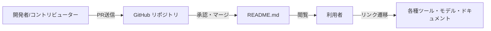

# **Awesome Gemma 調査レポート**

## **1. 基本情報**

* **ツール名**: Awesome Gemma
* **ツールの読み方**: オーサム ジェンマ
* **開発元**: Google DeepMind
* **公式サイト**: [https://github.com/google-gemma/awesome-gemma](https://github.com/google-gemma/awesome-gemma)
* **関連リンク**:
  * GitHub: [https://github.com/google-gemma/awesome-gemma](https://github.com/google-gemma/awesome-gemma)
  * ドキュメント: [https://deepmind.google/technologies/gemma/](https://deepmind.google/technologies/gemma/)
* **カテゴリ**: キュレーションリスト
* **概要**: Google DeepMindのオープンモデル「Gemma」ファミリに関する軽量で最先端の公式リソース集。モデル一覧、推論ツール、チュートリアル、コミュニティプロジェクトなどをまとめている。

## **2. 目的と主な利用シーン**

* **解決する課題**: Gemmaモデルを活用したいが、どこにどのようなリソースがあるか分からないという情報探索の手間を省くこと。
* **想定利用者**: Gemmaを使用するAI開発者、リサーチャー、ホビーイスト
* **利用シーン**:
  * 最新のGemmaモデル（Gemma 4など）とそのバリアント（MedGemma, PaliGemma等）を探す
  * ローカルまたはクラウドでGemmaを動かすためのツールやライブラリ（Ollama, vLLM, Hugging Face等）を探す
  * ファインチューニングの手法やデモアプリのコードベースを探す

## **3. 主要機能**

* **モデル一覧の提供**: コアモデルから、機能特化型のバリアント（FunctionGemma, MedGemma, PaliGemma 2など）まで幅広く網羅している。
* **推論ツールの紹介**: ローカル（llama.cpp, Ollama, LM Studio）およびホスト型（Google Cloud, OpenRouter, Cerebras, Together AIなど）の実行環境を案内。
* **ファインチューニングリソース**: Keras, JAX, Hugging Face, Unslothを用いた公式・非公式の学習ガイドやスクリプトを紹介。
* **チュートリアルとデモ**: ビジュアルガイドやブラウザ拡張、iOSシミュレータ制御など具体的な応用例へのリンクを提供。
* **コミュニティプロジェクトのショーケース**: 「Gemma 4 Good Challenge」などのハッカソン成果物や宇宙での稼働事例などを掲載している。

## **4. 動作原理・システム構成**

* **アーキテクチャ**: GitHubリポジトリを利用したマークダウンベースの静的なリンク集
* **主要コンポーネントとデータフロー**:
  * 管理者およびコントリビューターが `README.md` を更新し、GitHub上で公開される。利用者はブラウザを通じて閲覧する。
* **特筆すべき要素技術**:
  * GitHubのマークダウン記法による構造化
  * オープンソースコミュニティによるプルリクエストを通じた情報の継続的アップデート



## **5. 開始手順・セットアップ**

* **前提条件**:
  * Webブラウザ、またはGit
  * アカウント作成は不要（閲覧のみの場合）
* **インストール/導入**:

  ```bash
  # リポジトリをクローンする場合
  git clone https://github.com/google-gemma/awesome-gemma.git
  ```

* **初期設定**:
  * 特になし（クローンしたリポジトリのREADME.mdを読むか、ブラウザでアクセスする）
* **クイックスタート**:
  * ブラウザで[https://github.com/google-gemma/awesome-gemma](https://github.com/google-gemma/awesome-gemma)を開き、目次（Contents）から目的のセクションへジャンプする。

## **6. 特徴・強み (Pros)**

* Google DeepMindが主導・公式で管理しているため情報の信頼性が高い。
* エコシステム内の主要なツール（Hugging Face, Ollama, Unslothなど）との連携情報が網羅されている。
* 初心者向けのチュートリアルから、上級者向けのファインチューニングや最新のハッカソン事例まで幅広いレベルをカバーしている。

## **7. 弱み・注意点 (Cons)**

* リソース集であるため、リンク先の情報の正確性や最新性は各プロジェクトに依存する。
* 日本語対応は限定的（本体のREADMEは英語ベース）。
* 掲載情報が多岐にわたるため、目的のツールを絞り込むのに事前の基礎知識が必要となる場合がある。

## **8. 料金プラン**

| プラン名 | 料金 | 主な特徴 |
|---------|------|---------|
| **無料プラン** | 無料 | GitHub上で誰でも閲覧・クローン可能 |

* **課金体系**: 完全無料
* **無料トライアル**: なし（常に無料）

## **9. 導入実績・事例**

* **導入企業**: Awesomeリスト自体の導入企業という概念はないが、GemmaモデルはNASA（Gemma in Space）などで利用されている。
* **導入事例**:
  * Starcloud-1: 軌道上のH100 GPUにGemmaをデプロイ。
  * NASA: 衛星画像の分析と災害対応のためのテキスト圧縮にGemmaを活用。
* **対象業界**: AI開発、航空宇宙、医療（MedGemma等）、教育、災害対応など多岐にわたる。

## **10. サポート体制**

* **ドキュメント**: Awesomeリスト自体がドキュメントとしての機能を持つ。公式のGemmaドキュメント（ai.google.dev/gemma/docs）へのリンクも充実。
* **コミュニティ**: GitHubのIssueやPull Requestを通じたコミュニティ活動が中心。X（旧Twitter）アカウント @googlegemma での情報発信。
* **公式サポート**: GitHub Issueベースでの対応（オープンソースコミュニティとしてのサポート）。

## **11. エコシステムと連携**

### **11.1 API・外部サービス連携**

* **API**: Awesome Gemma自体はAPIを提供していないが、Gemmaモデルを実行可能な各種APIサービス（Google Cloud Vertex AI, OpenRouter, Together AI, Fireworks等）の情報をリストアップしている。
* **外部サービス連携**:
  * Hugging Face
  * Kaggle
  * Google Cloud / AI Studio

### **11.2 技術スタックとの相性**

Awesome Gemmaに掲載されている主要な推論環境・ツールの技術スタックを示す。

| 技術スタック | 相性 | メリット・推奨理由 | 懸念点・注意点 |
|:---|:---:|:---|:---|
| **Python (Transformers/JAX)** | ◎ | 公式実装やHugging Faceのサポートが厚い | 特になし |
| **C/C++ (llama.cpp)** | ◎ | 軽量かつ高速な推論が可能 | ビルド環境の構築が必要な場合あり |
| **JavaScript (Transformers.js)** | ◯ | ブラウザ上（WebGPU）で実行可能 | リソース制限に注意が必要 |
| **Docker** | ◯ | 環境構築が容易 | GPUを利用する場合はNVIDIA Container Toolkit等の設定が必要 |

## **12. セキュリティとコンプライアンス**

* **認証**: GitHubの標準的な認証を使用（閲覧のみなら不要）
* **データ管理**: リポジトリのコードは公開情報として管理される。
* **準拠規格**: オープンソースプロジェクトとしての標準的なポリシーに準拠。モデル自体の安全性については、Gemma Model Cardで言及されている。

## **13. 操作性 (UI/UX) と学習コスト**

* **UI/UX**: GitHubのマークダウン表示に依存しており、目次（Contents）からのナビゲーションがシンプルで分かりやすい。
* **学習コスト**: 情報源としての学習コストは極めて低いが、リンク先の各種ツールを使いこなすにはそれぞれのドキュメントを読む必要がある。

## **14. ベストプラクティス**

* **効果的な活用法 (Modern Practices)**:
  * Gemmaを使って新しいアプリケーションを開発する前に、類似のプロジェクトがDemos and Applicationsセクションにないか確認する。
  * ローカルでの検証にはOllamaやLM Studioを利用し、クラウドでの本格展開時にはVertex AIやModalなどを検討するフローが推奨される。
* **陥りやすい罠 (Antipatterns)**:
  * 公式ドキュメントを読まずにサードパーティの古いツールを利用してエラーに遭遇すること。

## **15. ユーザーの声（レビュー分析）**

* **調査対象**: GitHubスター数、X（旧Twitter）など
* **総合評価**: 160以上のスターを獲得しており（2026年8月時点）、開発者コミュニティからの注目を集めている。
* **ポジティブな評価**:
  * 「Gemma関連のエコシステムが一箇所にまとまっており、キャッチアップしやすい」
  * 「ハッカソン（Gemma 4 Good Challenge）の事例が豊富でインスピレーションになる」
* **ネガティブな評価 / 改善要望**:
  * リソース集の性質上、特定のツールに関する深掘りした情報はないため、最終的には個別ツールのリポジトリを参照する必要がある。
* **特徴的なユースケース**:
  * 宇宙環境での利用（Gemma in Space）や、途上国の医療・災害対応への応用（Gemma 4 Good Challenge）など、社会課題解決型のユースケースが多く紹介されている。

## **16. 直近半年のアップデート情報**

Awesome Gemmaは継続的に更新されている。以下は代表的な直近の掲載内容の例。

* **2026-08**: Gemma 4モデルおよびGemma 4 QAT（量子化対応）に関するリポジトリが追加された。
* **2026-07**: Gemma 4 Technical Report（技術論文）が公開された。
* **2026-05**: Gemma 4 Good Challengeの優秀作品（医療、教育、災害対応など）がリストに追加された。

(出典: [Awesome Gemma GitHub Repository](https://github.com/google-gemma/awesome-gemma))

## **17. 類似ツールとの比較**

### **17.1 機能比較表 (星取表)**

| 機能カテゴリ | 機能項目 | 本ツール (Awesome Gemma) | Awesome LLM | Awesome Llama |
|:---:|:---|:---:|:---:|:---:|
| **基本機能** | Gemma特化の情報 | ◎<br><small>Gemmaに特化</small> | △<br><small>LLM全般</small> | ×<br><small>Llamaに特化</small> |
| **カテゴリ特定** | デモ・ハッカソン事例 | ◎<br><small>専用セクションあり</small> | ◯<br><small>一般的な事例</small> | ◯<br><small>一般的な事例</small> |
| **非機能要件** | 日本語対応 | △<br><small>英語ベース</small> | △<br><small>英語ベース</small> | △<br><small>英語ベース</small> |

### **17.2 詳細比較**

| ツール名 | 特徴 | 強み | 弱み | 選択肢となるケース |
|---------|------|------|------|------------------|
| **本ツール** | Google DeepMind公式のGemmaリソース集 | Gemmaファミリの網羅性が高い | 他のLLM情報は含まれない | Gemmaを利用した開発を行う場合 |
| **Awesome LLM** | LLM全般のリソースをまとめたリスト | 業界全体のトレンドが掴める | 特定のモデルの深い情報は少ない | LLM全般の知識を得たい場合 |
| **Awesome Llama** | MetaのLlamaに関するリソース集 | Llamaエコシステムに強い | Llamaに依存する | Llamaを利用した開発を行う場合 |

## **18. 総評**

* **総合的な評価**:
  * Google DeepMindが公式に提供するAwesome Gemmaは、Gemmaモデルを利用するすべての開発者にとって最初に訪れるべきポータルである。最新モデルからコミュニティの応用例まで、Gemmaに関する情報が網羅的に整理されており、非常に価値が高い。
* **推奨されるチームやプロジェクト**:
  * Gemmaを活用したアプリケーション開発チーム、ファインチューニングを行うリサーチャー、ローカルでLLMを動かしたい個人開発者。
* **選択時のポイント**:
  * LLM全般の情報を探しているのではなく、特にGemma（およびそのバリアント）にフォーカスして開発や研究を進める際に最適なリソースハブとして機能する。
