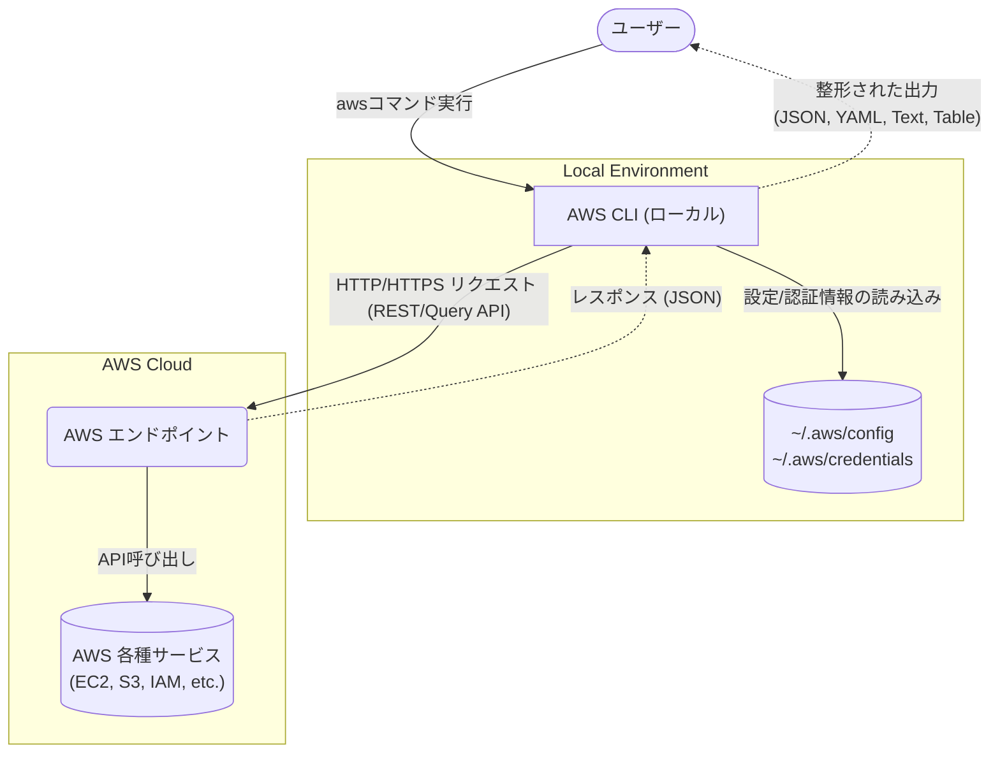

# **AWS CLI 調査レポート**

## **1. 基本情報**

* **ツール名**: AWS CLI
* **ツールの読み方**: エーダブリューエス シーエルアイ
* **開発元**: Amazon Web Services
* **公式サイト**: [https://aws.amazon.com/jp/cli/](https://aws.amazon.com/jp/cli/)
* **関連リンク**:
  * GitHub: [https://github.com/aws/aws-cli](https://github.com/aws/aws-cli)
  * ドキュメント: [https://docs.aws.amazon.com/cli/latest/userguide/cli-chap-welcome.html](https://docs.aws.amazon.com/cli/latest/userguide/cli-chap-welcome.html)
* **カテゴリ**: インフラ/クラウド
* **概要**: AWS コマンドラインインターフェイス (AWS CLI) は、AWSのサービスを管理するための統合ツールです。ダウンロードおよび設定用の単一のツールのみを使用して、コマンドラインから AWSの複数のサービスを制御し、スクリプトを使用してこれらを自動化することができます。

## **2. 目的と主な利用シーン**

* **解決する課題**: ブラウザベースのAWSマネジメントコンソールを使わずに、ターミナルから直接AWSサービスを操作・自動化したいというニーズに対応。
* **想定利用者**: 開発者、DevOpsエンジニア、インフラストラクチャ管理者。
* **利用シーン**:
  * サーバーのプロビジョニングや設定の自動化スクリプトへの組み込み
  * CI/CDパイプラインでのAWSリソースのデプロイメント
  * 日常的なS3バケットへのファイル同期やEC2インスタンスの管理

## **3. 主要機能**

* **統合されたサービス管理**: 一つのツール（`aws`コマンド）で、EC2、S3、IAMなどほぼ全てのAWSサービスを制御可能。
* **コマンド補完**: Tabキーを使用して部分的に入力されたコマンドやリソース名（DynamoDBテーブル名、IAMユーザー名など）を補完する機能。
* **自動プロンプト**: コマンド、パラメータ、リソースなどのプロンプトを表示し、対話的にコマンドを組み立てる機能。
* **SSOログイン機能**: `aws login` CLI コマンドにより、既存のコンソール認証情報を使用してAWSにプログラムでアクセス。
* **コマンド履歴**: `aws history` コマンドで過去の実行履歴を確認・表示。
* **JSON/YAML出力**: 実行結果のフォーマットをJSON、YAML、テキスト、テーブル形式で出力可能。
* **高レベルS3コマンド**: `aws s3 sync` などの複雑な操作を簡素化するコマンド群。

## **4. 動作原理・システム構成**

* **アーキテクチャ**: ローカルファーストのクライアント・サーバー構成（クライアントとしてのCLIがAWSクラウドAPIと通信）。
* **主要コンポーネントとデータフロー**:
  * ユーザーがターミナルで `aws` コマンドを実行すると、CLIはローカルの認証情報（`~/.aws/credentials` やSSOトークン）を読み込みます。
  * 内部でBoto3 (AWS SDK for Python) のコアライブラリ（botocore）を利用し、要求をHTTP/HTTPSリクエストに変換します。
  * AWSのエンドポイントに対してリクエストを送信し、AWSリソースの作成・変更・取得などの処理を行います。
  * レスポンス（通常はJSON）を受け取り、指定されたフォーマット（JSON、YAML、Table、Text）でターミナルに出力します。
* **特筆すべき要素技術**:
  * **JMESPath**: クライアント側でJSONレスポンスをフィルタリング・抽出するためのクエリ言語（`--query` オプションで使用）。
  * **IAM統合**: AWSのIdentity and Access Management (IAM) と深く統合されており、STSを利用した一時的な認証情報の取得（AssumeRole）や、AWS SSO (IAM Identity Center) を用いたフェデレーション認証をサポート。



## **5. 開始手順・セットアップ**

* **前提条件**:
  * AWSアカウント
  * アクセスキーIDとシークレットアクセスキー（またはIAMロール/SSO環境）
* **インストール/導入**:

  ```bash
  # Linux x86-64 executable installer の例
  curl "https://awscli.amazonaws.com/awscli-exe-linux-x86_64.zip" -o "awscliv2.zip"
  unzip awscliv2.zip
  sudo ./aws/install
  ```

* **初期設定**:
  * `aws configure` コマンドを実行し、アクセスキー、シークレットキー、デフォルトリージョン、出力フォーマットを設定します。
* **クイックスタート**:
  * インストール後、バージョン確認と簡単なS3リストコマンドで動作確認が可能です。

  ```bash
  aws --version
  aws s3 ls
  ```

## **6. 特徴・強み (Pros)**

* **高い網羅性**: AWSの新サービスや機能がリリースされると、迅速にCLIにも対応が追加されます。
* **スクリプト親和性**: JSON出力と `jq` や内蔵の `--query`（JMESPath）を組み合わせることで、複雑な自動化スクリプトを容易に作成できます。
* **認証の柔軟性**: 環境変数、設定ファイル、EC2インスタンスメタデータ（IAMロール）、AWS SSOなど、多様な認証方式をサポート。
* **マルチプラットフォーム**: Windows, macOS, Linuxのすべてで一貫したエクスペリエンスを提供。

## **7. 弱み・注意点 (Cons)**

* **学習曲線**: AWSの各サービスの概念とAPIモデルを理解している必要があるため、AWS初心者にはコマンドの組み立てが難しく感じられる場合があります。
* **出力形式の理解**: 複雑なJSON応答を解析するために、JMESPath（`--query`オプション）の構文を学ぶ必要があります。
* **v1とv2の非互換性**: AWS CLI v1とv2では一部動作が異なるため、移行時には注意が必要です。

## **8. 料金プラン**

| プラン名 | 料金 | 主な特徴 |
|---------|------|---------|
| **完全無料** | 無料 | AWS CLIツール自体の利用は完全無料（※ただし、操作したAWSサービス自体の利用料は発生します） |

* **課金体系**: ツールは無料。呼び出したAWSサービスの料金規定に従う。
* **無料トライアル**: AWS自体の無料枠（Free Tier）を利用可能。

## **9. 導入実績・事例**

* **導入企業**: AWSを利用している世界中の数百万の企業や開発者。
* **導入事例**: AWSインフラストラクチャのIaC（Infrastructure as Code）化、CI/CDパイプライン（GitHub Actions, GitLab CIなど）におけるAWSリソース操作など、広範に利用されています。
* **対象業界**: クラウドインフラを利用するすべての業界（IT、金融、ヘルスケア、スタートアップなど）。

## **10. サポート体制**

* **ドキュメント**: [AWS CLI User Guide](https://docs.aws.amazon.com/cli/latest/userguide/) および [Command Reference](https://awscli.amazonaws.com/v2/documentation/api/latest/index.html) が非常に充実しています。
* **コミュニティ**: [GitHub Repository](https://github.com/aws/aws-cli) でのIssue報告、Stack Overflow (`aws-cli`タグ)、AWS re:Postなどの活発なコミュニティ。
* **公式サポート**: AWSのサポートプランに加入している場合、AWSサポートから公式なサポートを受けることができます。

## **11. エコシステムと連携**

### **11.1 API・外部サービス連携**

* **API**: 本ツール自体がAWSの各種APIをラップするインターフェースです。
* **外部サービス連携**: 各種CI/CDツール（Jenkins, GitHub Actions, GitLab CI/CD, CircleCIなど）とシームレスに連携。

### **11.2 技術スタックとの相性**

| 技術スタック | 相性 | メリット・推奨理由 | 懸念点・注意点 |
|:---|:---:|:---|:---|
| **Bash/Shell Script** | ◎ | コマンドラインツールとして設計されており、シェルスクリプトとの相性が最高。 | 複雑なロジックはシェルスクリプトだと可読性が下がる。 |
| **Python** | ◎ | Pythonベース（boto3）で開発されており、Python環境での連携も容易。 | AWS SDK for Python (Boto3) を直接使う方が良いケースもある。 |
| **CI/CDツール (GitHub Actions等)** | ◎ | 公式アクションやコンテナイメージが提供されており、組み込みが容易。 | 認証情報の安全な管理（OIDC連携など）を適切に行う必要がある。 |
| **Docker** | ◎ | 公式のDockerイメージ（`amazon/aws-cli`）が提供されている。 | コンテナサイズや不要な依存関係の整理が必要な場合がある。 |

## **12. セキュリティとコンプライアンス**

* **認証**: IAMユーザー認証、AWS SSO (IAM Identity Center)、一時的認証情報 (STS)、EC2/ECS IAMロールなど、AWSの強力なセキュリティモデルを完全にサポート。
* **データ管理**: CLI自体はクライアント側ツールであり、データはユーザー環境とAWS間で直接通信されます。
* **準拠規格**: AWS CLIはAWSのサービスと通信するため、AWS自体の各種コンプライアンス（SOC、ISO、HIPAA、GDPR等）の枠組みの中で利用されます。

## **13. 操作性 (UI/UX) と学習コスト**

* **UI/UX**: v2から導入された自動プロンプト（`--cli-auto-prompt`）により、対話型でのコマンド入力が可能になり、UXが大幅に向上しました。
* **学習コスト**: AWSの基本概念を理解していれば、`aws [service] help` コマンドを活用することで容易に学習できますが、複雑なJMESPathクエリの習得には少し時間がかかります。

## **14. ベストプラクティス**

* **効果的な活用法 (Modern Practices)**:
  * **AWS SSOの利用**: 長期的なアクセスキー（IAMユーザー）の代わりに、AWS IAM Identity Center (SSO) と連携して短期クレデンシャルを利用する。
  * **JMESPathの活用**: `--query` パラメータを使用して、サーバー側でJSON出力をフィルタリングし、必要なデータだけを取得する。
  * **自動プロンプト**: 使い慣れないコマンドは `aws [command] --cli-auto-prompt` で対話的に組み立てる。
* **陥りやすい罠 (Antipatterns)**:
  * **アクセスキーのハードコード**: スクリプト内にアクセスキーをハードコードすることは重大なセキュリティリスク。環境変数やIAMロールを使用するべき。
  * **ページネーションの無視**: 一部のコマンドは結果をページネーション（分割）して返すため、すべての結果を取得していないのに処理を進めてしまう。

## **15. ユーザーの声（レビュー分析）**

* **調査対象**: GitHub, 開発者ブログ, Stack Overflow
* **総合評価**: クラウドCLIのデファクトスタンダードとして圧倒的な支持。（公式GitHubリポジトリのStar数：16k以上）
* **ポジティブな評価**:
  * "AWSのあらゆる操作がコマンドラインから可能になり、自動化に不可欠。"
  * "v2の自動プロンプトやSSO統合が非常に便利。"
  * "ドキュメントが充実しており、トラブルシューティングがしやすい。"
* **ネガティブな評価 / 改善要望**:
  * "一部のサービスのコマンド体系が他と異なり、一貫性に欠ける場合がある。"
  * "出力のJSONをパースするためのJMESPathの学習が面倒。"
  * "v1からv2への移行時に破壊的変更があり、スクリプトの修正が必要だった。"
* **特徴的なユースケース**:
  * ローカルのDockerコンテナ内からホストのIAMロールを借用して安全にAWSリソースにアクセスする構成。

## **16. 直近半年のアップデート情報**

* **2026-09-14**: `AWS CLI 2.36.45` リリース - STSの最大セッショントークンサイズの増加（4,096バイト）や、Billing、Image Builder、Glue、CodeDeployなどの各種AWSサービスの最新APIアップデートに追従。
* **2026-09-11**: `AWS CLI 2.36.44` リリース - Lightsailディストリビューションのプライベートオリジンアクセス対応や、Batchの一括ジョブAPI追加、S3 Object Lockドキュメントの更新などに追従。
* **2026-09-10**: `AWS CLI 2.36.43` リリース - CRT転送に対するレスポンスチェックサム検証とリクエストチェックサム計算オプションの設定に関するバグ修正。
* **頻繁な更新**: ほぼ毎日のように、AWSのAPI変更に追従するためのマイナーリリース（例：2.36.xシリーズ）が行われています。
* **2024-11-26**: `AWS CLI 2.0.0dev preview release` - AWS CLI v2の最初の開発者プレビューがリリースされ、リソース値の自動補完や自動プロンプト（ウィザード）、SSO連携の強化などが発表されました。（※過去の大きなマイルストーンとして記載）

(出典: [GitHub Releases (aws/aws-cli)](https://github.com/aws/aws-cli/releases))

## **17. 類似ツールとの比較**

### **17.1 機能比較表 (星取表)**

| 機能カテゴリ | 機能項目 | AWS CLI | AWS CloudFormation | Terraform | AWS MCP Servers |
|:---:|:---|:---:|:---:|:---:|:---:|
| **基本機能** | AWS操作網羅性 | ◎<br><small>ほぼ全API対応</small> | ◯<br><small>宣言的にリソース管理</small> | ◯<br><small>公式プロバイダーで網羅</small> | ◯<br><small>BedrockやCFnなどの特定操作</small> |
| **環境** | ローカル実行 | ◎<br><small>全OS対応</small> | ◯<br><small>AWS CLI経由などで実行</small> | ◎<br><small>全OS対応</small> | ◎<br><small>MCP対応クライアントで実行</small> |
| **運用・管理** | 状態管理 (State) | ×<br><small>コマンド実行のみ</small> | ◎<br><small>AWS側でフルマネージド</small> | ◎<br><small>Stateファイルで差分管理</small> | ×<br><small>コマンド実行/情報取得のみ</small> |
| **インターフェース** | 自然言語操作 | ×<br><small>コマンドとオプションが必要</small> | ×<br><small>YAML/JSONの記述が必要</small> | ×<br><small>HCLの記述が必要</small> | ◎<br><small>AI経由で直感的に操作可能</small> |

### **17.2 詳細比較**

| ツール名 | 特徴 | 強み | 弱み | 選択肢となるケース |
|---------|------|------|------|------------------|
| **AWS CLI** | 公式の汎用コマンドラインツール | 汎用性が高く、軽量。シェルスクリプトと相性が良い。新機能への追従が最速。 | 状態管理ができない（冪等性の担保は自己責任）。 | 単発の作業自動化、CI/CDパイプラインへの組み込み、S3のファイル同期。 |
| **AWS CloudFormation** | AWSネイティブなIaCサービス | AWS環境における高い安全性と信頼性。マネージドな状態管理。 | AWSへのベンダーロックイン。学習コストが高い。 | AWSに特化したインフラを宣言的に構築し、統一管理したい場合。 |
| **Terraform** | マルチクラウド対応のIaCツール | 圧倒的なプロバイダー数。マルチクラウド構成を一元管理できる。 | Stateファイルの厳格な管理が必要。ライセンス制約の懸念。 | 複数のクラウドを併用している組織や、ベンダーロックインを避けたい場合。 |
| **AWS MCP Servers** | AIアシスタント向けの公式連携サーバー群 | AIから自然言語でドキュメント検索やAWSリソース操作が可能になる。 | セットアップがやや煩雑。対応している操作はまだ限定的。 | Claude DesktopやCursorなどのAIアシスタントを用いてAWS開発を行う場合。 |

## **18. 総評**

* **総合的な評価**:
  AWS CLIは、AWSを利用するすべての開発者およびシステム管理者にとって、必須のツールです。v2へのアップデートにより、対話型プロンプトやSSO統合が改善され、使い勝手がさらに向上しました。オープンソースとして頻繁に更新されており、AWSの最新機能に即座に対応できる点が強みです。
* **推奨されるチームやプロジェクト**:
  * AWSをクラウド基盤として利用しているすべてのチーム。
  * CI/CDパイプラインを構築・運用するDevOpsチーム。
  * インフラのプロビジョニングや日々の運用作業を自動化したいシステム管理者。
* **選択時のポイント**:
  インフラストラクチャ全体を構築・管理する場合は、TerraformやAWS CloudFormationなどのIaCツールの使用を優先すべきです。しかし、IaCツールの機能でカバーしきれない操作や、CI/CDパイプライン内での単発のスクリプト実行、S3のファイル同期などにおいては、AWS CLIが最適かつ不可欠な選択肢となります。
