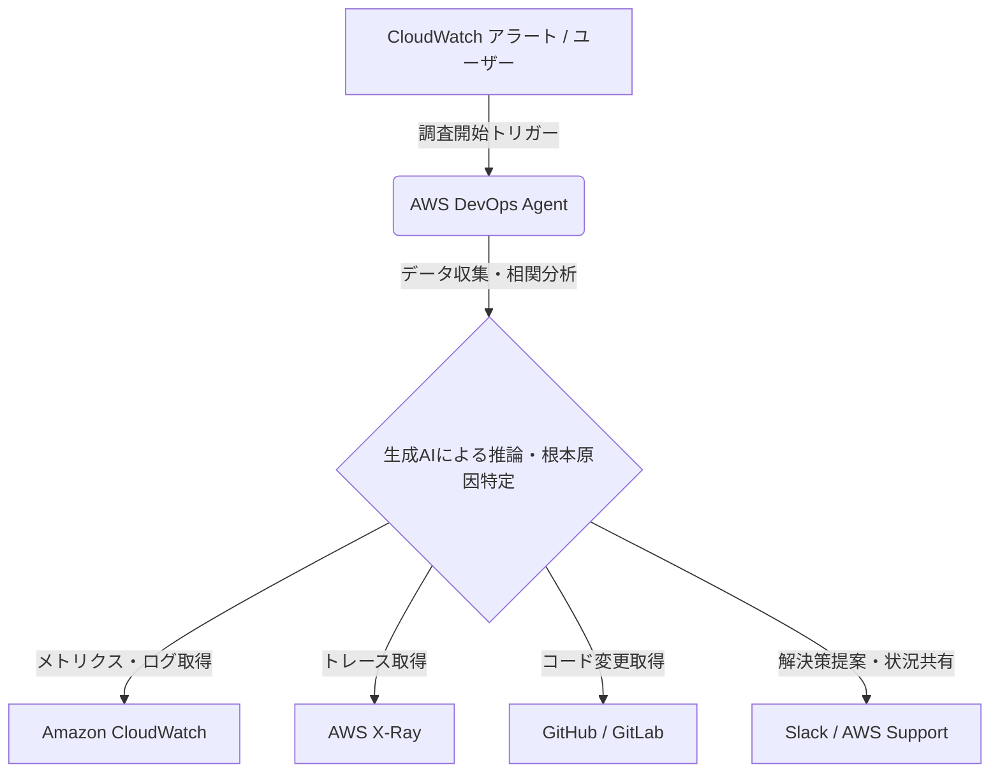

# **AWS DevOps Agent 調査レポート**

## **1. 基本情報**

* **ツール名**: AWS DevOps Agent
* **ツールの読み方**: エーダブリューエス デボオプス エージェント
* **開発元**: Amazon Web Services (AWS)
* **公式サイト**: [https://aws.amazon.com/devops-agent/](https://aws.amazon.com/devops-agent/)
* **関連リンク**:
  * ドキュメント: [https://docs.aws.amazon.com/devopsagent/latest/userguide/](https://docs.aws.amazon.com/devopsagent/latest/userguide/)
  * ブログ: [https://aws.amazon.com/blogs/aws/aws-devops-agent-helps-you-accelerate-incident-response-and-improve-system-reliability-preview/](https://aws.amazon.com/blogs/aws/aws-devops-agent-helps-you-accelerate-incident-response-and-improve-system-reliability-preview/)
* **カテゴリ**: 自律型AIエージェント
* **概要**: AWS DevOps Agentは、生成AIを活用して運用上の問題検出、診断、修復を加速する自律型AIエージェントです。AWSの可観測性ツールやサードパーティ製ツールと連携し、インシデント発生時に自律的にトリアージを行い、根本原因を特定して解決策を提案します。

## **2. 目的と主な利用シーン**

* **解決する課題**: 複雑化するクラウド環境における障害対応の長期化、アラートノイズによる運用担当者の疲弊、事後対応中心の運用スタイルからの脱却。
* **想定利用者**: DevOpsエンジニア、SRE（Site Reliability Engineering）、クラウド運用チーム。
* **利用シーン**:
  * **深夜の障害対応**: 夜間に発生したアラートに対し、エージェントが自動で初動調査を行い、必要な場合のみ人間にエスカレーションする。
  * **根本原因分析**: 複数のサービスにまたがる複雑な障害において、ログやトレースを横断的に分析し、原因を特定する。
  * **プロアクティブな改善**: 過去のインシデントパターンから再発防止策やインフラ最適化の提案を受ける。

## **3. 主要機能**

* **インシデント対応と解決 (Incident response and resolution)**: テレメトリ、コード、デプロイデータを相関分析し、システム変更やリソース制限などに起因する根本原因を特定します。
* **自動インシデント調整 (Automated incident coordination)**: Slackなどのチャットツール上でエージェントと対話し、調査結果の共有やAWSサポートケースの作成を支援します。
* **運用インシデントの未然防止 (Prevent future operational incidents)**: 過去のインシデント履歴を分析し、可観測性、インフラ最適化、パイプライン改善、アプリケーション回復性の4つの分野で強化案を提示します。
* **ランディングゾーン全体の推論**: ワークロード、ネットワーク、管理アカウント間の関係を理解し、トポロジー全体にわたって推論を行います。

## **4. 動作原理・システム構成**

* **アーキテクチャ**: クラウド完結型SaaS (AWSマネージドサービス)
* **主要コンポーネントとデータフロー**:
  * ユーザーはAWS Management Console上のAgent Spaceから、または監視ツールのアラートをトリガーに調査を開始します。
  * エージェントは対象のAWSアカウント内のリソースにアクセスし、CloudWatchのメトリクス・ログ、AWS X-Rayのトレース、GitHubなどのコードリポジトリから情報を収集・相関分析します。
  * 生成AIモデルを活用して根本原因の特定と解決策の提案を行い、Slack等のチャネルで関係者に状況を通知します。
* **特筆すべき要素技術**:
  * **Agent Space**: エージェントが調査を行う際のスコープと権限（IAMロール）を定義する論理的なコンテナ。
  * **Topology**: エージェントが調査の基盤として使用する主要リソースと関係性のマップ。

## **5. 開始手順・セットアップ**

* **前提条件**:
  * AWSアカウント
  * プレビューへのアクセス申請（必要な場合）
* **インストール/導入**:
  * AWSマネジメントコンソールの「AWS DevOps Agent」セクションから有効化します。
* **初期設定**:
  * 監視対象のデータソース（CloudWatch、Datadogなど）との連携設定。
  * コミュニケーションツール（Slackなど）との統合設定。
* **クイックスタート**:
  * コンソールまたはチャットツールから「最近の異常を分析して」と指示を出すことで調査を開始できます。

## **6. 特徴・強み (Pros)**

* **高い自律性**: 単なる情報の集約だけでなく、仮説の立案と検証を自律的に行い、解決策まで導き出す能力。
* **AWSネイティブな統合**: AWSの各サービスと深く統合されており、複雑なAWS環境のトポロジーや依存関係を正確に把握できる。
* **コンテキスト理解**: システムの構成図やログの意味を文脈（コンテキスト）として理解し、人間のように推論を行うことができる。

## **7. 弱み・注意点 (Cons)**

* **利用可能なリージョンの制限**: GAされましたが、利用可能なリージョンには制限がある可能性があります。
* **言語対応**: 主なインターフェースや生成されるレポートは英語が中心となる可能性があります（日本語対応状況は要確認）。
* **サードパーティ連携の範囲**: 主要なツールには対応していますが、すべての運用ツールを網羅しているわけではありません。

## **8. 料金プラン**

| プラン名 | 料金 | 主な特徴 |
|---------|------|---------|
| **無料トライアル** | 無料 | 新規顧客向けに2ヶ月間提供（AWSリソース利用料は別途発生） |

* **課金体系**: 分析データ量や処理量に基づく従量課金。
* **無料トライアル**: 新規顧客向けに2ヶ月間の無料トライアルが用意されています。

## **9. 導入実績・事例**

* **導入企業**: Deriv, Dhan.co, RMIT University
* **導入事例**:
  * **RMIT University**: トラブルシューティングのサイクルを4-7時間から30分未満に短縮。
  * **Deriv**: コンテキストインテリジェンス機能により、システム間の関係性を迅速に評価し、平均解決時間（MTTR）を短縮。
  * **Dhan.co**: 120万人のアクティブ顧客を持つ取引プラットフォームにおいて、高可用性の維持と運用プロセスの合理化に活用。
* **対象業界**: 金融サービス、教育、テクノロジーなど、高い信頼性が求められる業界。

## **10. サポート体制**

* **ドキュメント**: AWS公式ドキュメント（ユーザーガイド）が整備されています。
* **コミュニティ**: AWS re:Postなどで質問が可能。
* **公式サポート**: AWS Supportとの連携機能があり、エージェントの調査結果を付記してケースを作成可能。

## **11. エコシステムと連携**

### **11.1 API・外部サービス連携**

* **API**: 調査結果やアクションにアクセスするためのAPIが提供されていると考えられます。
* **外部サービス連携**:
  * **可観測性**: Datadog, Dynatrace, New Relic, Splunk
  * **コード管理**: GitHub, GitLab
  * **運用管理**: ServiceNow, PagerDuty
  * **コミュニケーション**: Slack

### **11.2 技術スタックとの相性**

| 技術スタック | 相性 | メリット・推奨理由 | 懸念点・注意点 |
|:---|:---:|:---|:---|
| **AWS Cloud** | ◎ | ネイティブ統合により最大限の効果を発揮 | 特になし |
| **Hybrid Cloud** | △ | 一部の機能はAWS外のリソースに対して制限される可能性 | 接続設定の複雑さ |
| **Serverless** | ◎ | 複雑になりがちなサーバーレス構成の追跡・分析に有効 | 特になし |

## **12. セキュリティとコンプライアンス**

* **認証**: AWS IAMによる厳格なアクセス制御。
* **データ管理**: 顧客データはAWSのセキュリティ基準に従って保護され、学習データとしての利用に関するポリシーはAWSのAIサービス規約に準拠します。
* **準拠規格**: AWSの各種コンプライアンス認定に対応（予定含む）。

## **13. 操作性 (UI/UX) と学習コスト**

* **UI/UX**: 自然言語での対話（チャット）が中心であり、直感的な操作が可能。AWSコンソールにも統合されています。
* **学習コスト**: プロンプトエンジニアリング的なスキルは多少役立ちますが、基本的には専門用語を使わずに指示できるため、学習コストは低めです。

## **14. ベストプラクティス**

* **効果的な活用法 (Modern Practices)**:
  * **ChatOpsへの統合**: Slackなどのチャットツールに常駐させ、チームの一員として扱うことで、情報の透明性と対応速度を向上させる。
  * **事後分析の活用**: 障害対応だけでなく、Prevent機能を活用して平時からシステムの堅牢性を高める活動に利用する。
* **陥りやすい罠 (Antipatterns)**:
  * **丸投げ**: エージェントの提案を検証せずにそのまま本番環境に適用すること（Human-in-the-loopを維持すべき）。

## **15. ユーザーの声（レビュー分析）**

* **調査対象**: AWS公式サイトの事例紹介
* **総合評価**: 非常に高い期待と初期の成功事例が報告されています。
* **ポジティブな評価**:
  * 「着陸ゾーン（Landing Zone）全体のトポロジーを推論できる能力が素晴らしい」（RMIT University）
  * 「運用パターンから学習する能力が、エンジニアリング効率の向上につながる」（Deriv）
* **ネガティブな評価 / 改善要望**:
  * G2、Capterra、ITreviewにレビューの登録なし。
* **特徴的なユースケース**:
  * 大規模な大学システムにおけるゼロタッチエンジニアリングの追求（RMIT University）。

## **16. 直近半年のアップデート情報**

* **2026-03-31**: AWS DevOps Agentが一般公開（GA）され、新規顧客向けに2ヶ月の無料トライアルの提供を開始。
* **2025-12-01**: AWS re:Invent 2025にて「AWS DevOps Agent」としてプレビュー公開。インシデント対応の加速とシステム信頼性の向上を目的とする。

(出典: [AWS Blog](https://aws.amazon.com/blogs/aws/aws-devops-agent-helps-you-accelerate-incident-response-and-improve-system-reliability-preview/))

## **17. 類似ツールとの比較**

### **17.1 機能比較表 (星取表)**

| 機能カテゴリ | 機能項目 | 本ツール | Datadog | PagerDuty | Kiro |
|:---:|:---|:---:|:---:|:---:|:---:|
| **自律対応** | 原因特定・提案 | ◎ <small>自律的な仮説検証</small> | ◯ <small>Watchdog/Bits AI</small> | ◯ <small>AIOpsによる相関</small> | ◎ <small>自律エージェント</small> |
| **連携** | AWS統合 | ◎ <small>ネイティブ</small> | ◎ <small>深い連携と統合</small> | ◯ <small>700以上の連携</small> | ◎ <small>AWSと親和性高</small> |
| **対話** | ChatOps | ◎ <small>Slack等で対話可能</small> | ◯ <small>通知とアシスタント</small> | ◯ <small>高度な通知連携</small> | ◎ <small>IDE/CLI/Web連携</small> |
| **学習** | 組織固有の文脈 | ◎ <small>トポロジー全体理解</small> | ◯ <small>横断的なメトリクス</small> | ◯ <small>過去インシデント学習</small> | ◯ <small>コードベース理解</small> |

### **17.2 詳細比較**

| ツール名 | 特徴 | 強み | 弱み | 選択肢となるケース |
|---------|------|------|------|------------------|
| **本ツール** | AWS特化型の自律運用エージェント | AWSリソース間の関係性を深く理解し、インシデント時の根本原因分析から修正案まで自律的に提案可能。 | サードパーティ製ツールやオンプレミス環境への対応は発展途上。 | AWS中心の環境で、障害対応（MTTR）を劇的に短縮したい場合。 |
| **Datadog** | SaaSベースの統合監視・オブザーバビリティプラットフォーム | インフラ、APM、ログ、セキュリティを単一画面で統合し、Bits AIやWatchdogなどの強力なAI機能を持つ。 | 料金体系が細分化されており、大規模利用時のコスト管理が複雑。 | クラウドネイティブ環境で、包括的な監視とAI支援を一元化したい場合。 |
| **PagerDuty** | インシデント対応とAIOpsに特化したプラットフォーム | 700以上のツールと連携し、膨大なアラートを集約・ノイズ削減して、適切なオンコール担当者へ確実にルーティングする。 | 根本原因の「推論・修正」よりも、「通知とワークフローの自動化」に重きを置いている。 | マルチクラウド環境でインシデント対応プロセス全体を標準化・効率化したい場合。 |
| **Kiro** | スペック駆動開発型のAIネイティブIDE | 自然言語からの要件定義から実装まで、強力な自律エージェントがコードレベルで介入・修正する。 | インシデント管理や監視のアラートノイズ削減といった運用レイヤーの機能は持たない。 | 開発フェーズや、インシデント原因特定後の「コードの修正・リファクタリング」を行いたい場合。 |

## **18. 総評**

* **総合的な評価**: AWS DevOps Agentは、従来の手動調査に依存していたインシデント対応プロセスを、AIによる自律的な調査・提案へとシフトさせる強力なツールです。特に「コンテキスト（文脈）の理解」と「推論」に重点が置かれており、単なる自動化スクリプトとは一線を画します。
* **推奨されるチームやプロジェクト**: AWS上でミッションクリティカルなシステムを運用しており、障害時のMTTR（平均復旧時間）短縮が重要課題となっている組織。
* **選択時のポイント**: AWSのエコシステムにどれだけ依存しているかが鍵となります。AWS中心であれば最強の選択肢ですが、マルチクラウド環境の場合は、各クラウドプロバイダーのツールやサードパーティ製AIOpsツールとの併用を検討する必要があります。
