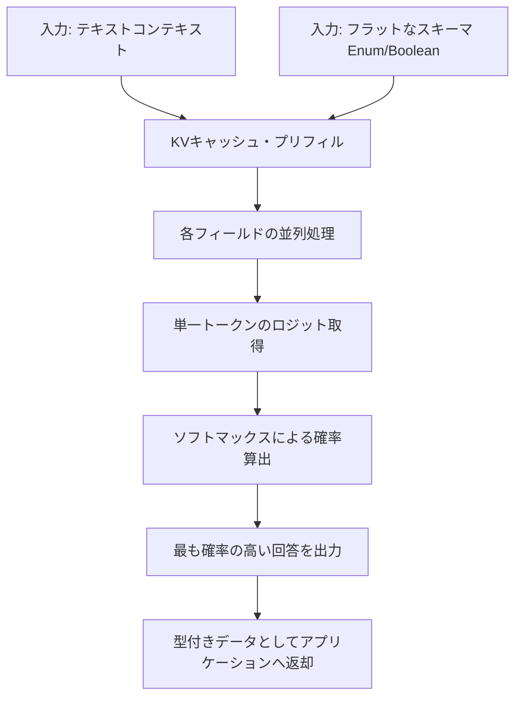

# **Bespoke Nimble 調査レポート**

## **1. 基本情報**

* **ツール名**: Bespoke Nimble
* **ツールの読み方**: ビスポーク・ニンブル
* **開発元**: Bespoke Labs
* **公式サイト**: [https://github.com/bespokelabsai/nimble](https://github.com/bespokelabsai/nimble)
* **関連リンク**:
  * GitHub: [https://github.com/bespokelabsai/nimble](https://github.com/bespokelabsai/nimble)
  * Hugging Face: [https://huggingface.co/bespokelabs/Bespoke-Nimble-9B](https://huggingface.co/bespokelabs/Bespoke-Nimble-9B)
* **カテゴリ**: AIモデル拡張/プラグイン
* **概要**: Bespoke Nimbleは、Bespoke Labsが開発したQwen3.5-9BベースのオープンソースAIモデル（LoRAアダプタ）である。テキストとスキーマを入力として受け取り、JSONなどのパースなしに直接型付きデータ（選択肢、真偽値など）を高速に出力する。

## **2. 目的と主な利用シーン**

* **解決する課題**: 従来のLLMは推論過程を含む自由記述のテキストを生成するため、システムに組み込んで型付きデータを確実かつ高速に取得するのが難しい。
* **想定利用者**: アプリケーションへのAI組み込みを行う開発者、データパイプライン構築者
* **利用シーン**:
  * リクエストのルーティング（条件に応じた振り分け）
  * ポリシーやルールの適用可否の判定（真偽値チェック）
  * アウトプットの評価や段階的なスコアリング

## **3. 主要機能**

* **型付き決定の直接出力**: 自由記述のテキストではなく、スキーマに基づく単一のトークンとして回答を出力する。
* **並列スコーリング (Parallel Scoring)**: 一度のコンテキスト処理（KVキャッシュプリフィル）で、複数のフィールドに対する評価を並列で実行可能（Mac環境等で対応）。
* **確率分布の出力**: 選択された回答だけでなく、候補となるすべての回答の確率（スコア）を出力可能。
* **コンテキストとスキーマの処理**: 長文のコンテキスト（テキスト）と、階層のないフラットなスキーマ（Enum、Boolean）を入力としてサポート。
* **対照的データキュレーション**: 微細な事実の違いで回答が変わるように工夫されたデータセットによって、モデルが根拠に基づき適切に判定できるように学習されている。

## **4. 動作原理・システム構成**

* **アーキテクチャ**: Qwen3.5-9BをベースモデルとしたLoRAアダプタ構成。
* **主要コンポーネントとデータフロー**:
  * モデルは入力されたプロンプトとスキーマを読み込み、KVキャッシュを事前充填（プリフィル）する。
  * 各質問に対し、許可された回答を示す単一トークンのロジット（Logits）を計算する。
  * ロジットをソフトマックス関数にかけて確率を算出し、最も確率の高いものを出力結果とする。
* **特筆すべき要素技術**:
  * 生成プロセスにおいて「テキスト生成（デコード）」を行わないため非常に高速。
  * 温度パラメータ（Temperature）による確率のキャリブレーションが行われている。



## **5. 開始手順・セットアップ**

* **前提条件**:
  * Python 3.12
  * Apple Silicon搭載のMac、またはBF16をサポートするNVIDIA GPU搭載のLinuxマシン
* **インストール/導入**:

  ```bash
  git clone https://github.com/bespokelabsai/nimble.git nimble
  cd nimble
  python3.12 -m venv .cache/venvs/nimble
  source .cache/venvs/nimble/bin/activate
  python -m pip install torch==2.8.0 -r requirements/training.txt
  ```

* **初期設定**:
  * Pythonスクリプトを用いてHugging FaceからベースモデルとLoRAアダプタをダウンロードし、マージ（統合）する処理を実行する。
* **クイックスタート**:
  * Python上で提供される `ParallelScorer` (Mac用) または `CudaCandidateScorer` (Linux用) をインスタンス化し、スキーマとテキストを渡してスコアリングを実行する。

## **6. 特徴・強み (Pros)**

* 推論過程を記述せず、直接的な出力（1ステップ）を行うため、一般的なLLMテキスト生成に比べてレイテンシが極めて低い。
* 出力結果のパース処理（JSONの解析など）が不要であり、型安全なデータが確実に得られる。
* TypeSafe AIが提供する「System One」アプローチ（Jev）をローカル環境や自前のGPU上でオープンソースモデルとして動作させることができる。

## **7. 弱み・注意点 (Cons)**

* 画像などのマルチモーダル入力には対応しておらず、テキストの評価・判定に特化している。
* 自身で説明や理由（根拠のテキスト生成）を出力することはできない。
* 最新のコンテキスト長は8,192トークンまでに制限されており、フィールド間の依存関係を考慮したネストされたJSON等には非対応。
* 日本語の入力も可能だが、英語モデルとしての特性が強く、プロンプトは英語に最適化されている。
* モデルの確率は絶対的な正確性を保証するものではないため、実運用では自社データでの検証が必要。

## **8. 料金プラン**

| プラン名 | 料金 | 主な特徴 |
|---------|------|---------|
| **オープンソース (OSS)** | 無料 | GitHubやHugging Faceから無償でダウンロード、商用利用も可能 (Apache 2.0 License)。自社インフラでのホスティング費用は別途必要。 |

* **課金体系**: 完全無料（自社ホスティングによるインフラコストのみ）
* **無料トライアル**: 該当なし

## **9. 導入実績・事例**

* **導入企業**: 2026年9月リリースのオープンソースモデルであり、具体的な企業名は公開事例なし。ただし、TypeSafe AI（Jev）等の代替・検証手段としてAIシステムビルダーによって検証が進められている。
* **導入事例**: レスポンス速度と型安全性が求められるルーティングタスク、カスタマーサポートのルール判定などでの利用が報告されている。
* **対象業界**: テクノロジー、ソフトウェア開発全般

## **10. サポート体制**

* **ドキュメント**: GitHubリポジトリ内にセットアップ、スコーリング、データキュレーション（Contrastive data curation）、トレーニング等の詳細なガイドが用意されている。
* **コミュニティ**: GitHubのIssueやHugging FaceのDiscussionを通じたオープンなコミュニティベースでのサポート。
* **公式サポート**: コミュニティ主導であり、企業向けの専任公式サポートは明記されていない。

## **11. エコシステムと連携**

### **11.1 API・外部サービス連携**

* **API**: モデル本体はPythonのコードベース（PyTorch, MLX）として提供されており、各自でAPIサーバー（SGLang等）としてデプロイ可能。
* **外部サービス連携**: オープンソースであるため、AWS、GCP、Modal等任意のクラウドプラットフォームにデプロイして他のシステムと自由に連携可能。

### **11.2 技術スタックとの相性**

| 技術スタック | 相性 | メリット・推奨理由 | 懸念点・注意点 |
|:---|:---:|:---|:---|
| **Python** | ◎ | 推論用の公式スクリプトがPyTorchおよびMLX用に提供されている | 特になし |
| **Hugging Face / PEFT** | ◎ | LoRAアダプタとして配布されており、標準的なライブラリで扱いやすい | マージ処理に一定のメモリ・ディスク容量が必要 |
| **Modal等のGPUクラウド** | ◯ | 提供されているガイドに従ってSGLangを用いてデプロイ可能 | コンテキスト長の制約(最大8,192トークン)に注意 |

## **12. セキュリティとコンプライアンス**

* **認証**: 自社ホスティングを行うため、認証機能は実装側のAPIゲートウェイやシステムに依存する。
* **データ管理**: ローカルまたは自社の閉域網・クラウド上で実行可能なため、データが外部のLLMプロバイダに送信されることはなく、機密性の高いデータの処理に適している。
* **準拠規格**: オープンソースソフトウェアとしての提供であり、セキュリティ規格への準拠はホスティング環境（AWS、GCP等）のコンプライアンスに基づく。

## **13. 操作性 (UI/UX) と学習コスト**

* **UI/UX**: 開発者向けのCLIおよびPythonスクリプト提供であるため、GUIは存在しない。型指定を行うスキーマ（辞書形式）は非常にシンプルで直感的。
* **学習コスト**: PyTorchやHugging Faceのエコシステムに慣れている開発者であれば、数時間以内にローカルでのセットアップと実行が可能。

## **14. ベストプラクティス**

* **効果的な活用法 (Modern Practices)**:
  * **並列スコーリングの活用**: 複数の条件判定（例えば10個の異なるルール）を同じコンテキストに対して行う場合、並列スコーリング機能を使うことで、1回分のコンテキスト処理コストで全判定を瞬時に行う。
  * **対照的データキュレーション**: 自社の特定のドメインに特化させたい場合、提供されている「Contrastive data curation」手法を用いて独自の学習データを作成しファインチューニングを行う。
* **陥りやすい罠 (Antipatterns)**:
  * 確率スコア（Probability）を過信し、閾値の設定なしに業務フローを自動化してしまうこと。必ず本番データで精度検証を行い、適切な閾値を設定する。
  * 自由記述での回答が必要なタスク（要約、文章生成）にNimbleを使用すること。Nimbleはあらかじめ決められた「選択肢」から選ぶタスク専用である。

## **15. ユーザーの声（レビュー分析）**

* **調査対象**: GitHub (スター数: 約1.9k)、X (Twitter)
* **総合評価**: レビューサイト（G2等）には登録がないが、オープンソースコミュニティからは高い注目を集めている。
* **ポジティブな評価**:
  * 「System Oneモデルのオープンソース版として、TypeSafe AI（Jev）のロジックを検証・理解するのに最適である。」
  * 「JSONパースエラーなどのLLM特有のストレスから解放され、決定的な結果を得られるため組み込みやすい。」
  * 「ローカルのMac環境 (MLX) で高速に動作する並列処理の実装が素晴らしい。」
* **ネガティブな評価 / 改善要望**:
  * 「まだ対応できるフィールドが単一のフラットな構造に限られており、ネストされた複雑なスキーマには対応していない。」
  * 「画像などのマルチモーダルな判断もできるようになればさらに用途が広がる。」
* **特徴的なユースケース**:
  * プライバシー要件が厳しく、API経由でデータを送信できない企業内での書類の自動仕分け・ルール判定エンジン。

## **16. 直近半年のアップデート情報**

* **2026-09-24**: 8,192トークンコンテキストと、フィールドあたり最大255の選択肢に対応した最新チェックポイント（Bespoke-Nimble-9B）を公開。温度パラメータ (T=1.0) がデフォルトに。
* **2026-09-22**: 元のリリース向けに、確率値と正答率の乖離を抑えるための温度キャリブレーション（Temperature 2.179）の適用を更新。
* **2026-09-20**: Bespoke-Nimble-9Bのトレーニング用データ（2,676件）および評価用ホールドアウトデータ（324件）を公開。
* **2026-09-19**: ホスト型APIのプロンプト上限を8,192トークンへ引き上げ。
* **2026-09-18**: JevとBespoke-Nimble-9Bを比較するためのパブリックベンチマークスイートを追加。

(出典: [GitHub Updates](https://github.com/bespokelabsai/nimble#updates))

## **17. 類似ツールとの比較**

### **17.1 機能比較表 (星取表)**

| 機能カテゴリ | 機能項目 | 本ツール | TypeSafe AI | Qwen |
|:---:|:---|:---:|:---:|:---:|
| **基本機能** | 型付き構造化データ出力 | ◎<br><small>ロジット評価で直接出力</small> | ◎<br><small>System Oneモデルの商用版</small> | △<br><small>プロンプト工夫やJSONモードが必要</small> |
| **提供形態** | オープンソース提供 | ◎<br><small>Apache 2.0で公開</small> | ×<br><small>SaaS / クラウドAPI</small> | ◯<br><small>オープンモデル提供あり</small> |
| **環境・運用** | ローカル実行/自社ホスト | ◯<br><small>MacやLinuxで実行可能</small> | △<br><small>API連携が中心</small> | ◯<br><small>自身で環境構築が可能</small> |
| **機能性** | テキスト生成能力 | ×<br><small>生成不可・決定専用</small> | ×<br><small>Jevは決定タスク専用</small> | ◎<br><small>高度な生成・推論機能</small> |
| **機能性** | マルチモーダル対応 | ×<br><small>テキスト入力のみ</small> | ×<br><small>テキスト入力のみ</small> | ◎<br><small>画像・動画対応(Qwen 3.5)</small> |

### **17.2 詳細比較**

| ツール名 | 特徴 | 強み | 弱み | 選択肢となるケース |
|---------|------|------|------|------------------|
| **本ツール** | 型付き出力に特化したOSSモデル | ロジット直接評価による高速・確実な出力と、無料で利用可能な点 | テキスト生成が一切できない。マルチモーダル非対応 | システムへの組み込みや、SaaS APIを使わず自社内で完結させたい場合 |
| **TypeSafe AI** | 「System One」AIのSaaS版 | 極めて高い精度（93.2%）と超低レイテンシを誇る商用サービス | オープンソースではなく、基本はAPI課金となる | 商用レベルの高いSLAと精度を必要とする、本格的なエンタープライズ利用 |
| **Qwen** | 中国Alibaba発の汎用マルチモーダルLLM | 優れた推論能力、長文処理、マルチモーダル入力に対応 | JSON出力を強要するにはプロンプトの調整が必要で遅延が発生する | ルール判定だけでなく、理由の説明や自由回答の生成、画像の分析が必要な場合 |

## **18. 総評**

* **総合的な評価**:
  Bespoke Nimbleは、大規模言語モデルを活用して「確実な型付きデータ」と「高速な応答」を得るという、AIのシステム組み込みにおける課題を解決する非常に実用的なオープンソースモデルである。TypeSafe AIのJevにインスパイアされたアプローチをオープンソース（Qwen3.5-9Bベース）で公開した意義は大きく、生成AIの新たな活用手法（System One）を民主化したツールと評価できる。
* **推奨されるチームやプロジェクト**:
  LLMの出力をパースする際の不安定さに悩まされている開発チームや、機密データを外部APIに送信できない環境で高速なAIルール判定エンジンを構築したいプロジェクトに最適である。
* **選択時のポイント**:
  テキスト生成やマルチモーダル機能が必要な場合は通常の「Qwen」や他LLMを、商用環境でのさらなる高精度とマネージドサービスを求める場合は「TypeSafe AI」を選択すべきである。一方、自社インフラ内で完結させ、コストを抑えて型付きの決定的推論を行いたい場合は、本ツールが非常に有力な選択肢となる。
