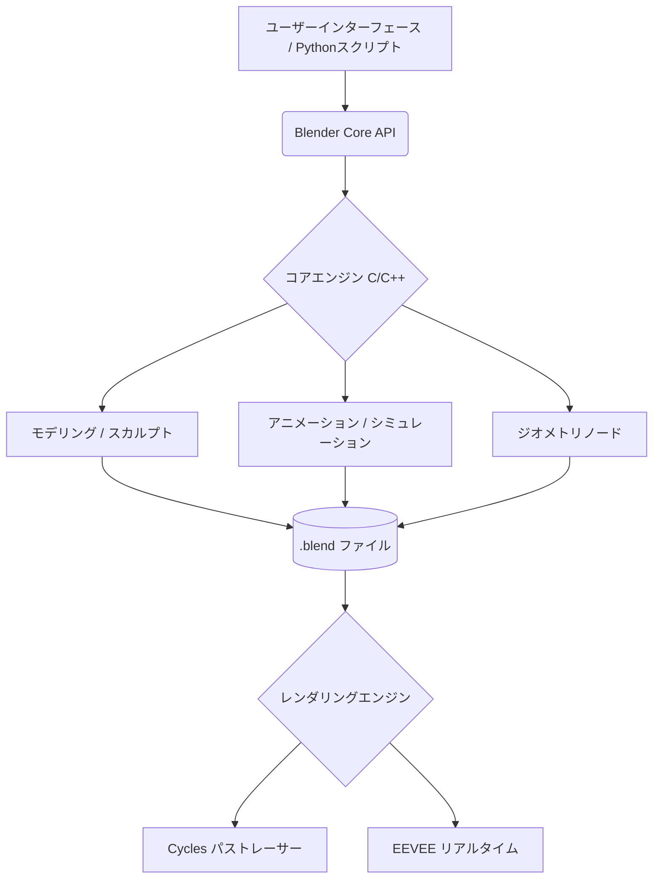

# **Blender 調査レポート**

## **1. 基本情報**

* **ツール名**: Blender
* **ツールの読み方**: ブレンダー
* **開発元**: Blender Foundation
* **公式サイト**: [https://www.blender.org/](https://www.blender.org/)
* **関連リンク**:
  * GitHub: [https://projects.blender.org/blender/blender](https://projects.blender.org/blender/blender)
  * ドキュメント: [https://docs.blender.org/manual/](https://docs.blender.org/manual/)
* **カテゴリ**: デザインツール
* **概要**: モデリング、リギング、アニメーション、シミュレーション、レンダリング、コンポジット、モーショントラッキング、動画編集など、3Dパイプラインの全体をサポートする、無料かつオープンソースの3D制作スイート。

## **2. 目的と主な利用シーン**

* **解決する課題**: 高価な3Dソフトウェアを購入することなく、プロ品質の3Dモデル、アニメーション、VFXの制作環境を提供する。
* **想定利用者**: 3Dアーティスト、アニメーター、ゲーム開発者、VFXアーティスト、インディー系映像作家、学生。
* **利用シーン**:
  * 映画、アニメ、CMなどの高品質な3Dアニメーション制作
  * ゲームやVR/AR向けの3Dアセット（キャラクター、背景、プロップ）のモデリング
  * 実写映像へのVFX合成やモーショントラッキング
  * 製品の3Dビジュアライゼーションや建築パースの作成

## **3. 主要機能**

* **モデリング**: ポリゴンモデリング、Nゴンサポート、高度なスカルプト機能、カーブ、非破壊のモディファイアーシステム。
* **アニメーション＆リギング**: キャラクターリギング、キーフレームアニメーション、インバースキネマティクス(IK)、シェイプキー、ノンリニアアニメーション。
* **レンダリング**: 物理ベースのパストレーサー「Cycles」と、リアルタイムレンダラー「EEVEE」を搭載。GPUレンダリングにも対応。
* **ジオメトリノード**: ノードベースでプロシージャル（手続き型）にモデリングやオブジェクトの配置を行う高度なシステム。
* **シミュレーション**: 流体（液体・煙・炎）、クロス（布）、剛体、パーティクル、ヘアなど、強力な物理シミュレーション。
* **グリースペンシル**: 3D空間内に直接2Dの絵を描き、2Dアニメーションと3Dをシームレスに統合できる機能。
* **VFX＆コンポジット**: カメラ/オブジェクトトラッキング、ノードベースのコンポジター、および基本的な動画編集（VSE）。

## **4. 動作原理・システム構成**

* **アーキテクチャ**: ローカルファーストのネイティブアプリケーション（C/C++ベースにPythonによる拡張）
* **主要コンポーネントとデータフロー**:
  * データはすべてローカルの「.blend」ファイルに統合して保存され、UI、モデリングデータ、アニメーションカーブなどすべてがこのファイルに内包される。
  * ユーザーの操作やPythonスクリプトによる拡張は内部のBlender APIを通じてC++コアと通信し、処理される。
* **特筆すべき要素技術**:
  * **ノードベースシステム**: マテリアル（シェーダー）、ジオメトリ（プロシージャルモデリング）、コンポジットなど、視覚的にノードを繋ぐことで非破壊的かつ高度な処理を実現。
  * **Cycles / EEVEE**: 物理ベースのパストレーサー（Cycles）とリアルタイムレンダラー（EEVEE）を搭載。

## **5. 開始手順・セットアップ**

* **前提条件**:
  * Windows、macOS、Linuxに対応。
  * 快適な動作には、一定以上のCPU、メモリ、およびグラフィックボード（GPU）が推奨される。
  * アカウント登録は不要。
* **インストール/導入**:
  * 公式サイトのダウンロードページからOSに合ったインストーラーをダウンロードし、インストールする。
  * Linux環境では各種パッケージマネージャー（snap、aptなど）やSteamからもインストール可能。

## **6. 特徴・強み (Pros)**

* **完全無料かつオープンソース**: 全ての機能が無料で利用でき、商用利用を含めいかなる制限もない（GPLライセンス）。
* **オールインワンのパイプライン**: モデリングから最終的な動画の書き出しまで、外部ツールを使わずに完結できる。
* **活発なコミュニティとエコシステム**: 世界中の開発者が機能追加に貢献しており、チュートリアルやアセット、プラグイン（アドオン）が極めて豊富。
* **進化のスピード**: Blender Foundationによる強力な開発体制と、大手企業からの資金援助により、ハイペースで最新技術が導入されている。

## **7. 弱み・注意点 (Cons)**

* **学習曲線が急**: 独自のショートカットやUIの概念があるため、完全な初心者や他の3Dソフト経験者が慣れるまでに時間がかかる。
* **業界標準との差異**: 大手映像スタジオなどではMayaや3ds Max等が依然として業界標準であり、他ツールとのデータ連携やパイプライン構築には工夫が必要な場合がある。
* **一部機能の専門性**: 動画編集機能など、専用のソフトウェア（DaVinci Resolve等）と比較すると機能が限定的な部分もある。
* **日本語ドキュメントの充実度**: UIの日本語化は可能だが、最新機能のチュートリアルや高度なトラブルシューティングは英語の情報が先行する。

## **8. 料金プラン**

| プラン名 | 料金 | 主な特徴 |
|---------|------|---------|
| **完全無料** | 無料 | オープンソース（GPLライセンス）として提供され、商用利用を含めすべての機能を無料で利用可能。 |

* **課金体系**: なし。ただし、開発を支援するためのBlender Development Fundへの寄付（サブスクリプション）や、公式アセット・チュートリアルが利用できるBlender Studioへの加入が可能。
* **無料トライアル**: なし（常に無料で利用可能）。

## **9. 導入実績・事例**

* **導入企業**: Khara（カラー）、Ubisoft Animation Studio、Tangent Animation、SPA Studiosなど。Epic GamesやNVIDIA、Appleなど大手企業も開発資金を提供。
* **導入事例**:
  * 映画『シン・エヴァンゲリオン劇場版』での一部制作（スタジオカラー）
  * Netflixのアニメ映画『ネクスト・ロボ (Next Gen)』、『失くした体 (I Lost My Body)』
  * アカデミー賞ノミネート作品『Flow』など、多くの長編・短編アニメーション映画。
* **対象業界**: 映画・アニメーション制作、インディーゲーム開発、フリーランスの3Dアーティスト、建築・プロダクトデザイン。

## **10. サポート体制**

* **ドキュメント**: 公式のオンラインリファレンスマニュアルが整備されており、有志による日本語翻訳も行われている。
* **コミュニティ**: Blender Artistsなどの大規模なフォーラムや、Stack Exchange、無数のYouTubeチュートリアル、Discordサーバーなど、世界最大級のコミュニティが存在する。
* **公式サポート**: 無料のオープンソースソフトウェアであるため、企業向けのような専任の個別サポート窓口はない。

## **11. エコシステムと連携**

### **11.1 API・外部サービス連携**

* **API**: Pythonスクリプトに完全対応。機能の拡張、UIのカスタマイズ、作業の自動化が可能。
* **外部サービス連携**: Alembic、USD、glTF、FBX、OBJなど、業界標準の3Dフォーマットのインポート/エクスポートに対応しており、他のDCCツールやゲームエンジン（Unity、Unreal Engine、Godot等）と連携可能。

### **11.2 技術スタックとの相性**

| 技術スタック | 相性 | メリット・推奨理由 | 懸念点・注意点 |
|:---|:---:|:---|:---|
| **Python** | ◎ | Blender内部で強力なPython APIが利用可能で、アドオン開発が容易 | バージョンアップデートでAPIが変更される場合がある |
| **Unity / Unreal Engine** | ◯ | FBXやglTFなどを介してスムーズなアセットのエクスポートが可能 | ボーンの構造やマテリアルの互換性に注意が必要 |
| **Godot Engine** | ◎ | オープンソース同士の親和性が高く、.blendファイルの直接インポートが公式サポートされている | 特になし |

## **12. セキュリティとコンプライアンス**

* **認証**: アカウント登録なしでローカル環境にインストール・実行可能。
* **データ管理**: データはすべてローカルの「.blend」ファイル等として保存されるため、自社内での厳密なデータ管理が可能。
* **準拠規格**: オープンソースソフトウェア（GPL v2以降）として透明性が確保されている。

## **13. 操作性 (UI/UX) と学習コスト**

* **UI/UX**: かつては独特で難解とされたUIだが、バージョン2.80での大刷新以降、業界標準に近い直感的な操作性へと大きく改善された。ワークスペース機能により、モデリング、アニメーションなどのタスクに応じた画面レイアウトに切り替え可能。
* **学習コスト**: 高い。3D特有の概念に加え、機能が非常に多岐にわたるため。ただし、有志による良質なチュートリアル動画（Donutチュートリアルなど）が豊富に存在するため、独学のハードルは低い。

## **14. ベストプラクティス**

* **効果的な活用法 (Modern Practices)**:
  * **ジオメトリノードの活用**: 大量のオブジェクト配置や、パラメータで変化するプロシージャルなモデリングを行う。
  * **EEVEEの活用**: リアルタイムレンダラーであるEEVEEを活用し、プレビューやアニメーションのルックデブを高速に行う。
  * **アドオンの導入**: 用途に合わせて、モデリング補助やアセット管理などの各種アドオン（プラグイン）を導入し、ワークフローを最適化する。
* **陥りやすい罠 (Antipatterns)**:
  * **巨大なポリゴン数**: モディファイアー（サブディビジョンサーフェス等）の適用を誤り、ポリゴン数が爆発的に増えて動作が重くなる。
  * **スケールとトランスフォームの未適用**: オブジェクトの拡大縮小を行った後、スケールを適用（Apply）しないまま作業を進めると、モディファイアーやシミュレーションが意図しない挙動になる。

## **15. ユーザーの声（レビュー分析）**

* **調査対象**: 主要なレビューサイト、SNS、コミュニティなど
* **総合評価**: 非常に高い。無料であることと、有料ソフトに匹敵する機能性が絶賛されている。
* **ポジティブな評価**:
  * 「完全無料なのにMayaなどの数万円のソフトと同等以上の機能がある」
  * 「YouTubeに質の高いチュートリアルが山のようにあるので、問題が起きてもすぐ解決できる」
  * 「アップデートの頻度が高く、常に最新の技術（AIデノイズや新しいレンダリング手法など）が使える」
* **ネガティブな評価 / 改善要望**:
  * 「機能が多すぎて最初はどこから手をつければいいか分からない」
  * 「業界標準ツール（Maya/3ds Max）とのショートカットや操作感の違いに戸惑う」
* **特徴的なユースケース**:
  * イラストレーターが背景や小物のパースを取るためのアタリとして、簡易的な3Dモデリングとレンダリングを利用する。

## **16. 直近半年のアップデート情報**

* **2026-09-14**: Blender 5.2.2 リリース。バグ修正とパフォーマンスの向上を含む安定版。
* **2026-07-13**: Blender 5.2.0 リリース。モデリングとレンダリングに関する新機能を追加。
* **2026-03-16**: Blender 5.1.0 リリース。パフォーマンスの向上、安定性の強化。
* **2026-02-15**: Winter of Quality 2026の取り組みとして、バグ修正と全体的な品質向上に注力。

(出典: [Blender Release Notes](https://www.blender.org/download/releases/))

## **17. 類似ツールとの比較**

### **17.1 機能比較表 (星取表)**

| 機能カテゴリ | 機能項目 | Blender | DaVinci Resolve | AviUtl |
|:---:|:---|:---:|:---:|:---:|
| **映像制作** | 3Dモデリング・アニメ | ◎ <small>フル機能の3Dスイート</small> | △ <small>Fusionでの限定的な3D</small> | × <small>非対応</small> |
| **映像制作** | 動画編集・カラー | ◯ <small>基本的な編集(VSE)</small> | ◎ <small>業界最高峰のカラーと編集</small> | ◯ <small>拡張編集プラグイン</small> |
| **映像制作** | コンポジット・VFX | ◯ <small>ノードベースコンポジット</small> | ◎ <small>強力なFusionノード</small> | ◯ <small>レイヤーベースの合成</small> |
| **拡張性** | アドオン・プラグイン | ◎ <small>無料の3D向けプラグイン多数</small> | ◯ <small>OpenFX対応 (一部有料)</small> | ◎ <small>有志によるスクリプト多数</small> |
| **コスト** | 価格 | ◎ <small>完全無料 (OSS)</small> | ◯ <small>無料版あり / Studio版は有料</small> | ◎ <small>完全無料</small> |

### **17.2 詳細比較**

| ツール名 | 特徴 | 強み | 弱み | 選択肢となるケース |
|---------|------|------|------|------------------|
| **Blender** | 無料の統合型3DCGソフト | 3Dモデリング、アニメーション、レンダリング機能が完全無料で使える | 動画編集特化のツールと比較すると、カラーグレーディング等の機能が限定的 | 3Dアセットの作成や3Dアニメーションを主軸に映像制作を行う場合。 |
| **DaVinci Resolve** | プロ向けのオールインワン動画編集ソフト | 最高峰のカラーコレクション、強力なノードベースVFX(Fusion)、音声編集(Fairlight) | 3Dモデリング機能はない。高度な機能の習得に時間がかかる | 実写映像のカラーグレーディングや、高品質な2D/3D合成、動画編集を本格的に行う場合。 |
| **AviUtl** | 歴史ある無料の国産動画編集ソフト | 動作が非常に軽く、有志のプラグインで無限に機能を拡張できる | 基本的な設計が古く、導入やエラー解決のハードルが高い | 低スペックPCでMAD動画やゲーム実況動画などを無料で編集したい場合。 |

## **18. 総評**

* **総合的な評価**:
  Blenderは、高額なプロ向けソフトウェアに匹敵、あるいは凌駕する機能を完全無料で提供している、現代の3D制作において極めて重要なソフトウェアである。活発なオープンソースコミュニティと強力な開発体制により、機能の進化スピードは業界随一となっている。
* **推奨されるチームやプロジェクト**:
  * 予算が限られているインディーゲーム開発者、個人の3Dアーティスト、学生。
  * 柔軟なパイプラインを構築したい小〜中規模のアニメーションスタジオ。
  * 2Dイラストや映像制作に3D表現を組み込みたいクリエイター。
* **選択時のポイント**:
  学習コストは一定必要だが、世界中に溢れるチュートリアルがその壁を低くしている。大手スタジオの既存のパイプライン（Maya等）に組み込む場合を除き、機能面・コスト面でBlenderを選択しない理由はほとんど見当たらない。
