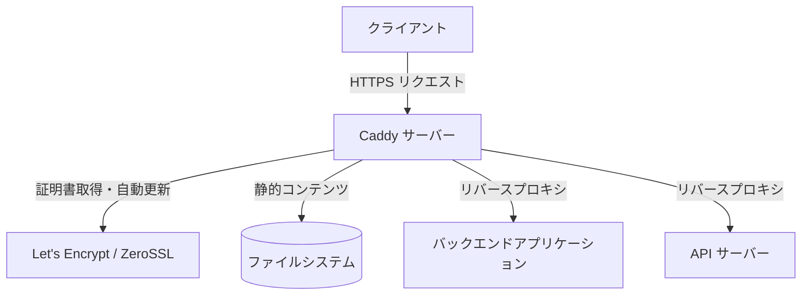

# **Caddy 調査レポート**

## **1. 基本情報**

* **ツール名**: Caddy
* **ツールの読み方**: キャディ
* **開発元**: ZeroSSL / オープンソースコミュニティ
* **公式サイト**: [https://caddyserver.com/](https://caddyserver.com/)
* **関連リンク**:
  * GitHub: [https://github.com/caddyserver/caddy](https://github.com/caddyserver/caddy)
  * ドキュメント: [https://caddyserver.com/docs/](https://caddyserver.com/docs/)
* **カテゴリ**: インフラ/サーバー管理
* **概要**: Caddyは、HTTPSをデフォルトで自動設定する機能を備えた、強力で拡張性の高いオープンソースのWebサーバーです。Go言語で書かれており、設定がシンプルで安全なのが特徴です。

## **2. 目的と主な利用シーン**

* **解決する課題**: Webサーバーの構築と、それに伴うSSL/TLS証明書の取得・更新作業の煩雑さを解消し、安全なHTTPS通信をデフォルトで実現する。
* **想定利用者**: バックエンドエンジニア、インフラエンジニア、個人開発者、スタートアップ企業。
* **利用シーン**:
  * APIサーバーやアプリケーションサーバーの前段に置くリバースプロキシとしての利用。
  * 静的サイトのホスティングと高速なファイル配信。
  * 内部PKI（公開鍵基盤）を使用したローカル環境や社内ネットワークでの安全なHTTPS通信。

## **3. 主要機能**

* **自動HTTPS**: Let's EncryptやZeroSSLなどのACMEプロトコル対応CAと連携し、SSL/TLS証明書の取得・更新をバックグラウンドで全自動化。
* **リバースプロキシ**: 動的バックエンド、ロードバランシング、アクティブ/パッシブなヘルスチェック、WebSocket、gRPC等のプロキシ機能。
* **Caddyfileによる簡易設定**: 驚くほど短く、直感的な構文でWebサーバーの設定を行える専用のフォーマットをサポート。
* **静的ファイルサーバー**: zstdやgzipによる自動圧縮、モダンでレスポンシブなファイルブラウザ（ディレクトリリスト）機能。
* **オンラインAPI (JSON API)**: サーバーを再起動することなく、REST API経由で動的に設定（JSONフォーマット）を変更可能。
* **FrankenPHPの統合**: Caddyの拡張として、PHPアプリ（LaravelやSymfonyなど）をFPMなしで高速に実行する機能。

## **4. 動作原理・システム構成**

* **アーキテクチャ**: CaddyはGo言語で開発されており、イベント駆動でメモリ安全なアーキテクチャを採用しています。コアはHTTPサーバーやTLS証明書マネージャーなどのモジュールを管理する構成となっており、必要な機能のみを静的にコンパイルして1つのバイナリにまとめることができます。
* **主要コンポーネントとデータフロー**:
  * リクエストがCaddyに到達すると、設定された「ルーター」に基づいてマッチングされ、対応する「ハンドラー」（ファイルサーバーやリバースプロキシなど）に渡されます。
  * HTTPS通信の場合、内部の証明書マネージャーがACMEサーバー（Let's Encryptなど）と非同期に通信し、証明書が期限切れになる前に自動で更新します。
* **特筆すべき要素技術**:
  * **Go言語 (Goroutines)**: 高い並行処理能力とメモリ安全性。
  * **CertMagic**: Caddyのコアとも言える、証明書自動管理のGoライブラリ。
  * **プラグインシステム**: APIやWebSocketsの処理など、Caddyfileのディレクティブを通じて自由に拡張可能。



## **5. 開始手順・セットアップ**

* **前提条件**:
  * Windows、macOS、LinuxなどGoがサポートする任意のOSで動作。
  * アカウント作成は不要（標準機能の場合）。
* **インストール/導入**:

  ```bash
  # macOS (Homebrew)
  brew install caddy

  # Ubuntu/Debian
  sudo apt install -y debian-keyring debian-archive-keyring apt-transport-https curl
  curl -1sLf 'https://dl.cloudsmith.io/public/caddy/stable/gpg.key' | sudo gpg --dearmor -o /usr/share/keyrings/caddy-stable-archive-keyring.gpg
  curl -1sLf 'https://dl.cloudsmith.io/public/caddy/stable/debian.deb.txt' | sudo tee /etc/apt/sources.list.d/caddy-stable.list
  sudo apt update
  sudo apt install caddy
  ```

* **初期設定**:
  * プロジェクトのルートディレクトリに `Caddyfile` という名前のテキストファイルを作成します。
* **クイックスタート**:

  ```text
  # Caddyfileの例 (リバースプロキシ)
  example.com {
      reverse_proxy localhost:8080
  }
  ```
  作成後、以下のコマンドでサーバーを起動します。
  ```bash
  caddy run
  ```
  これだけで自動的に `example.com` のSSL証明書が取得され、HTTPSで公開されます。

## **6. 特徴・強み (Pros)**

* **究極の利便性**: SSL証明書の取得と更新を完全に自動化。CronジョブやCertbotの個別設定が不要になり、運用コストが激減します。
* **設定のシンプルさ**: NginxやApacheと比較して、Caddyfileは圧倒的に短く直感的に記述でき、設定ミスを防ぎます。
* **高いセキュリティ**: メモリ安全なGo言語で構築されており、デフォルトで最新のTLSやOCSPステープリングが有効化されるなど、セキュアな初期設定が徹底されています。

## **7. 弱み・注意点 (Cons)**

* **レガシーシステムとの互換性**: Apacheの `.htaccess` のようなディレクトリ単位での動的な設定上書きには対応していません。
* **パフォーマンスの違い**: 極端に大規模な静的コンテンツ配信やC10k以上の環境では、長年チューニングされてきたNginxの方がピークパフォーマンスが優れる場合があります（ただし、大半のユースケースでは十分高速です）。
* **エコシステムの規模**: NginxやApacheほど古くからの膨大なコミュニティリソースや、すべてのOSでの長年の蓄積があるわけではありません。

## **8. 料金プラン**

| プラン名 | 料金 | 主な特徴 |
|---------|------|---------|
| **オープンソース版** | 無料 | Caddyのすべてのコア機能（自動HTTPS、プロキシ等）を利用可能。コミュニティサポート。 |
| **商用サポート / スポンサーシップ** | 任意（要問い合わせ） | Caddyの開発元や関連企業から商用サポート、インフラ構築支援を受けられる。またGitHub Sponsorsで支援可能。 |

* **課金体系**: 基本的に完全に無料（Apacheライセンス2.0）ですが、エンタープライズ向けのサポート契約やスポンサーシップとして資金提供が推奨されています。
* **無料トライアル**: オープンソースであるため、常に無料で利用可能です。

## **9. 導入実績・事例**

* **導入企業**: Stripe、Let's Encrypt（内部ツールとして）、その他数多くのSaaSプロバイダーやスタートアップ。
* **導入事例**: 何万ものカスタムドメインを持つSaaSプラットフォーム（On-Demand TLS機能を使用）や、社内のマイクロサービスのTLS通信の自動化。
* **対象業界**: 業界を問わず、特にWebインフラ、SaaS事業者、モダンなWeb開発環境で広く採用されています。

## **10. サポート体制**

* **ドキュメント**: 公式サイトに非常に詳細かつ整理されたドキュメント（英語）が用意されています。
* **コミュニティ**: 活発な公式フォーラム（Caddy Community）やGitHubがあり、開発者自らが回答することも多いです。
* **公式サポート**: 開発を主導する企業（ZeroSSL等）によるスポンサーシップ契約を通じて、ビジネスレベルのサポートを受けることが可能です。

## **11. エコシステムと連携**

### **11.1 API・外部サービス連携**

* **API**: Caddy自体がRESTful JSON APIを備えており、動的な設定変更や状態の取得が可能です。
* **外部サービス連携**: Let's EncryptやZeroSSLなどのACMEプロバイダー、Route53やCloudflareなどのDNSプロバイダー（DNSチャレンジ用プラグイン経由）と深く連携します。

### **11.2 技術スタックとの相性**

| 技術スタック | 相性 | メリット・推奨理由 | 懸念点・注意点 |
|:---|:---:|:---|:---|
| **Go / Node.js** | ◎ | アプリケーションの前段にCaddyを置くだけで、簡単に安全なHTTPSエンドポイントを提供可能。 | 特になし。 |
| **PHP (Laravel / Symfony)** | ◎ | FrankenPHPモジュールを使えば、php-fpm不要で従来の数倍のパフォーマンスを発揮。 | 既存のNginx/fpm環境からの移行には設定の書き換えが必要。 |
| **Docker / Kubernetes** | ◎ | コンテナネイティブであり、シングルバイナリのためイメージが小さくデプロイが容易。Ingress Controllerとしても利用可能。 | 複数インスタンスでクラスタを組む場合、証明書ストレージ（Redis等）の共有設定が必要。 |

## **12. セキュリティとコンプライアンス**

* **認証**: Basic認証等の機能が標準で用意されています。外部プラグインでAutheliaなどの認証プロバイダーとも連携可能です。
* **データ管理**: HTTPS証明書や秘密鍵は、デフォルトでファイルシステム（または指定したストレージ）に安全に保管され、クラスター間で共有することも可能です。
* **準拠規格**: CaddyのデフォルトのTLS設定は、PCI DSS、HIPAA、NISTのコンプライアンス要件に適合するよう設計されています。

## **13. 操作性 (UI/UX) と学習コスト**

* **UI/UX**: コマンドラインとCaddyfile（テキスト設定）が基本です。また、内蔵のファイルサーバー機能には、非常に見やすいモダンなファイルブラウザ（ディレクトリリスト）UIが備わっています。
* **学習コスト**: NginxやApacheと比較すると、HTTPSの自動化が組み込まれておりCaddyfileの構文もシンプルなため、導入のハードルは非常に低いです。

## **14. ベストプラクティス**

* **効果的な活用法 (Modern Practices)**:
  * **On-Demand TLS**: SaaSアプリケーションにおいて、顧客が独自ドメインを設定した際、初回アクセス時に動的に証明書を取得する機能を活用する。
  * クラスタリング: 複数のCaddyインスタンスでストレージ（Redis等）を共有し、証明書の取得・更新を自動で協調させる。
* **陥りやすい罠 (Antipatterns)**:
  * ローカル開発環境での利用時に、Caddyがインストールしたローカルルート証明書をOSが信頼していない（手動で信頼設定をしていない）ためにブラウザで警告が出る。
  * リバースプロキシ設定において、バックエンド側で想定しているヘッダー（`X-Forwarded-For`など）の引き継ぎ設定を忘れる（Caddy v2ではデフォルトで多くのヘッダーを引き継ぎますが、特殊な要件の場合は注意）。

## **15. ユーザーの声（レビュー分析）**

* **調査対象**: GitHub、Caddy Community、開発者ブログ、各種テックフォーラム。
* **総合評価**: 非常に高く、特に設定の容易さとHTTPS自動化に対する評価が圧倒的。
* **ポジティブな評価**:
  * 「Nginxで何行も書いていたSSLとプロキシの設定が、Caddyfileなら数行で終わる。もう手放せない。」
  * 「SaaSのカスタムドメイン対応において、On-Demand TLS機能は革命的だった。」
  * 「Go言語製なのでバイナリを1つ置くだけで動き、コンテナ環境での扱いやすさが抜群。」
* **ネガティブな評価 / 改善要望**:
  * 「古いNginxの設定をCaddyfileに翻訳する際、一部の複雑な正規表現ルーティング等で戸惑うことがある。」
  * 「プラグインを追加するにはCaddy自体をカスタムビルド（`xcaddy` を使用）する必要があり、やや手間に感じる場合がある。」
* **特徴的なユースケース**:
  * 顧客に独自ドメインを提供するホワイトラベルのSaaS企業が、裏側の証明書管理をすべてCaddyに任せるケース。

## **16. 直近半年のアップデート情報**

* **2026-10-01**: Caddy v2.11.6 リリース。URLPattern標準に基づく `url_pattern` リクエストマッチャーの追加、Slowloris攻撃緩和（非アクティブな読み書きタイムアウトの実装）、`tls_automate_names` グローバルオプションの追加、多数のバグ修正とパフォーマンス改善を実施。
* **2026-06-03**: Caddy v2.11.4 リリース。（v2.11系列の安定性向上と細かなバグ修正）
* **2026-05-12**: Caddy v2.11.3 リリース。（v2.11系列の安定性向上と細かなバグ修正）

(出典: [GitHub Releases](https://github.com/caddyserver/caddy/releases) )

## **17. 類似ツールとの比較**

### **17.1 機能比較表 (星取表)**

| 機能カテゴリ | 機能項目 | 本ツール | Nginx | Apache HTTP Server | Cloudflare |
|:---:|:---|:---:|:---:|:---:|:---:|
| **基本機能** | リバースプロキシ | ◎<br><small>設定が極めて簡単</small> | ◎<br><small>豊富な実績と高パフォーマンス</small> | ◯<br><small>標準的</small> | ◎<br><small>エッジでの強力なプロキシ</small> |
| **セキュリティ** | HTTPS（TLS）自動化 | ◎<br><small>デフォルトで完全自動</small> | △<br><small>Certbot等の設定が必要</small> | △<br><small>Certbot等の設定が必要</small> | ◎<br><small>プロキシさせるだけで自動</small> |
| **運用管理** | 設定ファイルの簡潔さ | ◎<br><small>Caddyfileで数行</small> | ◯<br><small>構造的だが長くなりがち</small> | △<br><small>XML風で冗長</small> | ◯<br><small>GUI/APIベース</small> |
| **拡張性** | 動的設定（再起動なし） | ◎<br><small>JSON APIで可能</small> | △<br><small>Plus(有料版)でのみ対応</small> | ◯<br><small>.htaccessで対応</small> | ◎<br><small>APIで即時反映</small> |

### **17.2 詳細比較**

| ツール名 | 特徴 | 強み | 弱み | 選択肢となるケース |
|---------|------|------|------|------------------|
| **本ツール (Caddy)** | HTTPS自動化が特徴のモダンなWebサーバー。 | 設定が圧倒的に簡単。On-Demand TLSなどの先進機能。メモリ安全なGo言語製。 | 歴史が浅く、Nginxほどの大規模なエコシステムや事例の蓄積はない。 | Webサーバーを素早く安全に立ち上げたい場合。SaaSの独自ドメイン管理を行いたい場合。 |
| **Nginx** | 世界中で使われる高性能Webサーバー/リバースプロキシ。 | 圧倒的な同時接続処理能力と、長年の運用実績。 | HTTPSの自動化にはCertbot等の外部ツールとCronジョブの設定が必要。 | 非常にトラフィックが多いサイトや、既にNginx前提のエコシステムが構築されている場合。 |
| **Cloudflare** | CDN/WAFを備えたエッジネットワーク（SaaS）。 | サーバー不要でグローバルな配信と強力なDDoS/WAF防御が無料で手に入る。 | SaaSであるため、社内LANのみでの利用やオンプレミスでの完全な自己管理には向かない。 | パブリックなWebサイトを運用し、セキュリティ防御とCDN配信を手軽に行いたい場合。 |

## **18. 総評**

* **総合的な評価**:
  * Caddyは、Webサーバーの設定と運用に伴う「HTTPS証明書の管理」という最大の痛みを完全に取り除いた革新的なツールです。Go言語による堅牢な設計と、Caddyfileの非常に簡潔な構文は、開発者の生産性を大きく向上させます。
* **推奨されるチームやプロジェクト**:
  * 迅速にプロダクトをローンチしたいスタートアップや個人の開発プロジェクト。
  * ユーザーのカスタムドメインへのHTTPS対応を自動化したいSaaSプラットフォーム。
  * 複雑なNginxの設定ファイル管理に疲弊しているインフラチーム。
* **選択時のポイント**:
  * すでにNginxやApacheで強固に構築された既存インフラを無理に置き換える必要はありませんが、新規でWebサーバーやリバースプロキシを構築する場合、Caddyは設定の容易さと運用の手間のなさから、第一選択肢として強く推奨されます。
