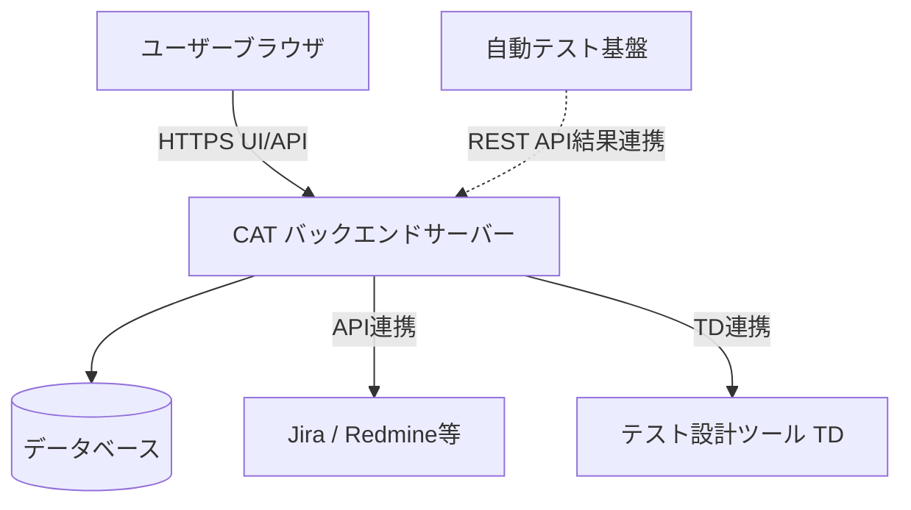

# **CAT 調査レポート**

## **1. 基本情報**

* **ツール名**: CAT (Computer Aided Test)
* **ツールの読み方**: キャット
* **開発元**: 株式会社SHIFT
* **公式サイト**: [https://www.catcloud.net/](https://www.catcloud.net/)
* **関連リンク**:
  * ドキュメント: https://catcloud.zendesk.com/hc/ja
* **カテゴリ**: テスト/QA
* **概要**: 株式会社SHIFTが提供する統合型ソフトウェアテスト管理ツール。Excelで行われていたテスト管理の課題（多重管理、可視化の遅れなど）を解決するために開発され、テストの実行管理、不具合管理、進捗の可視化をワンストップで実現する。

## **2. 目的と主な利用シーン**

* **解決する課題**:
  * Excelによるテスト仕様書のバージョン管理や同時編集の煩雑さの解消。
  * テスト実行状況と不具合発生状況のリアルタイムな可視化。
  * テストケースと不具合情報の紐付け（トレーサビリティ）の確保。
* **想定利用者**: QAエンジニア、テスト管理者、開発者、プロジェクトマネージャー。
* **利用シーン**:
  * **受入テスト・システムテスト**: 複数のテスターが同時にテストを実行し、進捗を管理するシーン。
  * **不具合管理**: テスト中に発見されたバグを起票し、修正状況を追跡する。
  * **品質分析**: プロジェクトの品質状況（信頼度成長曲線など）を分析し、リリースの判断材料とする。

## **3. 主要機能**

* **Excelインポート**: 既存のExcelテスト仕様書をドラッグ＆ドロップでそのまま取り込み、Web上で管理・編集が可能。
* **オンラインテスト実行**: Webブラウザ上でテストケースを実行し、OK/NGの結果を記録。複数人での同時実行もスムーズ。
* **統合的な不具合管理**: テスト実行画面から直接不具合を起票でき、テストケースと不具合が自動的に紐付く。
* **リアルタイム進捗管理**: 全体の進捗率、NG件数、未消化数などをリアルタイムにダッシュボードで確認可能。
* **品質分析**: 信頼度成長曲線（バーンダウンチャート）、機能ごとのバグ密度などを自動でグラフ化。
* **テスト設計支援 (TD連携)**: テスト設計ツール「TD」と連携し、設計から実行までをシームレスにつなぐ（一部プラン・オプション）。

## **4. 動作原理・システム構成**

* **アーキテクチャ**: クラウド完結型SaaS（一部オンプレミス提供もあり）
* **主要コンポーネントとデータフロー**:
  * ブラウザからWebアプリケーションにアクセスし、テスト設計や実行結果を登録する。
  * バックエンドサーバーがそれらのデータをDBに保存し、分析エンジンを通じて進捗や品質グラフをリアルタイムに生成して返す。
  * 外部BTS（JiraやRedmine等）とAPI連携することで、不具合データを双方向に同期・紐付けする。
* **特筆すべき要素技術**:
  * **データ同期・連携**: 外部ツールとのREST API連携により、テスト環境でのバグトラッキングと品質指標を統合管理。

## **5. 開始手順・セットアップ**

* **前提条件**:
  * Webブラウザ（Chrome, Edge, Firefox, Safariなど）
  * アカウント作成（メールアドレスが必要）
* **インストール/導入**:
  * クラウド版（SaaS）のため、サーバーへのインストールは不要。公式サイトから申し込み後、即時利用可能。
  * オンプレミス（ダウンロード）版もあり、その場合はサーバー環境（Windows/Linux, Webサーバー, DBなど）の構築が必要。
* **初期設定**:
  1. 「サービス」および「プロジェクト」の作成。
  2. メンバーの招待と権限設定。
  3. テスト仕様書（Excel等）のインポート、またはWeb上での作成。
* **クイックスタート**:
  1. ログイン後、サンプルプロジェクトを確認するか、新規プロジェクトを作成。
  2. Excelのテスト仕様書をドラッグ＆ドロップでインポート。
  3. 「テスト実行」画面を開き、ケースのステータスを「OK」に変更してみる。

## **6. 特徴・強み (Pros)**

* Excelライクな操作性で、多くの現場で使われているExcelの操作感を踏襲しており、学習コストが低く、現場への導入がスムーズ。
* オールインワンでテスト管理とバグ管理（BTS）が統合されており、別途JiraやRedmineを立てなくても単体で完結できる（外部連携も可能）。
* 強力な品質可視化機能を持ち、SHIFT社のテストノウハウが詰め込まれた分析機能により、特別な設定なしで品質状況をグラフ化できる。
* 国産ツールならではの安心感があり、UI、マニュアル、サポートが完全に日本語対応しており、日本企業の商習慣に合った機能（Excel帳票出力など）も充実。

## **7. 弱み・注意点 (Cons)**

* 無料プランにはユーザー数（10名まで）やプロジェクト数（5個まで）に制限があり、規模が大きくなると有料プランへの移行が必要。
* RPO（目標復旧時間）がクラウド版スタンダードプランで1日となっており、ミッションクリティカルな要件では確認が必要（エンタープライズ向けの要件は要確認）。
* グローバル対応について、UIの英語対応は進んでいるが、海外製ツール（TestRail等）に比べるとグローバルでのコミュニティ規模は小さい。

## **8. 料金プラン**

| プラン名 | 料金 | 主な特徴 |
|---------|------|---------|
| **フリープラン** | 無料 | ユーザー数10名まで、プロジェクト数5個まで、期間無制限、基本機能利用可 |
| **スタンダードプラン** | 2,650円/月 (1ユーザーあたり) | ユーザー数・プロジェクト数無制限、容量25GB/ユーザー、サーバー予備機あり |
| **ダウンロード版** | 950,000円〜 (買取) | オンプレミス運用向け、基本25ライセンス含む、2年目以降保守費あり |

* **課金体系**: ユーザー数単位の月額課金（クラウド版）。
* **無料トライアル**: スタンダードプランの機能を試せるトライアル期間あり。

## **9. 導入実績・事例**

* **導入企業**: 株式会社日立製作所、パナソニック株式会社 エレクトリックワークス社、エプソンアヴァシス株式会社、株式会社リクルートライフスタイル、株式会社クオリティアなど。
* **導入事例**:
  * **日立製作所**: 公共システム案件で導入。リアルタイムかつ正確な進捗・品質の可視化を実現。
  * **パナソニック**: 大規模プロジェクトで導入。安心できるサポート体制と、ツールの進化（機能改善）を評価。
  * **クオリティア**: 大規模プロジェクトにおけるリスクの早期発見に活用。
* **対象業界**: SIer、メーカー、Webサービス事業者など、ソフトウェア開発を行う幅広い業種・規模で採用。

## **10. サポート体制**

* **ドキュメント**: 公式ヘルプセンター（Zendesk）などにて、操作マニュアル、FAQ、APIリファレンスが公開されている。
* **コミュニティ**: ユーザーコミュニティとしての目立った公開フォーラムはないが、SHIFT社主催のセミナーやイベントで情報交換が行われる。
* **公式サポート**: 問い合わせフォーム、メールでのサポートを提供。国産ツールのため日本語でのきめ細やかな対応が可能。

## **11. エコシステムと連携**

### **11.1 API・外部サービス連携**

* **API**: REST APIを提供しており、プロジェクト情報の取得、テスト結果の登録、課題の操作などが可能。
* **外部サービス連携**: Jira, Redmine, Backlog などのBTS、Slackなどのチャットツール、GitHub, GitLabなどのバージョン管理システム、AD/LDAPなどと連携可能。

### **11.2 技術スタックとの相性**

| 技術スタック | 相性 | メリット・推奨理由 | 懸念点・注意点 |
|:---|:---:|:---|:---|
| **Selenium / Appium** | ◯ | API経由で自動テストの結果をCATに取り込み、手動テストと一元管理が可能。 | 取り込み用のスクリプト作成が必要。 |
| **Jira** | ◎ | 双方向連携が可能。開発チームはJira、QAチームはCATという使い分けがスムーズ。 | ステータスのマッピング設定が必要。 |
| **Excel** | ◎ | 既存資産をそのまま活用できるため、移行コストが極めて低い。 | 複雑なマクロを含むExcelは一部調整が必要な場合も。 |

## **12. セキュリティとコンプライアンス**

* **認証**: 2要素認証（2FA）に対応、IPアドレス制限機能あり。SAML認証(SSO)にも対応。
* **データ管理**: 通信のSSL暗号化。クラウド版のデータバックアップ体制が敷かれている。
* **準拠規格**: 運営元の株式会社SHIFTはISO/IEC 27001 (ISMS) 認証を取得している。

## **13. 操作性 (UI/UX) と学習コスト**

* **UI/UX**: 「Webで動くExcel」を目指したUIで、セルへの入力、コピー＆ペースト、オートフィルなどがブラウザ上で直感的に行える。
* **学習コスト**: 非常に低い。Excelでテスト管理をした経験があれば、ほとんど説明なしで使い始めることができる。

## **14. ベストプラクティス**

* **効果的な活用法 (Modern Practices)**:
  * **ハイブリッド管理**: 単体テスト・結合テストの自動化結果をAPIでCATに集約し、手動テスト（探索的テスト等）と合わせて全体の品質をCATで可視化する。
  * **BTS連携の活用**: 開発者は使い慣れたJira/Redmineを使い続け、QAはCATでテスト管理に集中する「役割分担」を行う。
* **陥りやすい罠 (Antipatterns)**:
  * **過度なカスタマイズ**: カスタムフィールドを増やしすぎて入力負荷を高め、テスターの生産性を下げる。
  * **巨大なExcelのインポート**: 非常に重いExcelファイルを分割せずにインポートしようとしてパフォーマンス低下を招く（適切な単位で仕様書を分けるべき）。

## **15. ユーザーの声（レビュー分析）**

* **調査対象**: 公式サイト導入事例およびユーザーインタビュー（※G2、Capterra、ITreviewなどの主要レビューサイトでの掲載は見当たらず、主に国内向けの導入事例による）
* **総合評価**: レビューサイトでの評価スコアなし
* **ポジティブな評価**:
  * 「Excelの資産を無駄にせず、スムーズにシステム化できた。」（導入事例より要約）
  * 「進捗報告資料を作る手間がなくなり、URLを共有するだけで済むようになった。」（導入事例より要約）
  * 「サポートのレスポンスが早く、要望も機能に反映されやすい。」（導入事例より要約）
* **ネガティブな評価 / 改善要望**:
  * 大量のデータを扱う場合のブラウザの動作に関する課題（過去のアップデートで順次改善傾向にある）。
* **特徴的なユースケース**:
  * 公共システム、ゲーム開発、大規模なWebサービス開発など、非常に多くのテストケースとテスターが関わるプロジェクトでの活用が多く見られる。

## **16. 直近半年のアップデート情報**

* **2026-04-09**: CATの機能追加アップデート、機能縮小（テスト実行画面でローカルファイルへのリンクを有効化、サブタスクの項目の表示設定で「スコープ」を非表示に、スケジュール管理機能の提供を終了など）（Ver 4.20.8）
* **2026-02-26**: CATおよびTDの機能改善アップデート（添付ファイルの一覧をダウンロード可能に、テスト実行画面の列フィルター対象を登録メンバーのみに変更、TDログイン有効期限にCATの設定を反映）（Ver 4.20.7）
* **2026-01-07**: 操作性向上と管理機能を強化（工程の「削除」を「アーカイブ」に変更、プロジェクトの添付ファイルの一括ダウンロードおよび削除に対応、テスト実行画面のフィルタがAND/OR条件切替に対応など）（Ver 4.20.6）
* **2025-11-18**: テスト仕様書詳細検索の空白検索対応、プロジェクトのアーカイブ機能追加（Ver 4.20.5）
* **2025-10-07**: テスト設計ツール「TD」との連携強化（CATから直接作成）、IP制限機能の拡張（Ver 4.20.4）

(出典: [CAT アップデート情報](https://www.catcloud.net/update_history.html))

## **17. 類似ツールとの比較**

### **17.1 機能比較表 (星取表)**

| 機能カテゴリ | 機能項目 | 本ツール (CAT) | TestRail | Qase | Jira (単体) |
|:---:|:---|:---:|:---:|:---:|:---:|
| **基本機能** | テストケース管理 | ◎ <small>Excelライク</small> | ◯ <small>ツリー構造</small> | ◯ <small>モダンUI</small> | △ <small>要アドオン</small> |
| **統合管理** | テストと不具合 | ◎ <small>完全統合</small> | △ <small>連携前提</small> | △ <small>連携前提</small> | ◯ <small>同一PF</small> |
| **操作性** | Excelインポート | ◎ <small>D&Dで完了</small> | △ <small>CSV経由等</small> | ◯ <small>CSV/XML</small> | △ <small>CSVのみ</small> |
| **非機能要件** | 日本語対応 | ◎ <small>完全対応</small> | △ <small>代理店依存</small> | × <small>英語のみ</small> | ◯ <small>対応</small> |
| **コスト** | 開始価格 | ◎ <small>無料/$20強〜</small> | △ <small>$37/月〜</small> | ◯ <small>無料/$24/月〜</small> | ◯ <small>無料/~$8.15/月〜</small> |

### **17.2 詳細比較**

| ツール名 | 特徴 | 強み | 弱み | 選択肢となるケース |
|---------|------|------|------|------------------|
| **本ツール (CAT)** | 国産・Excelライク | 日本の現場に最適化されたUI、学習コストの低さ、統合型管理 | グローバルでのエコシステムは限定的 | 日本国内のプロジェクト、Excelからの脱却を目指すチーム |
| **TestRail** | 世界標準 | 豊富なAPI、多数の自動テストツール連携、グローバルでの実績 | 料金がやや高め($37/月〜)、日本語情報は代理店頼み | 海外拠点と連携するプロジェクト、自動テスト統合重視 |
| **Qase** | モダンSaaS | 美しいUI、高速な動作、無料プラン($24/月〜)あり | 日本語未対応、エンタープライズ機能はこれから | 英語に抵抗がないスタートアップ、UI/UX重視 |
| **Jira (単体)** | プロジェクト管理 | 開発タスクとの一元管理(~$8.15/月〜) | テスト管理機能は弱く、XrayやZephyr等のアドオン(有料)がほぼ必須 | 既にJiraを全社導入しており、プラットフォームを増やしたくない場合 |

## **18. 総評**

* **総合的な評価**:
  * CATは、日本のソフトウェア開発現場の課題（Excel依存、多重管理）を解決するために特化した、極めて実用的なツールである。「Excelの良さを残しつつ、Web化のメリットを享受する」というコンセプトは、現場の抵抗感を最小限に抑えつつ品質管理プロセスを近代化するのに最適解と言える。機能のアップデートも頻繁であり、クラウドサービスの利点を十分に活かしている。
* **推奨されるチームやプロジェクト**:
  * Excelでのテスト管理に限界を感じているチーム、QA専任者がおらず開発者がテストを兼務しているプロジェクト、SIerや受託開発など品質報告（帳票）が重要な案件。
* **選択時のポイント**:
  * 「学習コストをかけずにすぐに導入したい」「日本語でのサポートが必須」であればCATは強力な候補となる。一方で、「英語ベースの最新モダンツールを使いたい」「海外拠点との連携が主」であれば、TestRailやQaseなども比較検討の対象となる。
