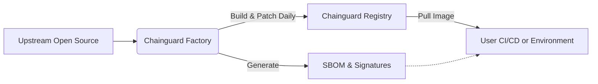

# **Chainguard 調査レポート**

## **1. 基本情報**

* **ツール名**: Chainguard
* **ツールの読み方**: チェインガード
* **開発元**: Chainguard
* **公式サイト**: [https://www.chainguard.dev/](https://www.chainguard.dev/)
* **関連リンク**:
  * GitHub: [https://github.com/chainguard-dev](https://github.com/chainguard-dev)
  * ドキュメント: [https://edu.chainguard.dev/](https://edu.chainguard.dev/)
  * レビューサイト: [G2](https://www.g2.com/products/chainguard/reviews)
* **カテゴリ**: セキュリティ
* **概要**: 既知の脆弱性（CVE）を持たない最小限のセキュアなコンテナイメージ（Chainguard Images）、言語ライブラリ、仮想マシンイメージを提供するプラットフォーム。ソースコードから毎日再ビルドされ、パッチが適用された安全なソフトウェアサプライチェーンを実現する。

## **2. 目的と主な利用シーン**

* **解決する課題**: オープンソースソフトウェアやコンテナベースイメージに潜む多数の脆弱性（CVE）の管理・修正にかかるエンジニアリングの工数負担とセキュリティリスク。
* **想定利用者**: 開発チーム、プラットフォームチーム、セキュリティチーム、DevSecOpsエンジニア
* **利用シーン**:
  * コンテナ化されたアプリケーションのベースイメージとしての活用
  * セキュアなCI/CDパイプラインの構築
  * FedRAMP、PCI DSS、SOC 2などのコンプライアンス要件を満たすインフラ環境の構築

## **3. 主要機能**

* **Chainguard Containers (Images)**: 既知のCVEがゼロに近い、最小限のパッケージのみを含むセキュアなコンテナイメージ。ベースイメージ、アプリケーション、AI/ML、FIPS準拠イメージなどがある。
* **Chainguard Libraries**: サプライチェーン攻撃から保護された、マルウェア耐性のある言語ライブラリ（Python、Java、JavaScript等）。
* **Chainguard VMs**: ソースから毎日再ビルドされる最適化されたセキュアな仮想マシンイメージ。
* **Chainguard OS Packages**: カスタムコンテナをビルドするための、エンタープライズレベルで維持されるセキュアなパッケージ群。
* **Chainguard Actions**: Chainguard Factoryで構築・維持される、安全性がデフォルトで確保されたCI/CDワークフロー。
* **SBOMおよびプロビジョナンス**: 全てのイメージに対して、ビルド時のソフトウェア部品表（SBOM）とデジタル署名（Sigstore）を提供する。
* **SLAに基づくCVE修正**: エンタープライズ向けには、クリティカルCVEは7日以内、その他のCVEは14日以内というパッチ適用のSLAを提供する。

## **4. 動作原理・システム構成**

* **アーキテクチャ**: SaaSおよびレジストリサービス（クラウド完結型SaaS）
* **主要コンポーネントとデータフロー**:
  * ユーザーはChainguardのレジストリ（`cgr.dev`等）からコンテナイメージをPullする。
  * バックエンドには「Chainguard Factory」と呼ばれる自動化されたビルドインフラが存在する。
* **特筆すべき要素技術**:
  * **Chainguard Factory**: オープンソースのエキスパートが運用するエージェント型のソフトウェアファクトリー。ソースからパッケージを毎日再ビルドし、継続的にパッチを適用する。
  * **SLSA L3**: ソフトウェアサプライチェーンのセキュリティフレームワークであるSLSAのレベル3に準拠した強固なビルドインフラ。
  * **Sigstore**: 成果物のデジタル署名と検証に使用されるオープンソース技術。



## **5. 開始手順・セットアップ**

* **前提条件**:
  * Dockerなどのコンテナランタイム環境
  * アカウント作成は公開イメージの利用のみなら不要。エンタープライズや特定の機能利用時は必要。
* **インストール/導入**:

  ```bash
  # Pythonベースイメージの取得例
  docker pull cgr.dev/chainguard/python:latest
  ```

* **初期設定**:
  * エンタープライズ版や特定のイメージを利用する場合は、Chainguard Consoleでアカウントを作成し、プル用のトークン等の認証情報を設定する必要がある。
* **クイックスタート**:
  * 取得したイメージをベースにして`Dockerfile`を作成し、ビルド・実行する。

## **6. 特徴・強み (Pros)**

* 独自のChainguard Factoryによるソースからのビルドで、未知のマルウェア混入を防ぐ。
* ベースイメージに不要なOSツール（シェル等）を含めない「ディストロレス」な設計により、攻撃表面を最小化し、CVEを平均97.6%削減する。
* クリティカルな脆弱性に対しては7日以内の修正SLAがあり、エンタープライズの厳しいセキュリティ要件を満たす。
* FedRAMP、SOC 2、PCI DSSなどの厳格な要件に対応するFIPS準拠イメージなども提供される。

## **7. 弱み・注意点 (Cons)**

* コンテナイメージにシェルやパッケージマネージャが含まれていないため、コンテナ内に入っての直接的なデバッグが難しい場合がある（ディストロレス共通の課題）。
* 「Catalog」プランは開発チームの規模に応じた価格（10名チームで$19,000〜）となり、小規模チームやスタートアップには高額に感じられる場合がある。
* 公式サイトやドキュメント、サポートにおいて日本語対応が行われておらず、基本的に英語のみとなる。

## **8. 料金プラン**

| プラン名 | 料金 | 主な特徴 |
|---------|------|---------|
| **Free Images** | 無料 | 5つのイメージまで商用利用可能。常に最新（latest）バージョンのみ。SLAなし。 |
| **Per Image** | 要問い合わせ | 利用するイメージ（Base, App, AI/ML, FIPS等）の種類と数に基づく課金。SLAあり。 |
| **Catalog** | $19,000〜/年 | チーム10名の場合の価格。エンジニア組織の規模に基づく課金。カタログ内の全てのイメージにアクセス可能。SLAあり。 |

* **課金体系**: 組織のエンジニア数（Catalog）、または利用イメージ数（Per Image）に基づく
* **無料トライアル**: Free Imagesとして5つまでのイメージを永続的に無料で利用可能

## **9. 導入実績・事例**

* **導入企業**: Canva, Snowflake, Snap, Anduril, Hewlett Packard Enterprise (HPE)
* **導入事例**:
  * **Snowflake**: Chainguard Containersを導入することで、何百・何千とあった脆弱性が一晩でゼロに減少し、FedRAMP High認証の取得に大きく貢献した。
  * **Anduril**: ベースイメージのパッチ適用にかかる工数が削減され、開発者がソフトウェア構築に集中できるようになった。
* **対象業界**: テクノロジー、公共部門（政府機関）、金融サービスなど、セキュリティ要件の厳しい業界

## **10. サポート体制**

* **ドキュメント**: 公式ドキュメント、チュートリアル、コース等が充実している。
* **コミュニティ**: ユーザーフォーラムとして活発なSlackコミュニティが存在する。
* **公式サポート**: エンタープライズプラン向けにサポート窓口を提供（主に英語対応）。

## **11. エコシステムと連携**

### **11.1 API・外部サービス連携**

* **API**: レジストリアクセスや管理機能用のAPIを提供。
* **外部サービス連携**: Snyk, Grype, Trivy, AWS Inspector, Wiz, GitLab, CrowdStrike などの主要スキャナー。JFrog Artifactory, AWS ECR, Docker Hub, Google Artifact Registry などのアーティファクトレジストリ。

### **11.2 技術スタックとの相性**

| 技術スタック | 相性 | メリット・推奨理由 | 懸念点・注意点 |
|:---|:---:|:---|:---|
| **Python** | ◎ | 専用のChainguard LibrariesやPythonベースイメージが提供されており、機械学習環境等で安全に利用可能。 | 特になし |
| **Java** | ◎ | Java向けのセキュアなベースイメージやライブラリを提供。 | 特になし |
| **Node.js (JavaScript)** | ◎ | Node.js向けの最適化されたイメージを提供。 | 特になし |
| **Go** | ◎ | Goアプリケーションのビルド・実行環境として非常に軽量で相性が良い。 | 特になし |

## **12. セキュリティとコンプライアンス**

* **認証**: SSO対応。Sigstoreを活用した成果物のデジタル署名と検証の仕組みがある。
* **データ管理**: SaaSレジストリとして提供、自社アーティファクト管理システムへのイメージミラーリングも可能。
* **準拠規格**: SOC 2取得済み。FedRAMP、PCI DSS、CMMC 2.0に対応するソリューション（FIPSイメージ等）を提供。

## **13. 操作性 (UI/UX) と学習コスト**

* **UI/UX**: 既存のDockerワークフロー（`docker pull`、`docker build`）をそのまま利用できるため、開発者にとっての操作性は非常に高い。
* **学習コスト**: コンテナを利用している開発者であれば学習コストはほぼゼロ。ただし、ディストロレス環境特有の運用（デバッグ手法の変更など）に慣れる必要がある。

## **14. ベストプラクティス**

* **効果的な活用法 (Modern Practices)**:
  * マルチステージビルドを活用し、ビルド段階では必要なツールを含むイメージを使用し、最終的な実行イメージにはChainguardの最小イメージを使用する。
  * アーティファクトレジストリへChainguardイメージをミラーリングし、社内から高速・安全にアクセスする。
* **陥りやすい罠 (Antipatterns)**:
  * 実行イメージ内に`curl`や`bash`などの不要なデバッグツールを追加してしまうこと。これによりChainguardのディストロレスの利点（攻撃表面の最小化）が損なわれる。

## **15. ユーザーの声（レビュー分析）**

* **調査対象**: G2、AWS Marketplace Reviews
* **総合評価**: 4.7/5.0 (G2)
* **ポジティブな評価**:
  * （G2より引用）「CVEがゼロに近い状態になり、セキュリティ対応の手間が大幅に減った。」
  * （G2より引用）「セットアップが非常に簡単で、既存のパイプラインにシームレスに統合できる。」
  * （AWS Marketplace Reviewsより引用）「サポートの対応が迅速で的確。」
* **ネガティブな評価 / 改善要望**:
  * （G2より引用）「価格体系が以前は高額だった（現在は改善されつつあるが、依然としてコストがかかる）。」
  * （AWS Marketplace Reviewsより引用）「一部のイメージの更新が遅いことがある。」
* **特徴的なユースケース**: Kubernetesプラットフォーム用の安全なイメージとして導入し、インフラ全体のセキュリティポスチャを大幅に向上させている。

## **16. 直近半年のアップデート情報**

* **2026-08-12**: The Guardener GitHub Appを発表。既存のDockerfileを最小限でセキュアなChainguardイメージに自動移行・維持するシステム。
* **2026-08-04**: Chainguard LibrariesがAWS Security Hub Extendedで利用可能に。
* **2026-06-25**: AI/ML環境向けに最適化された安全なソフトウェアエコシステム関連のアップデートを「AI Readiness Innovation Week」で多数発表。
* **2026-06-25**: Chainguard Repositoryに新しいポリシー制御機能を追加。Chainguard Libraries for JavaScriptがGA（一般公開）。
* **2026-06-24**: パイプラインやツール環境を変更することなく、堅牢化されたコンテナイメージを導入できる新機能を発表。
* **2026-03-17**: Chainguard Assemble 2026にて、「Chainguard OS Packages」、「Catalog Starter（無料枠提供）」、「Chainguard Actions（CI/CDワークフロー）」などを発表。

(出典: [Chainguard Blog (Unchained)](https://www.chainguard.dev/unchained) )

## **17. 類似ツールとの比較**

### **17.1 機能比較表 (星取表)**

| 機能カテゴリ | 機能項目 | 本ツール | Docker Hub (Official) | Google Distroless | RapidFort |
|:---:|:---|:---:|:---:|:---:|:---:|
| **基本機能** | CVEゼロ/最小化 | ◎<br><small>SLA付きで修正提供</small> | △<br><small>多くのCVEが残存</small> | ◯<br><small>最小構成だが頻繁なパッチなし</small> | ◯<br><small>実行時のプロファイルからスリム化</small> |
| **カテゴリ特定** | FIPS対応 | ◎<br><small>認証向けイメージ提供</small> | △<br><small>自力での対応が必要</small> | △<br><small>公式サポートなし</small> | ◯<br><small>既存イメージの最適化</small> |
| **エンタープライズ** | SLA付きサポート | ◎<br><small>提供あり</small> | △<br><small>一部あり</small> | ×<br><small>コミュニティサポートのみ</small> | ◯<br><small>商用サポートあり</small> |
| **非機能要件** | 日本語対応 | ×<br><small>英語のみ</small> | ×<br><small>英語のみ</small> | ×<br><small>英語のみ</small> | ×<br><small>英語のみ</small> |

### **17.2 詳細比較**

| ツール名 | 特徴 | 強み | 弱み | 選択肢となるケース |
|---------|------|------|------|------------------|
| **本ツール** | セキュアな最小イメージを商用SLA付きで提供。 | パッチ適用が迅速、SBOMや署名を標準提供。 | エンタープライズプランのコストがかかる。 | セキュリティ要件が厳しく、コンプライアンス準拠（FedRAMPなど）が求められるエンタープライズ企業。 |
| **Google Distroless** | Googleが提供する言語固有の最小限イメージ。 | 無料で利用でき、攻撃表面を大きく削減できる。 | SLAがなく、緊急の脆弱性対応が遅れる場合がある。 | コストをかけずにセキュアなコンテナを運用したい場合。 |
| **RapidFort** | 既存のコンテナイメージを最適化するツール。 | 既存のOSベース（Ubuntu等）を変えずにCVEを削減可能。 | コンテナの最適化・プロファイリングプロセスをCI/CDに組み込む手間がかかる。 | 現在のベースイメージ（OS等）を変更せずにCVEを削減したい場合。 |

## **18. 総評**

* **総合的な評価**:
  * Chainguardは、現代のソフトウェアサプライチェーンにおいて最大の頭痛の種である「オープンソースの脆弱性（CVE）管理」を根底から解決する強力なソリューションである。ソースからの独自ビルド（Chainguard Factory）とSLA付きのパッチ提供により、セキュリティと開発スピードの両立を実現している。
* **推奨されるチームやプロジェクト**:
  * 金融機関、政府機関、ヘルステックなど、厳格なコンプライアンス要件（SOC 2、FedRAMP、PCI DSS等）が求められるプロジェクト。
  * 脆弱性対応（パッチ当てやアップデート）に多大なエンジニアリング工数を割かれている開発・プラットフォームチーム。
* **選択時のポイント**:
  * 非常に高品質なサービスだが、カタログ全体の利用には年間約19,000ドルからの費用がかかるため、OSSのDistrolessイメージと比べた場合のROI（エンジニアの工数削減とセキュリティリスク低減の価値）をどう評価するかが導入の鍵となる。まずはFree Images（5つまで無料）で効果を検証することが推奨される。
