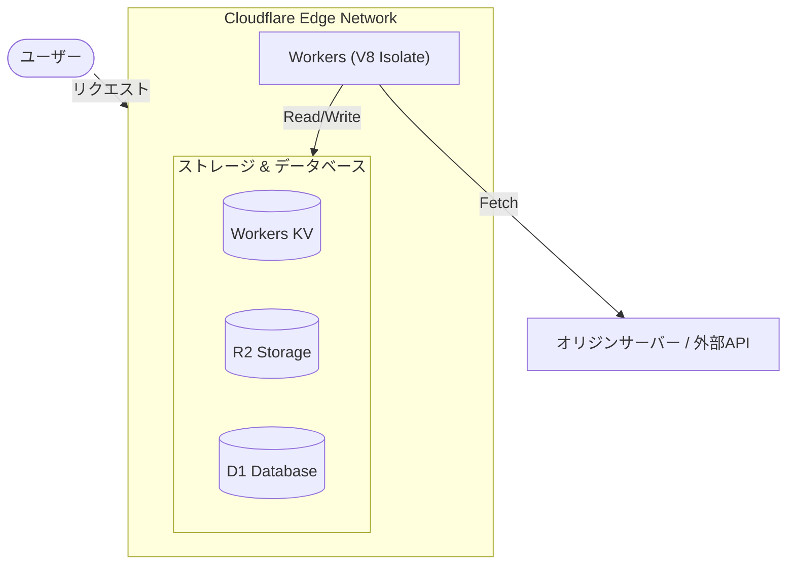

# **Cloudflare Workers 調査レポート**

## **1. 基本情報**

* **ツール名**: Cloudflare Workers
* **ツールの読み方**: クラウドフレア ワーカーズ
* **開発元**: Cloudflare, Inc.
* **公式サイト**: [https://developers.cloudflare.com/workers/](https://developers.cloudflare.com/workers/)
* **関連リンク**:
  * GitHub: [https://github.com/cloudflare/workers-sdk](https://github.com/cloudflare/workers-sdk)
  * ドキュメント: [https://developers.cloudflare.com/workers/](https://developers.cloudflare.com/workers/)
* **カテゴリ**: クラウドサービス/PaaS
* **概要**: Cloudflareのグローバルエッジネットワーク上で動作するサーバーレスプラットフォーム。従来のコンテナベースのサーバーレスとは異なり、V8 Isolate技術を採用することでコールドスタートの問題を解消し、低遅延でコードを実行できます。

## **2. 目的と主な利用シーン**

* **解決する課題**: バックエンドAPIの応答遅延、サーバー管理の煩雑さ、大規模トラフィック時のスケーリング対応。
* **想定利用者**: Webデベロッパー、フロントエンド/バックエンドエンジニア、インフラエンジニア。
* **利用シーン**:
  * 高速なWeb APIの構築とホスティング
  * エッジでのリクエスト制御やルーティング、認証（Middlewareとしての利用）
  * SSR（サーバーサイドレンダリング）の実行環境

## **3. 主要機能**

* **グローバルエッジ実行**: ユーザーに最も近いCloudflareのデータセンターでコードを実行し、レイテンシを極限まで低減。
* **超高速コールドスタート**: V8 Isolateの採用により、数ミリ秒単位での超高速な起動（コールドスタートゼロ）を実現。
* **豊富なストレージ連携**: Workers KV（キーバリュー）、D1（SQLデータベース）、R2（オブジェクトストレージ）、Durable Objectsなど、状態を持つアプリケーション構築を強力に支援。
* **Wrangler CLI**: 開発、テスト、デプロイメントを効率化するための強力な公式コマンドラインツール。
* **多言語対応**: JavaScript、TypeScriptに加えて、WebAssemblyを通じてRustやC/C++、さらにはPythonもサポート。

## **4. 動作原理・システム構成**

* **アーキテクチャ**: クラウド完結型のサーバーレスエッジコンピューティング環境。従来のコンテナベースのサーバーレス（AWS Lambdaなど）とは異なり、V8エンジンのIsolate技術を採用。
* **主要コンポーネントとデータフロー**:
  * 開発者はWrangler CLIを通じてコードをCloudflareにデプロイする。
  * リクエストがCloudflareのエッジネットワークに到達すると、ユーザーに最も近いデータセンターで処理される。
  * ワーカーはCloudflareの各種ストレージサービス（KV, R2, D1など）と連携し、状態を持つ処理やデータベースアクセスを行う。
* **特筆すべき要素技術**:
  * **V8 Isolate**: Google Chromeと同じV8 JavaScriptエンジンを使用し、軽量なサンドボックス（Isolate）で各リクエストを処理する。これにより、コンテナ起動のオーバーヘッドがなく、コールドスタートが数ミリ秒（またはゼロ）になる。



## **5. 開始手順・セットアップ**

* **前提条件**:
  * Node.js と npm のインストール
  * Cloudflareアカウントの作成
* **インストール/導入**:

  ```bash
  # プロジェクトの作成
  npm create cloudflare@latest
  ```

* **初期設定**:
  * CLIの案内に従ってテンプレートを選択し、プロジェクトディレクトリを作成。
  * `wrangler login` コマンドでCloudflareアカウントにログイン・認証を行う。
* **クイックスタート**:
  * ローカルでの開発サーバー起動: `npm run dev` (WranglerがMiniflareを使用してローカル環境をエミュレート)
  * エッジへのデプロイ: `npm run deploy` (数秒で全世界にデプロイ完了)

## **6. 特徴・強み (Pros)**

* コールドスタートによる遅延がほぼゼロで、世界中で一貫した低遅延（ハイパフォーマンス）を実現。
* 無料プランの枠が非常に大きく（1日10万リクエスト、月間約300万リクエストまで無料）、個人開発やプロトタイプに導入しやすい。
* V8 Isolateを採用しているため、軽量で高セキュリティな実行環境。
* 豊富なCloudflareエコシステム（D1, R2, KV, Queues等）との親和性が極めて高い。

## **7. 弱み・注意点 (Cons)**

* Node.js互換性は高まっているものの、完全な互換性があるわけではないため、一部のNode API依存ライブラリが動作しない場合がある。
* メモリ制限（1ワーカーあたり128MB）があり、メモリを大量に消費する処理や長時間のバッチ処理には不向き。
* Cloudflareのエコシステムに強く依存（ロックイン）する形になる。

## **8. 料金プラン**

| プラン名 | 料金 | 主な特徴 |
|---------|------|---------|
| **Free (無料プラン)** | 無料 | 1日あたり100,000リクエスト。最大CPU時間 10ms/リクエスト。 |
| **Paid (Standardプラン)** | $5/月 | 月間1,000万リクエスト、3,000万CPUミリ秒が含まれる。以降は追加課金。最大CPU時間 50ms。 |
| **Enterprise** | カスタム | 大規模なトラフィック向けのカスタムリクエスト量とサポート体制。 |

* **課金体系**: リクエスト数およびCPU実行時間（ミリ秒）ベース。
* **無料トライアル**: なし（永久無料のFreeプランを活用可能）。

## **9. 導入実績・事例**

* **導入企業**: Discord、Notion、Shopify などの大規模プラットフォーム。
* **導入事例**: Shopifyはカスタムストアフロントのルーティングとパフォーマンス向上のために採用。DiscordはAPIゲートウェイやマイクロサービスの処理で活用し、ミリ秒単位の応答を実現。
* **対象業界**: Eコマース、SaaS、メディア、ゲームなど、グローバルなトラフィックと低遅延が求められる業界全般。

## **10. サポート体制**

* **ドキュメント**: 公式のCloudflare Developer Docsは非常に充実しており、チュートリアルやフレームワークごとのガイドが豊富。
* **コミュニティ**: 活発な公式Discordサーバーが存在し、開発者同士の質問やCloudflareエンジニアからのサポートが得られる。
* **公式サポート**: 無料プランはコミュニティサポート中心。有料・Enterpriseプランでチケットサポートや優先対応が可能。

## **11. エコシステムと連携**

### **11.1 API・外部サービス連携**

* **API**: フル機能のCloudflare APIが公開されており、デプロイや設定の自動化が容易。
* **外部サービス連携**: GitHub Actions や GitLab CI などの外部CI/CDツールとの連携がネイティブにサポートされ、Sentry や Datadog などの外部監視ツールとも容易に連携可能。

### **11.2 技術スタックとの相性**

| 技術スタック | 相性 | メリット・推奨理由 | 懸念点・注意点 |
|:---|:---:|:---|:---|
| **Hono** | ◎ | Workers向けに最適化された軽量フレームワーク | 特になし。最良の選択肢の一つ。 |
| **Next.js (Edge Runtime)** | ◯ | 多くの機能がエッジで動作 | 一部のNode.js依存APIは未サポート |
| **Remix / React Router** | ◎ | Cloudflare Pages / Workersへの公式サポートが充実 | プロジェクト構成の理解が必要 |
| **Python (FastAPI等)** | △ | Python Workers（ベータ）によるサポート | まだ発展途上であり、制限事項が存在する |

## **12. セキュリティとコンプライアンス**

* **認証**: Cloudflare Access（Zero Trust）との統合により、ワーカーへのセキュアなアクセス制御が容易に実装可能。
* **データ管理**: V8 Isolateは厳格なサンドボックス環境を提供。Spectreなどのサイドチャネル攻撃対策としてタイマー精度の制限やマルチスレッドの無効化を実施。
* **準拠規格**: Cloudflareのインフラストラクチャとして、ISO 27001, SOC 2 Type II, GDPR, PCI DSSなど主要な規格に準拠。

## **13. 操作性 (UI/UX) と学習コスト**

* **UI/UX**: Cloudflareのダッシュボードは多機能だが、初めてのユーザーにはやや複雑に感じられることがある。Wrangler CLIの開発体験（DX）は非常に高く評価されている。
* **学習コスト**: JavaScript/TypeScriptやWeb標準のFetch APIに慣れていれば学習コストは低い。ただし、V8 Isolate固有の制約（Node.jsとの違い）を理解する必要がある。

## **14. ベストプラクティス**

* **効果的な活用法 (Modern Practices)**:
  * Honoなどのエッジ向けに設計された軽量フレームワークを使用し、パフォーマンスを最大化する。
  * Wranglerを使用したローカルでのMiniflareによるテストと、Vitestを活用した自動テストを組み込む。
  * 環境変数やSecretsを活用し、本番環境と開発環境をセキュアに分離する。
* **陥りやすい罠 (Antipatterns)**:
  * 巨大な依存ライブラリをバンドルしてしまうことによるワーカーサイズの超過（最大3MB〜10MB制限）。
  * 実行中に不要なブロッキング処理や、長いループを実行してCPU制限（10ms〜50ms）に抵触すること。

## **15. ユーザーの声（レビュー分析）**

* **調査対象**: G2等のレビューサイトや開発者コミュニティ。
* **総合評価**: 4.6/5.0 (G2)
* **ポジティブな評価**:
  * 「コールドスタートがなく、インフラ構築の手間も省けるためDXが最高」
  * 「D1やKVと組み合わせることでフルスタックアプリが驚くほど簡単に作れる」
* **ネガティブな評価 / 改善要望**:
  * 「管理画面のメニューが多すぎて、目的の設定を見つけるのが難しい」
  * 「Node.jsのフルサポートではないため、既存プロジェクトの移行には一部書き換えが必要」
* **特徴的なユースケース**:
  * 静的サイトの前段に配置し、A/Bテストのルーティングや国別IPでのリダイレクト処理をエッジで瞬時に処理する用途が評価されている。

## **16. 直近半年のアップデート情報**

* **2026-08-28**: v8をバージョン15.3にアップデート
* **2026-08-20**: Durable Object Dynamic Workerの同時実行上限を4から10に引き上げ
* **2026-05-13**: SendEmailビルダーにおいてto/cc/bccに配列を渡すとエラーになる回帰バグを修正
* **2026-04-17**: Dynamic Workersのカスタム上限設定をサポート

(出典: [Cloudflare Workers Changelog](https://developers.cloudflare.com/workers/platform/changelog/))

## **17. 類似ツールとの比較**

### **17.1 機能比較表 (星取表)**

| 機能カテゴリ | 機能項目 | 本ツール | Vercel | AWS Lambda | Deno |
|:---:|:---|:---:|:---:|:---:|:---:|
| **基本機能** | コールドスタート | ◎<br><small>ほぼゼロ(Isolate)</small> | ◯<br><small>Edgeなら高速</small> | △<br><small>コンテナ起動遅延あり</small> | ◎<br><small>ほぼゼロ(Isolate)</small> |
| **カテゴリ特定** | 状態保持・DB連携 | ◎<br><small>D1, KV, R2等豊富</small> | ◯<br><small>Vercel KV, Postgres等</small> | ◎<br><small>DynamoDB等豊富</small> | △<br><small>Deno KVあり</small> |
| **開発体験** | ローカル開発 | ◎<br><small>Wrangler/Miniflare</small> | ◎<br><small>Vercel CLI</small> | ◯<br><small>SAM等</small> | ◯<br><small>Denoランタイム直接</small> |
| **非機能要件** | Node.js完全互換 | △<br><small>一部非互換あり</small> | ◯<br><small>Node環境選択可能</small> | ◎<br><small>ネイティブ対応</small> | △<br><small>一部制約あり</small> |

### **17.2 詳細比較**

| ツール名 | 特徴 | 強み | 弱み | 選択肢となるケース |
|---------|------|------|------|------------------|
| **本ツール** | グローバルなエッジサーバーレス | 超低遅延、低コスト、Cloudflare連携 | Node.jsの完全互換がない | エッジでの高速な処理やCloudflareインフラを多用する場合 |
| **Vercel** | フロントエンド向けのホスティング | Next.jsとの完璧な親和性、圧倒的なDX | 大規模トラフィックではコストが高め | Next.jsを利用したプロジェクトの場合 |
| **AWS Lambda** | コンテナベースの汎用サーバーレス | AWSエコシステムとの連携、何でも動く | コールドスタート、設定の複雑さ | 既存インフラがAWSで、重い処理を回す場合 |
| **Deno** | Denoベースのエッジプラットフォーム | Denoネイティブ、TSをそのまま実行 | エコシステムがまだ発展途上 | Denoを使用するプロジェクトの場合 |

## **18. 総評**

* **総合的な評価**:
  Cloudflare Workersは、V8 Isolate技術を用いて従来のサーバーレスの弱点であったコールドスタートを見事に解決した、極めて優秀なプラットフォームです。D1やR2といった周辺ストレージの拡充により、単なるエッジでのルーティングから「フルスタックアプリケーション」の基盤へと成長を遂げており、パフォーマンスとコスト効率の面で最高クラスの評価を得ています。
* **推奨されるチームやプロジェクト**:
  Webパフォーマンスを極限まで追求したいチームや、新規でAPIやマイクロサービスを立ち上げるスタートアップ。HonoやRemixなどのモダンなWebフレームワークを採用するプロジェクトに最適です。
* **選択時のポイント**:
  AWSのような重量級のクラウドインフラが必要なく、グローバルでの低遅延と運用負荷の低減を最優先とする場合、Cloudflare Workersは真っ先に検討すべき選択肢となります。ただし、既存のNode.js資産をそのまま持ち込む場合は、互換性の検証が必須です。
