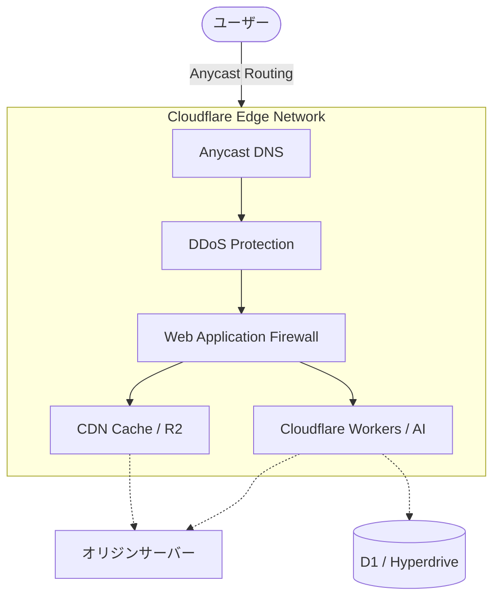

# **Cloudflare 調査レポート**

## **1. 基本情報**

* **ツール名**: Cloudflare
* **ツールの読み方**: クラウドフレア
* **開発元**: Cloudflare, Inc.
* **公式サイト**: [https://www.cloudflare.com/](https://www.cloudflare.com/)
* **関連リンク**:
  * ドキュメント: [https://developers.cloudflare.com/](https://developers.cloudflare.com/)
* **カテゴリ**: CDN/セキュリティ
* **概要**: Cloudflareは、Webサイトやアプリケーションのパフォーマンス向上、セキュリティ強化、信頼性向上を実現するための統合型グローバルクラウドネットワークサービスです。CDN、WAF、DDoS防御、サーバーレスコンピューティングなどの機能を包括的に提供します。

## **2. 目的と主な利用シーン**

* **解決する課題**:
  * Webサイトの表示速度の低下や高負荷時のサーバーダウン
  * DDoS攻撃やSQLインジェクションなどのサイバー攻撃からの保護
  * 社内システムへの安全なリモートアクセス（VPNの代替）
* **想定利用者**:
  * WebサイトやWebアプリケーションを運営するすべての個人・企業
  * ECサイト事業者、メディア・コンテンツ配信事業者
  * 企業のIT・セキュリティ担当者、開発者
* **利用シーン**:
  * **高速なコンテンツ配信**: グローバルCDNを利用して世界中のユーザーに低遅延でコンテンツを届ける。
  * **サイト保護**: 大規模なDDoS攻撃や悪意のあるボットからWebサイトを守る。
  * **エッジコンピューティング**: Cloudflare Workersを利用して、サーバーを管理せずにアプリケーションロジックをエッジで実行する。
  * **Zero Trustアクセス**: Cloudflare Zero Trustにより、社内リソースへのアクセスをIDベースで制御する。

## **3. 主要機能**

* **CDN (Content Delivery Network)**: 世界330都市以上に展開するエッジネットワークでコンテンツをキャッシュし、配信を高速化。
* **WAF (Web Application Firewall)**: OWASP Top 10などの脅威からアプリケーションを保護。マネージドルールセットで容易に導入可能。
* **DDoS防御**: L3/L4/L7のあらゆるレイヤーでのDDoS攻撃を自動検知・緩和。容量無制限の保護を提供。
* **Cloudflare Workers**: 高速な起動時間を持つサーバーレス実行環境。JavaScript, Rust, Pythonなどで記述可能。
* **Cloudflare R2**: エグレス料金（データ転送料）が無料のS3互換オブジェクトストレージ。
* **Cloudflare Access (Zero Trust)**: VPN不要で社内アプリやSaaSへのセキュアなアクセスを提供。
* **Browser Run**: ブラウザセッションを記録し、ログやネットワークリクエスト、DOMのインスペクトが可能。
* **Workers AI**: Cloudflareのグローバルネットワーク上でサーバーレスにAIモデル（Llama, Stable Diffusion等）を実行・推論。

## **4. 動作原理・システム構成**

* **アーキテクチャ**: グローバルに分散したエッジネットワーク（クラウド完結型SaaS）
* **主要コンポーネントとデータフロー**:
  * ユーザーのアクセスは最寄りのCloudflareエッジサーバーにルーティングされる（Anycast DNSを使用）。
  * エッジサーバー内で、DDoS保護、WAF、CDNキャッシュの処理が実行される。
  * Cloudflare Workersがエッジで実行され、データベース(HyperdriveやD1など)や外部APIと通信し、動的コンテンツを生成する。
* **特筆すべき要素技術**:
  * **V8 Isolates**: Workersの実行環境として使用され、コールドスタートゼロの高速なサーバーレス実行を実現。
  * **Anycast**: 世界中のデータセンターで同じIPアドレスを共有し、最寄りのサーバーへの高速ルーティングを提供。

## **5. 開始手順・セットアップ**

* **前提条件**:
  * ドメインを所有していること
  * アカウント作成（メールアドレス）
* **インストール/導入**:
  1. 公式サイトからアカウントを作成。
  2. 対象のドメインを入力し、スキャンを実行。
  3. Cloudflareが提示するネームサーバー（例: `bob.ns.cloudflare.com`）に、ドメイン登録業者の設定を変更。
* **初期設定**:
  * SSL/TLS設定（通常は「Full」または「Full (Strict)」を推奨）。
  * DNSレコードの確認とプロキシ設定（オレンジ色の雲アイコン）の有効化。
* **クイックスタート**:
  * ネームサーバー変更が反映されれば、自動的にCDNとDDoS防御が有効になる。
  * Workersを利用する場合は `npm create cloudflare@latest` でプロジェクトを作成可能。

## **6. 特徴・強み (Pros)**

* **圧倒的な無料プラン**: 個人や小規模プロジェクトであれば、CDN、DDoS防御、SSL、Workers（制限あり）などが永年無料で利用可能。
* **統合プラットフォーム**: セキュリティ、パフォーマンス、開発基盤が一つにまとまっており、管理コストを大幅に削減できる。
* **エッジでのイノベーション**: WorkersやR2など、エッジコンピューティング分野での機能拡張が著しく、AWSなどと比較しても先進的な機能が多い。
* **R2のエグレス料金無料**: クラウドストレージの大きなコスト要因であるデータ転送料が無料であり、コスト削減効果が高い。

## **7. 弱み・注意点 (Cons)**

* **設定の複雑化**: 機能追加のペースが速く、管理画面の項目が膨大になっているため、目的の設定を見つけるのが難しい場合がある。
* **障害時の影響範囲**: DNSとCDNを握っているため、Cloudflareに障害が起きるとWebサイト全体が閲覧不可になるリスクがある（2025年の障害など）。
* **日本語情報の遅れ**: UIは日本語化されているが、最新機能のドキュメントやブログは英語が先行することが多い。

## **8. 料金プラン**

| プラン名 | 料金 | 主な特徴 |
|---------|------|---------|
| **Free** | 無料 | 個人・趣味向け。DDoS防御、CDN、SSL、Workers (10万リクエスト/日)。 |
| **Pro** | $20/月 | プロフェッショナル向け。WAF、画像最適化、キャッシュ分析の強化。 |
| **Business** | $200/月 | 中小企業向け。100% SLA、24時間チャットサポート、カスタムWAFルール。 |
| **Enterprise** | 要問い合わせ | 大規模組織向け。高度なセキュリティ、専任サポート、ログ保持期間延長。 |

* **課金体系**: プランはドメインごとの月額固定。Workers, R2, Imagesなどは使用量に応じた従量課金。
* **無料トライアル**: Enterpriseプラン以外はトライアルなし（Freeプランで十分試用可能）。

## **9. 導入実績・事例**

* **導入企業**: Discord, Shopify, Garmin, L'Oréal, 日本政府（デジタル庁など）
* **導入事例**:
  * **Discord**: WebSocket通信の安定化とDDoS対策にCloudflareを利用。
  * **Shopify**: すべての加盟店ストアのトラフィックをCloudflare経由で配信し、高速化と保護を実現。
* **対象業界**: Eコマース、SaaS、メディア、金融、公共機関など全業界。

## **10. サポート体制**

* **ドキュメント**: [Cloudflare Developers](https://developers.cloudflare.com/) に網羅的な技術ドキュメントがある。
* **コミュニティ**: ユーザーフォーラムやDiscordサーバーが活発。
* **公式サポート**:
  * Free: コミュニティのみ。
  * Pro: メールサポート（応答数日）。
  * Business: チャットサポート（24/365）。
  * Enterprise: 電話・メール・チャット優先対応。

## **11. エコシステムと連携**

### **11.1 API・外部サービス連携**

* **API**: ほぼすべての機能を操作可能なREST APIを提供。Terraform Providerも公式サポートされており、IaCが可能。
* **外部サービス連携**:
  * **Terraform**: インフラのコード管理。
  * **Kubernetes**: Ingress Controllerとしての連携。
  * **Datadog / Splunk**: ログの転送と分析（Enterpriseプラン等）。
  * **CMS**: WordPressプラグインなどが公式提供されている。

### **11.2 技術スタックとの相性**

| 技術スタック | 相性 | メリット・推奨理由 | 懸念点・注意点 |
|:---|:---:|:---|:---|
| **Next.js (Vercel)** | ◯ | Next.jsアプリの前段に配置してセキュリティ強化が可能。 | VercelもCloudflareを利用しているため、二重設定（Double Cloudflare）に注意が必要。 |
| **Static Site** | ◎ | Pages機能で静的サイトを無料で高速ホスティング可能。 | 特になし。GitHub連携で自動デプロイ。 |
| **Python / Node.js** | ◎ | Workersで一部ロジックをエッジ処理し、オリジン負荷を軽減。 | WorkersのランタイムはNode.js完全互換ではないため、一部ライブラリは動かない。 |
| **AWS (S3)** | ◎ | R2をキャッシュや代替として使うことでコスト削減。 | S3独自の機能（Glacierなど）はR2にはない。 |

## **12. セキュリティとコンプライアンス**

* **認証**: ダッシュボードへの2要素認証(2FA)、SSO(Enterprise)。Access機能によるアプリへの認証統合。
* **データ管理**: Data Localization Suiteにより、データの保存・処理地域を制御可能（GDPR対応等）。
* **準拠規格**: PCI DSS Level 1, SOC 2 Type II, ISO 27001, GDPR, FedRAMP Moderateなど多数取得。

## **13. 操作性 (UI/UX) と学習コスト**

* **UI/UX**: モダンで洗練されたダッシュボードだが、機能が多岐にわたるため、深い階層にある設定を探すのに慣れが必要。
* **学習コスト**: 基本的なCDN/DNS設定は非常に簡単。WorkersやZero Trustなどの高度な機能は、ネットワークやプログラミングの知識が必要となり学習コストはやや高い。

## **14. ベストプラクティス**

* **効果的な活用法 (Modern Practices)**:
  * **IaC化**: Terraformを使用して設定をコード管理し、変更履歴を追跡可能にする。
  * **Cache Rulesの活用**: ページルールだけでなく、より柔軟なCache Rulesを使ってキャッシュ率を最大化する。
  * **R2へのオフロード**: 静的アセットをR2に配置し、エグレス料金をゼロにする。
* **陥りやすい罠 (Antipatterns)**:
  * **DNSのみ利用**: プロキシ（オレンジ雲）を有効にしないと、CDNやセキュリティ機能が働かない。
  * **WAFの過剰設定**: ルールを厳しくしすぎて正規ユーザーをブロックしてしまう（ログを確認しながら調整が必要）。

## **15. ユーザーの声（レビュー分析）**

* **調査対象**: G2, Capterra, X (Twitter)
* **総合評価**: 4.7/5.0 (G2による引用)
* **ポジティブな評価**:
  * 「無料プランの太っ腹さは異常。個人開発者の救世主。」（SNS等のレビューより要約）
  * 「DDoS攻撃が来た際も、ボタン一つ（Under Attack Mode）で防御でき、サイトが落ちなかった。」（ユーザーレビューより要約）
  * 「Workersのデプロイが一瞬で終わり、体験が良い。」（ユーザーレビューより要約）
* **ネガティブな評価 / 改善要望**:
  * 「サポートからの返信が遅い（特に下位プラン）。」（ユーザーレビューより要約）
  * 「機能が多すぎて使いこなせていない気がする。」（ユーザーレビューより要約）
  * 「Enterpriseプランの価格が非公開で、見積もりが取りにくい。」（ユーザーレビューより要約）
* **特徴的なユースケース**:
  * 海外からのアクセスが多いサイトで、Cloudflare導入により表示速度が数秒改善した事例。

## **16. 直近半年のアップデート情報**

* **2026-09-18**: Browser Run Session Recordingsにてログ、ネットワークリクエスト、DOMのインスペクト機能が追加
* **2026-09-18**: Cloudflare WANおよびMagic TransitにてUnified Routingの一般提供（GA）を開始
* **2026-09-17**: Workers AIにて同期推論リクエスト時の rejectIfBusy オプションを追加
* **2026-09-17**: Workersのトレース機能にJavaScript RPCセッションスパンを自動で含める機能を追加
* **2026-09-16**: Python WorkersからHyperdriveを経由したPostgreSQL/MySQLへの接続をサポート
* **2026-09-15**: Workflowsインスタンスイベントのストリーミングサブスクライブ機能を追加

(出典: [Cloudflare Release Notes](https://developers.cloudflare.com/release-notes/))

## **17. 類似ツールとの比較**

### **17.1 機能比較表 (星取表)**

| 機能カテゴリ | 機能項目 | Cloudflare | Vercel | Google Cloud |
|:---:|:---|:---:|:---:|:---:|
| **配信性能** | CDN/キャッシュ | ◎ <small>グローバル規模・強力</small> | ◎ <small>Fluid Compute等</small> | ◯ <small>Cloud CDN</small> |
| **セキュリティ** | WAF/DDoS | ◎ <small>強力・低価格</small> | △ <small>基本機能</small> | ◎ <small>Cloud Armor等</small> |
| **開発機能** | エッジ/AI処理 | ◎ <small>Workers/Workers AI</small> | ◎ <small>AI SDK, v0等</small> | ◎ <small>Gemini 3.5/Vertex AI</small> |
| **コスト** | 無料プラン/安さ | ◎ <small>圧倒的(転送量無料等)</small> | ◯ <small>無料枠あり</small> | △ <small>基本従量課金</small> |
| **環境** | コンテナ/K8s | × <small>非対応</small> | × <small>SaaSのみ</small> | ◎ <small>GKE (本家)</small> |

### **17.2 詳細比較**

| ツール名 | 特徴 | 強み | 弱み | 選択肢となるケース |
|---------|------|------|------|------------------|
| **Cloudflare** | 統合型エッジプラットフォーム | 無料プランが強力、エグレス料金無料(R2)、Workersによる高速なエッジ処理。 | 機能が膨大で設定画面が複雑になる場合がある。 | コストを抑えつつ高機能なCDN/WAFが欲しい場合。Workersを活用したい場合。 |
| **Vercel** | Next.js特化のFrontend Cloud | 圧倒的なDX、Next.js最適化、AI機能の統合（AI SDK/Gateway等）。 | バックエンドやインフラの完全なコントロールは難しい。 | Next.js採用時、開発スピードとフロントエンドのDXを最優先する場合。 |
| **Google Cloud** | データとAIに特化したクラウド | GKEによるコンテナ運用、BigQueryやVertex AIなどデータ/AI基盤が強力。 | インフラ管理の学習コストが高く、従量課金でコストが変動しやすい。 | 大規模なデータ分析やAIモデルの直接活用、複雑なコンテナ基盤が必要な場合。 |

## **18. 総評**

* **総合的な評価**:
  Cloudflareは、パフォーマンス、セキュリティ、開発者体験のバランスが最も優れたエッジプラットフォームです。特に「無料または低コストで始められ、必要に応じてスケールできる」点が他社を圧倒しています。WorkersやR2などの革新的な機能により、単なるCDNを超えた「アプリケーションプラットフォーム」へと進化しており、モダンなWeb開発において第一に検討すべきツールです。
* **推奨されるチームやプロジェクト**:
  * コストをかけずにセキュリティ対策と高速化を行いたいスタートアップや個人開発者。
  * グローバルに展開するSaaSやECサイト。
  * サーバーレスアーキテクチャ（Workers）を活用してインフラ運用を減らしたいチーム。
* **選択時のポイント**:
  * AWS利用者の場合、CloudFrontの手軽さとCloudflareの機能・コストメリット（特に転送量）を比較する必要があります。多くの場合、Cloudflareの方が安価で高機能ですが、アーキテクチャの複雑さは増す可能性があります。
