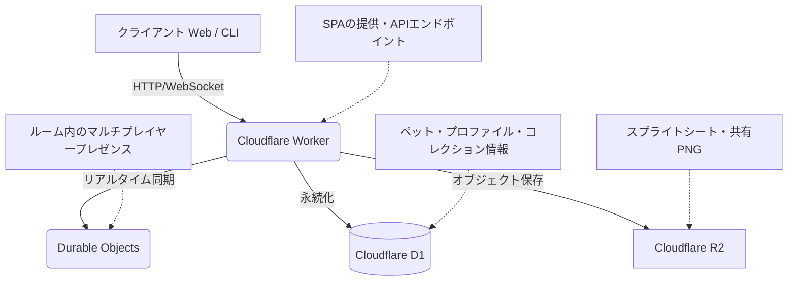

# **Codex Pet Share 調査レポート**

## **1. 基本情報**

* **ツール名**: Codex Pet Share
* **ツールの読み方**: コーデックス ペット シェア
* **開発元**: portons
* **公式サイト**: [https://codex-pets.net/](https://codex-pets.net/)
* **関連リンク**:
  * GitHub: [https://github.com/portons/codex-pet-share](https://github.com/portons/codex-pet-share)
  * CodeWiki: [https://codewiki.google/github.com/portons/codex-pet-share](https://codewiki.google/github.com/portons/codex-pet-share)
* **カテゴリ**: 開発ツール
* **概要**: Codex Pet Shareは、アニメーション付きのピクセルペットを共有するためのセルフホスト可能なWebアプリケーションです。スプライトシートのアップロード、コミュニティギャラリーの閲覧、マルチプレイヤーのプレイルーム機能、そして1行のCLIコマンドでペットをターミナルに直接プルする機能を提供します。

## **2. 目的と主な利用シーン**

* **解決する課題**: Codexユーザーがカスタムのピクセルペットを簡単に見つけ、共有し、自身の環境にインストールするためのプラットフォームの提供。
* **想定利用者**: 開発者、Codexユーザー、ピクセルアーティスト、コミュニティ運営者
* **利用シーン**:
  * 作成したカスタムのCodex Petをコミュニティに公開・共有する
  * 他のユーザーが作成した魅力的なペットを探し、CLIを使って自身のCodex環境にインストールする
  * マルチプレイヤーのプレイルームでペットのアニメーションや動作をテスト・鑑賞する

## **3. 主要機能**

* **ペットパッケージのアップロードと共有**: v1およびv2形式のペットパッケージ（`pet.json`と`spritesheet.webp`）をアップロードし、ギャラリーで公開。
* **コミュニティギャラリー**: ユーザーが投稿したペットを一覧表示、閲覧。
* **CLI連携**: `npx` コマンドを使用して、ギャラリーから直接ターミナルやローカル環境にペットをダウンロード・インストール。
* **マルチプレイヤープレイルーム**: 共有されたペットをインタラクティブなプレイルームに配置し、他のユーザーと同時に動作を確認可能。
* **セルフホスティング対応**: オープンソースとして提供され、独自のコミュニティ向けに独立したインスタンスを立ち上げ可能。

## **4. 動作原理・システム構成**

* **アーキテクチャ**: クラウドネイティブなサーバーレス・エッジコンピューティング構成（Cloudflare推奨）を採用したクライアント・サーバー型。
* **主要コンポーネントとデータフロー**:
  * フロントエンドは静的SPAとしてホスティングされ、バックエンドAPI（Cloudflare Worker）と通信する。
  * データ（ペット、プロフィール、いいね、コレクション、ルーム）はデータベース（Cloudflare D1）に保存される。
  * ペットパッケージやレンダリングされた共有画像（PNG）はオブジェクトストレージ（Cloudflare R2）に保存される。
  * リアルタイムのプレゼンスやルームチャネルのブロードキャストは、ステートフルなエッジコンポーネント（Cloudflare Durable Objects）によって管理される。
* **特筆すべき要素技術**:
  * 依存関係を抽象化するプロバイダーアダプターパターンを採用しており、標準ではCloudflareスタック用のアダプターが同梱されている。



## **5. 開始手順・セットアップ**

* **前提条件**:
  * Node.js 20以上、npm
  * 静的ホスティング環境（`dist/`用）
  * （同梱アダプターを使用する場合）Cloudflareアカウント（Workers, D1, R2, Durable Objects）
* **インストール/導入**:

  ```bash
  # リポジトリのクローンと依存関係のインストール
  git clone https://github.com/your-org/your-pet-share.git
  cd your-pet-share
  npm install
  ```

* **初期設定**:
  * `.env.example`を`.env.local`にコピーし、必要な環境変数（APIキーやデータベースURL等）を設定。
* **クイックスタート**:
  * `npm run dev`でローカル開発サーバーを起動し、フロントエンドとAPIをテスト。
  * プロダクション環境へは`npm run build`でビルドし、Cloudflare等へデプロイ。

## **6. 特徴・強み (Pros)**

* **開発者体験（DX）に優れたCLI連携**: WebUIだけでなく、`npx`コマンド一つで目的のペットをダウンロードできるため、Codexユーザーにとって非常に導入がスムーズ。
* **最新のサーバーレス/エッジ技術スタック**: Cloudflareの各種サービス（Workers, D1, R2, DO）を活用したモダンでスケーラブルな構成。
* **カスタマイズ容易性**: ブランド文字列などが環境変数でパラメータ化されており、ソースコードを変更せずに容易に独自のペット共有サイトとしてリブランド可能。

## **7. 弱み・注意点 (Cons)**

* **セルフホスティングのハードル**: 提供されているデモURLや共有インスタンスはなく、利用するには自身でCloudflare等のバックエンド環境を構築・運用する必要がある。
* **ローカルストレージの利用**: 現状（v1）ではセッションJWTの保存にブラウザのlocalStorageを使用しており、HttpOnly Cookieへの移行が今後の課題とされている。
* **プロバイダーの依存**: 標準アダプターはCloudflareに強く依存しているため、他のプロバイダーを利用する場合はアダプターの実装が必要。

## **8. 料金プラン**

| プラン名 | 料金 | 主な特徴 |
|---------|------|---------|
| **オープンソース (MIT)** | 無料 | ソースコードは無料で提供される。セルフホストに伴うインフラ費用（Cloudflare等）は別途発生。 |

* **課金体系**: クラウドプロバイダーの従量課金等に依存
* **無料トライアル**: 該当なし

## **9. 導入実績・事例**

* **導入企業**: 公開事例なし。主に個人の開発者やコミュニティによってセルフホストされる。
* **導入事例**: https://codex-pets.net/ が公式または代表的なインスタンスとして稼働している。
* **対象業界**: ソフトウェア開発、オープンソースコミュニティ

## **10. サポート体制**

* **ドキュメント**: GitHubリポジトリ内の`README.md`や`docs/`ディレクトリに、セットアップ、リブランド、アダプター実装に関するドキュメントが存在。
* **コミュニティ**: GitHub IssuesやPull Requestsを通じたオープンソースコミュニティ。
* **公式サポート**: オープンソースソフトウェアのため、エンタープライズ向けの公式サポートは提供されていない。

## **11. エコシステムと連携**

### **11.1 API・外部サービス連携**

* **API**: HTTP `/api/*` コントラクトとしてバックエンドAPIが定義されており、フロントエンドと連携。
* **外部サービス連携**: OGPやTwitter Cardなどのソーシャルシェアに標準で対応。

### **11.2 技術スタックとの相性**

| 技術スタック | 相性 | メリット・推奨理由 | 懸念点・注意点 |
|:---|:---:|:---|:---|
| **Cloudflare (Workers, D1, R2, DO)** | ◎ | 公式にアダプターが同梱されており、即座にデプロイ可能 | 特定のベンダーロックインの可能性 |
| **Node.js** | ◯ | 開発環境として標準サポート | プロダクション稼働には適切なプロバイダーが必要 |

## **12. セキュリティとコンプライアンス**

* **認証**: JWTベースのセッション管理（現状はlocalStorageに保存）
* **データ管理**: IPアドレスやUser Agentからハッシュ（`PET_STATS_SALT`を使用）を生成し、匿名ユーザーの閲覧数・ダウンロード数を1日単位で重複排除しプライバシーに配慮。
* **準拠規格**: 公式サイトでは公開されていない。個別の問い合わせが必要。

## **13. 操作性 (UI/UX) と学習コスト**

* **UI/UX**: シンプルなCSS変数とReactの関数コンポーネントのみで構築された、直感的でレスポンシブなUI。グローバルな状態管理ライブラリや重いデザインシステムフレームワークを使用せず、軽量で高速。
* **学習コスト**: Webアプリケーションの利用者としての学習コストは非常に低い。セルフホストする場合、Cloudflareの各サービス（Workers, D1, DO等）に関する知識が必要。

## **14. ベストプラクティス**

* **効果的な活用法 (Modern Practices)**:
  * 環境変数（`VITE_APP_NAME`等）を利用して、コードを変更せずに自身のコミュニティ向けにリブランドして展開する。
  * `npm run build:social-card`などの運用スクリプトを利用してOGP画像を最新化する。
* **陥りやすい罠 (Antipatterns)**:
  * `PET_STATS_SALT`や各種シークレットキー（`AUTH_SECRET`等）をコミットしたり公開したりする設定ミス（ビルド時の検証スクリプトで一部防がれる）。
  * 認証・管理APIのエンドポイントに対するレートリミット設定を怠ること（DoS攻撃のリスク）。

## **15. ユーザーの声（レビュー分析）**

* **調査対象**: GitHub リポジトリ (Stars, Forks)
* **総合評価**: GitHub Stars 114, Forks 10 (2026-08-17時点)
* **ポジティブな評価**:
  * 「Codex Petを共有するためのシンプルで効果的なソリューション。」
  * 「Cloudflareを利用したモダンなスタックで、エッジでのリアルタイムプレイルームが構築できる点が面白い。」
* **ネガティブな評価 / 改善要望**:
  * 「localStorageの利用など、セキュリティ面での改善（HttpOnly Cookie化）がIssueで議論されている。」
* **特徴的なユースケース**:
  * 特定のテーマやキャラクターに特化した、独自のピクセルペットコミュニティの立ち上げ。

## **16. 直近半年のアップデート情報**

* **2026-05**: OpenAI Codex Petsがリリースされ、これに対応する形でプロジェクトが開始・公開された。v1およびv2のペットパッケージ形式のサポート、マルチプレイヤープレイルームの実装が行われている。

(出典: [GitHub リポジトリ コミット履歴](https://github.com/portons/codex-pet-share/commits/master) )

## **17. 類似ツールとの比較**

### **17.1 機能比較表 (星取表)**

| 機能カテゴリ | 機能項目 | 本ツール | hatch-pet (OpenAI) | codex-pet (RunComfy) |
|:---:|:---|:---:|:---:|:---:|
| **基本機能** | ペット生成 | ×<br><small>共有・ホスティング特化</small> | ◎<br><small>$imagegenを使用</small> | ◎<br><small>GPT Image 2を使用</small> |
| **カテゴリ特定** | ギャラリー共有 | ◎<br><small>コミュニティ機能完備</small> | ×<br><small>生成ツールのみ</small> | ×<br><small>生成ツールのみ</small> |
| **カテゴリ特定** | CLIインストール | ◎<br><small>npxで直接取得</small> | ◯<br><small>生成後に配置</small> | ◯<br><small>生成後に配置</small> |
| **非機能要件** | セルフホスト | ◎<br><small>Cloudflare等で構築可能</small> | ◯<br><small>ローカル実行</small> | ◯<br><small>ローカル実行</small> |

### **17.2 詳細比較**

| ツール名 | 特徴 | 強み | 弱み | 選択肢となるケース |
|---------|------|------|------|------------------|
| **本ツール** | ペットの共有プラットフォーム | ギャラリー機能、プレイルーム、CLIからの直接ダウンロード | ペット自体の生成機能はない | 作成されたペットを広くコミュニティに公開・共有したい場合 |
| **hatch-pet (OpenAI)** | 公式のペット生成ツール | Codex内部の`$imagegen`を利用した高品質な生成 | Codex Pro環境が必須 | Codex Pro環境があり、公式ツールでペットを生成したい場合 |
| **codex-pet (RunComfy)** | RunComfyベースの生成ツール | Codex Pro不要、1枚の画像から生成 | RunComfyのAPI利用が必要 | Codex Proはないが、カスタムのペット画像を生成したい場合 |

## **18. 総評**

* **総合的な評価**:
  Codex Pet Shareは、Codex向けに作られたピクセルペットをコミュニティで共有・発見するための非常に優れたオープンソースプラットフォームです。Cloudflareのモダンなサーバーレススタックをベースに構築されており、マルチプレイヤーのプレイルーム機能や、開発者に嬉しいCLIからの直接インストール機能など、単なるアップローダーに留まらないリッチな体験を提供しています。
* **推奨されるチームやプロジェクト**:
  独自のピクセルアートコミュニティや、特定のテーマに沿ったCodex Petを集めるプラットフォームを立ち上げたい個人開発者やコミュニティオーガナイザー。
* **選択時のポイント**:
  本ツールは「ペットを生成するツール」ではなく「生成されたペットを共有するプラットフォーム」です。そのため、ペット自体の生成にはhatch-petやRunComfyのスキルを使用し、その成果物を公開・配布する場として本ツールをホスティングして活用するという使い分けが重要になります。
