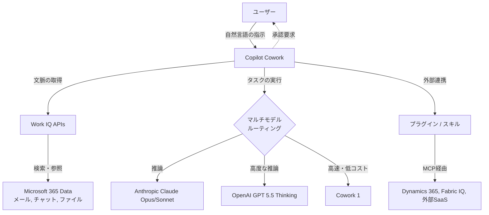

# **Copilot Cowork 調査レポート**

## **1. 基本情報**

<!--
【ガイドライン】
- 必須: ツール名、開発元、公式サイト、カテゴリ、概要
- 概要は2-3文で簡潔に記述
-->

* **ツール名**: Copilot Cowork
* **ツールの読み方**: コパイロット コワーク
* **開発元**: Microsoft
* **公式サイト**: [https://adoption.microsoft.com/en-us/copilot/frontier-program/](https://adoption.microsoft.com/en-us/copilot/frontier-program/)
* **関連リンク**:
  * ニュース・ドキュメント: [Microsoft 365 Blog](https://www.microsoft.com/en-us/microsoft-365/blog/tag/copilot-cowork/)
* **カテゴリ**: 自律型AIエージェント
* **概要**: Copilot Coworkは、単に質問に答えたり文章を生成したりするだけでなく、ユーザーの意図を具体的な「アクション」に変換し、バックグラウンドで自律的にタスクを完了させるMicrosoft 365向けのエージェントです。マルチモデルのアプローチを採用し、Outlook、Teams、Excelなどのデータを横断して活用しながら、承認プロセスを経て安全に業務を代行します。

## **2. 目的と主な利用シーン**

<!--
【ガイドライン】
- 3-5項目を箇条書きで記述
- 想定利用者を具体的に記載
-->

* **解決する課題**: 複数のツールにまたがる煩雑な情報収集、資料作成、スケジュールの調整など、時間のかかる非コーディングタスクの自動化。
* **想定利用者**: ナレッジワーカー、マネージャー、プロジェクトリーダー、営業担当など、複数のタスクを並行して管理するビジネスプロフェッショナル。
* **利用シーン**:
  * **カレンダーの整理**: Outlookのスケジュールを確認し、優先度の低い会議をリスケジュールしたり、フォーカス時間を自動で確保する。
  * **会議パケットの作成**: メディア、メール、ファイルから関連情報を引き出し、会議のブリーフィングドキュメントやプレゼン資料（デッキ）を自動生成する。
  * **迅速な企業リサーチ**: Webソースや社内データ（SECファイリング、アナリストレポートなど）を収集し、引用付きのエグゼクティブサマリーとExcelの分析シートを作成する。
  * **ローンチ計画の作成**: 競合比較表をExcelで作成し、バリュープロポジション文書、顧客向けピッチ資料などをまとめて生成・共有する。

## **3. 主要機能**

<!--
【ガイドライン】
- 5-10項目の主要機能を箇条書きで記述
- 各機能は1-2文で概要を説明
-->

* **自律的なタスク実行 (Plan-to-Action)**: 要求を受け取ると、それを実行可能な計画（プラン）に落とし込み、バックグラウンドで自律的に進行します。
* **安全な承認プロセス**: タスクの実行中にチェックポイントを設け、ユーザーが進行状況を確認したり、変更を承認（または修正・一時停止）できる機能。
* **Microsoft 365アプリ連携**: Outlook、Teams、Excel、Wordなどの各種アプリ間をまたいでアクションを実行します。
* **Work IQ統合**: 組織内のコミュニケーションやファイルのシグナルを引き出し、ユーザーと同じレベルの「文脈理解」を持ってタスクを実行します。
* **マルチモデルアプローチ**: 特定のブランドのモデルに限定されず、業界の最新のイノベーションを取り入れ、タスクに最適なAIモデル（Anthropic Claude Opus、OpenAI GPT 5.5など）を選択して利用するアプローチを採用しています。
* **カスタムスキルとプラグイン**: ユーザー独自のワークフローを「スキル」として登録したり、サードパーティ製ツール（Miro, monday.com等）やDynamics 365と連携する「プラグイン」を追加できます。
* **ブラウザ自動化**: Edgeブラウザを介して、社内ポータルやSaaSツールの操作をCoworkに委譲できます（ローカル実行のためPCの起動が必要）。

## **4. 動作原理・システム構成**

<!--
【ガイドライン】
- ツールの動作原理、システム構成（アーキテクチャ）、データの流れ、通信フローなどを記述
- クライアント・サーバー型、ローカルファースト、クラウド完結など、ツールのアーキテクチャ特性を明記
- 可能であればMermaidによる構成図やフロー図を含めること（Mermaid内のノードや説明テキストは原則日本語表記で作成する）
- 要素技術や内部で使われている仕組み（例：Docker、Git worktree、WebSockets、E2EEなど）を解説
- SaaS等の場合はわかる範囲で記述し、公開されていない場合は「非公開」とし、分かる範囲の処理フロー等を記載
-->

* **アーキテクチャ**: クラウド完結型のSaaSアーキテクチャ（ブラウザ自動化機能など一部はローカルEdgeブラウザに依存）。Microsoft 365のサンドボックス環境内でタスクがバックグラウンド実行されます。
* **主要コンポーネントとデータフロー**:
  * **Work IQ**: ユーザーのメール、チャット、ファイル、組織図などからセマンティックインデックスを構築し、エージェントに「文脈」を提供します。
  * **マルチモデルルーティング**: タスクの特性（速度、深さ、推論能力など）に応じて、Anthropic Claude、OpenAI GPT、自社製小型モデル（Cowork 1）などを自動的（Autoモード）または手動で選択して実行します。
* **特筆すべき要素技術**:
  * **Model Context Protocol (MCP)**: プラグインやスキルはMCPを通じてプログレッシブに情報開示され、外部サービス（Dynamics 365, LSEG, Miroなど）と安全に接続します。

## **5. 開始手順・セットアップ**

<!--
【ガイドライン】
- アカウント作成から「Hello World」的な最初の動作確認までの手順
- 主要なコマンドや設定項目を記載
-->

* **前提条件**:
  * Microsoft 365 Copilot ライセンス（USL）の保有。
  * 管理者によるCowork機能の有効化と予算（Copilot Credits）の割り当て。
* **導入手順**:
  1. Microsoft 365 Copilotアプリを開き、「Cowork」モードのトグルをオンにする。
  2. 必要に応じて、Customizeタブからプラグイン（Dynamics 365など）やカスタムスキルを有効化する。
* **クイックスタート**:
  * Coworkに対して「来週のカレンダーを整理して、フォーカス時間を確保する計画を提案して」と自然言語で指示を出す。
  * 提示されたリスケジュールとフォーカス時間の設定プランを確認し、「承認」をクリックしてバックグラウンドで実行させる。

## **6. 特徴・強み (Pros)**

<!--
【ガイドライン】
- 3-5項目を箇条書きで記述
- 競合との差別化ポイントを明確に
-->

* **ユーザー主導のコントロール**: 完全な自動化ではなく、重要な変更が行われる前には必ずユーザーの承認を求めるため、意図しない破壊的な操作を防げます。
* **エンタープライズ対応のセキュリティ**: 隔離されたサンドボックス環境のクラウドで実行され、Microsoft 365のID、権限、コンプライアンスポリシーがデフォルトで適用されます。
* **エコシステム内での完結と拡張性**: 普段利用しているMicrosoft 365のデータ内で動作するだけでなく、プラグインを通じてDynamics 365やMiroなどの外部SaaSへシームレスに拡張できます。
* **マルチモデルの優位性**: 特定のモデルに制限されず、AnthropicやOpenAIなどの最新モデルの中から作業に最適なものを選択（または自動ルーティング）できる強みを持っています。

## **7. 弱み・注意点 (Cons)**

<!--
【ガイドライン】
- 3-5項目を箇条書きで記述
- 日本語対応の状況は必ず含める
-->

* **利用コストの管理**: 基本的なCopilotライセンスに加えて、タスクの複雑さ（Light, Medium, Heavy）に応じた従量課金（Copilot Credits）が発生するため、管理者による予算設定やモニタリングが必須です。
* **Microsoft 365依存**: Google Workspaceなど、他のエコシステムをメインで利用している企業では真価を発揮しにくいです。
* **ブラウザ自動化の制約**: Edgeブラウザを利用した自動化タスクはローカルで実行されるため、タスク完了までPCを起動したままにする必要があります。
* **日本語対応の状況**: 基本的なUIや処理は多言語対応（日本語含む）していますが、プレビューからGAへの移行期において、高度な推論や特定のプラグインでの日本語対応精度は英語に比べて劣る可能性があります。

## **8. 料金プラン**

<!--
【ガイドライン】
- 表形式で整理することを推奨
- 最新の料金情報であることを確認
- 価格は通貨を明記（例: $10/月、¥1,000/月）
-->

| プラン名 | 料金 | 主な特徴 |
|---------|------|---------|
| **PayGo (従量課金)** | $0.01 / Copilot Credit | Microsoft 365 Copilot USLが別途必要。タスクの消費リソース（モデル利用、検索、ツール呼び出し、実行時間）に応じたクレジット消費。 |
| **P3 (事前コミット)** | 要問い合わせ | 事前に一定量のクレジット使用をコミットすることで、PayGoよりも割引が適用されるエンタープライズ向けプラン。 |

* **課金体系**: ユーザー単位で実行したタスクの複雑度（Light, Medium, Heavy）に基づきCopilot Creditsを消費します。
* **無料トライアル**: 一部のFrontier Program参加企業に対し、移行期間（2026年7月1日まで）の猶予が設けられています。

## **9. 導入実績・事例**

<!--
【ガイドライン】
- 具体的な企業名を3-5社挙げる
- 導入事例がない場合は「公開事例なし。ただし、〜の分野での利用が報告されている」等
-->

* **導入企業**: Accenture, Avanade, Advance Local, Capital Group, Koch, LTM, Ooredoo Qatar, Zurich Insurance など、Fortune 500の半数以上がプレビュー期間中から利用。
* **導入事例**:
  * あるエンジニアリングチームは、バッチジョブのスプレッドシートを安全に編集し、変更後に依存関係フローチャートを生成する作業を自動化。
  * 営業リーダーは、停滞しているパイプラインをCoworkに分析させ、リスクのある案件リストとフォローアップ案を数時間で作成。
* **対象業界**: 情報通信、コンサルティング、金融、保険など、ドキュメントワークや会議が多いあらゆるエンタープライズ企業。

## **10. サポート体制**

<!--
【ガイドライン】
- ドキュメント、コミュニティ、公式サポートの3項目を必ず含める
- URLがあれば記載
-->

* **ドキュメント**: [Microsoft 365 Blog](https://www.microsoft.com/en-us/microsoft-365/blog/tag/copilot-cowork/) や Microsoft Learn にて、管理者向けおよびユーザー向けのガイドラインが提供されています。
* **コミュニティ**: Tech Community等のMicrosoft系フォーラムで情報が共有されます。
* **公式サポート**: Microsoft 365のエンタープライズサポートチャネルを通じて対応が行われます。

## **11. エコシステムと連携**

<!--
【ガイドライン】
- API、外部連携、技術スタックとの相性を包括的に記述
-->

### **11.1 API・外部サービス連携**

<!--
【ガイドライン】
- APIの有無と公開状況を明記
- 主要連携サービスを5-10個リストアップ
-->

* **API**: 2026年6月16日より「Work IQ APIs」が一般提供され、開発者はChat、Context、Tools、Workspacesの各ドメインにプログラムからアクセスし、独自エージェントにWork IQの文脈を組み込むことが可能です。
* **外部サービス連携**:
  * **Microsoft製品**: Microsoft 365全般、Dynamics 365 (Sales, Customer Service, ERP)、Fabric IQ (Power BI)
  * **サードパーティプラグイン**: LSEG, Miro, monday.com, S&P Global Energy, Enosix, Harvey など。

### **11.2 技術スタックとの相性**

<!--
【ガイドライン】
- 主要なフレームワークや言語との相性を表形式で整理
- 相性: ◎ (非常に良い), ◯ (良い), △ (工夫が必要/一部非対応), × (非推奨)
-->

| 技術スタック | 相性 | メリット・推奨理由 | 懸念点・注意点 |
|:---|:---:|:---|:---|
| **Microsoft 365 (Officeアプリ)** | ◎ | データへのアクセスや操作がネイティブに統合されており、シームレスに動作する。 | 特になし |
| **Microsoft Work IQ / Dynamics 365** | ◎ | 組織内の人間関係やコンテキスト、CRM/ERPデータをエージェントに提供し、より的確なタスク実行を可能にする。 | データの事前インデックス化やアクセス権設定が必要。 |
| **外部SaaS (プラグイン提供あり)** | ◯ | Miroやmonday.comなど公式プラグインがある場合は簡単に連携可能。 | 各種SaaS側のアカウントや権限設定が必要。 |
| **Google Workspace** | × | Microsoftの認証基盤とエコシステムに強く依存しているため、直接的な統合は難しい。 | Microsoft環境への移行が必要。 |

## **12. セキュリティとコンプライアンス**

<!--
【ガイドライン】
- 認証、データ管理、準拠規格の3項目を必ず調査
- 情報が見つからない場合は「公式サイトで公開されていない。問い合わせが必要。」と記載
- 「不明」「見つからず」のみの記載は避ける
-->

* **認証**: Microsoft Entra ID を用いた既存の認証・認可システムを利用。
* **データ管理**: 実行されるタスクは保護された「サンドボックス化されたクラウド環境」で処理されます。プロンプト、応答、生成物はMicrosoft 365のデータ管理境界内に留まり、監査ログ、DSPM、eDiscoveryなどで追跡・保護されます。
* **準拠規格**: Microsoft 365のエンタープライズグレードのコンプライアンス・セキュリティポリシーがデフォルトで適用され、機密ラベルの継承などもサポートされます。

## **13. 操作性 (UI/UX) と学習コスト**

<!--
【ガイドライン】
- 実際の使用感や、類似ツールとの比較を含める
-->

* **UI/UX**: Microsoft 365 Copilotアプリ内に「Cowork」のトグルスイッチが用意されており、通常のチャットから深いタスク実行モードへスムーズに移行できます。タスクの進行状況がバックグラウンドで管理され、チェックポイントでユーザーに確認（Approve）を求めるUIを採用しています。
* **学習コスト**: 自然言語でタスクを依頼できるため基本的な学習コストは低いですが、「どのような粒度で指示を出すと最も効率的に動くか」というエージェントへの委譲スキル（プロンプト・デリゲーション）を身につける必要があります。

## **14. ベストプラクティス**

<!--
【ガイドライン】
- ツールを効果的に活用するための推奨事項や、避けるべきアンチパターンを記述
- 公式ドキュメントのBest Practicesや、熟練エンジニアの知見を参考にする
-->

* **効果的な活用法 (Modern Practices)**:
  * **目標（Outcome）の明確化**: 「何をすべきか」という手順ではなく、「どのような結果が欲しいか」を具体的に伝えることで、Coworkが最適なプランを構築しやすくなります。
  * **カスタムスキルの登録**: メールのトーンや定型的な業務プロセスを「スキル」としてCoworkに学習させることで、チーム全体で高品質な結果を再現性高く得られます。
* **陥りやすい罠 (Antipatterns)**:
  * **過度なマイクロマネジメント**: 一つひとつの手順を細かく指示しすぎると、エージェントの自律的なプランニング能力を活かしきれません。
  * **コスト管理の軽視**: 従量課金であるため、管理者がユーザーやグループごとの予算設定（Spending limits）を行わずに放置すると、予期せぬコスト増につながる恐れがあります。

## **15. ユーザーの声（レビュー分析）**

<!--
【ガイドライン】
- 必須調査サイト: G2, Capterra, ITreview（日本語レビュー）のうち該当するもの
- 追加調査サイト: App Store, Google Play, X(Twitter), Reddit等
- 総合評価スコアがあれば必ず記載
- ポジティブ・ネガティブ各3項目以上
-->

* **調査対象**: 公式発表、SNS反応
* **総合評価**: G2やCapterraでのスコア登録はまだ限定的ですが、Frontier Programにおいて「最もユーザー満足度が高い機能の一つ」と報告されています。
* **ポジティブな評価**:
  * 「バッチ処理のエラーチェックや依存関係図の作成など、手作業の介入が必要だった部分を完全に自動化できた。」
  * 「マルチモデルの技術が採用されているのは強力。用途に応じてAnthropicやOpenAIのモデルを使い分けられるのが良い。」
  * 「セキュリティ境界が守られたサンドボックス環境で動くため、企業でも安心して自律型エージェントを試せる。」
* **ネガティブな評価 / 改善要望**:
  * 「ブラウザ自動化（Edge）の際に、タスクが終わるまでPCを起動し続けなければならないのは少し不便。」
  * 「エージェントがバックグラウンドで動く際のコンピューティングコストが従量課金のため、社内稟議や予算管理が煩雑になる。」
  * 「カスタムスキルを作成するためのUIがまだ直感的ではなく、非エンジニアにはハードルが高い部分がある。」
* **特徴的なユースケース**:
  * 財務マネージャーがCoworkに顧客の契約書をレビューさせ、Dynamics 365のERPデータやLSEGの市場データと照合し、リスクを分析した上で承認メールを自動作成する。

## **16. 直近半年のアップデート情報**

<!--
【ガイドライン】
- 日付の降順（新しいものが上）
- 3-10項目をリストアップ
- 各項目に日付と概要を含める
- **情報源の優先順位**:
  1. GitHubリポジトリの `CHANGELOG.md`
  2. GitHub Releases
  3. 公式ブログ / ニュース
- 情報源のURLを記載。
-->

* **2026-06-16**: **一般提供（GA）開始**: Copilot Coworkが全世界で一般提供開始。従量課金ベースの価格モデル（Copilot Credits）、管理者のコスト管理機能、さらにLSEGやMiroなどのサードパーティプラグインが追加されました。
* **2026-06-02**: **Work IQ APIs 発表**: 組織のデータと文脈をエージェントに提供するインテリジェンスレイヤー「Work IQ」のAPI群（Chat, Context, Tools, Workspaces）が発表されました。
* **2026-05-05**: **プラグインとスキルの機能拡張**: Anthropic Claude Opus 4.8 や OpenAI GPT 5.5 Thinking などモデルの選択肢が広がり、さらにカスタムスキルやEdgeを通じたブラウザ自動化機能がFrontier Programで利用可能になりました。
* **2026-03-09**: **Copilot Cowork 発表**: Microsoft 365ブログにて、自律的にタスクを完了させるエージェント機能として「Copilot Cowork」が発表されました。

(出典: [Microsoft 365 Blog](https://www.microsoft.com/en-us/microsoft-365/blog/tag/copilot-cowork/))

## **17. 類似ツールとの比較**

<!--
【ガイドライン】
- 3-5個の類似ツールと比較
- **機能比較表（星取表）**と**詳細比較**の2つの観点で記述する
-->

### **17.1 機能比較表 (星取表)**

<!--
【記載ルール】
- 縦軸に主要機能、横軸にツールを配置
- 記号の意味:
  - ◎: 非常に優れている / カタログスペック以上の機能 / 独自強み
  - ◯: 対応している / 標準的な機能
  - △: 一部対応 / 制限あり / アドオンが必要
  - ×: 非対応
  - -: 不明 / 該当なし
- 中立性を保つため、比較対象のツールが得意とする機能も平等にリストアップすること
-->

| 機能カテゴリ | 機能項目 | Copilot Cowork | Microsoft 365 Copilot (通常版) | GitHub Copilot |
|:---:|:---|:---:|:---:|:---:|
| **基本機能** | 自律的タスク実行 | ◎ <small>計画立案から実行まで</small> | △ <small>ユーザーの指示ごとに応答</small> | ◯ <small>コードエディタ内での支援</small> |
| **環境** | データアクセス | ◎ <small>M365 Graph / Work IQ</small> | ◎ <small>M365 Graph</small> | ◯ <small>ローカルコードとGitHub連携</small> |
| **拡張性** | カスタムエージェント | ◎ <small>プラグイン/カスタムスキル完備</small> | ◯ <small>Copilot Studio経由</small> | ◯ <small>Copilot Extensions</small> |
| **管理** | エンタープライズ保護 | ◎ <small>M365準拠、監査可能</small> | ◎ <small>M365準拠</small> | ◎ <small>エンタープライズ管理対応</small> |
| **コスト** | ライセンス料 | △ <small>Copilot USL + 従量課金</small> | △ <small>$30/ユーザー/月</small> | ◯ <small>月額固定</small> |

### **17.2 詳細比較**

<!--
【ガイドライン】
- 定性的な違いや、どのようなユーザーに向いているかを記述
-->

| ツール名 | 特徴 | 強み | 弱み | 選択肢となるケース |
|---------|------|------|------|------------------|
| **Copilot Cowork** | Microsoft 365に深く統合された自律型エージェント。 | M365上のカレンダー、メール、ファイル操作をシームレスに行え、エンタープライズの監査にも対応。さらにサードパーティプラグインによる拡張性が高い。 | Copilotライセンスに加え、タスクの実行に応じた従量課金（クレジット）が発生しコスト管理が複雑。 | M365を業務基盤としており、日常的な事務・管理・分析タスクを安全かつ自律的に自動化したい企業。 |
| **Microsoft 365 Copilot (通常版)** | M365アプリに組み込まれた生成AIアシスタント。 | 即座に文章を要約・生成でき、チャット形式で手軽に情報を引き出せる。月額定額でコストの見通しが立てやすい。 | バックグラウンドで複数のステップを自律的に進行させるような「代行」タスクには不向き。 | 会議の要約やメールのドラフト作成など、目の前の単発タスクを素早くこなしたい場合。 |
| **GitHub Copilot** | 開発者向けのAIペアプログラマー。 | コードの自動補完やテスト生成に特化し、開発者の生産性を向上させる。 | ナレッジワーカー向けの事務タスク自動化には対応していない。 | ソフトウェアエンジニアがコーディングタスクを効率化したい場合。 |

## **18. 総評**

<!--
【ガイドライン】
- 総合評価、推奨チーム、選択ポイントの3項目を必ず含める
- 客観的で中立的な評価を心がける
-->

* **総合的な評価**:
  Copilot Coworkは、AIの役割を「チャットボット」から「頼れる同僚（Coworker）」へと引き上げるエポックメイキングなツールです。マルチモデルのアプローチと、Microsoftの強固なエンタープライズ環境の融合により、セキュリティを担保したまま複雑なタスクの自律実行を実現しています。GAに伴い追加されたプラグインやスキル機能により、その適用範囲は大幅に広がりました。
* **推奨されるチームやプロジェクト**:
  カレンダー調整、会議準備、リサーチの集計といった複数アプリにまたがるタスクに忙殺されているマネージャー層、プロジェクトリーダー、および財務・営業等のバックオフィスチームに特に推奨されます。
* **選択時のポイント**:
  導入に際しては、Work IQを活用するための社内データの整理と、エージェントに対する適切なプロンプト（目標指示）スキルが重要になります。また、従量課金モデルであるため、組織全体でのコスト管理とガバナンス体制の構築が成功の鍵となります。
