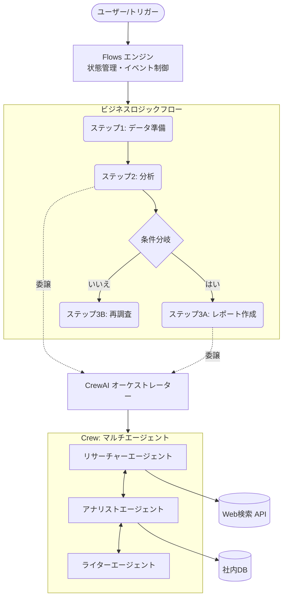

# **CrewAI 調査レポート**

## **1. 基本情報**

* **ツール名**: CrewAI
* **ツールの読み方**: クルーエーアイ
* **開発元**: CrewAI Inc.
* **公式サイト**: [https://crewai.com/](https://crewai.com/)
* **関連リンク**:
  * GitHub: [https://github.com/crewaiinc/crewai](https://github.com/crewaiinc/crewai)
  * ドキュメント: [https://docs.crewai.com/](https://docs.crewai.com/)
* **カテゴリ**: AIエージェント基盤
* **概要**: CrewAIは、自律型AIエージェントのチーム（Crews）と、イベント駆動型のワークフロー（Flows）を構築・管理するためのオープンソースのPythonフレームワークです。複雑なタスクを役割分担したエージェントの協調によって解決します。

## **2. 目的と主な利用シーン**

* **解決する課題**: 複雑で多段階にわたるタスクの自動化、および単一のLLM呼び出しでは対応できない高度な論理的推論や役割分担が必要な業務の効率化。
* **想定利用者**: AIエンジニア、データサイエンティスト、社内プロセスの自動化を推進する企業の開発チーム。
* **利用シーン**:
  * **市場調査と分析**: データの収集担当エージェントと、そのデータを分析してレポートにまとめるエージェントを連携させた自動調査。
  * **ソフトウェア開発・レビュー**: コーディング担当エージェントとコードレビュー担当エージェントによる自動化された開発フロー。
  * **コンテンツ生成**: 記事の執筆から校正、フォーマット調整までを一連のプロセスとして自動生成。

## **3. 主要機能**

* **Crews (クルー)**: 個別の目標、役割、バックストーリーを持たせた複数の自律型AIエージェントをグループ化し、タスクを委任して協調作業を行わせる機能。
* **Flows (フロー)**: AIエージェントの実行をイベント駆動で制御し、状態管理や条件分岐、複雑なビジネスロジックを構成するワークフロー機能。
* **役割ベースのアーキテクチャ**: 各エージェントに特定の専門知識や役割（例: 「シニアデータリサーチャー」「アナリスト」）を持たせることで、より自然で高度なタスク実行を可能にする。
* **ツール連携**: Serper.devなどの外部APIや、データベース、ローカルツール、各種SaaS（Gmail, Slack, Salesforce等）とエージェントを簡単に統合できる機能。
* **CrewAI AMP (Agent Management Platform)**: エンタープライズ向けに、エージェントの展開、管理、監視、サーバーレススケーリングを提供するコントロールプレーン。

## **4. 動作原理・システム構成**

* **アーキテクチャ**: CrewAIは、エージェントを調整する高レベルなオーケストレーション（Crews）と、イベント駆動型のステートマシンに基づく低レベルなワークフロー制御（Flows）を統合したハイブリッドアーキテクチャです。バックエンドはPythonで実装されており、各種LLMAPIと非同期に通信します。
* **主要コンポーネントとデータフロー**:
  * **Flows**: タスクの実行順序、条件分岐、ループなどの全体的なプロセスフローを管理します。各ステップで状態（State）を保持し、イベントを発行・購読することで進行します。
  * **Crews**: Flowsから呼び出されるか、独立して実行されるエージェントのグループです。特定のタスク（Task）を達成するために、役割（Role）を持ったエージェント同士が委譲（Delegation）や情報共有を行いながら自律的に進行します。
  * **Tools**: エージェントが外部システム（Web検索、DB、API）と相互作用するためのインターフェースです。
* **特筆すべき要素技術**:
  * **LangChain非依存**: 独自の実装により軽量化されており、不要なオーバーヘッドを避けています。
  * **CrewAI AMP**: 本番環境向けのサーバーレスインフラであり、実行ログの収集（可観測性）、SSO、RBACなどを提供するコントロールプレーンです。



## **5. 開始手順・セットアップ**

* **前提条件**:
  * Python >=3.10 <3.14
  * 依存関係管理ツールとして `uv` が推奨されている
  * OpenAI等のLLM APIキー
* **インストール/導入**:

  ```bash
  # 基本パッケージのインストール
  uv pip install crewai

  # 追加ツールを含むインストール
  uv pip install 'crewai[tools]'
  ```

* **初期設定**:
  * `.env` ファイルに `OPENAI_API_KEY` などの環境変数を設定。
* **クイックスタート**:
  * コマンドラインツールを使用して新規プロジェクトを作成:

    ```bash
    crewai create crew <project_name>
    ```

  * `agents.yaml` や `tasks.yaml`、`crew.py` を編集してエージェントとタスクを定義し、`crewai run` で実行。

## **6. 特徴・強み (Pros)**

* **軽量かつ高速**: LangChain等の他のエージェントフレームワークに依存せず、ゼロから構築されているため、リソース消費が少なく高速な実行が可能。
* **柔軟性と精密な制御**: 高レベルなオーケストレーション（Crews）と低レベルで厳密な制御（Flows）をシームレスに組み合わせることができる。
* **直感的な抽象化**: 複雑なマルチエージェントシステムを、役割（Role）、目標（Goal）、バックストーリーといった人間にも理解しやすい概念で構築できる。

## **7. 弱み・注意点 (Cons)**

* **日本語ドキュメントの不足**: 公式ドキュメントやコミュニティフォーラムの主要言語は英語であり、日本語でのサポート情報はまだ少ない。
* **運用時のAPIコスト**: 複数のエージェントが相互に通信しながらタスクを実行するため、LLMのAPI呼び出し回数が増加しやすく、コスト管理に注意が必要。
* **学習曲線の存在**: 基本的なCrewsの作成は容易だが、高度なFlowsとCrewsの統合、カスタムツールの作成などを本番環境レベルで実装するには一定の学習コストがかかる。

## **8. 料金プラン**

| プラン名 | 料金 | 主な特徴 |
|---------|------|---------|
| **Open Source** | 無料 | OSSフレームワーク、自己ホスト、コミュニティサポート |
| **Basic (Free)** | 無料 | Visual editor、GitHub統合、月間50回のワークフロー実行 |
| **Enterprise** | カスタム | CrewAI/プライベートインフラ、オンサイトサポート、月間50時間の開発サポート、無制限実行など |

* **課金体系**: Basicプランの追加実行は $0.50/回。Enterpriseプランは要問い合わせ（カスタム）。
* **無料トライアル**: Basicプランで無料で開始可能（月間50回の実行上限あり）。

## **9. 導入実績・事例**

* **導入企業**: DocuSign, IBM, PwC, Gelato, General Assembly 等。
* **導入事例**:
  * **DocuSign**: 複数の内部システムからリードデータを抽出し統合評価するAIエージェントにより、リードへの初回コンタクトまでの時間を75%短縮。
  * **IBM**: WatsonX.AIと統合し、レガシーシステムとモダンシステム間の手動調整を削減。
  * **PwC**: AIエージェントのワークフローを活用し、コード生成の精度を10%から70%へと大幅に向上。
* **対象業界**: ソフトウェア開発、金融、コンサルティングなど多岐にわたる。Fortune 500企業の60%で導入実績あり。

## **10. サポート体制**

* **ドキュメント**: 公式ドキュメント（[https://docs.crewai.com/](https://docs.crewai.com/)）が非常に充実しており、多数のチュートリアルやAPIリファレンスが用意されている。
* **コミュニティ**: フォーラム、GitHub（10万以上の認定開発者コミュニティ）が活発に機能。
* **公式サポート**: Enterpriseプランでは専用サポート（Slack/Teams）、オンサイトサポート、トレーニングが提供される。

## **11. エコシステムと連携**

### **11.1 API・外部サービス連携**

* **API**: CrewAI自体が強力なAPIを備えており、各種ツールやプラットフォームへの統合が容易。CrewAI AMPでは一元管理用のAPIも提供。
* **外部サービス連携**: OpenAI、Ollama、LM StudioなどのLLM。Slack、Microsoft Teams、Gmail、Salesforce、HubSpot、Notionなどのエンタープライズアプリケーション。Serper.devなどの検索ツール。

### **11.2 技術スタックとの相性**

| 技術スタック | 相性 | メリット・推奨理由 | 懸念点・注意点 |
|:---|:---:|:---|:---|
| **Python** | ◎ | ネイティブ言語であり、完全な機能が提供される。 | 特になし。 |
| **LangChain** | ◯ | 連携可能であり、既存のLangChainツールをCrewAIに組み込める。 | CrewAI自体はLangChain非依存を強みとしているため、混在によりアーキテクチャが複雑化する可能性あり。 |

## **12. セキュリティとコンプライアンス**

* **認証**: CrewAI AMPではSSO (MS Entra, Okta) やロールベースのアクセス制御 (RBAC) に対応。
* **データ管理**: Enterprise環境ではCrewAI Cloudまたは顧客のプライベートVPCへの展開（CrewAI AMP Factory）が可能。
* **準拠規格**: エンタープライズ向けにFedRamp High対応環境のサポート、データの暗号化およびSOC2/ISO27001水準のセキュリティ対策を考慮した設計（詳細は問い合わせが必要）。

## **13. 操作性 (UI/UX) と学習コスト**

* **UI/UX**: OSS版はコードベースだが、CLIツールの `crewai` が用意されておりプロジェクトのセットアップが容易。AMP Cloudでは視覚的なエディタ（Studio）を提供。
* **学習コスト**: Pythonの基礎知識とLLMの挙動に対する理解があれば導入は比較的容易。公式がDeepLearning.AI等でコースを提供しており、学習リソースは豊富。

## **14. ベストプラクティス**

* **効果的な活用法 (Modern Practices)**:
  * **CrewsとFlowsの組み合わせ**: 単純な逐次処理だけでなく、Flowsを使って全体の制御（条件分岐やリトライロジック）を行い、特定の複雑な課題に対してのみCrewsを呼び出すアーキテクチャ。
  * **Yaml設定ファイルの分離**: コード内にプロンプトを直接書くのではなく、`agents.yaml` や `tasks.yaml` に役割やタスク定義を分離し、メンテナンス性を高める。
* **陥りやすい罠 (Antipatterns)**:
  * 単純なタスクに過剰な数のエージェントを割り当て、トークン消費とレイテンシを無駄に増大させること。
  * エージェントの「ゴール」や「バックストーリー」を曖昧に設定し、予期しない動作（ハルシネーション）を引き起こすこと。

## **15. ユーザーの声（レビュー分析）**

* **調査対象**: G2 (要約引用)、Tech系ブログ等
* **総合評価**: 概ね好評。特定のサイトの定量的なスコアは確認できなかったが、GitHubでのStar数（48.9k）が支持を物語っている。
* **ポジティブな評価**:
  * 役割や目標を設定するだけで自律的に協調動作するパラダイムが画期的。
  * 既存のLangChainやAutogenと比べ、概念が人間にとって直感的で分かりやすく、設定がシンプル。
* **ネガティブな評価 / 改善要望**:
  * 複数のエージェントを介するため、デバッグやトレーシングが複雑になりがち（ただし、最新のCrewAI AMPでの可観測性機能により改善されつつある）。
* **特徴的なユースケース**:
  * 複雑なリサーチレポートの自動生成や、複数のAPIを叩いて情報を統合するカスタマーサポートの自動化。

## **16. 直近半年のアップデート情報**

* **2026-09-04**: Version 1.15.20 - レガシーなプラットフォームツールのエイリアス解決のバグ修正およびClipperインテグレーションクライアントの追加。
* **2026-08-27**: Version 1.15.18 - 会話型フロー (Conversational flows) を試験段階から安定版（stable）へ昇格。実行コンテキストのUUID管理機能を強化。
* **2026-08-14**: Version 1.15.16 - UUIDサポートによる実行コンテキスト管理の導入。フローを終了させた例外の種類や時間の記録機能を追加し、可観測性を向上。
* **2026-07-30**: Version 1.15.9 - ツールの失敗を成功として報告するのではなく、適切にエラーとして表面化する機能を追加。フロー実行失敗時のイベント（FlowFailedEvent）を追加。
* **2026-06-25**: Version 1.15.0 - 宣言的フロー（Declarative Flows）の統一的な読み込み機能を追加。CLI TUIでの会話型フローのサポートを開始。

(出典: [GitHub Releases](https://github.com/crewaiinc/crewai/releases))

## **17. 類似ツールとの比較**

### **17.1 機能比較表 (星取表)**

| 機能カテゴリ | 機能項目 | CrewAI | PraisonAI | Microsoft Agent Framework | ChatDev |
|:---:|:---|:---:|:---:|:---:|:---:|
| **基本機能** | マルチエージェント協調 | ◎<br><small>役割ベースで直感的</small> | ◎<br><small>YAMLベースで手軽</small> | ◎<br><small>Copilot統合が強力</small> | ◯<br><small>ソフトウェア開発特化</small> |
| **設計概念** | アーキテクチャの柔軟性 | ◎<br><small>FlowsとCrewsの統合</small> | ◯<br><small>CrewAI等もバックエンドで利用</small> | ◎<br><small>宣言的ワークフロー</small> | △<br><small>プロセスが固定化されがち</small> |
| **エンタープライズ** | 本番環境の管理・監視 | ◯<br><small>CrewAI AMPで対応</small> | △<br><small>小〜中規模向け</small> | ◎<br><small>Azure・エンタープライズ対応</small> | ×<br><small>実稼働向けではない</small> |
| **非機能要件** | 学習コスト（導入の容易さ） | ◎<br><small>直感的で低い</small> | ◎<br><small>ローコードで非常に低い</small> | ◯<br><small>多機能ゆえにやや高い</small> | ◯<br><small>用途が限られ導入は容易</small> |

### **17.2 詳細比較**

| ツール名 | 特徴 | 強み | 弱み | 選択肢となるケース |
|---------|------|------|------|------------------|
| **CrewAI** | 人間のチーム組織を模した役割ベースのフレームワーク。 | 直感的で学習コストが低く、Flowsによるワークフロー制御も可能。軽量。 | 日本語のナレッジがやや少ない。 | AIによる業務自動化を、チームの役割分担のような直感的な概念で設計・制御したい場合。 |
| **PraisonAI** | 複数のエージェントフレームワークを抽象化したローコードツール。 | YAMLファイルのみでマルチエージェントを即座に構築できる手軽さ。 | 大規模な独自制御や複雑な状態管理には向かない。 | プロトタイピングや、コードを書かずに素早くエージェントを立ち上げたい場合。 |
| **Microsoft Agent Framework** | Semantic KernelとAutoGenの知見を統合したMSの次世代基盤。 | 宣言的ワークフローやエンタープライズグレードの堅牢性、Copilotとの統合。 | 概念が複雑でエコシステムが巨大なため、初期学習コストが高い。 | 大規模なエンタープライズシステムへの組み込みや、Azureインフラを主軸とする場合。 |
| **ChatDev** | 仮想ソフトウェア開発会社を模したマルチエージェント。 | 設計からテストまでの「ソフトウェア開発プロセス」に特化して最適化。 | ソフトウェア開発以外の汎用的なタスクには適用しづらい。 | プロンプトからソフトウェアのプロトタイプを全自動で生成・テストしたい場合。 |

## **18. 総評**

* **総合的な評価**:
  CrewAIは、マルチエージェントシステムの複雑な概念を、「役割」「目標」「タスク」といった人間組織のアナロジーに落とし込むことで、非常に高い開発体験を提供しています。さらに「Flows」機能の追加により、AIの自律性とシステムとしての厳密な制御のバランスを取ることに成功しており、本番環境への適用にも十分に耐えうる完成度の高いフレームワークです。
* **推奨されるチームやプロジェクト**:
  * 複雑なデータ収集や分析、コンテンツ生成など、段階的なプロセスを自動化したいプロジェクト。
  * LangChainなどの重量級フレームワークを避け、軽量かつ見通しの良いコードベースを維持したい開発チーム。
* **選択時のポイント**:
  他のフレームワーク（LangGraphなど）が状態遷移グラフの構築を要求するのに対し、CrewAIは宣言的な設定（YAML）と直感的な役割定義で構築できるため、AIエージェントシステムのPoCから商用デプロイまでを迅速に進めたい場合に強力な選択肢となります。
