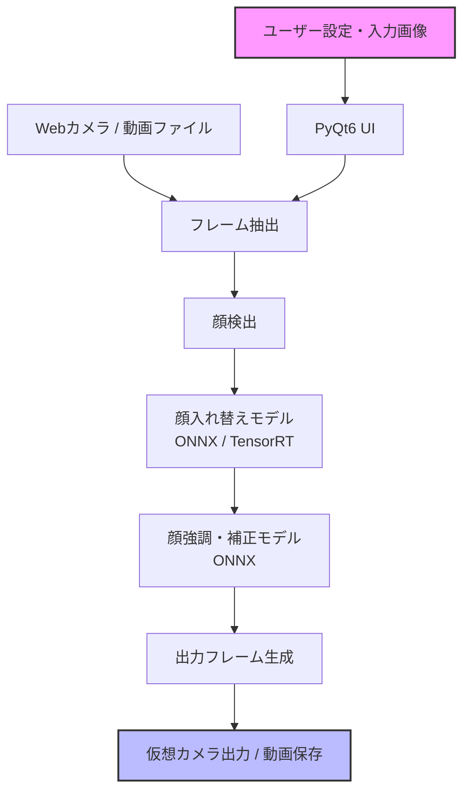

# **Deep-Live-Cam 調査レポート**

## **1. 基本情報**

* **ツール名**: Deep-Live-Cam
* **ツールの読み方**: ディープライブカム
* **開発元**: hacksider
* **公式サイト**: [https://deeplivecam.net/](https://deeplivecam.net/)
* **関連リンク**:
  * GitHub: [https://github.com/hacksider/Deep-Live-Cam](https://github.com/hacksider/Deep-Live-Cam)
* **カテゴリ**: AI画像/メディア生成
* **概要**: Deep-Live-Camは、たった1枚の画像からリアルタイムで顔を入れ替えたり、ビデオのディープフェイクを生成できるオープンソースのソフトウェアです。ストリーマーやVtuber、コンテンツクリエイター向けに設計されています。

## **2. 目的と主な利用シーン**

* **解決する課題**: 複雑なモデリングや多数の学習用画像を用意することなく、簡単にアバターや別人の顔を利用した動画・配信を作成したいというニーズに応える。
* **想定利用者**: コンテンツクリエイター、Vtuber、ストリーマー、映像制作者
* **利用シーン**:
  * ライブ配信中のアバターとしての利用
  * カスタムキャラクターの動画作成
  * 衣服のデザインなどにモデルの顔を適用する用途

## **3. 主要機能**

* **リアルタイム顔入れ替え**: ウェブカメラの映像に対して、指定した1枚の画像の顔をリアルタイムで合成する機能。
* **Flux Live (プロンプト編集)**: テキストプロンプトによるリアルタイムの顔編集機能。
* **ワンクリック・ディープフェイク**: 複雑な設定なしに、数回のクリックで既存の動画の顔を入れ替える機能。
* **RTX Upscaler**: NVIDIA GPUハードウェアを利用したリアルタイムのアップスケーリング機能。
* **安全性チェック機能**: ヌードや過激なコンテンツ、戦争の映像など、不適切なメディアの処理を防止する組み込みのチェック機能。
* **マルチプラットフォーム対応**: Windows、Mac (Silicon対応)、CPU/GPU（NVIDIA TensorRT、AMD）など、幅広い環境での動作をサポート（Pre-built版など）。
* **Mouth Mask**: 口の動きの追従やマスク処理に関する機能。

## **4. 動作原理・システム構成**

* **アーキテクチャ**: ローカルファーストのクライアントアプリケーション。処理は全てユーザーの端末のCPU/GPU上で完結して実行される（Decart Live等の特定モードを除く）。
* **主要コンポーネントとデータフロー**:
  * 入力画像（ソース画像）から顔の特徴を抽出し、ウェブカメラや動画フレーム（ターゲット）の顔部分に対してリアルタイムにマッピングを行う。PyQt6ベースのUIからモデルに指示を送り、ONNXベースの推論エンジンで処理された画像が出力としてストリーミングされる。
* **特筆すべき要素技術**:
  * v2.7 Ultimate以降では、重い依存関係（PyTorch、TensorFlow）を排除し、完全にONNX上で動作するように再構築されている。またNVIDIA GPU環境向けにTensorRTアクセラレーションを組み込んでいる。



## **5. 開始手順・セットアップ**

* **前提条件**:
  * Python環境 (手動インストールの場合)
  * Git (手動インストールの場合)
  * FFmpeg (手動インストールの場合)
  * 推奨環境として、NVIDIA GPU (CUDA/TensorRT対応) または AMD GPU、Mac Silicon
* **インストール/導入**:
  オープンソース版の手動インストール手順：

  ```bash
  # リポジトリのクローン
  git clone https://github.com/hacksider/Deep-Live-Cam.git
  cd Deep-Live-Cam

  # 依存関係のインストール (環境に応じた requirements ファイルを使用)
  pip install -r requirements.txt
  ```

  ※または、公式サイトからPre-built版（Windows/Mac Silicon等）をダウンロード可能。
* **初期設定**:
  * 必要な顔モデルやONNXモデルのダウンロード（初回起動時に設定される場合あり）。
* **クイックスタート**:
  1. 顔の画像を選択する。
  2. 使用するカメラを選択する。
  3. "Live" ボタンを押す。

## **6. 特徴・強み (Pros)**

* 必要なソース画像が1枚だけで済むため、事前の学習の手間が全くかからない。
* リアルタイム処理に対応しており、ライブストリーミングやビデオ通話で即座に利用できる。
* PyTorchやTensorFlowへの依存をなくしONNXベースで再構築されたことで、起動が高速でメモリ使用量も少ない。
* 日本語を含む5カ国語のUIをサポートしており、多言語ユーザーにとって使いやすい。

## **7. 弱み・注意点 (Cons)**

* Flux Liveなど一部の高度なリアルタイム機能は、RTX 5090やRTX 6000クラス等の非常に高い性能のGPUを要求する。
* ディープフェイク技術の性質上、悪用されるリスクがあり、利用者は法規制や倫理基準（本人同意の取得や明記など）を遵守する責任がある。
* MacのCPU環境ではフレームレートが出ないため、Apple Siliconモデルや外部GPUが実質必須となる。

## **8. 料金プラン**

| プラン名 | 料金 | 主な特徴 |
|---------|------|---------|
| **オープンソース版 (GitHub)** | 無料 | 全ての基本機能、コミュニティサポート、手動での環境構築が必要 |
| **Nvidia GPU プラン** | 有料 (要確認) | 優先サポート、最適化されたPre-builtバイナリ、多数の追加機能 |
| **AMD GPU プラン** | 有料 (要確認) | 優先サポート、最適化されたPre-builtバイナリ、多数の追加機能 |
| **Mac / Silicon Edition プラン** | 有料 (要確認) | 優先サポート、最適化されたPre-builtバイナリ、多数の追加機能 |

* **課金体系**: サブスクリプション形式（詳細は公式サイトを参照）
* **無料トライアル**: オープンソース版で全機能のベースを利用可能。

## **9. 導入実績・事例**

* **導入企業**: 個人クリエイターやストリーマーを中心に広く利用されており、特定の企業名は公開されていない。
* **導入事例**: GitHub上で8万以上のスターを獲得しており、世界中の開発者やクリエイターによって多数のフォークや利用事例が存在する。
* **対象業界**: エンターテインメント、動画配信、クリエイターエコノミー。

## **10. サポート体制**

* **ドキュメント**: GitHubのREADMEにて、インストール手順やトラブルシューティングが公開されている。
* **コミュニティ**: GitHubのIssuesやDiscussions、関連フォーラムでの活発な情報交換が行われている。
* **公式サポート**: 公式サイトの有料プラン登録者向けに「Priority Support（優先サポート）」が提供されている。

## **11. エコシステムと連携**

### **11.1 API・外部サービス連携**

* **API**: ツール自体はスタンドアロンのアプリケーションとして動作し、直接的なパブリックAPIの提供は標準ではないが、オープンソースであるためスクリプト経由での連携が可能。
* **外部サービス連携**: OBS Studioなどの配信ソフトで仮想カメラとして認識させることで、各種ライブ配信プラットフォーム（YouTube Live、Twitchなど）と連携可能。

### **11.2 技術スタックとの相性**

| 技術スタック | 相性 | メリット・推奨理由 | 懸念点・注意点 |
|:---|:---:|:---|:---|
| **Python** | ◎ | コアがPythonで実装されており、拡張やカスタマイズが容易 | バージョン依存や環境構築でのトラブルに注意 |
| **OBS Studio** | ◎ | 仮想カメラ出力により配信ソフトとのシームレスな統合が可能 | PCのスペックによっては同時稼働で負荷が高まる |
| **NVIDIA CUDA / TensorRT** | ◎ | 処理速度が劇的に向上し、リアルタイム性が安定する | 対応GPUの用意が必須 |

## **12. セキュリティとコンプライアンス**

* **認証**: 基本的なオープンソース版はローカル動作のため認証不要。有料版サイトではアカウント作成とログイン機能がある。
* **データ管理**: 基本的にローカル環境で処理が行われるため、利用者のデータや画像が外部サーバーに送信されることはない。
* **準拠規格**: 特に公開されている認証（ISOなど）はないが、ソフトウェアレベルで「NSFW（不適切コンテンツ）」の検知・ブロック機能を搭載している。

## **13. 操作性 (UI/UX) と学習コスト**

* **UI/UX**: PyQt6ベースの新しいUIが導入され、非常にモダンでクリーンな操作画面を提供。日本語化にも対応しているため、直感的に操作できる。
* **学習コスト**: Pre-built版を使用する場合、環境構築の必要がないため学習コストは非常に低い。手動インストールの場合でも、ドキュメントに沿ってコマンドを実行するだけのため比較的容易。

## **14. ベストプラクティス**

* **効果的な活用法 (Modern Practices)**:
  * 配信の品質を向上させるため、OBSなどの仮想カメラプラグインと組み合わせて利用する。
  * 処理速度を確保するため、可能な限りCUDA、TensorRT、Core MLなどのハードウェアアクセラレーションを有効化する。
* **陥りやすい罠 (Antipatterns)**:
  * 他人の顔画像を無断で使用すること（倫理的・法的問題のリスクがあるため、同意の取得と明記が推奨される）。
  * 必要なライブラリ（FFmpegなど）のパスが通っていない状態で実行し、エラーを発生させること。

## **15. ユーザーの声（レビュー分析）**

* **調査対象**: GitHub、X(Twitter)、Reddit
* **総合評価**: 非常に高い支持（GitHubスター数 82,000超）
* **ポジティブな評価**:
  * 「たった1枚の画像でここまで自然なディープフェイクがリアルタイムでできるのは革命的。」
  * 「オープンソースでこれだけの機能が無料で試せるのは素晴らしい。」
* **ネガティブな評価 / 改善要望**:
  * 「MacのCPU環境だとフレームレートが出ないため、MシリーズチップやGPUがほぼ必須。」
  * 「環境構築時にPythonの依存関係エラーでつまずく初心者が多い。」
* **特徴的なユースケース**:
  * 顔出しに抵抗がある配信者が、自分のお気に入りのキャラクターの顔を被ってVtuber的に活動する用途。

## **16. 直近半年のアップデート情報**

* **2026-08-01**: Version 2.7 Ultimate がリリース。UIをPyQt6ベースで刷新、TensorRT対応、重い依存関係の除去とONNXベースへの移行、日本語を含む5言語対応、Flux Liveでのプロンプト編集機能を搭載。
* **2026-05-20**: Version 2.7-RC1 リリース。Decart Live、Flux Live、UIの多言語化機能が追加される。
* **2026-03-11**: Version 2.7 beta リリース。リアルタイムの顔強調機能(Face Enhancer)、LUTサポート、ウィンドウプロジェクションなどが追加。
* **2026-02-10**: Version 2.6 リリース。仮想カメラの公式サポート、レンダリングエンジンの高速化が図られる。

(出典: [GitHubリポジトリ Releases](https://github.com/hacksider/Deep-Live-Cam/releases) など)

## **17. 類似ツールとの比較**

### **17.1 機能比較表 (星取表)**

| 機能カテゴリ | 機能項目 | 本ツール | Roop | DeepFaceLive | FaceFusion |
|:---:|:---|:---:|:---:|:---:|:---:|
| **基本機能** | 1枚画像での顔入替 | ◎<br><small>リアルタイムで強力</small> | ◯<br><small>開発終了</small> | ◯<br><small>モデル事前学習が主</small> | ◎<br><small>機能豊富</small> |
| **カテゴリ特定** | リアルタイム配信対応 | ◎<br><small>仮想カメラとして機能</small> | △<br><small>動画処理メイン</small> | ◎<br><small>ライブ配信特化</small> | ◯<br><small>ライブモードあり</small> |
| **非機能要件** | 日本語対応 | ◯<br><small>公式でUI対応</small> | △<br><small>英語</small> | △<br><small>英語/ロシア語</small> | ◯<br><small>多言語対応</small> |
| **エコシステム** | Pre-builtバイナリ | ◎<br><small>公式で提供あり</small> | ×<br><small>なし</small> | ◯<br><small>Windows版あり</small> | ◯<br><small>インストーラーあり</small> |

### **17.2 詳細比較**

| ツール名 | 特徴 | 強み | 弱み | 選択肢となるケース |
|---------|------|------|------|------------------|
| **本ツール** | 1枚の画像でリアルタイム顔入替 | インストールと利用が極めて簡単。コミュニティが巨大 | 高度な調整機能は限られる | 配信や通話ですぐに顔を入れ替えたい場合 |
| **Roop** | Deep-Live-Camの起源とも言えるツール | 1枚画像からの生成の先駆者 | 開発が終了しており、更新がない | 歴史的背景を知るための参照用 |
| **DeepFaceLive** | リアルタイム配信に特化した強力なツール | 高品質なモデルの学習と適用が可能 | 事前のモデル学習に時間と労力がかかる | 長期間同じアバターで最高品質の配信を行いたい場合 |
| **FaceFusion** | 統合的な顔操作フレームワーク | 非常に多機能でUIが洗練されている | リアルタイム性よりもオフラインの動画処理に向く面もある | 録画済みの動画に対して細かな顔の加工や補正を行いたい場合 |

## **18. 総評**

* **総合的な評価**:
  Deep-Live-Camは、ディープフェイク技術の民主化を体現するような画期的なツールです。たった1枚の画像を用意するだけで、複雑な環境構築なしにリアルタイムの顔入れ替えが可能になる点は非常に高く評価できます。さらにバージョン2.7でのUI刷新と多言語対応、ONNXベースへの移行により、軽量化と使いやすさが大幅に向上しました。
* **推奨されるチームやプロジェクト**:
  手軽にアバターを利用したい個人ストリーマー、Vtuber、また動画制作におけるリファレンスとして活用したい映像クリエイターに強く推奨されます。
* **選択時のポイント**:
  事前のモデル学習を行わずに即座に顔を入れ替えたい場合は本ツールが最適です。一方で、映像作品レベルの最高品質や微細な調整が必要な場合は、DeepFaceLab等の学習型ツールやFaceFusionなどのオフライン処理ツールと用途に応じて使い分けることが重要です。
