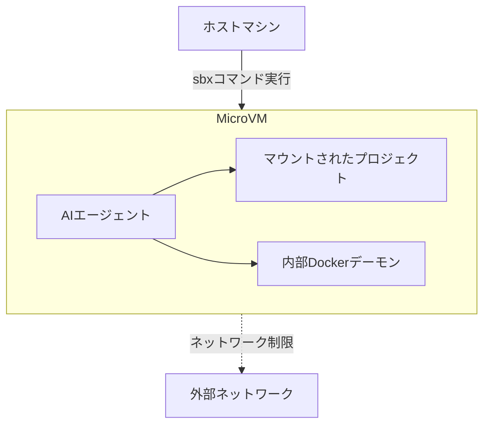

# **Docker Sandboxes 調査レポート**

## **1. 基本情報**

* **ツール名**: Docker Sandboxes
* **ツールの読み方**: ドッカーサンドボックス
* **開発元**: Docker Inc.
* **公式サイト**: [https://www.docker.com/products/docker-sandboxes/](https://www.docker.com/products/docker-sandboxes/)
* **関連リンク**:
  * ドキュメント: [https://docs.docker.com/ai/sandboxes/](https://docs.docker.com/ai/sandboxes/)
* **カテゴリ**: AIコーディング支援
* **概要**: AIコーディングエージェント（Claude Code, Copilot CLI, Codex, OpenCode, Kiroなど）を安全に実行するための、使い捨て可能で隔離されたマイクロVM環境。ホストマシンを保護しつつ、エージェントの自律的な動作を支援する。

## **2. 目的と主な利用シーン**

* **解決する課題**: AIエージェントに自律的な実行権限（ファイル操作やコマンド実行など）を与えつつ、ホストマシンのファイルシステムやネットワークを保護するセキュリティ上の課題を解決する。
* **想定利用者**: AIエージェントを活用して開発を行うエンジニア、セキュリティを重視する開発チームや管理者。
* **利用シーン**:
  * AIエージェントにコードの自動生成やパッケージのインストールを自律的かつ安全に行わせる。
  * プロジェクトのワークスペースのみを隔離してエージェントにアクセスさせ、意図しないファイル変更を防ぐ。
  * 同一プロジェクトに対して複数エージェントによる作業を並行して安全に行う。

## **3. 主要機能**

* **マイクロVMによる隔離**: 各エージェントを専用のマイクロVM内で実行し、ホスト環境との間に強力なセキュリティ境界を設ける。
* **使い捨て環境 (Disposable by default)**: 仮想マシンよりも高速に起動（スピンアップ）し、作業が不要になればコマンド1つで安全に破棄できる。
* **Dockerイン・サンドボックス**: サンドボックス内でエージェント自身がさらにDockerコンテナを起動・操作することが可能。
* **カスタマイズ可能な実行ポリシー**: ファイルシステムやネットワークアクセスの制御を定義し、エージェントの権限を必要に応じて制限できる。
* **Gitワークスペース統合**: サンドボックス内での変更を独立した作業領域として管理し、ホスト側から差分（diff）を確認してからマージできる。

## **4. 動作原理・システム構成**

* **アーキテクチャ**: ローカルホスト上で稼働する軽量マイクロVM（MicroVM）ベースのクライアント完結型構成。
* **主要コンポーネントとデータフロー**:
  * ユーザーがホスト上で `sbx` CLIを実行し、マイクロVMを起動する。
  * 起動したマイクロVM内にプロジェクトのワークスペース（特定のディレクトリ）のみをマウントする。
  * エージェントは、自身の専用カーネルとDockerデーモンを持つVM内で独立して処理を行う。
  * 外部へのネットワーク通信などのアウトバウンドリクエストは、プロキシを通じて制御される。
* **特筆すべき要素技術**:
  * **MicroVM**: 従来のVMよりも軽量で高速ながら、カーネルレベルの隔離を提供する。
  * **Git Worktree**: エージェントごとの作業の並行化と差分管理を安全に行うための仕組み。



## **5. 開始手順・セットアップ**

* **前提条件**:
  * macOS、Windows、またはLinux（Ubuntu）環境
  * Docker Desktopのインストールは必須ではない
* **インストール/導入**:

  ```bash
  # macOSの場合
  brew trust docker/tap && brew install docker/tap/sbx

  # Windowsの場合
  winget install Docker.sbx

  # Linux (Ubuntu)の場合
  curl -fsSL https://get.docker.com | sudo REPO_ONLY=1 sh
  sudo apt-get install docker-sbx
  ```

* **初期設定**: コマンドラインツール `sbx` を使用してサンドボックス環境を初期化。
* **クイックスタート**:
  * `sbx create --clone copilot` などを実行して、エージェント用の隔離環境を即座に作成し作業を開始する。

## **6. 特徴・強み (Pros)**

* **YOLOモードの安全な活用**: 確認プロンプトなしでエージェントを自律動作させる設定（`--dangerously-skip-permissions`）を、MicroVMの強力な隔離により安全に実行できる。
* **多様なエージェント対応**: Claude Code、Copilot CLI、Codex、Kiroなど、主要なCLIベースのコーディングエージェントに標準で対応している。
* **高いアイソレーション**: エージェントごとに独立したカーネルとDockerデーモンを持たせ、ホスト環境を一切汚染しない。
* **Gitとのシームレスな統合**: サンドボックス内での変更を独立したリモートとして扱い、ホスト側から差分を安全に確認してマージできる運用が可能。

## **7. 弱み・注意点 (Cons)**

* **高度な管理には有償プランが必要**: チーム全体でのネットワークアクセスやファイルシステムポリシーの一元管理（Docker AI Governance）には、上位プランが必要となる。
* **リソースの消費オーバーヘッド**: 軽量とはいえVMベースであるため、多数のエージェントサンドボックスを同時に起動した際のリソースオーバーヘッドが生じる。
* **日本語対応状況**: 公式ドキュメントやCLIは主に英語での提供となっており、日本語UIやサポートは十分ではない。

## **8. 料金プラン**

| プラン名 | 料金 | 主な特徴 |
|---------|------|---------|
| **Docker Personal** | 無料 | 個人の開発者向け。基本的なコンテナ構築とデプロイ機能、Sandboxesの利用を含む。 |
| **Docker Pro** | $9/月 | 個人プロフェッショナル向け。高度な機能や追加リソースを提供。 |
| **Docker Team** | $15/月/ユーザー | 小規模チーム向け。コラボレーションツールを利用可能。 |
| **Docker Business** | $24/月/ユーザー | エンタープライズ向け。強固なセキュリティ管理や「Docker AI Governance」に対応。 |

* **課金体系**: ユーザー単位・月額または年額払い（Dockerサブスクリプションに準ずる）
* **無料トライアル**: Dockerの提供する規定に準じる。

## **9. 導入実績・事例**

* **導入企業**: Warp（ターミナルエミュレータ開発企業）, NanoClawなど
* **導入事例**:
  * **Warp**: 開発者がクラウドかローカルかを問わず、一貫した環境でAIエージェントを自由に実行できるようDocker Sandboxesを統合した。
  * **NanoClaw**: エージェントを信頼するのではなく安全な壁を築くというコンセプトのもと、インフラストラクチャレベルでの安全性を評価している。
* **対象業界**: ソフトウェア開発、セキュリティ、AIツールベンダー

## **10. サポート体制**

* **ドキュメント**: 公式ドキュメント（[https://docs.docker.com/ai/sandboxes/](https://docs.docker.com/ai/sandboxes/)）が整備されている。
* **コミュニティ**: Dockerの大規模な開発者コミュニティやオープンソースコミュニティを活用できる。
* **公式サポート**: Dockerの有償プランに応じた各種公式サポート窓口（チケット等）が利用可能。

## **11. エコシステムと連携**

### **11.1 API・外部サービス連携**

* **API**: サンドボックスの作成・管理用CLIおよび、組織向けAI Governanceに関する機能が提供されている。
* **外部サービス連携**: Claude Code、Gemini CLI、Copilot CLI、Codex、Kiroなど、各種AIエージェントツールと標準で連携。

### **11.2 技術スタックとの相性**

| 技術スタック | 相性 | メリット・推奨理由 | 懸念点・注意点 |
|:---|:---:|:---|:---|
| **Docker / コンテナ環境** | ◎ | Dockerエコシステムの一部であり、既存のコンテナワークフローとの親和性は最高 | 特になし |
| **CLIベースAIエージェント** | ◎ | ターミナル上で動作するエージェントツールを直接的かつ容易に安全化できる | 特になし |
| **Git / バージョン管理** | ◎ | クローンモードなどで独立したGitワークツリーとしてシームレスに連携可能 | コンフリクト解決はホスト側で行う必要がある |

## **12. セキュリティとコンプライアンス**

* **認証**: Dockerアカウントを利用（エンタープライズプランではSSOなど高度な認証に対応）。
* **データ管理**: MicroVMによりホスト環境から分離され、マウントされた特定のワークスペースのみにアクセスが限定される。チーム全体でのセキュリティポリシー管理は「Docker AI Governance」により一元制御可能。
* **準拠規格**: エンタープライズプランにおいて、Dockerプラットフォームが取得する標準的なセキュリティ認証に準拠。

## **13. 操作性 (UI/UX) と学習コスト**

* **UI/UX**: ターミナルから `sbx` コマンドを用いて直感的に操作できる。Docker等に慣れた開発者にとっては非常に使いやすい設計。
* **学習コスト**: Dockerの基本的な知識があれば導入は容易。ただし、独立したGitワークスペースを利用した差分レビューの運用フローには多少の慣れが必要となる。

## **14. ベストプラクティス**

* **効果的な活用法 (Modern Practices)**:
  * `--dangerously-skip-permissions`（YOLOモード）を活用し、安全なサンドボックス内ではエージェントに最大限の自律性を与えることで、確認の手間を省き開発速度を向上させる。
  * エージェントの作業結果を安全に管理するため、`.sbx/` ディレクトリを `.gitignore` に追加し、ホスト側から差分を `git diff` でレビューした後にマージする運用を行う。
* **陥りやすい罠 (Antipatterns)**:
  * 隔離されていないホスト環境（ローカルPCそのもの）で、AIエージェントをフル権限で動作させてしまうこと。
  * 組織利用においてサンドボックスのポリシー管理を個人任せにし、チーム全体での一貫したセキュリティ基準（Docker AI Governance等）を導入しないこと。

## **15. ユーザーの声（レビュー分析）**

* **調査対象**: 公式サイト事例、開発者向け技術ブログなど
* **総合評価**: リリース直後のため定量的なスコアは少ないが、アーリーアダプターからは総じて高い評価を得ている。
* **ポジティブな評価**:
  * 「AIエージェントに自律的な自由を与えながらも、ホストの安全性を完全に担保できる画期的なアプローチである。」
  * 「エージェントごとにGitの別ブランチ（ワークツリー）として作業を分離できるため、レビューが非常に安全かつ容易になった。」
* **ネガティブな評価 / 改善要望**:
  * 「設定や運用に関するベストプラクティス（YOLOモードの活用法など）が、まだコミュニティ全体に十分に浸透していない。」
* **特徴的なユースケース**:
  * 同一プロジェクトに対して、複数のエージェントを別々のサンドボックスで並行稼働させ、それぞれの成果（コミット）をホスト側から独立してレビューし統合する使い方。

## **16. 直近半年のアップデート情報**

* **2026-08-11**: AIエージェントをローカルで安全に実行するための「Docker Sandboxes」を公開。Claude Code、Copilot CLIなどの主要エージェントへの対応およびYOLOモードの提供を開始。

(出典: [Docker Products ニュースリリース](https://www.docker.com/products/) )

## **17. 類似ツールとの比較**

### **17.1 機能比較表 (星取表)**

| 機能カテゴリ | 機能項目 | Docker Sandboxes | E2b Sandbox | DevContainers |
|:---:|:---|:---:|:---:|:---:|
| **基本機能** | 隔離環境の提供 | ◎<br><small>MicroVMレベルの隔離</small> | ◎<br><small>クラウドベースの隔離</small> | ◯<br><small>コンテナレベルの隔離</small> |
| **カテゴリ特定** | AIエージェント対応 | ◎<br><small>各種CLIエージェント標準対応</small> | ◎<br><small>SDK経由でLLMアプリに特化</small> | △<br><small>エージェント用の手動構成が必要</small> |
| **エンタープライズ** | 一元管理・ガバナンス | ◎<br><small>Docker AI Governance連携</small> | ◯<br><small>チーム・組織機能</small> | △<br><small>基本的にはホストの設定に依存</small> |
| **非機能要件** | ローカル実行 | ◎<br><small>ローカルで完結可能</small> | ×<br><small>主にクラウドインフラを利用</small> | ◎<br><small>ローカル環境で動作</small> |

### **17.2 詳細比較**

| ツール名 | 特徴 | 強み | 弱み | 選択肢となるケース |
|---------|------|------|------|------------------|
| **Docker Sandboxes** | 開発者向けのローカルMicroVMサンドボックス環境 | 堅牢なMicroVMとGitのシームレスな連携、Dockerエコシステムとの完全な互換性 | 高度なチーム管理には有償エンタープライズプランが必要 | ローカル環境でCLIベースのAIエージェントを安全かつ最大限に活用したい場合 |
| **E2b Sandbox** | クラウドインフラを利用したAIアプリ用サンドボックス | AIアプリ開発者向けのSDKが充実しており、クラウド上でスケーラブルに動作する | ローカルPC上での開発補助エージェント実行を主目的としていない | カスタムのAIアプリケーションバックエンドとして、動的なコード実行環境が必要な場合 |
| **DevContainers** | 開発環境のコンテナ化を実現する標準ツール | VS Code等と密に統合されており、普及率が高く構成の共有が容易 | AIの自律的なシステム操作に対するハードなセキュリティ境界としては弱い場合がある | 開発チーム全体での基本的な環境統一や、標準的なコンテナ開発を行う場合 |

## **18. 総評**

* **総合的な評価**:
  * Docker Sandboxesは、AIコーディングエージェント活用時の最大の課題であった「エージェントへの権限付与（自律性）」と「ホスト環境のセキュリティ」のトレードオフを見事に解決する強力なインフラツールである。MicroVMによるハードな隔離により、ホストを汚染することなくAIエージェントのパフォーマンスを最大限に引き出すことができる。
* **推奨されるチームやプロジェクト**:
  * GitHub Copilot CLI、Claude Codeなど、ローカルで動作するAIコーディングエージェントを積極的に業務に活用している開発チームや、セキュリティ基準が厳格なエンタープライズ環境に強く推奨される。
* **選択時のポイント**:
  * 個人の開発効率向上だけでなく、組織として安全にAIエージェントを運用し、将来的には「Docker AI Governance」などの一元的なガバナンス機構と連携させたい場合に最適な選択肢となる。
