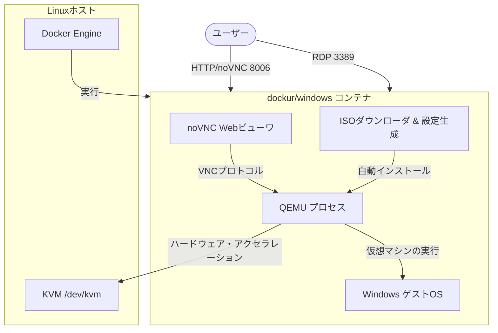

# **dockur/windows 調査レポート**

## **1. 基本情報**

* **ツール名**: dockur/windows
* **ツールの読み方**: ドッカー・ウィンドウズ
* **開発元**: dockur (コミュニティベース)
* **公式サイト**: [https://github.com/dockur/windows](https://github.com/dockur/windows)
* **関連リンク**:
  * GitHub: [https://github.com/dockur/windows](https://github.com/dockur/windows)
  * CodeWiki: [https://codewiki.google/github.com/dockur/windows](https://codewiki.google/github.com/dockur/windows)
  * Docker Hub: [https://hub.docker.com/r/dockurr/windows](https://hub.docker.com/r/dockurr/windows)
* **カテゴリ**: OS/プラットフォーム
* **概要**: dockur/windowsは、Dockerコンテナ内でWindows OSを実行するためのオープンソースツールです。QEMUとKVM技術をバックエンドに使用し、ISOイメージのダウンロードからWindowsのインストール、初期設定までを自動化します。

## **2. 目的と主な利用シーン**

* **解決する課題**: Windows環境の構築にかかる手間と時間の削減。クリーンなWindows環境の即時提供。
* **想定利用者**: クロスプラットフォーム開発を行うエンジニア、自動テストを行うQAチーム、マルウェア解析などを行うセキュリティ研究者。
* **利用シーン**:
  * **CI/CDパイプライン**: Windowsアプリケーションのビルドやテストをコンテナ化された環境で実行する。
  * **サンドボックス**: 怪しいファイルを開いたり、システム設定を変更する実験を行ったりするための使い捨て環境として。
  * **クロスブラウザテスト**: MacやLinuxユーザーが、IEモードやEdgeでの動作確認を行うために。

## **3. 主要機能**

* **全自動インストール**: 指定したバージョンのWindows ISOを自動でダウンロードし、無人インストール（Unattended Installation）を実行します。
* **KVMアクセラレーション**: Linuxホスト上でKVMを利用することで、ネイティブに近いパフォーマンスを実現します。
* **Webビューワ (noVNC)**: ブラウザからポート8006にアクセスするだけで、Windowsのデスクトップ画面を操作できます。
* **RDPサポート**: 標準のリモートデスクトッププロトコル（RDP）をサポートし、高画質・高レスポンスな操作が可能です。
* **バージョン選択**: 環境変数を変更するだけで、Windows 11, 10, 8.1, Server 2022など多彩なバージョンを切り替え可能です。
* **DHCP対応**: コンテナに個別のIPアドレスを割り当て、ローカルネットワーク上の独立したPCとして振る舞わせることが可能です。
* **ディスク・USBパススルー**: ホストの物理ディスクやUSBデバイスをWindows環境に直接接続できます。

## **4. 動作原理・システム構成**

* **アーキテクチャ**: ローカルファーストのDockerコンテナ仮想化構成。コンテナ内部でQEMUを利用して完全仮想化環境を構築し、Windowsを実行します。
* **主要コンポーネントとデータフロー**:
  * Dockerコンテナを起動すると、まず指定されたWindowsのISOイメージが自動でダウンロードされます。
  * ISOのダウンロード後、無人インストール用の応答ファイル（Unattended answer file）が生成され、インストールプロセスが自動化されます。
  * QEMUが起動し、KVMデバイス（`/dev/kvm`）をパススルーすることでネイティブに近いパフォーマンスを発揮します。
  * 画面描画はVNCおよびRDPを通じて提供され、内蔵のnoVNCサーバーによりWebブラウザからポート8006経由でアクセス可能です。



* **特筆すべき要素技術**:
  * **QEMU & KVM**: バックエンドの完全仮想化基盤。Linuxホスト上でハードウェア支援仮想化（KVM）を利用し、CPUのオーバーヘッドを最小限に抑えます。
  * **noVNC**: ブラウザベースのVNCクライアント。特別なクライアントソフトなしで仮想マシンの画面操作を実現します。

## **5. 開始手順・セットアップ**

* **前提条件**:
  * Dockerがインストールされていること。
  * ホストOSがLinuxであり、KVMが有効になっていることが推奨されます（Windows/Macでも動作はしますが低速です）。
* **インストール/導入**:
  `docker-compose.yml` を作成します。

  ```yaml
  services:
    windows:
      image: dockurr/windows
      container_name: windows
      environment:
        VERSION: "11"
      devices:
        - /dev/kvm
      cap_add:
        - NET_ADMIN
      ports:
        - 8006:8006
        - 3389:3389/tcp
        - 3389:3389/udp
      stop_grace_period: 2m
  ```

* **初期設定**:
  特に必要ありません。コンテナ起動時に自動的に設定が行われます。
* **クイックスタート**:

  ```bash
  docker compose up -d
  ```

  ブラウザで `http://localhost:8006` にアクセスし、インストール状況を確認します。

## **6. 特徴・強み (Pros)**

* **圧倒的な手軽さ**: ISOを用意したり、インストーラーをポチポチ操作する必要がありません。`docker up` だけで完結します。
* **再現性**: インフラをコード（Composeファイル）で管理できるため、いつでも同じ構成のWindows環境を再現できます。
* **柔軟なカスタマイズ**: CPUコア数、メモリ量、ディスクサイズなどを環境変数で簡単に調整できます。

## **7. 弱み・注意点 (Cons)**

* **パフォーマンス要件**: 実用的な速度で動作させるには、LinuxホストとKVM（Kernel-based Virtual Machine）がほぼ必須です。
* **ライセンス**: Windowsのライセンスは利用者が自身で用意し、適切に管理する必要があります（評価版としての利用も可能ですが期間制限があります）。
* **Webビューワの制限**: 内蔵のWebビューワは便利ですが、音声転送やクリップボード共有などに制約があります（RDPで解決可能）。

## **8. 料金プラン**

本ツール自体はMITライセンスのオープンソースソフトウェアであり、無料で利用できます。

| プラン名 | 料金 | 主な特徴 |
|---------|------|---------|
| **OSS** | 無料 | GitHubで公開されている全機能を利用可能。 |

* **課金体系**: なし。ただし、実行するWindows OSのライセンス費用は別途必要になる場合があります。
* **無料トライアル**: なし（常に無料）。

## **9. 導入実績・事例**

* **導入企業**: 公開された企業導入事例はありませんが、GitHubスター数は多くの支持を集めており（2026年2月時点）、多くの個人開発者やコミュニティで利用されています。
* **導入事例**:
  * **ホームラボ**: 自宅サーバー上でWindows専用ソフトウェアを常時稼働させるために利用。
  * **開発環境**: MacユーザーがWindows専用の.NETアプリケーションをメンテナンスするために利用。
* **対象業界**: ソフトウェア開発、ITインフラ、個人ホビーユース。

## **10. サポート体制**

* **ドキュメント**: GitHubのREADMEが非常に充実しており、主要な設定やトラブルシューティングが網羅されています。
* **コミュニティ**: GitHub IssuesやDiscussionsが活発で、開発者（kroese氏など）からのレスポンスも早いです。
* **公式サポート**: 商用サポートは提供されていません。

## **11. エコシステムと連携**

### **11.1 API・外部サービス連携**

* **API**: ツール独自のAPIはありませんが、Docker APIを通じてコンテナの制御が可能です。
* **外部サービス連携**: 特になし。

### **11.2 技術スタックとの相性**

| 技術スタック | 相性 | メリット・推奨理由 | 懸念点・注意点 |
|:---|:---:|:---|:---|
| **Docker Compose** | ◎ | 公式で推奨される利用方法。設定をファイル管理できる。 | 特になし |
| **Kubernetes** | ◯ | マニフェストが提供されており、Podとしてデプロイ可能。 | KVMデバイスのパススルー設定が必要。 |
| **GitHub Actions** | △ | 利用可能だが、ネストされた仮想化が必要となりパフォーマンスが出にくい。 | 実行時間が長くなる可能性がある。 |

## **12. セキュリティとコンプライアンス**

* **認証**: デフォルトでユーザー名 `Docker`、パスワード `admin` が設定されますが、環境変数で変更可能です。
* **データ管理**: データはDockerボリューム内に保存されます。コンテナを削除しても永続化設定をしていればデータは残ります。
* **準拠規格**: 特になし。OSSとしての提供です。

## **13. 操作性 (UI/UX) と学習コスト**

* **UI/UX**: インストール中はWeb画面に進捗バーが表示され、完了後はWindowsのデスクトップが表示されます。一般的なPC操作と同じ感覚で使用できます。
* **学習コスト**: Dockerの基本的な知識があれば、導入は非常に容易です。Windows自体の操作知識は必要です。

## **14. ベストプラクティス**

* **効果的な活用法 (Modern Practices)**:
  * **RDPの利用**: セットアップ完了後は、WebビューワではなくRDPクライアントから接続することで、より快適な操作感を得られます。
  * **KVMの確認**: 必ず `kvm-ok` コマンドなどでホストのKVMが有効になっていることを確認してください。
* **陥りやすい罠 (Antipatterns)**:
  * **リソース不足**: メモリ割り当てが少なすぎると、Windowsのインストールが失敗したり、動作が極端に遅くなったりします（最低4GB、推奨8GB以上）。
  * **永続化の忘れ**: 重要なデータを保存する場合は、必ずボリュームマウントを行ってください。

## **15. ユーザーの声（レビュー分析）**

* **調査対象**: GitHub, Reddit, Hackernews
* **総合評価**: 非常に高い。DockerでWindowsを動かすデファクトスタンダードになりつつあります。
* **ポジティブな評価**:
  * 「魔法のようにWindowsが立ち上がる。」
  * 「以前はVirtualBoxを使っていたが、これならバックグラウンドで管理できて楽だ。」
  * 「ISOを自分で探してこなくていいのが最高に便利。」
* **ネガティブな評価 / 改善要望**:
  * 「Mac（Apple Silicon）だとQEMUのエミュレーションになるため、実用的な速度が出ない。」
  * 「Windows Updateが走るとCPU使用率が跳ね上がる。」

## **16. 直近半年のアップデート情報**

* **2026-08-21**: **v6.05 リリース**。Windows 95/98/MEのサポート追加、インストールテストの改善、VirtIOドライバ(v1.9.60)やQEMUベースイメージ(v7.48)のアップデートなど。
* **2026-07-14**: **v6.00 リリース**。メジャーバージョンアップデート。複数の機能追加と改善。
* **2025-11-22**: **v5.14 リリース**。Workspaces configurationの更新、VirtIOドライバ(v1.9.49)やQEMUベースイメージ(v7.29)のアップデートなど。
* **2025-11-12**: **v5.13 リリース**。Windows Serverダウンロードリンクの更新、Win9x用ネットワークアダプタ修正、QEMUベースイメージ(v7.28)のアップデートなど。
* **2025-10-22**: **v5.12 リリース**。wsddnパッケージ(v1.22)やQEMUベースイメージ(v7.27)のアップデート、共有フォルダのSELinux警告追加、SeaBIOS control charactersの削除など。

(出典: [GitHub Releases](https://github.com/dockur/windows/releases))

## **17. 類似ツールとの比較**

### **17.1 機能比較表 (星取表)**

| 機能カテゴリ | 機能項目 | dockur/windows | WSL | Parallels Desktop for Mac |
|:---:|:---|:---:|:---:|:---:|
| **基本機能** | インストール自動化 | ◎<br><small>完全自動</small> | ◯<br><small>CLIで簡易導入</small> | ◎<br><small>GUIでワンクリック導入</small> |
| **環境** | コンテナ対応 | ◎<br><small>ネイティブ対応</small> | ◯<br><small>Docker連携可能</small> | △<br><small>コンテナというよりVM</small> |
| **操作性** | Web UI | ◯<br><small>標準搭載</small> | ×<br><small>基本的にCLIメイン</small> | ×<br><small>ネイティブGUIメイン</small> |
| **パフォーマンス** | ネイティブ仮想化 | ◯<br><small>Linux上でKVM対応</small> | ◎<br><small>Windows上で統合環境</small> | ◎<br><small>Mac (Apple Silicon)に最適化</small> |

### **17.2 詳細比較**

| ツール名 | 特徴 | 強み | 弱み | 選択肢となるケース |
|---------|------|------|------|------------------|
| **dockur/windows** | Docker完結型のWindows実行環境 | インフラとしての管理が容易、セットアップが全自動 | Apple Siliconでのパフォーマンスに難あり | CI/CDや、Linux上のDocker環境に統一したい場合。 |
| **WSL** | Windows上でLinuxを動かすサブシステム | Windows環境との密接なファイル・システム統合 | Windowsホストが必須、GUIアプリの制約 | Windows環境でシームレスにLinuxを使いたい場合。 |
| **Parallels Desktop for Mac** | Mac専用の高性能デスクトップ仮想化 | Mac上でWindowsがネイティブ並の速度で動く | 有料ソフトウェア、Docker等との連携は外部的 | Macユーザーが実用的なWindows環境を使いたい場合。 |

## **18. 総評**

* **総合的な評価**:
  dockur/windowsは、これまで「重い」「面倒」だったWindows環境の構築を、Dockerのエコシステムに組み込むことで劇的に簡素化しました。特にLinuxユーザーにとっては、コマンド一つでWindows環境が手に入る革命的なツールです。
* **推奨されるチームやプロジェクト**:
  * 頻繁にクリーンなWindows環境を必要とするQAチーム。
  * Windows向けのビルドパイプラインをコンテナ化したいDevOpsチーム。
* **選択時のポイント**:
  * ホストマシンがLinux (KVM対応) であるなら、迷わず採用すべきです。
  * Mac (M1/M2/M3) ユーザーの場合は、パフォーマンスの観点からUTMやParallelsなどのネイティブ仮想化ソフトの方が快適な場合があります。
