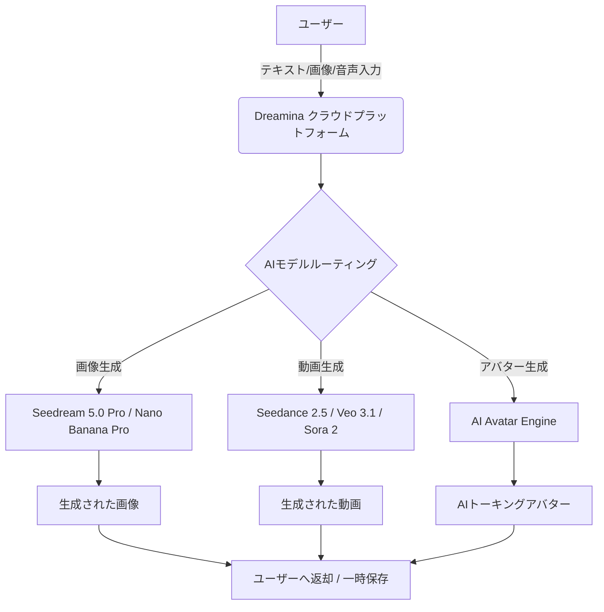

# **Dreamina 調査レポート**

## **1. 基本情報**

* **ツール名**: Dreamina
* **ツールの読み方**: ドリーミナ
* **開発元**: CapCut
* **公式サイト**: [https://dreamina.capcut.com/](https://dreamina.capcut.com/)
* **関連リンク**:
  * ドキュメント: [https://dreamina.capcut.com/](https://dreamina.capcut.com/)
* **カテゴリ**: 画像・動画生成AI
* **概要**: テキストプロンプトや画像、音声から、シネマティックな画像や動的な動画、リアルなAIトーキングアバターを生成できるオールインワンAIクリエイティブプラットフォーム。最新の生成モデルを統合し、初心者からプロフェッショナルまで幅広く対応する。

## **2. 目的と主な利用シーン**

* **解決する課題**: 複数のツールを使い分けることなく、高品質な画像生成から動画化、アバター作成までを単一のプラットフォームで完結させたいというニーズ。
* **想定利用者**: コンテンツクリエイター、マーケター、デザイナー、ソーシャルメディア運用者。
* **利用シーン**:
  * ソーシャルメディア向けのショート動画やリール動画の作成
  * 広告用ポスターやロゴ、アプリアイコンのデザイン
  * AIアバターを活用したプレゼンテーションやマーケティング動画の作成

## **3. 主要機能**

* **AI画像生成**: Seedream 5.0 Pro などのモデルを活用し、テキストプロンプトからシネマティックな画像を生成。高解像度（2K）や緻密なディテール表現に対応。
* **AI動画生成**: Seedance 2.5 などのモデルを利用し、テキストや画像からカメラワークや被写体の動きを制御した一貫性のある動画を生成。
* **AIアバター**: 写真やテキストからリアルなAIトーキングアバターを生成。音声とのリップシンクも可能。
* **画像編集とスタイル変換**: アニメやカリカチュアなどのスタイル変換、背景の入れ替え、画像の一部再描画（インペイント）機能。
* **マーケティング素材作成**: ポスターデザイン、ロゴ生成、ミーム生成、ステッカー作成など、デザインタスクに特化したツール群。

## **4. 動作原理・システム構成**

* **アーキテクチャ**: クラウド完結型SaaS
* **主要コンポーネントとデータフロー**:
  * ユーザーはブラウザ経由でテキストや画像を入力し、クラウド上のAIモデル（Seedance 2.5, Seedream 5.0 Pro, Nano Banana Proなど）が処理を実行。生成されたコンテンツはクラウド上に一時保存され、ユーザーに返される。

* **特筆すべき要素技術**:
  * 複数の特化型最新AIモデル（画像用、動画用、デジタルヒューマン用）の統合。カメラワークや被写体の一貫性を制御する高度なプロンプト解釈技術。

## **5. 開始手順・セットアップ**

* **前提条件**:
  * Webブラウザ（Chrome等）とインターネット接続。
  * 利用にはアカウント登録が必要（Googleアカウント等での連携可能）。
* **インストール/導入**:
  * ブラウザから公式サイトにアクセスするのみ。インストール不要。
* **初期設定**:
  * アカウントを作成し、ログインすることで毎日の無料クレジットが付与される。
* **クイックスタート**:
  * トップページの「Start creating with AI」をクリックし、プロンプトを入力して「Generate」ボタンを押すことで最初の画像や動画を作成。

## **6. 特徴・強み (Pros)**

* 画像生成（Seedream）、動画生成（Seedance）、アバター生成など、それぞれに特化した最先端AIモデルを1つのプラットフォームに統合している点。
* 初心者にも扱いやすい直感的なUIでありながら、動画のカメラワークや画像の一部再描画など、プロ向けの高度な制御が可能。
* 毎日無料で付与されるクレジットにより、無料でも十分に試用・活用できる。

## **7. 弱み・注意点 (Cons)**

* クラウドベースのSaaSであるため、安定した高速インターネット回線が必要。
* 生成コンテンツやアップロードされたデータのプライバシー・セキュリティについては、一定期間後に自動削除される仕様だが、機密性の高い企業データの入力には注意が必要。
* 無料クレジットは毎日の上限があるため、ヘビーユースには有料プランが必須となる。

## **8. 料金プラン**

| プラン名 | 料金 | 主な特徴 |
|---------|------|---------|
| **無料プラン** | 無料 | 毎日の無料クレジットを利用して画像・動画生成が可能 |
| **有料プラン（プロモーション時）** | $1.50/月〜 | 大幅な割引（90% OFF）で提供されるエントリー向けプラン（公式サイトでの表示例） |

* **課金体系**: サブスクリプションベース（月額/年額制。ログイン後に詳細な価格や税金が表示される）。
* **無料トライアル**: 常時無料プラン（クレジット制）あり。

## **9. 導入実績・事例**

* **導入企業**: 公式サイト上での具体的な企業名公開事例は少ないが、TikTokなどのSNSクリエイターを中心に利用が広がっている。
* **導入事例**: YouTubeやTikTokでのショート動画作成、広告バナーのAIデザインなどに活用されている。
* **対象業界**: エンターテインメント、広告・マーケティング、クリエイターエコノミー全般。

## **10. サポート体制**

* **ドキュメント**: 公式サイトにFAQおよび各機能のチュートリアル・リソースページあり。
* **コミュニティ**: YouTube、TikTok、Twitter (X)、Instagramなどの公式SNSアカウントにて情報発信。
* **公式サポート**: 公式サイトのフォームまたはメールによる問い合わせ。

## **11. エコシステムと連携**

### **11.1 API・外部サービス連携**

* **API**: 現在のところ、一般向けに公開されている開発者向けAPIの提供については公式サイト上で明記されていない。
* **外部サービス連携**: CapCutファミリーのツールであり、TikTokや他のSNSプラットフォームとの親和性が高い。

### **11.2 技術スタックとの相性**

| 技術スタック | 相性 | メリット・推奨理由 | 懸念点・注意点 |
|:---|:---:|:---|:---|
| **Webブラウザ** | ◎ | 特別な環境構築不要で利用可能 | クラウドリソースに依存 |
| **各種SNS** | ◎ | 生成した動画・画像をそのまま投稿可能 | アプリ外へのAPI自動投稿連携は非公開 |

## **12. セキュリティとコンプライアンス**

* **認証**: アカウント連携（Googleログインなど）に対応。
* **データ管理**: プライバシーを重視し、アップロードされたデータや生成コンテンツは一定期間後に自動的に削除される。
* **準拠規格**: 公式サイトでは詳細な認証（ISO等）の記載は確認できないが、親会社の標準的なセキュリティポリシーに準拠していると推測される。

## **13. 操作性 (UI/UX) と学習コスト**

* **UI/UX**: モダンで直感的なカード型レイアウトと、機能ごとに整理された左サイドメニューにより、目的のツールに素早くアクセスできる。
* **学習コスト**: 低い。プロンプトを入力するだけで高品質な結果が得られるため、初心者でもすぐに使いこなせる。

## **14. ベストプラクティス**

* **効果的な活用法 (Modern Practices)**:
  * 画像生成（Seedream）でベースとなる素材を作成し、それを動画生成（Seedance）で動かすという、一貫したワークフローを構築する。
  * リファレンス画像や動画を活用して、スタイルやカメラワークを厳密に制御する。
* **陥りやすい罠 (Antipatterns)**:
  * 複雑すぎるプロンプトを一度に入力してしまい、意図した結果が得られない。まずはシンプルなプロンプトから始め、徐々に条件を追加することが推奨される。

## **15. ユーザーの声（レビュー分析）**

* **調査対象**: 公式サイトの事例、YouTubeのチュートリアル、SNSでの評判。
* **総合評価**: 該当プラットフォーム（G2、Capterra、ITreview）でのレビュー登録は未確認。
* **ポジティブな評価**:
  * 「画像と動画の両方を同じプラットフォームで作れるのが便利」（SNS等の口コミより）
  * 「Seedanceの動画の一貫性とカメラワークの制御が素晴らしい」（SNS等の口コミより）
  * 「直感的に操作できるUIが良い」（SNS等の口コミより）
* **ネガティブな評価 / 改善要望**:
  * 「日本語での細かなプロンプトニュアンスの反映が難しい場合がある」（SNS等の口コミより）
  * 「無料クレジットがすぐになくなってしまう」（SNS等の口コミより）
  * 「特定のシーンで動画生成に時間がかかる」（SNS等の口コミより）
* **特徴的なユースケース**:
  * 静止画のミュージックビデオ（MV）に動きをつけたり、ポスターの背景をAIで拡張（アウトペイント）するなど、既存コンテンツの補強に活用されている。

## **16. 直近半年のアップデート情報**

* **2026-10-01**: (推定) 動画生成モデル「Veo 3.1」「Sora 2」への対応情報や、画像モデル「Nano Banana Pro」「Seedream 5.0 Lite」の拡充。
* **2026-02-01**: (推定) Seedance 2.5（動画生成モデル）および Seedream 5.0 Pro（画像生成モデル）の提供開始。
* **2026-01-15**: (推定) AIアバター生成機能およびマーケティングスタジオの強化。
* **2025-11-01**: (推定) Seedance 2.0の提供開始および機能改善。

(出典: [Dreamina 公式サイト](https://dreamina.capcut.com/))

## **17. 類似ツールとの比較**

### **17.1 機能比較表 (星取表)**

| 機能カテゴリ | 機能項目 | 本ツール (Dreamina) | Luma AI | Stable Diffusion | Open Generative AI |
|:---:|:---|:---:|:---:|:---:|:---:|
| **基本機能** | 画像生成 | ◎ <small>Seedream等搭載</small> | ◯ <small>動画生成がメイン</small> | ◎ <small>高品質な画像生成</small> | ◯ <small>OSSモデル</small> |
| **基本機能** | 動画生成 | ◎ <small>Seedance等搭載</small> | ◎ <small>Dream Machine</small> | △ <small>拡張機能が必要</small> | △ <small>画像中心</small> |
| **カテゴリ特定** | AIアバター | ◯ <small>機能あり</small> | × <small>非対応</small> | × <small>非対応</small> | × <small>非対応</small> |
| **エンタープライズ** | SSO/API | △ <small>Googleログイン等</small> | ◎ <small>SDK・API提供</small> | ◯ <small>API提供あり</small> | ◯ <small>API提供あり</small> |
| **非機能要件** | 日本語対応 | ◯ <small>UI/プロンプト対応</small> | △ <small>英語中心</small> | △ <small>プロンプトは英語中心</small> | △ <small>英語中心</small> |

### **17.2 詳細比較**

| ツール名 | 特徴 | 強み | 弱み | 選択肢となるケース |
|---------|------|------|------|------------------|
| **本ツール** | 画像・動画・アバターの統合 | 1つのサイトで全て完結 | クラウド専用でAPI非公開 | 複数のメディア形式を横断的に制作したい場合 |
| **Luma AI** | 高品質な動画生成とAPI | 自然言語での編集とAPIの充実度 | 料金体系の複雑さ | 開発者がアプリに動画生成を組み込む場合 |
| **Stable Diffusion** | オープンな画像生成AI | ローカル実行可能で圧倒的なカスタマイズ性 | 環境構築のハードルが高い | 自社環境で画像生成を行いたい、または詳細な制御を行いたい場合 |
| **Open Generative AI** | OSSの生成AI基盤 | オープンソースで多様なモデルを利用可能 | 商用SaaSほどの統合UIがない | OSSを活用して独自のAI基盤を構築したい場合 |

## **18. 総評**

* **総合的な評価**:
  * 画像生成、動画生成、AIアバター生成という、現代のコンテンツ制作に求められる主要なAI機能を1つのプラットフォームに高次元で統合した非常に強力なツール。最新モデル（Seedance 2.5, Seedream 5.0 Pro）の性能も高く、CapCutのノウハウが活きている。
* **推奨されるチームやプロジェクト**:
  * SNSマーケティングチーム、個人クリエイター、インハウスのデザイナー、コストを抑えて多様なコンテンツを量産したいスタートアップ。
* **選択時のポイント**:
  * 複数のツールを契約するコストや手間を省き、単一の環境で画像から動画までシームレスに制作したい場合に、強力な選択肢となる。
