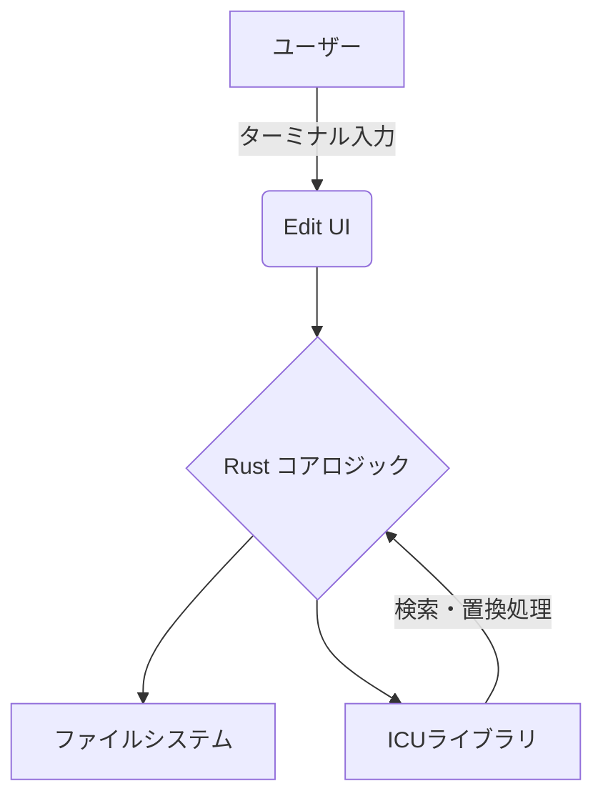

# **Edit 調査レポート**

## **1. 基本情報**

* **ツール名**: Edit (msedit)
* **ツールの読み方**: エディット / エムエスエディット
* **開発元**: Microsoft
* **公式サイト**: [https://github.com/microsoft/edit](https://github.com/microsoft/edit)
* **関連リンク**:
  * GitHub: [https://github.com/microsoft/edit](https://github.com/microsoft/edit)
  * ドキュメント: [https://github.com/microsoft/edit/blob/main/README.md](https://github.com/microsoft/edit/blob/main/README.md)
* **カテゴリ**: IDE/エディタ
* **概要**: Edit（msedit）は、クラシックなMS-DOS Editorにオマージュを捧げつつ、VS Codeのようなモダンなインターフェースと入力コントロールを備えたシンプルなテキストエディタです。ターミナルに不慣れなユーザーでも簡単に使えることを目指しています。

## **2. 目的と主な利用シーン**

* **解決する課題**: ターミナル環境における、複雑な操作を覚える必要のないシンプルで直感的なテキスト編集機能の提供。
* **想定利用者**: 開発者、サーバー管理者、ターミナル作業を行う全てのユーザー。
* **利用シーン**:
  * サーバー上での設定ファイルの簡単な編集
  * ターミナル環境でのスクリプトやテキストの作成・修正
  * リソースの限られた環境での軽量なテキスト編集

## **3. 主要機能**

* **モダンなインターフェース**: VS Codeライクな入力コントロールとキーバインドを提供。
* **シンタックスハイライト**: v2.0.0よりコンパイラを用いたシンタックスハイライト機能を追加。
* **検索・置換**: ICUライブラリを活用した高度な検索と置換機能。
* **マルチプラットフォーム対応**: Windows, macOS, Linuxで動作。
* **多言語対応**: ビルド時の設定により、複数言語のサポートが可能。

## **4. 動作原理・システム構成**

* **アーキテクチャ**: ローカル環境で動作するスタンドアロンなデスクトップアプリケーション。Rustで実装され、ネイティブバイナリとしてコンパイルされる。
* **主要コンポーネントとデータフロー**:
  * ターミナルインターフェース: MS-DOS風のUIを描画し、ユーザーからの入力を受け取る。
  * 検索・置換エンジン: ICUライブラリを利用した高度なテキスト処理。

* **特筆すべき要素技術**:
  * Rust言語を用いたメモリセーフな実装。
  * ICU (International Components for Unicode) による文字列操作のサポート。

## **5. 開始手順・セットアップ**

* **前提条件**:
  * 各OSに対応したパッケージマネージャー、またはRust（ソースからビルドする場合）
* **インストール/導入**:

  ```bash
  # Windows (WinGet)
  winget install Microsoft.Edit

  # macOS (Homebrew)
  brew install msedit

  # Linux (インストールスクリプト)
  curl --proto '=https' --tlsv1.2 -sSf https://raw.githubusercontent.com/microsoft/edit/main/assets/install.sh | sh
  ```

* **クイックスタート**:
  * ターミナルで `edit` または `msedit` と入力して起動。

## **6. 特徴・強み (Pros)**

* クラシックなMS-DOS Editorの使い勝手を現代風にアレンジした直感的な操作感。
* Vimなどの学習コストが高いエディタと異なり、VS Codeライクな操作で誰でもすぐに使い始められる。
* Rust言語で実装されており、軽量かつ高速に動作。

## **7. 弱み・注意点 (Cons)**

* 「シンプルなエディタ」を志向しているため、高度なIDE機能（コード補完、デバッガ連携など）は搭載されていない。
* システム上の既存の `edit` コマンドと名前が衝突する可能性がある（その場合は `msedit` の使用が推奨されている）。
* ソースからビルドする場合、CコンパイラやICUライブラリなどの依存関係が必要。

## **8. 料金プラン**

| プラン名 | 料金 | 主な特徴 |
|---------|------|---------|
| **オープンソース** | 無料 | MITライセンスで提供される完全無料のツール |

* **課金体系**: 完全無料 (オープンソース)
* **無料トライアル**: なし

## **9. 導入実績・事例**

* **導入企業**: オープンソースツールのため、世界中の開発者やコミュニティで利用されている。
* **対象業界**: ソフトウェア開発、サーバー保守、インフラ管理全般。

## **10. サポート体制**

* **ドキュメント**: GitHubリポジトリのREADMEおよびソースコード内のドキュメント。
* **コミュニティ**: GitHubのIssuesやDiscussionsを通じたユーザー間の交流やフィードバック。
* **公式サポート**: Microsoftのオープンソースプロジェクトとして、GitHub上でのコミュニティベースのサポート。

## **11. エコシステムと連携**

### **11.1 API・外部サービス連携**

* **API**: 単体のターミナルエディタであるため、外部公開APIは提供していない。
* **外部サービス連携**: コマンドラインツールとして、シェルスクリプトや他のCLIツールと組み合わせて利用可能。

### **11.2 技術スタックとの相性**

| 技術スタック | 相性 | メリット・推奨理由 | 懸念点・注意点 |
|:---|:---:|:---|:---|
| **ターミナル環境 (bash, zsh等)** | ◎ | コマンドラインからシームレスに呼び出せる | 特になし |
| **Rust環境** | ◎ | Cargoを用いてソースから簡単にビルド・カスタマイズ可能 | 特になし |

## **12. セキュリティとコンプライアンス**

* **認証**: デスクトップアプリケーションであるため、認証機能はなし。
* **データ管理**: ローカル環境で実行され、クラウドへのデータ送信は行わない。
* **準拠規格**: Microsoftのオープンソースセキュリティポリシーに準拠。

## **13. 操作性 (UI/UX) と学習コスト**

* **UI/UX**: MS-DOS Editor風の懐かしい見た目に、VS Codeに似た現代的な入力方式を採用。
* **学習コスト**: 非常に低い。Vimのような特殊なモードやキーバインドを覚える必要がなく、直感的に操作可能。

## **14. ベストプラクティス**

* **効果的な活用法 (Modern Practices)**:
  * サーバー上での設定ファイル（nginx.conf, sshd_configなど）の編集時の、VimやNanoの代替としての利用。
  * `msedit` エイリアスを活用して、既存のシステムコマンドとの競合を回避。
* **陥りやすい罠 (Antipatterns)**:
  * 大規模なプロジェクトのコードリーディングやリファクタリングなど、多機能IDEが適している場面での無理な利用。

## **15. ユーザーの声（レビュー分析）**

* **調査対象**: GitHubスター数、X (Twitter)、開発者フォーラム
* **総合評価**: 高評価 (GitHubスター数: 14.1k+)
* **ポジティブな評価**:
  * 「Vimの使い方を思い出せない時に、サクッと使える最高のエディタ」
  * 「DOS時代の懐かしさとモダンな操作感のバランスが良い」
* **ネガティブな評価 / 改善要望**:
  * 「名前が `edit` なので既存コマンドと衝突しやすいのが不便」
* **特徴的なユースケース**: 初心者向けのLinux/UNIX環境でのデフォルトエディタとしての導入。

## **16. 直近半年のアップデート情報**

* **2026-04-28**: v2.0.0 リリース - コンパイラを用いたシンタックスハイライト機能の追加など
* **2025-10-15**: v1.2.1 リリース - Windows 11 25H2に同梱される最終バイナリ。Windows用の実行可能アイコンを追加など
* **2025-06-11**: v1.2.0 リリース - 多数のバグ修正と新機能の追加

(出典: [GitHub Releases](https://github.com/microsoft/edit/releases))

## **17. 類似ツールとの比較**

### **17.1 機能比較表 (星取表)**

| 機能カテゴリ | 機能項目 | 本ツール | Kiro | Visual Studio Code |
|:---:|:---|:---:|:---:|:---:|
| **基本機能** | テキスト編集 | ◎<br><small>直感的で使いやすい</small> | ◎<br><small>スペック駆動開発</small> | ◎<br><small>多機能</small> |
| **操作性** | 学習コストの低さ | ◎<br><small>VS Codeライクな操作</small> | △<br><small>独自フローの学習が必要</small> | ◯<br><small>GUIベース</small> |
| **環境** | ターミナル動作 | ◎<br><small>ネイティブ対応</small> | ◯<br><small>CLIツール提供</small> | △<br><small>基本はGUI</small> |
| **拡張性** | プラグイン | ×<br><small>非対応</small> | ◯<br><small>スキル等による拡張</small> | ◎<br><small>非常に豊富</small> |

### **17.2 詳細比較**

| ツール名 | 特徴 | 強み | 弱み | 選択肢となるケース |
|---------|------|------|------|------------------|
| **本ツール (Edit)** | 直感的なターミナルエディタ | 学習コストが低く軽量 | 拡張機能がない | サーバーで手軽にファイルを編集したい場合 |
| **Kiro** | AWS発のスペック駆動開発エディタ | 要件定義から実装までの自律エージェント支援 | 日本語ドキュメントやUIが英語中心 | AWS環境で設計から実装までを構造的に進めたい場合 |
| **Visual Studio Code** | 多機能なGUIエディタ | 圧倒的な拡張性と機能群 | リソース消費が大きい、GUIが必要 | 本格的なソフトウェア開発を行う場合 |

## **18. 総評**

* **総合的な評価**: Edit (msedit) は、ターミナル環境でのテキスト編集における「Vimのような学習コスト」という障壁を取り払う、優れたシンプルエディタです。
* **推奨されるチームやプロジェクト**: ターミナル操作に不慣れなメンバーが多いチーム、または手軽な設定ファイル編集ツールを求めているインフラ管理者。
* **選択時のポイント**: 本格的なコーディングではなく、「ちょっとしたファイルの編集」をターミナル上で行いたい場合に、Nanoの代替、またはVimを避けるための最良の選択肢となります。
