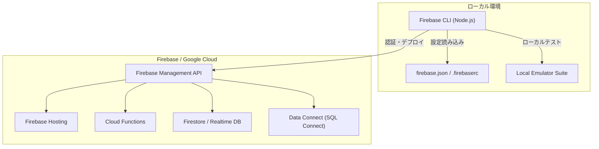

# **Firebase CLI 調査レポート**

## **1. 基本情報**

* **ツール名**: Firebase CLI
* **ツールの読み方**: ファイアベース・シーエルアイ
* **開発元**: Google
* **公式サイト**: [https://firebase.google.com/docs/cli](https://firebase.google.com/docs/cli)
* **関連リンク**:
  * GitHub: [https://github.com/firebase/firebase-tools](https://github.com/firebase/firebase-tools)
* **カテゴリ**: 開発者ツール
* **概要**: Firebaseプロジェクトの管理、リソースの表示、デプロイなどを行うためのコマンドラインインターフェース。Cloud Functionsのデプロイ、Hostingの設定、セキュリティルールのテストなどをローカル環境からシームレスに実行できます。

## **2. 目的と主な利用シーン**

* **解決する課題**: Firebaseプロジェクトの構成管理、クラウド環境へのデプロイ、ローカルでの動作確認（エミュレーション）を自動化・効率化する。
* **想定利用者**: アプリケーション開発者、バックエンドエンジニア、DevOpsエンジニア
* **利用シーン**:
  * Firebase HostingへのWebサイトやアセットのデプロイ
  * Cloud Functions for Firebaseのコードのデプロイと管理
  * Local Emulator Suiteを使用した、クラウド環境のローカルでのモックテスト
  * CI/CDパイプライン（GitHub Actionsなど）での自動デプロイメントの実行

## **3. 主要機能**

* **プロジェクトの初期化と管理**: `firebase init`コマンドを使用して、プロジェクトディレクトリを設定し、関連するFirebaseプロダクト（Hosting、Functions、Firestoreなど）の構成ファイル（`firebase.json`など）を自動生成します。
* **クラウドへのデプロイ**: `firebase deploy`コマンドにより、設定されたFirebaseサービス（Hosting、Functions、データベースのセキュリティルールなど）を一度に、または指定してデプロイできます。
* **Local Emulator Suiteの実行**: `firebase emulators:start`により、Firestore、Realtime Database、Authentication、Functionsなどのローカルエミュレーターを起動し、本番環境に影響を与えずに安全にテストできます。
* **プロジェクトの切り替え**: `firebase use`コマンドを使用して、開発用、ステージング用、本番用など、複数のFirebaseプロジェクトエイリアスを簡単に切り替えることができます。
* **CI/CDの統合**: 認証トークンやApplication Default Credentials（ADC）を使用することで、ヘッドレス環境（CIシステム）でのコマンド実行をサポートしています。
* **Data Connect (SQL Connect) エミュレーション**: PostgreSQLベースのData Connectエミュレータを実行し、GraphQLクエリやミューテーションのローカルテストを可能にします。
* **MCP (Model Context Protocol) ツール対応**: AIエージェント等がCLIの機能を直接呼び出してデプロイやテストを実行できるようにするためのMCPサーバー機能を内蔵しています。

## **4. 動作原理・システム構成**

* **アーキテクチャ**: クライアント（CLI）からFirebase/Google CloudのAPIエンドポイントへの通信、およびローカル環境でのエミュレーション（Local Emulator Suite）を組み合わせた構成。
* **主要コンポーネントとデータフロー**:
  * **CLIコア**: Node.jsで実行され、コマンド解析とAPI連携を担う。
  * **ローカルエミュレータ**: `firebase emulators:start` 時にローカルでプロセスとして立ち上がり、Firestore、Functions、Data Connect（SQL Connect）などをモックする。
  * **デプロイフロー**: プロジェクト内のコード（Functions等）やアセット（Hosting等）をバンドルし、Firebase Management APIなどを経由してGoogle Cloudインフラにプッシュする。



* **特筆すべき要素技術**:
  * **MCP (Model Context Protocol)**: CLI内でMCPサーバー機能を提供し、Agentからの操作や情報をやり取りする。
  * **Application Default Credentials (ADC)**: CI/CD環境などでのセキュアな認証。

## **5. 開始手順・セットアップ**

* **前提条件**:
  * Node.js (v18.0.0以上推奨) がインストールされていること。
  * Firebaseプロジェクトがセットアップされていること。
* **インストール/導入**:
  スタンドアロンバイナリ、またはnpm経由でインストール可能です。

  ```bash
  # npmを使用したインストール
  npm install -g firebase-tools
  ```

* **初期設定**:
  1. アカウントへのログイン:

     ```bash
     firebase login
     ```

  2. プロジェクトディレクトリの初期化（アプリのルートディレクトリで実行）:

     ```bash
     firebase init
     ```

* **クイックスタート**:
  機能の開発・設定が完了したら、以下のコマンドでデプロイを行います。

  ```bash
  firebase deploy
  ```

## **6. 特徴・強み (Pros)**

* **Firebaseとの完全な統合**: Googleが提供する公式ツールであり、Firebaseの全プロダクトとシームレスに連携します。
* **ローカルでのテスト機能**: Local Emulator Suiteが非常に強力で、クラウド環境をローカルで再現することで、開発サイクルを大幅に短縮できます。
* **クロスプラットフォーム対応**: Windows、macOS、Linuxの各OS向けにスタンドアロンバイナリやnpmパッケージとして提供されており、環境を選ばずに利用できます。

## **7. 弱み・注意点 (Cons)**

* **Node.jsへの依存**: npm経由でインストールする場合、特定のNode.jsバージョン（v18以上など）に依存するため、環境のバージョン管理が必要です。
* **コマンドの複雑さ**: 提供する機能が多岐にわたるため、一部の高度なコマンド（特定の機能のデプロイやエミュレータの特定設定など）は学習コストがかかる場合があります。
* **Firebaseに特化**: 当然ながら、Firebase以外のバックエンドサービスやインフラ管理には使用できません（AWS CLIやTerraformとは目的が異なります）。

## **8. 料金プラン**

| プラン名 | 料金 | 主な特徴 |
|---------|------|---------|
| **無料プラン** | 無料 | CLIツール自体は無料でオープンソースとして提供されています。 |

* **課金体系**: ツール自体の利用は無料です。ただし、CLIを使用してデプロイしたFirebaseプロジェクトのリソース（Hostingの転送量、Functionsの実行回数、Firestoreの読み書きなど）は、Firebaseの料金プラン（Sparkプラン、Blazeプラン）に従って課金されます。

## **9. 導入実績・事例**

* **導入企業**: Firebaseを利用している世界中のスタートアップから大企業（Google、Duolingo、The New York Timesなど）の開発チームで広く利用されています。
* **導入事例**: モバイルアプリやWebアプリのバックエンドとしてFirebaseを採用しているプロジェクトにおいて、日常的なデプロイ作業やCI/CDパイプラインの構築ツールとして活用されています。
* **対象業界**: モバイルアプリ開発、Webアプリケーション開発、ゲーム開発など、業界を問わずFirebaseを利用するすべての領域。

## **10. サポート体制**

* **ドキュメント**: 公式のFirebaseドキュメント内にCLI専用の詳細なリファレンスが用意されており、コマンドのオプションや設定ファイルの記述方法が網羅されています。
* **コミュニティ**: GitHub上のオープンソースリポジトリ（`firebase-tools`）にて、Issueの報告や機能要望が活発に行われています。また、Stack Overflow等の開発者コミュニティでも多数の知見が共有されています。
* **公式サポート**: Firebaseの公式サポートチャネルを通じて、CLIに関連する問題についてもサポートを受けることができます。

## **11. エコシステムと連携**

### **11.1 API・外部サービス連携**

* **API**: CLI自体はコマンドラインツールですが、内部的にはFirebase Management APIや各プロダクトのAPIを呼び出しています。
* **外部サービス連携**: CI/CDツール（GitHub Actions, GitLab CI, CircleCIなど）と組み合わせて使用することが一般的です。
* **MCP (Model Context Protocol) 連携**: AIエージェント（Cursor, Claude Desktopなど）と連携するためのMCPサーバーとして機能し、エージェントからの直接デプロイや情報取得が可能です。

### **11.2 技術スタックとの相性**

| 技術スタック | 相性 | メリット・推奨理由 | 懸念点・注意点 |
|:---|:---:|:---|:---|
| **Node.js** | ◎ | Firebase Cloud Functionsの主要言語であり、CLIもNode.jsベースで動作するため親和性が極めて高い。 | 特になし。 |
| **GitHub Actions** | ◎ | 公式からデプロイ用のActionが提供されており、自動化パイプラインの構築が容易。 | トークンや認証情報のセキュアな管理が必要。 |
| **Flutter / Dart** | ◎ | FlutterFireとの連携で、モバイルアプリのバックエンドデプロイメントがスムーズに行える。 | 特になし。 |

## **12. セキュリティとコンプライアンス**

* **認証**: `firebase login`によるGoogleアカウントを用いたOAuth認証、またはCI環境向けのApplication Default Credentials (ADC) をサポートしています。
* **データ管理**: CLI自体はユーザーの設定情報やコードをデプロイするのみで、データを永続的に保持しません。デプロイされたデータはFirebaseのインフラ上でGoogleのセキュリティ基準に従って管理されます。
* **準拠規格**: Firebaseプラットフォーム全体として、ISO 27001、SOC 1/2/3などの主要なセキュリティ認証に準拠しています。

## **13. 操作性 (UI/UX) と学習コスト**

* **UI/UX**: コマンドラインインターフェースでありながら、対話型のプロンプト（`firebase init`など）を備えており、直感的にプロジェクトの設定を進めることができます。
* **学習コスト**: 基本的なデプロイ（`firebase deploy`）は非常に簡単ですが、特定のサービス（例: Cloud Functionsのみ）のデプロイや、複数環境（エイリアス）の管理、セキュリティルールのデバッグなどは、公式ドキュメントを読み込む必要があります。

## **14. ベストプラクティス**

* **効果的な活用法 (Modern Practices)**:
  * **Local Emulator Suiteの活用**: クラウドにデプロイする前に、必ずローカルエミュレータでCloud Functionsやセキュリティルールのテストを行うことで、バグを早期に発見し、開発速度を向上させます。
  * **プロジェクトエイリアスの利用**: `firebase use`を使用して、`staging`や`prod`などのエイリアスを設定し、環境ごとのデプロイミスを防ぎます。
  * **部分的なデプロイ**: `firebase deploy --only functions,hosting`のように`--only`フラグを使用して、変更があったリソースのみをデプロイし、デプロイ時間を短縮します。
* **陥りやすい罠 (Antipatterns)**:
  * **CI/CD環境でのトークン管理**: `FIREBASE_TOKEN`（レガシーな方法）の漏洩リスク。現在はApplication Default Credentials (ADC) の使用が推奨されています。
  * **`.firebaserc`の誤ったコミット**: 個人の開発用エイリアスが含まれる場合があるため、チーム開発ではコミットルールに注意が必要です。

## **15. ユーザーの声（レビュー分析）**

* **調査対象**: 公式ドキュメント、GitHubリポジトリのIssue、技術ブログなど。
* **総合評価**: 公式ツールとして広く受け入れられており、必須のツールとして高い評価を得ています。
* **ポジティブな評価**:
  * 「`firebase init`による対話型のセットアップが非常にわかりやすい」
  * 「エミュレータ機能のおかげで、本番環境を汚さずにセキュアなテストができる」
* **ネガティブな評価 / 改善要望**:
  * 「Node.jsのバージョンアップデートに伴い、時折互換性の問題が生じることがある」
  * 「大規模なCloud Functionsをデプロイする際、時間がかかる、またはクォータエラーになることがある」
* **特徴的なユースケース**:
  * 複雑なセキュリティルール（Firestore, Realtime Database）をローカルエミュレータ上で自動テストするCIパイプラインの構築。

## **16. 直近半年のアップデート情報**

* 公式ドキュメントによると、Firebase CLIは継続的にアップデートが行われています。最新のリリース情報はGitHubリポジトリの [Releases](https://github.com/firebase/firebase-tools/releases) または `CHANGELOG.md` で確認できます。

* **2024-09-14 (v15.30.1)**: IAMおよびCloud Resource ManagerのセキュリティAPIが無効なプロジェクトにおいて、迅速なエラーと修復手順を提供するよう改善。宣言型セキュリティ関連のサービスアカウントのクリーンアップ問題を修正。
* **2024-09-09 (v15.30.0)**: SQL Connectローカルツールキット(v3.4.19)への更新、PostgreSQLエミュレータのバグ修正。GraphQLクエリ用の `dataconnect_execute_in_emulator` コマンドを追加。MCPツールの連携用プロキシサーバー設定を追加。
* **2024-09-02 (v15.29.0)**: デバッグログの出力先をカスタマイズできる `FIREBASE_DEBUG_PATH` 環境変数をサポート。MCPツールのリスト出力に `humanReadableDescription` を追加。
* **2024-08-28 (v15.28.2)**: サービスアカウント作成における404エラーの競合状態を防ぐため、シークレットへのアクセス権付与をリリースフェーズに遅延させるよう修正。App Hostingのポーリングタイムアウトを60分に延長。
* **2024-08-19 (v15.28.0)**: Deploy MCPツールにおける認証エラーを修正し、`login` MCPツールに `reauth` オプションを追加。非推奨の拡張機能に対する移行追跡ツールを追加。

(出典: [Firebase CLI Releases](https://github.com/firebase/firebase-tools/releases) )

## **17. 類似ツールとの比較**

### **17.1 機能比較表 (星取表)**

| 機能カテゴリ | 機能項目 | Firebase CLI | AWS CLI | Supabase CLI |
|:---:|:---|:---:|:---:|:---:|
| **基本機能** | デプロイ管理 | ◎<br><small>Firebaseエコシステムに特化し最適化</small> | ◎<br><small>AWSの全リソースを網羅的に管理</small> | ◯<br><small>Supabaseプロジェクトの管理・デプロイ</small> |
| **開発体験** | ローカルエミュレータ | ◎<br><small>Local Emulator Suiteが強力で充実</small> | △<br><small>AWS SAM Local等があるが設定が複雑</small> | ◯<br><small>ローカルでの開発環境構築をサポート</small> |
| **汎用性** | 対応サービス範囲 | △<br><small>Firebaseプロダクトに限定される</small> | ◎<br><small>AWS上のほぼすべてのサービスを操作可能</small> | △<br><small>Supabaseエコシステムに限定される</small> |
| **非機能要件** | 設定の容易さ | ◎<br><small>対話型コマンドで初心者にも優しい</small> | ◯<br><small>強力だがパラメータが多く学習曲線が急</small> | ◯<br><small>初期設定は比較的容易</small> |

### **17.2 詳細比較**

| ツール名 | 特徴 | 強み | 弱み | 選択肢となるケース |
|---------|------|------|------|------------------|
| **Firebase CLI** | Firebase専用のデプロイ・管理ツール | Firebaseとの完璧な統合、対話型UI、強力なローカルエミュレータ | Firebase以外のインフラ管理には使用不可 | バックエンドとしてFirebaseを採用しているすべてのプロジェクト |
| **AWS CLI** | AWSリソースを管理する汎用CLI | AWSのほぼすべてのサービスをコマンドラインから制御可能 | コマンドとオプションが膨大で学習コストが高い | AWSエコシステムを利用してインフラを構築・運用する場合 |
| **Supabase CLI** | Firebase代替として人気のSupabase用CLI | ローカルでのPostgreSQL開発環境の構築とマイグレーション管理 | Firebaseほどエミュレータの機能が多岐にわたらない | RDB(PostgreSQL)をベースとしたバックエンドを好む場合 |

## **18. 総評**

* **総合的な評価**:
  Firebase CLIは、Firebaseを利用する開発者にとって単なるデプロイツールを超えた、開発ワークフロー全体を支える中核的な基盤です。強力なLocal Emulator Suiteや直感的なコマンド体系に加え、Data Connect（SQL Connect）によるRDBサポート強化やMCP対応など、最新のパラダイムにも追従し続けています。
* **推奨されるチームやプロジェクト**:
  モバイルアプリ開発やフロントエンド主体のWebアプリ開発など、BaaSの強みを最大限に活かしたいアジャイルな開発チームに最適です。特にローカルでのテスト自動化やCI/CD連携を重視するプロジェクトに強力な効果を発揮します。
* **選択時のポイント**:
  Firebaseを採用するなら必須のツールです。バックエンド全体をAWSなどで構築する場合はAWS CLI、フロントエンドのホスティングに特化するならVercel、エッジ環境での分散処理を重視するならCloudflare Workers (Wrangler) と比較し、プロジェクトのアーキテクチャ特性に応じて適切なプラットフォームとCLIを選定することが重要です。
