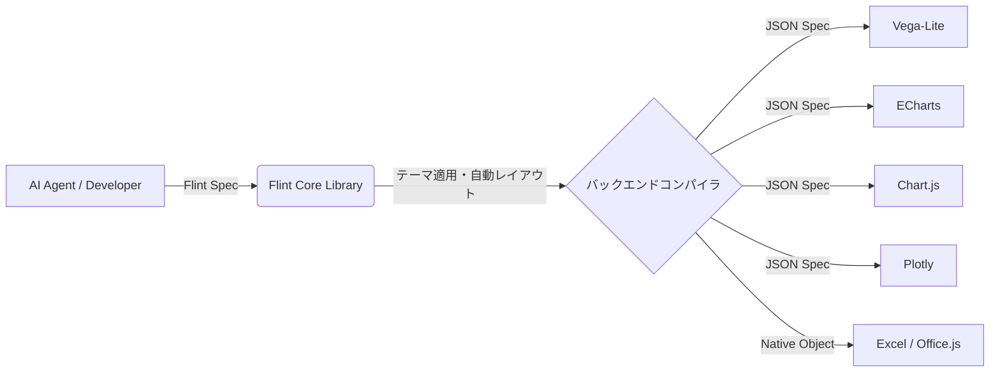

# **Flint 調査レポート**

## **1. 基本情報**

* **ツール名**: Flint
* **ツールの読み方**: フリント
* **開発元**: Microsoft Research
* **公式サイト**: [https://microsoft.github.io/flint-chart/](https://microsoft.github.io/flint-chart/)
* **関連リンク**:
  * GitHub: [https://github.com/microsoft/flint-chart](https://github.com/microsoft/flint-chart)
* **カテゴリ**: データビジュアライゼーション
* **概要**: AIエージェントが人間にも編集可能なシンプルなチャート仕様（中間言語）から、表現豊かで洗練された可視化を生成するためのツール。Vega-Lite、ECharts、Chart.js、Plotly、Excelといった複数の描画バックエンドに対応している。

## **2. 目的と主な利用シーン**

* **解決する課題**: AIエージェントや開発者がチャートを作成する際、スケールや軸、余白、ラベル、レイアウトなどの詳細な設定（パラメーターチューニング）を行う手間を省き、データや意味付けに基づいた自動レイアウトを実現する。
* **想定利用者**: AIエージェント開発者、フロントエンドエンジニア、データサイエンティスト
* **利用シーン**:
  * AIエージェント（チャットUIなど）の回答内で、動的かつ洗練されたチャートを即座に生成してユーザーに提示する
  * フロントエンドアプリケーションで、単一のコードから様々なバックエンド（Chart.jsやEChartsなど）向けにチャートを描画する
  * 企業やブランドのビジュアルテーマを統一したダッシュボードを構築する

## **3. 主要機能**

* **セマンティックチャート仕様**: 「ランク」「温度」「価格」「国」など70以上のセマンティックタイプを用いてデータの意味を定義し、適切な可視化を支援する。
* **自動レイアウト**: データのカーディナリティ（要素数）やチャートの設計、キャンバスの制約に合わせて、サイズ、余白、ラベル、マーク、凡例を自動的に最適化する。
* **フォーマルなビジュアルテーマ**: New York Times風、Economist風など10種類の組み込みプリセットが用意されており、レイアウトや配色、タイポグラフィを一貫して適用できる。
* **マルチバックエンド対応**: 1つの入力から、Vega-Lite、ECharts、Chart.js、Plotly、さらにはExcel（Office.js経由）のネイティブ仕様へコンパイル可能。
* **エージェント向けチャート作成支援（MCP対応）**: MCPサーバーとして機能し、AIエージェントがチャットやコーディング環境から直接チャートを作成、検証、レンダリングできる。
* **動的チャートウィジェット機能**: チャートのタイプを切り替えたり、プロパティをインプレースで編集したりできる機能（v0.3.0より）。

## **4. 動作原理・システム構成**

* **アーキテクチャ**: ローカルおよびクライアントサイド完結型（JavaScript/TypeScriptライブラリ）＋ エージェント連携用MCPサーバー
* **主要コンポーネントとデータフロー**:
  * ユーザーまたはAIエージェントがシンプルな「Flint Spec（中間言語）」を定義する。
  * `flint-chart` コアライブラリが入力データとテーマ定義を解析し、セマンティックな意味合いやレイアウトの自動調整（余白や軸の設定など）を計算する。
  * 選択されたバックエンドモジュール（Vega-Lite, ECharts, Chart.js等）へ処理が渡され、各ライブラリ専用のネイティブ設定オブジェクト（JSONなど）が出力される。
  * MCPサーバー（`flint-chart-mcp`）を介する場合、LLMはMCPのToolを利用してデータを渡し、静的画像やインタラクティブなチャートビューの表示要求をクライアントへ返す。
* **特筆すべき要素技術**:
  * Model Context Protocol (MCP): LLMエージェントがローカルツールを呼び出すための標準プロトコル。



## **5. 開始手順・セットアップ**

* **前提条件**:
  * Node.js 18以上
  * アカウント作成は不要
* **インストール/導入**:

  ```bash
  # アプリケーションコードへのライブラリとしてのインストール
  npm install flint-chart

  # MCPサーバーとしてのインストール（AIエージェント用）
  npx -y flint-chart-mcp
  ```

* **初期設定**:
  * ライブラリとして使用する場合は特別な認証やキーは不要。ソースコード内でモジュールをインポートする。
* **クイックスタート**:
  ```typescript
  import { assembleVegaLite } from 'flint-chart';

  // 1つのSpecからVega-Liteのネイティブ設定を生成
  const spec = assembleVegaLite({
    data: { values: myData },
    semantic_types: { weight: 'Quantity', mpg: 'Quantity', origin: 'Country' },
    chart_spec: {
      chartType: 'Scatter Plot',
      encodings: { x: { field: 'weight' }, y: { field: 'mpg' }, color: { field: 'origin' } },
      baseSize: { width: 400, height: 300 },
    },
    theme_spec: 'economist', // テーマの適用
  });
  ```

## **6. 特徴・強み (Pros)**

* AIエージェントに最適化されているため、人間が書くような冗長な描画ライブラリの設定パラメーターをLLMに出力させる必要がない。
* 複数のフロントエンド描画ライブラリ（Vega-Lite、EChartsなど）に1つの仕様で対応できるため、既存の技術スタックに組み込みやすい。
* テーマのプリセットが豊富で、かつカスタマイズも可能なため、デザインの統一感を簡単に実現できる。
* Excelネイティブチャートの生成にも対応している点は、ビジネスレポートの自動化において大きな強みとなる。

## **7. 弱み・注意点 (Cons)**

* Python版はソースのみのプレビュー段階（パッケージリリース前）であり、Pythonエコシステム（Jupyter Notebookなど）での利用はこれからの発展に期待。
* 描画ライブラリに依存するため、各ライブラリの極めて特殊な拡張機能やカスタム描画をFlint仕様から完全に制御するのは難しい場合がある。
* 公式ドキュメントの多くは英語ベースであり、日本語による情報はまだ少ない。

## **8. 料金プラン**

| プラン名 | 料金 | 主な特徴 |
|---------|------|---------|
| **オープンソース (MIT)** | 無料 | すべての機能が利用可能 |

* **課金体系**: 完全無料（オープンソース）
* **無料トライアル**: 該当なし

## **9. 導入実績・事例**

* **導入企業**: Microsoft Research発のプロジェクトであり、一般企業の導入事例はまだ広く公開されていない。
* **導入事例**: AIエージェントフレームワークやチャットUIにおける可視化ツールとしての試験的な組み込みが想定される。
* **対象業界**: ソフトウェア開発、AIプラットフォーム開発、データ分析

## **10. サポート体制**

* **ドキュメント**: [公式プロジェクトサイト](https://microsoft.github.io/flint-chart/)、APIリファレンス、テーマガイドなどがGitHubリポジトリ内に整備されている。
* **コミュニティ**: GitHub IssuesおよびPull Requestsによるオープンソースコミュニティ。
* **公式サポート**: なし（コミュニティベースのサポート）。

## **11. エコシステムと連携**

### **11.1 API・外部サービス連携**

* **API**: JavaScript/TypeScriptのAPIを提供。
* **外部サービス連携**: Model Context Protocol (MCP) を通じたAIエージェント（Claude Desktopなど）との連携、Office.jsを介したExcelとの連携。

### **11.2 技術スタックとの相性**

| 技術スタック | 相性 | メリット・推奨理由 | 懸念点・注意点 |
|:---|:---:|:---|:---|
| **Node.js / TypeScript** | ◎ | ファーストクラスサポート、型定義完備 | 特になし |
| **React / Next.js** | ◎ | 生成したJSONを各種React向けラッパー（recharts, echarts-for-react等）へ流し込みやすい | 特になし |
| **Python** | △ | 現状はプレビュー版のみ | パッケージの正式リリース待ち |
| **AI エージェント (MCP対応)** | ◎ | `flint-chart-mcp` を用いることでシームレスに統合可能 | クライアント側がMCPに対応している必要がある |

## **12. セキュリティとコンプライアンス**

* **認証**: ローカルライブラリおよびローカルMCPサーバーとして動作するため、ツール自体への認証メカニズムは不要。
* **データ管理**: データは処理を行うローカル環境内、または組み込まれたアプリケーション内で完結し、外部のサーバーへ送信されることはない。
* **準拠規格**: 公式サイトでは特定の認証（SOC2等）の明記はないが、オープンソースであり自己ホスト可能なため、企業のセキュリティ要件に合わせやすい。

## **13. 操作性 (UI/UX) と学習コスト**

* **UI/UX**: デモサイトにはインタラクティブなライブエディターがあり、コードとプレビューの対応が分かりやすい。
* **学習コスト**: Vega-Liteなどのネイティブ仕様を直接書くよりも記述量が少なく、抽象度が高いため、初期の学習コストは低い。ただし、テーマの詳細なカスタマイズを行う場合はFlint固有の仕様への理解が必要。

## **14. ベストプラクティス**

* **効果的な活用法 (Modern Practices)**:
  * MCPサーバーとしてLLMに登録し、LLMにデータソース（CSVやJSON）を渡して「このデータでEconomist風の棒グラフを作って」と指示するフロー。
  * 組織固有のブランドテーマを事前に定義（`extends`を利用した継承）しておき、開発チーム全体で共通のテーマ仕様（ThemeSpec）を利用する構成。
* **陥りやすい罠 (Antipatterns)**:
  * バックエンド専用の細かい微調整が必要な要件において、Flintのレイヤーで無理にハックしようとすること。要件が極めて特殊な場合は、Flintが生成したネイティブSpec（JSON）を受け取った後に、アプリケーション側で直接プロパティを上書き・修正する方が早い場合がある。

## **15. ユーザーの声（レビュー分析）**

* **調査対象**: GitHub, X(Twitter)など
* **総合評価**: G2やCapterraでのスコアは未登録
* **ポジティブな評価**:
  * AIエージェントとの連携が非常にスムーズで、MCPのユースケースとして優れている。
  * 出力先として複数の著名な描画ライブラリを選べる点が便利。
  * 組み込みのテーマ（New York Times風など）が高品質で、手間をかけずに美しいグラフができる。
* **ネガティブな評価 / 改善要望**:
  * Python環境向けの正式なパッケージリリースが待ち遠しい。
* **特徴的なユースケース**:
  * Claude DesktopにMCPサーバーとして追加し、ローカルのCSVファイルの内容をチャット上で可視化して分析する。

## **16. 直近半年のアップデート情報**

* **2026-08-05**: バージョン0.5.0リリース。ビジュアルシステム全体を定義できるフォーマルな「テーマ仕様」を追加（New York Times, Economistなど10種のプリセット）。
* **2026-07-24**: バージョン0.4.0リリース。38種類のPlotlyチャートタイプと、18種類のExcelネイティブチャートテンプレートを追加。
* **2026-07-19**: バージョン0.3.0リリース。チャートウィジェットを動的に切り替えたり、プロパティをインプレースで編集する機能を追加。
* **2026-07-13**: バージョン0.2.1リリース。チャートプロパティの検証とバックエンドの一貫性を向上。

(出典: [GitHub Releases](https://github.com/microsoft/flint-chart/releases))

## **17. 類似ツールとの比較**

### **17.1 機能比較表 (星取表)**

| 機能カテゴリ | 機能項目 | 本ツール (Flint) | Vega-Lite | ECharts |
|:---:|:---|:---:|:---:|:---:|
| **基本機能** | 描画の抽象化 | ◎<br><small>高度な抽象化による自動レイアウト</small> | ◯<br><small>文法ベースの宣言的記述</small> | ◯<br><small>設定オブジェクトベース</small> |
| **拡張性** | マルチバックエンド | ◎<br><small>5種類のバックエンドに出力可能</small> | ×<br><small>Vega出力のみ</small> | ×<br><small>Canvas/SVG出力のみ</small> |
| **エンタープライズ** | AI連携(MCP) | ◎<br><small>MCPサーバー標準提供</small> | △<br><small>独自実装が必要</small> | △<br><small>独自実装が必要</small> |
| **非機能要件** | テーマ機能 | ◎<br><small>10種のプリセットと継承機能</small> | ◯<br><small>設定ファイルで対応</small> | ◯<br><small>専用テーマビルダあり</small> |

### **17.2 詳細比較**

| ツール名 | 特徴 | 強み | 弱み | 選択肢となるケース |
|---------|------|------|------|------------------|
| **本ツール** | AI向けの中間言語。複数ライブラリへコンパイル。 | MCP対応、AIに最適化されたシンプルな仕様、テーマの一貫性。 | 描画ライブラリ固有の超詳細なカスタマイズには向かない。Python未提供。 | AIエージェントにグラフを描かせたい場合や、フロントで複数の描画ライブラリを使い分ける場合。 |
| **Vega-Lite** | データ可視化の文法に基づく高レベルな宣言的仕様。 | インタラクションも含めた厳密な文法定義。学術的基盤。 | 仕様が冗長になりがちでLLMには出力させにくい場合がある。 | データ探索用のインタラクティブな可視化を厳密に構築したい場合。 |
| **ECharts** | Apacheによる強力な描画ライブラリ。 | 描画パフォーマンスが高く、チャートの種類が非常に豊富。 | 設定オブジェクトが巨大になりやすく、学習コストが高い。 | 大量のデータを扱う場合や、複雑で特殊なチャート（3Dなど）を描画したい場合。 |

## **18. 総評**

* **総合的な評価**:
  Flintは、AI時代においてLLMに「美しいグラフを描かせる」という課題に対するスマートな解決策です。既存の強力な描画ライブラリ（Vega-Lite、ECharts等）を置き換えるのではなく、それらの上に「AIフレンドリーな中間レイヤー」を構築した点が高く評価できます。MCPサーバーの標準提供や、デザイン性の高いテーマ機能により、実用性が非常に高いツールとなっています。
* **推奨されるチームやプロジェクト**:
  AIエージェント（チャットボットやコーディングアシスタント）を開発しているチーム、社内ダッシュボードのデザインを統一したいフロントエンドチームに強く推奨されます。
* **選択時のポイント**:
  AIから直接可視化を生成するフローを構築したい場合は、Flint（およびMCP）の導入が第一選択肢となります。一方、特定の描画ライブラリのニッチな機能を極限まで使い倒したい場合は、Flintを挟まずに直接そのライブラリを使用する方が適している可能性があります。
