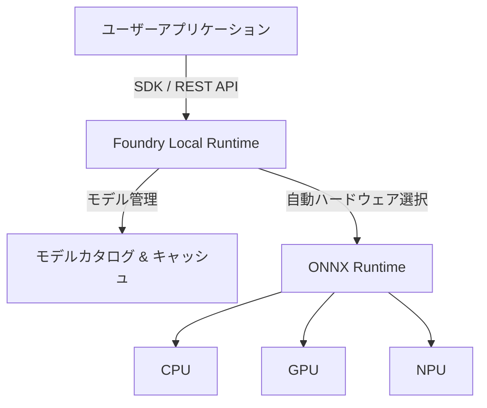

# **Foundry Local 調査レポート**

## **1. 基本情報**

* **ツール名**: Foundry Local
* **ツールの読み方**: ファウンドリ ローカル
* **開発元**: Microsoft
* **公式サイト**: [https://learn.microsoft.com/en-us/azure/ai-foundry/foundry-local/what-is-foundry-local?view=foundry-classic](https://learn.microsoft.com/en-us/azure/ai-foundry/foundry-local/what-is-foundry-local?view=foundry-classic)
* **関連リンク**:
  * ドキュメント: [https://learn.microsoft.com/en-us/azure/ai-foundry/foundry-local/get-started?view=foundry-classic](https://learn.microsoft.com/en-us/azure/ai-foundry/foundry-local/get-started?view=foundry-classic)
* **カテゴリ**: ローカルAI実行環境
* **概要**: Microsoftが提供するオンデバイスAI推論ソリューション。CLI、SDK、REST APIを介してローカルハードウェア（PCやエッジデバイス）上でAIモデルを実行する。クラウドコストの削減、データプライバシーの確保、低遅延応答を実現することを目的としている。

## **2. 目的と主な利用シーン**

* **解決する課題**: クラウドベースAI推論のコスト、データプライバシー懸念、ネットワーク遅延の問題を解決する。
* **想定利用者**: AIアプリケーション開発者、組み込みシステムエンジニア、企業のIT部門。
* **利用シーン**:
  * 機密データを扱うため、データを外部クラウドに送信できない場合。
  * オフラインまたはネットワーク接続が不安定な環境でのAI利用。
  * 低遅延の応答が求められるリアルタイムアプリケーション。
  * クラウドへの本格展開前に行う、ローカル環境でのAIモデルの実験・検証。

## **3. 主要機能**

* **軽量ランタイム**: ONNX Runtimeを利用した約20MBの軽量ランタイムで、モデルの取得やハードウェアアクセラレーションを自動管理。
* **オンデバイス推論**: クラウド接続なしで、ローカルデバイス上でAIモデルを実行。
* **NPU/GPUアクセラレーション**: Intel、QualcommのNPUや各種GPUを自動検出し、最適な実行プロバイダーを選択してパフォーマンスを最適化。
* **モデルのカスタマイズ**: プリセットされたモデルの選択だけでなく、独自のカスタムモデルも利用可能。
* **OpenAI互換API**: OpenAIのSDKやResponses APIフォーマットと互換性があり、既存のアプリを最小限のコード変更で移行可能。
* **ローカルWebサーバー**: 複数プロセスへのモデル提供やLangChain等のツール統合に便利なローカルサーバー機能を搭載。
* **ハイブリッド運用**: 必要に応じてMicrosoft Foundry (クラウド) へのスケールアップが可能な設計。

## **4. 動作原理・システム構成**

* **アーキテクチャ**: ローカルファーストの推論エンジンおよびAPIサーバー。
* **主要コンポーネントとデータフロー**:
  * ユーザーのアプリケーションはSDK（Python, C#, JS, Rust等）またはREST API（OpenAI互換）を通じてFoundry Localにリクエストを送信する。
  * リクエストはローカルで処理され、モデルの推論結果が直接返される。データはデバイス外に送信されない。
* **特筆すべき要素技術**:
  * **ONNX Runtime**: 軽量かつ高速な推論を実現するバックエンド。
  * **実行プロバイダー (Execution Providers)**: ハードウェア（CPU, GPU, NPU）に応じて最適な推論バックエンドを自動選択・ダウンロードする仕組み。



## **5. 開始手順・セットアップ**

* **前提条件**:
  * Windows Terminal または macOS Terminal
  * 初回モデルダウンロード用のインターネット接続
  * Azureサブスクリプションは**不要**（ローカル利用のみの場合）
* **インストール/導入**:
  公式サイトの[Get Started](https://learn.microsoft.com/en-us/azure/ai-foundry/foundry-local/get-started?view=foundry-classic)ガイドに従いインストール。
* **初期設定**:
  * NPUを利用する場合は、IntelまたはQualcommの専用ドライバをインストールする必要がある。
* **クイックスタート**:

  ```bash
  # CLIコマンドのヘルプ表示
  foundry --help

  # 利用可能なモデルのリスト表示
  foundry model list

  # モデルのダウンロードと実行（例: qwen2.5-0.5b）
  foundry model run qwen2.5-0.5b
  ```

## **6. 特徴・強み (Pros)**

* **コスト効率**: 既存のハードウェアリソースを活用するため、クラウドの従量課金コストを大幅に削減できる。
* **プライバシー保護**: プロンプトや出力データがデバイス外部に送信されないため、セキュリティとコンプライアンス要件を満たしやすい。
* **低遅延**: ネットワークの往復時間が発生しないため、リアルタイムに近い高速な応答を実現。
* **Microsoftエコシステム**: Azure AI Foundryとの親和性が高く、開発からデプロイまでのワークフローが統一されている。

## **7. 弱み・注意点 (Cons)**

* **ハードウェア依存**: パフォーマンスがローカルデバイスのスペック（特にNPUの有無、メモリ、CPU性能）に大きく依存する。
* **スケーラビリティの制限**: クラウドのようにリソースを柔軟に拡張できないため、大規模な並列処理には不向き。
* **環境構築の複雑さ**: NPUドライバのインストールやバージョン管理など、OSやハードウェア固有のセットアップが必要になる場合がある。
* **プレビュー段階**: Public Preview版のため、機能やプロセスがGA（一般提供）までに変更される可能性がある。

## **8. 料金プラン**

| プラン名 | 料金 | 主な特徴 |
|---|---|---|
| **Foundry Local** | 無料 | ローカルハードウェア上で動作するため、ツール自体の利用料は発生しない。Azureサブスクリプションも不要。 |

* **課金体系**: なし（ローカル実行のため）。
* **無料トライアル**: 該当なし。
* **注意点**: モデルや実行プロバイダーの初回ダウンロード時にはインターネット接続が必要。ハイブリッド構成でMicrosoft Foundry（クラウド）を利用する場合は、別途Azureの利用料金が発生する。

## **9. 導入実績・事例**

* **導入企業**: Public Preview段階のため、具体的な企業導入事例はまだ少ないが、Microsoftの「Copilot+ PC」イニシアティブに関連する開発者やISV（独立系ソフトウェアベンダー）での利用が想定されている。
* **導入事例**: 公式サイトでの公開事例はなし。
* **対象業界**: エッジコンピューティングが求められる製造業、小売業、ヘルスケアなどでのPoC（概念実証）に適している。

## **10. サポート体制**

* **ドキュメント**: Microsoft Learnにて詳細な公式ドキュメント（セットアップガイド、APIリファレンス、ベストプラクティス）が提供されている。
* **コミュニティ**: GitHubやMicrosoft Tech Communityフォーラムでの情報交換が可能。
* **公式サポート**: Azureの有償サポートプラン契約者は、技術サポートの対象となる場合がある（プレビュー期間中の扱いは要確認）。

## **11. エコシステムと連携**

### **11.1 API・外部サービス連携**

* **API**: REST APIが提供されており、`http://localhost:PORT` へのHTTPリクエストを介して推論エンジンを操作できる。
* **外部サービス連携**:
  * **SDK**: Python SDKなどが用意されており、プログラムからの制御が容易。
  * **Hugging Face**: Hugging Faceで公開されているモデルをコンパイルしてFoundry Localで利用するためのガイドが提供されている。

### **11.2 技術スタックとの相性**

| 技術スタック | 相性 | メリット・推奨理由 | 懸念点・注意点 |
|:---|:---:|:---|:---|
| **Python** | ◎ | 公式SDKが提供されており、統合が非常にスムーズ | 特になし |
| **JavaScript / TypeScript** | ◎ | Node.js (v20以上) 向け公式SDKあり | 特になし |
| **.NET / C#** | ◎ | 公式SDK提供。Windows MLランタイムとの統合による強力なハードウェア最適化 | .NET 8.0 SDK以上が必要 |
| **Rust** | ◎ | 公式SDK提供 (Cargo)。軽量・高速なアプリ組み込みに最適 | Rust 1.70.0以上が必要 |
| **REST API対応言語** | ◯ | OpenAI互換のHTTPリクエストで操作可能 | SDKがない場合、リクエスト構築の手間が必要 |

## **12. セキュリティとコンプライアンス**

* **認証**: ツール自体に認証機能はなく、ローカルマシンへのアクセス制御に依存する。
* **データ管理**: データは処理から出力まで全てローカルデバイス上で完結し、外部に送信されない（モデルダウンロードや診断データ共有を除く）。
* **準拠規格**: 公式サイトで公開されていない。企業のコンプライアンス要件への適合については問い合わせが必要。

## **13. 操作性 (UI/UX) と学習コスト**

* **UI/UX**: CLIやAPIが中心のため、GUIを持たないCUIツール。操作にはターミナルの知識が必須。`foundry` コマンドは直感的で覚えやすい。
* **学習コスト**: Dockerやコマンドライン、AIモデルの基本知識があれば導入は比較的容易。ただし、NPUドライバのトラブルシューティングが必要になる場合がある。

## **14. ベストプラクティス**

* **効果的な活用法 (Modern Practices)**:
  * 開発初期段階でのコスト削減のためにローカルでプロトタイピングを行い、スケーリングが必要な段階でクラウドへ移行する。
  * 機密データを扱うモジュールのみをFoundry Localで処理し、それ以外をクラウドで処理するハイブリッド構成。
* **陥りやすい罠 (Antipatterns)**:
  * ハードウェア要件（特にNPU）を満たしていないPCで高性能モデルを動かそうとしてパフォーマンスが出ない。
  * プレビュー版の仕様変更により、スクリプトが動作しなくなるリスクを考慮せずに運用に組み込む。

## **15. ユーザーの声（レビュー分析）**

* **調査対象**: 公式ドキュメント、関連技術ブログ、GitHub上のIssue (2026年1月時点)
* **総合評価**: レビューサイトの登録なし。
* **ポジティブな評価**:
  * 「クラウドコストを気にせず、手元でLLMを試せる点が非常に良い」
  * 「オフラインで動作するため、セキュアな環境やネットワークが不安定な場所でのデモに活用できる」
  * 「Microsoft製という安心感と、将来的なAzure連携への期待がある」
* **ネガティブな評価 / 改善要望**:
  * 「対応ハードウェア（特にNPU）の要件が厳しく、手持ちのPCで動作しないことがある」
  * 「セットアップ手順、特にドライバのバージョン依存関係がやや複雑」
  * 「まだプレビュー版なので、対応モデルが少なく感じる」
* **特徴的なユースケース**:
  * 企業内のセキュアな環境やネットワークが不安定な場所でのAI活用検証およびデモ運用。

## **16. 直近半年のアップデート情報**

* **2026-06-18**: C#、JavaScript、Rust向けの公式SDKを追加。OpenAI互換APIとローカルWebサーバー機能をサポート。
* **2026-01-06**: Microsoft Learnの公式ドキュメントが更新。Public Preview版として、インストール手順やCLIリファレンスが整備された。
* **2025-11-01**: (推定) Public Previewのリリースに向けた継続的な機能追加とバグ修正、NPUドライバの互換性向上などが実施された。

(出典: [Foundry Local documentation](https://learn.microsoft.com/en-us/azure/ai-foundry/foundry-local/what-is-foundry-local?view=foundry-classic))

## **17. 類似ツールとの比較**

### **17.1 機能比較表 (星取表)**

| 機能カテゴリ | 機能項目 | Foundry Local | Ollama | LM Studio |
|:---:|:---|:---:|:---:|:---:|
| **基本機能** | ローカル推論 | ◎<br><small>NPU最適化</small> | ◎<br><small>CPU/GPU対応</small> | ◎<br><small>GUI操作</small> |
| **操作性** | GUI | ×<br><small>CLI/API/SDKのみ</small> | ×<br><small>CLI/APIのみ</small> | ◎<br><small>直感的なGUI</small> |
| **開発** | SDK/API | ◎<br><small>多言語SDK/OpenAI互換</small> | ◎<br><small>OpenAI互換API</small> | ◯<br><small>OpenAI互換API</small> |
| **エコシステム** | クラウド連携 | ◎<br><small>Azure統合</small> | △<br><small>サードパーティ依存</small> | △<br><small>単体利用中心</small> |

### **17.2 詳細比較**

| ツール名 | 特徴 | 強み | 弱み | 選択肢となるケース |
|---------|------|------|------|------------------|
| **Foundry Local** | Microsoft製の開発者向けローカル推論ソリューション | NPU活用、Azureエコシステムとの連携 | ハードウェア依存、プレビュー版 | 企業の開発環境で、ハードウェア性能を活かしたい場合 |
| **Ollama** | オープンソースで手軽さが人気のローカルLLM実行ツール | セットアップが簡単、幅広いモデルに対応 | 企業向け機能(管理・セキュリティ)が不足 | 個人開発者やコミュニティモデルを素早く試したい場合 |
| **LM Studio** | GUIベースで直感的に操作できるローカルLLMアプリ | GUIによる高い操作性、非エンジニアでも使いやすい | アプリへの組み込み(SDK/API)には不向き | LLMをとにかく簡単にPCで動かしてみたい場合 |

## **18. 総評**

* **総合的な評価**:
  「AI PC」時代の到来を見据えた、Microsoftによる重要なローカル推論ソリューション。特に、企業ユースで求められるデータプライバシーとコスト管理の課題に応える強力な選択肢となる。プレビュー段階ながら、将来性は非常に高い。
* **推奨されるチームやプロジェクト**:
  * 機密情報を扱うため、データを外部に出せない社内AIツールの開発プロジェクト。
  * ネットワークが制限された現場（工場、店舗など）向けのアプリケーション開発。
  * 既にMicrosoft Azureエコシステムを利用しており、将来的なクラウド連携を視野に入れている開発チーム。
* **選択時のポイント**:
  * ターゲットとなる実行環境（エンドユーザーのPCスペック、特にNPUの有無）を事前に確認することが重要。
  * アプリケーションへの組み込み（SDK/API連携）を前提とするか、単にモデルを試したいだけかで、OllamaやLM Studioとの使い分けを検討する。
