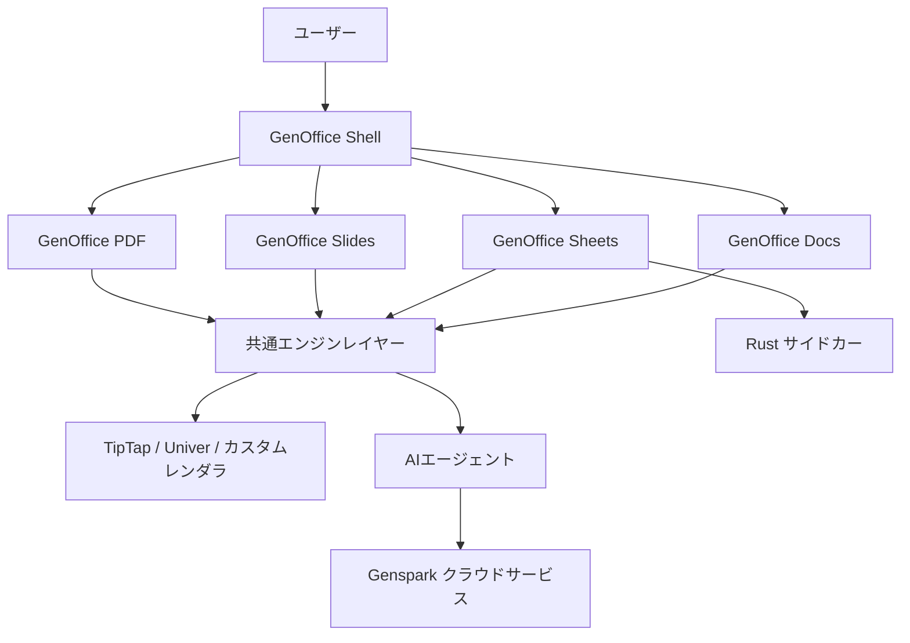

# **GenOffice 調査レポート**

## **1. 基本情報**

* **ツール名**: GenOffice
* **ツールの読み方**: ゲンオフィス
* **開発元**: Mainfunc, Inc (Genspark)
* **公式サイト**: [https://www.genspark.ai/](https://www.genspark.ai/)
* **関連リンク**:
  * GitHub: [https://github.com/genspark-ai/genoffice](https://github.com/genspark-ai/genoffice)
* **カテゴリ**: オフィススイート
* **概要**: GenOfficeは、AI編集機能を後付けのチャットボックスではなく、第一級のワークフローとして組み込んだmacOSおよびWindows向けのAIネイティブな統合オフィススイートです。ワープロ、表計算、プレゼンテーション、PDFの4つのアプリケーションを提供します。

## **2. 目的と主な利用シーン**

* **解決する課題**: 既存のオフィスソフト（Word、Excel等）におけるAI機能の統合不足を解消し、ドキュメントのレイアウトを破壊することなくAIによる高度な編集や生成をシームレスに行うこと。
* **想定利用者**: 日常的にドキュメント、スプレッドシート、プレゼンテーションを作成・編集するナレッジワーカーや開発者。
* **利用シーン**:
  * Word形式（.docx）のドキュメントのAIを用いたブロック単位での編集や推敲。
  * Excel形式（.xlsx）のデータに対するAIエージェントを通じた分析や操作。
  * PowerPoint形式（.pptx）のプレゼンテーション資料の作成。
  * PDFドキュメントへの注釈追加やフォーム入力などの編集。

## **3. 主要機能**

* **GenOffice Docs（ワープロ）**: .docxフォーマット対応。変更された段落のみを再生成する「パラグラフ・パッチ」方式を採用し、Wordで開いた際のレイアウト崩れを防ぎます。変更履歴、コメント、スタイル、数式などに対応しています。
* **GenOffice Sheets（表計算）**: .xlsxフォーマット対応。Univerコアをベースに独自拡張を加えており、ピボットテーブル、スライサー、条件付き書式、関数のトレースなどをサポートします。
* **GenOffice Slides（プレゼンテーション）**: .pptxフォーマット対応。独自の解析・レンダリングエンジンを搭載し、マスター、グラフ、トリミング、テキストシェーピング（HarfBuzz）などに対応しています。
* **GenOffice PDF（PDFビューア/エディタ）**: pdf.jsとpdf-libベース。注釈、フォーム、アウトライン、スタンプ、署名、ページ操作などに対応しています。
* **AIパネルの統合**: 全てのアプリに共通のAIパネルが埋め込まれており、Docsではバージョンごとのスナップショットと差分表示によるブロック単位のAI編集、他のアプリでは状態に対するツール呼び出し型のエージェント機能を提供します。
* **プロバイダ抽象化**: ユーザーのGensparkアカウントにログインすることで、モデルの呼び出しをGensparkサービス側でルーティングします。ローカルにAPIキーを保存する必要がありません。

## **4. 動作原理・システム構成**

* **アーキテクチャ**: Electronベースのローカルデスクトップアプリケーション（クライアント・サーバー型のSaaSではなく、ローカルファーストな構成）。
* **主要コンポーネントとデータフロー**:
  * 5つのElectronアプリ（docs, sheets, slides, pdf, shell）が共通のエンジンレイヤーを共有しています。
  * UIはReactで構築され、テキスト編集にはTipTapを利用しています。
  * Sheets（表計算）では、.xlsxファイルのインポート/エクスポート処理にRust製のサイドカー（calamine + IronCalc）を使用しています。
  * 元のファイルを「信頼できる情報源（Source of Truth）」とし、編集は「狭いパッチ（narrow patches）」として適用されます。エディタが触れなかった部分は、バイトレベルで元の状態が保持されます（Byte-preserving round trip）。
* **特筆すべき要素技術**:
  * **Electron**: クロスプラットフォームなデスクトップアプリ構築。
  * **TypeScript**: コアエンジンおよびUIの実装。
  * **Rust**: 表計算の高速なファイルパース。
  * **TipTap**: ブロックベースのストリーミングエディタ。
  * **Univer**: オープンソースの表計算コア。



## **5. 開始手順・セットアップ**

* **前提条件**:
  * macOS (Apple Silicon) または Windows (x64) 環境。
  * Node.js (開発用)
* **インストール/導入**:
  * 公式のReleasesページ（GitHub）から署名済みのインストーラーをダウンロードして実行します。
    * macOS: `GenOffice-0.4.110-arm64.dmg`
    * Windows: `GenOfficeSetup-v0.4.110.exe`
* **開発環境のセットアップ**:
  ```bash
  npm install
  npm run dev
  ```
  * Sheetsアプリの開発にはRustツールチェーン（cargo）が必要です。

## **6. 特徴・強み (Pros)**

* **高い互換性と非破壊編集**: .docxなどのファイルを編集・保存する際、変更した段落のXMLのみをパッチし、その他のXMLバイナリは元のまま維持するため、Microsoft Officeとの高い互換性を実現しています。
* **AIファーストのUX設計**: 単なるチャットボットの追加ではなく、ブロック単位でのAI編集や状態をコンテキストとしたAIエージェント操作など、AIを前提としたUI/UXになっています。
* **ローカルでの軽快な動作とオープン性**: Electronアプリとしてローカルで動作し、ソースコードの大半がApache 2.0ライセンスで公開されています。

## **7. 弱み・注意点 (Cons)**

* **AI利用の制約**: AI機能（モデル呼び出し）を利用するにはGensparkアカウントでのログインが前提となっており、ローカル完結のLLM利用や他社APIキーの直接入力などのカスタマイズ性については公式ドキュメント上で明言されていません。
* **日本語対応**: UIの多言語対応（i18n）基盤は存在し日本語フォント（Noto CJK等）もバンドルされていますが、サポートの完全性については未検証です。
* **発展途上**: バージョンが0.4系であり、エンタープライズ向けのモジュール（ee/）は将来の予約となっており、まだ機能が成熟しきっていない可能性があります。

## **8. 料金プラン**

| プラン名 | 料金 | 主な特徴 |
|---------|------|---------|
| **オープンソース版** | 無料 | Apache 2.0ライセンスに基づくOSS。基本的なオフィススイート機能が利用可能。 |

* **課金体系**: 現在は無料のオープンソースソフトウェアとして提供されています。Genspark側のAI機能利用に関する制限や課金体系は、Gensparkのサービス規約に依存します。
* **無料トライアル**: 全機能が無料で利用可能です。

## **9. 導入実績・事例**

* **導入企業**: 公開事例なし。
* **導入事例**: 新興のオープンソースプロジェクトのため、具体的なエンタープライズ導入事例はまだ公開されていません。
* **対象業界**: 業界を問わず、AIを活用したドキュメント作成を効率化したい個人ユーザーや開発者。

## **10. サポート体制**

* **ドキュメント**: GitHubリポジトリのREADMEが主要なドキュメントとなります。
* **コミュニティ**: GitHubのIssueやDiscussionsを通じたオープンソースコミュニティでのやり取りが中心です。
* **公式サポート**: 無料のオープンソース版においては、公式のSLAを伴うサポート窓口は提供されていません。

## **11. エコシステムと連携**

### **11.1 API・外部サービス連携**

* **API**: 外部からGenOfficeを操作するための公開APIは提供されていません。
* **外部サービス連携**: AI機能の提供バックエンドとして、Gensparkのクラウドサービスと強固に連携しています。Gensparkの認証基盤およびウェブ/画像検索ツールと統合されています。

### **11.2 技術スタックとの相性**

| 技術スタック | 相性 | メリット・推奨理由 | 懸念点・注意点 |
|:---|:---:|:---|:---|
| **Electron** | ◎ | アプリケーションのベースプラットフォーム | 内部アーキテクチャの根幹 |
| **React** | ◎ | UIキットとして全面的に採用 | 特になし |
| **Rust** | ◯ | 表計算の高速処理（calamine等）に利用 | ビルドにRust環境が必要 |

## **12. セキュリティとコンプライアンス**

* **認証**: Gensparkアカウントを用いたサインイン。ローカルにモデルのAPIキーは保存されません。
* **データ管理**: アプリケーションはローカルで動作し、ファイルのパースやレンダリングはローカルで行われます。AIリクエスト時に必要なコンテキストのみがGensparkのサーバーに送信されるアーキテクチャです。レンダラーのサンドボックス化や外部リンクのゲート制御など、プロセスセキュリティ対策が実装されています。
* **準拠規格**: 公式サイトで公開されている特定の認証（SOC2等）はありません。

## **13. 操作性 (UI/UX) と学習コスト**

* **UI/UX**: 既存のオフィススイート（Office 365, Google Workspace）の操作感に寄せつつ、AIパネルが各アプリに統合されたモダンなタブベースのUI（Shell）を備えています。
* **学習コスト**: 一般的なワープロや表計算ソフトの利用経験があれば、基本的な操作は直感的に行えます。AI機能の「ブロック単位の編集」などの概念に慣れるのに少し時間がかかる可能性があります。

## **14. ベストプラクティス**

* **効果的な活用法 (Modern Practices)**:
  * 既存の.docxや.xlsxファイルをGenOfficeで開き、AIエージェントを用いて内容の要約やデータの分析を行い、レイアウトを崩さずに上書き保存する使い方。
* **陥りやすい罠 (Antipatterns)**:
  * AIが生成したコンテンツを無条件に信頼すること（常にユーザーによるレビューが推奨されます）。

## **15. ユーザーの声（レビュー分析）**

* **調査対象**: GitHubの活動状況などを参考。主要なBtoBレビューサイト（G2, Capterra等）にはまだ登録されていません。
* **総合評価**: GitHubリポジトリでスターを集めており、開発者からの注目度が高まっています。
* **ポジティブな評価**:
  * 既存ファイルの「バイトレベルの保持（Byte-preserving round trip）」による非破壊編集の技術的アプローチが高く評価されています。
* **ネガティブな評価 / 改善要望**:
  * まだリリースされて間もないため、バグの報告や機能拡充の要望がGitHub Issueで議論されています。
* **特徴的なユースケース**:
  * エンジニアがローカル環境でマークダウン感覚でAIアシストを受けながらドキュメントを作成し、最終的に.docx形式で出力するフロー。

## **16. 直近半年のアップデート情報**

* **2026-08-03**: リポジトリの最新の活動状況から、v0.4.110のリリースが確認されました。macOSおよびWindows向けのインストーラーが提供されています。

(出典: [GenOffice GitHub Releases](https://github.com/genspark-ai/genoffice/releases) )

## **17. 類似ツールとの比較**

### **17.1 機能比較表 (星取表)**

| 機能カテゴリ | 機能項目 | 本ツール | Microsoft 365 | Google Workspace | LibreOffice |
|:---:|:---|:---:|:---:|:---:|:---:|
| **基本機能** | 文書作成/表計算 | ◯<br><small>基本機能に対応</small> | ◎<br><small>業界標準・多機能</small> | ◎<br><small>強力な同時編集</small> | ◯<br><small>多機能なOSS</small> |
| **独自性** | AIネイティブ編集 | ◎<br><small>ブロック単位のAI編集</small> | ◯<br><small>Copilot対応</small> | ◯<br><small>Gemini連携</small> | ×<br><small>標準非対応</small> |
| **互換性** | 既存OOXMLファイル保持 | ◎<br><small>バイトレベルの非破壊パッチ</small> | ◎<br><small>ネイティブフォーマット</small> | △<br><small>インポート/エクスポート変換</small> | ◯<br><small>高い互換性を持つが変換あり</small> |
| **環境** | ローカル動作 | ◯<br><small>デスクトップアプリ</small> | ◯<br><small>デスクトップ版あり</small> | ×<br><small>Webのみ完結</small> | ◎<br><small>完全オフライン</small> |

### **17.2 詳細比較**

| ツール名 | 特徴 | 強み | 弱み | 選択肢となるケース |
|---------|------|------|------|------------------|
| **GenOffice** | AI統合型のローカルオフィススイート（OSS） | 既存ファイルのバイナリを維持した非破壊のAI編集、無料のOSS | 新興のため機能の成熟度やエンタープライズサポートに欠ける | 個人や開発者が、AIをフル活用しつつOffice形式のファイルを直接編集したい場合 |
| **Microsoft 365** | 業界標準のオフィススイート | 圧倒的な機能、完全な互換性、エンタープライズサポート | 高機能ゆえの重さ、サブスクリプション費用 | 企業での標準的な業務利用、高度なマクロが必要な場合 |
| **Google Workspace** | クラウドベースの共同編集ツール | リアルタイム共同編集、Webブラウザのみで動作 | 完全なオフライン作業に制約、Office形式との変換でレイアウトが崩れる場合がある | チームでの同時編集やクラウドでのドキュメント管理を重視する場合 |
| **LibreOffice** | 伝統的なオープンソースオフィススイート | 完全に無料でオフライン動作 | AI機能がない、最新のOffice形式と完璧な互換性はない | AI不要で完全な無料・オフライン環境を求める場合 |

## **18. 総評**

* **総合的な評価**:
  GenOfficeは、「AIの統合」と「既存のOfficeファイル（OOXML）との完全な互換性維持」という、相反しがちな2つの目標を見事に両立させようとする意欲的なオープンソースプロジェクトです。特に「バイトレベルでの非破壊編集（Byte-preserving round trip）」というアプローチは、WordやExcelのレイアウト崩れを恐れるユーザーにとって非常に魅力的な技術的解決策です。
* **推奨されるチームやプロジェクト**:
  日常業務でOfficeファイルのやり取りが発生しつつも、AIを活用した文書作成・データ分析の効率化を模索している個人ユーザーや、スタートアップ、技術感度の高い開発者チームに推奨されます。
* **選択時のポイント**:
  既存のMicrosoft 365やGoogle Workspaceを完全に置き換えるにはエンタープライズ機能が不足していますが、AIを活用した「編集・ドラフト作成ツール」としてローカルに導入し、既存ファイルに対する安全なAI処理を行う目的においては、非常に有力な選択肢となります。無料で利用できるため、気軽に試すことができるのも大きな利点です。
