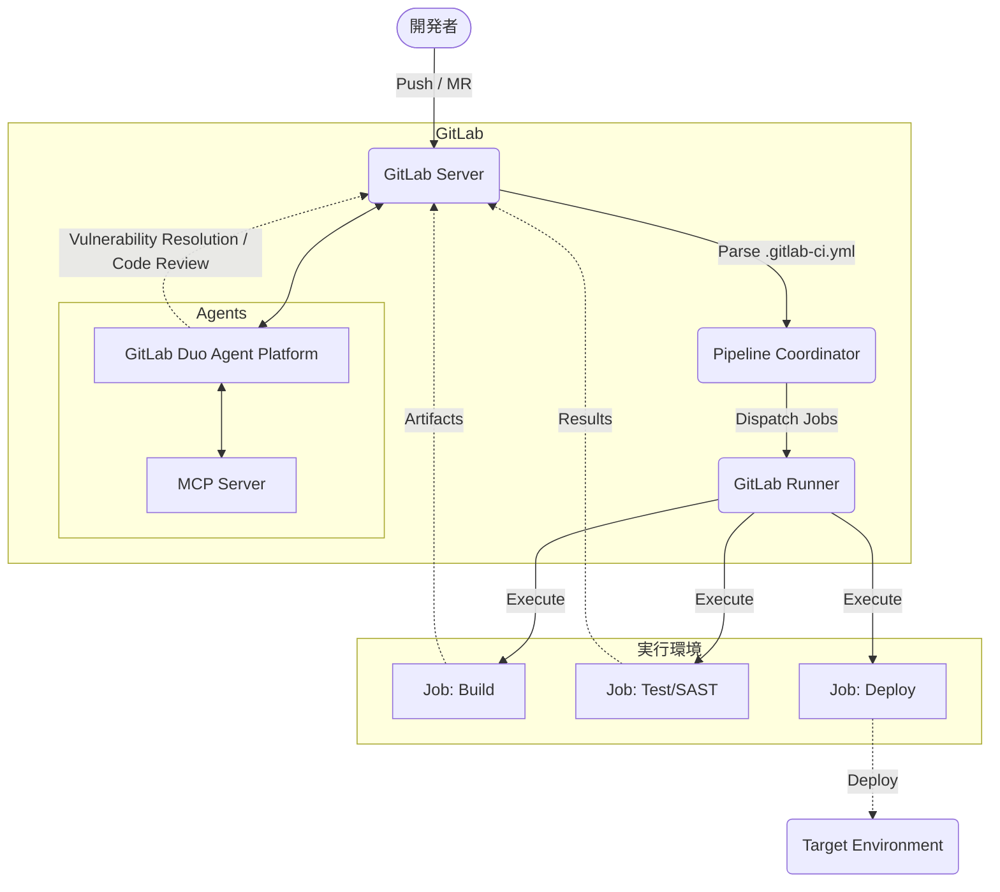

# **GitLab CI/CD 調査レポート**

## **1. 基本情報**

* **ツール名**: GitLab CI/CD
* **ツールの読み方**: ギットラボ シーアイシーディ
* **開発元**: GitLab Inc.
* **公式サイト**: [https://about.gitlab.com/solutions/continuous-integration/](https://about.gitlab.com/solutions/continuous-integration/)
* **関連リンク**:
  * ドキュメント: [https://docs.gitlab.com/ee/ci/](https://docs.gitlab.com/ee/ci/)
  * **カテゴリ**: CI/CD
* **概要**: GitLabにネイティブ統合されたCI/CD機能。`.gitlab-ci.yml`ファイルでパイプラインを定義し、ビルド、テスト、デプロイ、セキュリティスキャンなどのDevOpsライフサイクル全体を自動化する。AI機能（GitLab Duo）との連携も強化されている。

## **2. 目的と主な利用シーン**

* **解決する課題**: 開発プロセスの自動化によるリリースサイクルの短縮、手動作業の排除、およびセキュリティシフトレフトの実現。
* **想定利用者**: GitLabを利用する開発者、QAエンジニア、セキュリティ担当者。
* **利用シーン**:
  * **自動テストとビルド**: マージリクエスト作成ごとの単体テスト、Lint、ビルド実行。
  * **マルチクラウドデプロイ**: AWS, GCP, Azureへの自動デプロイやKubernetesクラスタへのGitOps。
  * **DevSecOps**: パイプライン内でのSAST/DAST/依存関係スキャンの自動実行と脆弱性管理。
  * **AIによる自律的なタスク実行**: 脆弱性のトリアージやパイプライン修正の自動化（GitLab Duo Agents）。

## **3. 主要機能**

<!--
【ガイドライン】
- 5-10項目の主要機能を箇条書きで記述
- 各機能は1-2文で概要を説明
-->

* **パイプライン・アズ・コード**: YAML形式(`.gitlab-ci.yml`)でパイプライン構成を管理し、バージョン管理システムと完全に統合。
* **GitLab Duo Agent Platform**: AIエージェント（Planner, Security Analyst, Data Analyst, CI Expertなど）がコンテキストを保持し、計画、セキュリティ分析、パイプライン作成などを自律的に支援・実行するプラットフォーム。
* **MCPサーバー統合**: Model Context Protocol (MCP) を通じて、外部のAIツールとGitLabの機能（パイプライン管理やマージリクエストなど）をセキュアに連携。
* **Flow Creator & カスタムフロー**: AIエージェントのカスタムワークフローを対話型で作成し、複雑なタスクを自動化する機能を搭載。
* **CI/CDコンポーネントカタログ**: 再利用可能なパイプライン構成要素をカタログ化し、組織内で共有・標準化する機能。
* **Auto DevOps**: コードを検出してビルド、テスト、デプロイのパイプラインを自動生成する機能（設定不要で開始可能）。
* **DAG (Directed Acyclic Graph)**: `needs`キーワードにより、ステージ順序に縛られない効率的な並列ジョブ実行が可能。
* **統合セキュリティスキャン (Ultimate)**: SAST, DAST, コンテナスキャンなどをパイプラインに組み込み、AIによる誤検知判定（False Positive Detection）や脆弱性の自動修正提案を利用可能。

## **4. 動作原理・システム構成**

* **アーキテクチャ**: クラウド完結型SaaS（GitLab.com）およびローカルファーストのSelf-Managed（オンプレミス）に対応したクライアント・サーバー構成
* **主要コンポーネントとデータフロー**:
  * **GitLab Server**: ソースコードリポジトリ、CI/CDパイプラインの定義（`.gitlab-ci.yml`）、ジョブのスケジューリング、ユーザーインターフェースを提供する中央サーバー。
  * **GitLab Runner**: GitLab Serverからジョブを受信し、実際のビルド・テスト・デプロイ処理を実行する独立したエージェント（Docker, Kubernetes, Shell, VirtualBox等で動作）。
  * **データフロー**: 開発者がコードをPush（またはMerge Requestを作成）すると、GitLab Serverが`.gitlab-ci.yml`をパースし、パイプラインを構築。利用可能なGitLab Runnerにジョブをディスパッチし、Runnerが実行結果とアーティファクトをServerに返却する。
* **特筆すべき要素技術**:
  * **Docker Executor / Kubernetes Executor**: コンテナ技術を利用し、ジョブごとにクリーンで分離された実行環境を動的にプロビジョニングする。
  * **GitLab Duo Agent Platform**: モデルコンテキストプロトコル (MCP) サーバーと統合され、AIエージェント（Planner, Security Analyst, Data Analyst, CI Expertなど）がコンテキストを保持しながら自律的にパイプラインの診断、脆弱性の修復、コードレビューなどを実行するアーキテクチャ。
  * **DAG (Directed Acyclic Graph)**: `needs` キーワードを用いた有向非巡回グラフによる、ステージの枠を超えた柔軟なジョブの並列・順序制御技術。



## **5. 開始手順・セットアップ**

* **前提条件**:
  * GitLabアカウント（SaaS版またはSelf-Managed版）
  * Gitリポジトリ
  * GitLab Runner（SaaS版は共有ランナーが利用可能、Self-Managed版は別途セットアップが必要な場合あり）
* **インストール/導入**:
  GitLabに標準機能として組み込まれているため、インストールの必要はない。
* **初期設定**:
  * リポジトリのルートに `.gitlab-ci.yml` ファイルを作成するだけで有効化される。
* **クイックスタート**:

  ```yaml
  # .gitlab-ci.yml の例
  build-job:
    stage: build
    script:
      - echo "Hello, GitLab CI/CD!"
  ```

  上記ファイルをコミットすると、自動的にパイプラインが実行される。

## **6. 特徴・強み (Pros)**

<!--
【ガイドライン】
- 3-5項目を箇条書きで記述
- 競合との差別化ポイントを明確に
-->

* **オールインワンの統合体験**: ソースコード管理、CI/CD、セキュリティ、監視が単一UIで完結しており、ツール間のコンテキストスイッチが不要。
* **Agentic AIによる高度な自律化**: GitLab Duo Agent Platformにより、CI Expert Agentを通じたパイプラインの構築から、Security Analyst Agentによる脆弱性トリアージ・自動修復まで、ソフトウェア開発ライフサイクル全体でAIエージェントが能動的に支援する。
* **拡張可能なAIエコシステム**: MCPサーバーの統合や、Flow Creatorを用いたカスタムフローの構築により、組織固有の要件に合わせた柔軟なAIワークフローを構築可能。
* **柔軟な実行環境と高度なコンプライアンス**: SaaS版とセルフホストランナーを柔軟に組み合わせることができ、詳細なコンプライアンスポリシーやセキュリティ設定を組織全体に強制できる。

## **7. 弱み・注意点 (Cons)**

* **機能過多による複雑性**: メニューや設定項目が非常に多く、初心者は必要な機能を見つけるのに迷うことがある。
* **学習コスト**: シンプルなCIは簡単だが、`rules`や`include`を駆使した高度なパイプライン設計には深い知識が必要。
* **YAML地獄**: 大規模なプロジェクトではYAMLファイルが肥大化・複雑化しやすく、可読性の維持に工夫が必要（コンポーネント機能で改善傾向）。
* **コスト**: Ultimateプラン（セキュリティ機能含む）は高機能だが、価格もエンタープライズ向け設定となっている。

## **8. 料金プラン**

| プラン名 | 料金 | 主な特徴 |
|---------|------|---------|
| **Free** | 無料 | 5ユーザーまで。月間400分のCI/CD時間、10GiBストレージ。個人・小規模向け。 |
| **Premium** | $29/ユーザー/月 | 月間10,000分のCI/CD時間、高度なCI/CD、承認ルール、優先サポート。 |
| **Ultimate** | 要問い合わせ | 月間50,000分のCI/CD時間、高度なセキュリティ(SAST/DAST)、コンプライアンス、AIクレジット増量。 |

* **課金体系**: ユーザー数課金（年間契約）。CI/CD時間は追加購入可能。
* **アドオン**:
  * **GitLab Duo Pro**: $19/ユーザー/月（コード補完、チャット）
  * **GitLab Duo Enterprise**: 要問い合わせ（全AI機能）
* **無料トライアル**: Ultimateプランの30日間無料トライアルあり。

## **9. 導入実績・事例**

* **導入企業**: Goldman Sachs, NVIDIA, Siemens, T-Mobile, Lockheed Martin など、Fortune 100企業の多くが採用。
* **導入事例**:
  * **NVIDIA**: 複雑なハードウェア/ソフトウェアのテストパイプラインをGitLab CIで自動化。
  * **Siemens**: 数千人の開発者が利用するDevOpsプラットフォームとしてGitLabを採用し、リリースサイクルを高速化。
* **対象業界**: 金融、自動車、通信、テクノロジーなど、セキュリティと信頼性が重視される業界で特に強い。

## **10. サポート体制**

* **ドキュメント**: 公式ドキュメントは非常に詳細で、チュートリアルからAPIリファレンスまで網羅されている。
* **コミュニティ**: GitLab ForumやIssue Trackerが活発で、開発者（GitLab社員含む）からのレスポンスが得られやすい。
* **公式サポート**: Premium以上でSLA付きのサポートが提供される。Ultimateではさらに手厚いサポート体制がある。

## **11. エコシステムと連携**

### **10.1 API・外部サービス連携**

* **API**: 包括的なREST APIおよびGraphQL APIを提供しており、パイプライン操作や設定変更などほぼ全ての操作が可能。
* **外部サービス連携**:
  * Kubernetes (Agent for KubernetesによるGitOps統合)
  * クラウドプロバイダー (AWS, Google Cloud, Azure) - OIDC認証対応
  * コミュニケーション (Slack, Microsoft Teams, Discord)
  * その他 (Jira, Vault, HashiCorp Terraformなど)

### **10.2 技術スタックとの相性**

| 技術スタック | 相性 | メリット・推奨理由 | 懸念点・注意点 |
|:---|:---:|:---|:---|
| **Docker / K8s** | ◎ | Docker in Docker (dind) やコンテナレジストリが完全に統合されており最適。 | dind利用時の特権モードのセキュリティ管理が必要。 |
| **Node.js / Python** | ◎ | 公式イメージを利用して簡単にパイプラインを構築可能。 | キャッシュ設定を適切に行わないと毎回ダウンロードが発生する。 |
| **Java** | ◯ | Maven/Gradleなどのビルドツールとの連携も容易。 | ビルド時間が長くなりがちなので、キャッシュやアーティファクト管理が重要。 |
| **iOS / macOS** | △ | SaaS版でmacOSランナーが利用可能だが、コストが高め。 | 専用のランナー設定が必要になる場合がある。 |

## **12. セキュリティとコンプライアンス**

* **認証**: 2要素認証(2FA), SSO (SAML, CAS, LDAPなど), OIDCによる外部クラウド連携。
* **データ管理**: 変数のマスク機能、Project Access Tokensによる権限分離。Ultimateでは監査ログや脆弱性管理が強力。
* **準拠規格**: SOC 2 Type 2, ISO 27001, GDPRなど主要な国際規格に準拠。FedRAMP認証も取得済み。

## **13. 操作性 (UI/UX) と学習コスト**

* **UI/UX**: パイプライングラフの視覚化機能が優秀で、複雑な依存関係（DAG）も直感的に把握できる。エディタにはバリデーション機能があり便利。
* **学習コスト**: 基本的な使い方は簡単だが、GitLab固有の概念（Artifacts, Cache, Environments, Runnerなど）を正しく理解し使いこなすには学習が必要。

## **14. ベストプラクティス**

* **効果的な活用法 (Modern Practices)**:
  * **DAG (`needs`) の活用**: ステージ順次実行ではなく、`needs` キーワードを使ってジョブの依存関係を明示し、並列実行を最大化してパイプラインを高速化する。
  * **CI/CDコンポーネント**: 共通処理をコンポーネントとして切り出し、`include: component` で再利用することで、パイプラインの標準化とメンテナンス性を向上させる。
  * **`rules` の使用**: レガシーな `only/except` ではなく、より柔軟で強力な `rules` キーワードを使用してジョブの実行条件を制御する。
  * **Inputsによる動的構成**: `spec:inputs` を使用して、パイプライン設定にパラメータを渡し、再利用性を高める。
* **陥りやすい罠 (Antipatterns)**:
  * **手動でのシークレット管理**: パイプライン変数に手動で機密情報を設定するのではなく、外部のシークレット管理ツール（Vaultなど）や保護された変数を利用する。
  * **巨大な `.gitlab-ci.yml`**: 全てを1つのファイルに記述すると管理不能になるため、`include` 機能を使ってファイルを分割・構造化する。
  * **不必要なブロッキング**: 独立して実行できるジョブを、前のステージの完了待ちにさせない（`needs` を使っていないケース）。

## **15. ユーザーの声（レビュー分析）**

* **調査対象**: G2 (2026年4月時点のGoogle検索結果スニペットより引用)
* **総合評価**: 4.5/5.0 (G2)
* **ポジティブな評価**:
  * 「GitHub Actionsと比較しても遜色ない、あるいはそれ以上に統合された強力なCI/CD機能。」
  * 「セルフホストが可能で、オンプレミス環境での運用において非常に信頼性が高い。」
  * 「一つのプラットフォームで全て完結するため、ツールの管理コストが大幅に削減できた。」
* **ネガティブな評価 / 改善要望**:
  * 「UIが頻繁に変更され、機能が多すぎるため、時々迷子になる。」
  * 「小規模なチームにとっては、セットアップや概念がややオーバーエンジニアリングに感じることがある。」
  * 「Runnerの管理やスケーリング設定が、GitHubのホステッドランナーに比べると手間がかかる場合がある（特にセルフホスト時）。」

## **16. 直近半年のアップデート情報**

* **2026-09-17 (GitLab 19.4)**: MCP (Model Context Protocol) サーバーツールのガバナンス機能の追加、Advanced SASTでのKotlin/Dart/Scala言語サポート、悪意のあるパッケージ検出(Beta)などを導入。
* **2026-08-20 (GitLab 19.3)**: Flow Creator (AIエージェントのカスタムフローを対話型で作成する機能) や、Secrets Manager (GitLab.com版) が利用可能に。
* **2026-07-16 (GitLab 19.2)**: GitLab Duo CLI、カスタムフロー、Scheduled pipeline execution policies が一般公開(GA)。
* **2026-06-18 (GitLab 19.1)**: AIによるSecret false positive detection（シークレットの誤検知判定）の一般公開、GitLab Duoの「Always on」設定などが追加。

(出典: [GitLab Releases](https://about.gitlab.com/releases/categories/releases/))

## **17. 類似ツールとの比較**

### **17.1 機能比較表 (星取表)**

| 機能カテゴリ | 機能項目 | GitLab CI/CD | GitHub Actions | Jenkins | act |
|:---:|:---|:---:|:---:|:---:|:---:|
| **基本機能** | セットアップ | ◯<br><small>GitLabなら即座</small> | ◎<br><small>YAML置くだけ</small> | △<br><small>サーバー構築要</small> | ◎<br><small>CLIツールで容易</small> |
| **統合** | リポジトリ連携 | ◎<br><small>GitLab完全統合</small> | ◎<br><small>GitHub完全統合</small> | ◯<br><small>プラグイン対応</small> | ◯<br><small>GitHub Actions互換</small> |
| **拡張性** | 再利用性/拡張 | ◯<br><small>コンポーネント</small> | ◎<br><small>Marketplace</small> | ◎<br><small>無限のプラグイン</small> | △<br><small>ローカル実行に特化</small> |
| **実行環境** | ランナー環境 | ◎<br><small>SaaS+Self</small> | ◎<br><small>Hosted+Self</small> | ◎<br><small>Self(完全制御)</small> | △<br><small>Docker環境必須</small> |
| **非機能要件** | 日本語対応 | △<br><small>UI/一部ドキュメント</small> | ◯<br><small>ドキュメント充実</small> | ◯<br><small>情報豊富</small> | ×<br><small>英語中心</small> |

### **17.2 詳細比較**

| ツール名 | 特徴 | 強み | 弱み | 選択肢となるケース |
|---------|------|------|------|------------------|
| **GitLab CI/CD** | オールインワン統合型 | GitLabとのシームレスな統合、DevSecOps機能の充実、AIエージェントによる支援 | GitHubエコシステムと比較すると外部連携アクションの数が少なめ | ソースコード管理にGitLabを使用している場合（第一候補）。DevSecOpsを単一基盤で実現したい場合。 |
| **GitHub Actions** | GitHub統合型 | 世界最大の開発者コミュニティとMarketplace、導入の圧倒的な手軽さ | 複雑なパイプラインの可読性が下がりやすい、企業向け機能の一部がアドオン | GitHubを使用している場合。豊富なサードパーティ製アクションを活用したい場合。 |
| **Jenkins** | OSS自動化サーバー | 圧倒的な柔軟性とプラグイン数、オンプレミスでの完全な制御 | サーバー構築・運用保守の手間、学習コストが高い | クローズドなオンプレミス環境での運用が必須な場合や、非常に特殊な要件がある場合。 |
| **act** | ローカル実行ツール | GitHub Actionsのワークフローをローカルで手軽に実行可能、テストサイクルの短縮 | GitHub環境との完全な互換性はなく一部制限あり | GitHub Actionsのワークフローを開発中で、ローカルで素早く動作確認したい場合。 |

## **18. 総評**

<!--
【ガイドライン】
- 総合評価、推奨チーム、選択ポイントの3項目を必ず含める
- 客観的で中立的な評価を心がける
-->

* **総合的な評価**:
  GitLab CI/CDは、単なるCIツールではなく「DevSecOpsプラットフォーム」の中核として機能する強力なツールである。特にGitLab 19系にかけて強化された「GitLab Duo Agent Platform」とMCPサーバーの統合により、AIがパイプラインの構築・診断からセキュリティの脆弱性解決、カスタムフローの実行までを自律的かつ能動的に支援する体制が確立された。ソースコード管理とCI/CDが完全に融合しているため、導入の手間が少なく、運用コストも抑えられる点が最大の魅力。
* **推奨されるチームやプロジェクト**:
  * GitLabを既に利用している、または移行を検討しているすべてのチーム。
  * ツールチェーンを統合し、運用管理の負荷を減らしたい組織。
  * MCPサーバーやカスタムAIエージェントを活用し、DevSecOpsプロセスの高度な自動化を推進したいエンタープライズ企業。
* **選択時のポイント**:
  * 「GitLabを使うか、GitHubを使うか」というプラットフォーム選定とほぼ同義になる。GitLabを選ぶなら、他社製CIツールを導入するよりもGitLab CI/CDを使う方がメリットが大きい。逆に、GitHubメインならActionsが自然な選択となる。また、ローカルで軽量にワークフローをテストしたい場合は `act` のような周辺ツールとの組み合わせも検討される。
