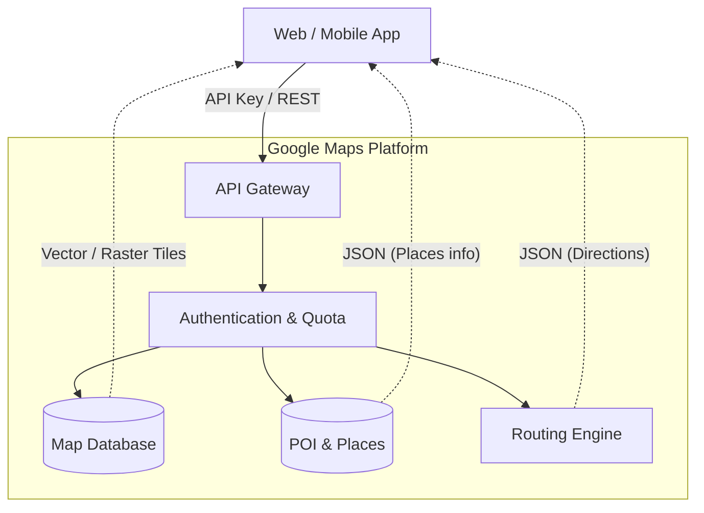

# **Google Maps Platform 調査レポート**

## **1. 基本情報**

* **ツール名**: Google Maps Platform
* **ツールの読み方**: グーグル マップ プラットフォーム
* **開発元**: Google
* **公式サイト**: [https://developers.google.com/maps](https://developers.google.com/maps)
* **関連リンク**:
  * GitHub: [https://github.com/googlemaps](https://github.com/googlemaps)
  * ドキュメント: [https://developers.google.com/maps/documentation](https://developers.google.com/maps/documentation)
* **カテゴリ**: その他
* **概要**: Google Maps Platform は、Google マップの強力なデータと機能を独自のアプリケーションに統合できるAPIとSDKのセットです。静的・動的な地図表示だけでなく、ルート検索、場所の検索（POI）、ジオコーディング、標高データ、そして近年では大気質や花粉情報などの環境データも提供しています。

## **2. 目的と主な利用シーン**

* **解決する課題**:
  * アプリケーションへの高品質な地図の埋め込み
  * 正確な位置情報の取得と住所の正規化
  * 複雑な配送ルートや移動時間の計算
  * ユーザー体験を向上させるリッチな位置情報機能の実装
* **想定利用者**:
  * Web/モバイルアプリケーション開発者
  * 配送・物流企業（配車管理、ルート最適化）
  * 不動産、旅行、小売業界のサービス提供者
* **利用シーン**:
  * **店舗検索 (Store Locator)**: 最寄りの店舗を表示し、そこまでのルートを案内する。
  * **ライドシェア・デリバリー**: ドライバーとユーザーの位置をリアルタイムに表示し、到着予想時間を提示する。
  * **不動産サイト**: 物件周辺の地図やストリートビューを表示し、周辺環境を可視化する。
  * **旅行プランニング**: 観光スポット間の移動距離や時間を計算し、旅程を作成する。

## **3. 主要機能**

Google Maps Platformの機能は主に以下のカテゴリに分類されます。

* **Maps (地図)**:
  * **Maps JavaScript API / Maps SDK for Android & iOS**: カスタマイズ可能なインタラクティブな地図を表示。
  * **Static Maps API**: 画像として地図を表示（軽量）。
  * **Street View Static API**: 360度のパノラマ画像を表示。
  * **Photorealistic 3D Tiles**: 高精細な3D地理空間データをCesiumなどで利用可能にする。
* **Routes (ルート)**:
  * **Directions API**: 複数の交通手段（車、徒歩、自転車、交通機関）でのルート検索。
  * **Distance Matrix API**: 複数の出発地と目的地間の距離と所要時間を計算。
  * **Roads API**: GPS座標を道路網に合わせて補正（スナップ）。
  * **Grounding with Google Maps**: Gemini等LLMへの最新マップデータおよびルート情報のグラウンディング。
* **Places (場所)**:
  * **Places API**: 施設情報の検索、詳細取得、写真取得。
  * **Geocoding API**: 住所と緯度経度の相互変換。
  * **Geolocation API**: 携帯基地局やWi-Fi情報から現在位置を特定。
  * **Address Validation API**: 住所の存在確認と構成要素の分解・修正。
* **Environment (環境)**:
  * **Air Quality API**: 大気質指数の取得。
  * **Pollen API**: 花粉飛散情報の取得。
  * **Solar API**: 建物の屋根の日射量データなどの提供（太陽光パネル設置検討など）。
* **Google Earth (データ分析)**:
  * サイト分析や時間経過による地形変化の検出、データの分類（classification）機能の提供。

## **4. 動作原理・システム構成**

* **アーキテクチャ**: クラウド完結型SaaS（API/SDKを通じたクライアント・サーバー構成）
* **主要コンポーネントとデータフロー**:
  * クライアント（Webブラウザ/モバイルアプリ）がGoogleのサーバーに対してAPIリクエスト（HTTP REST等）を送信する。
  * サーバー側で認証（APIキーの制限確認やIPチェック）を行い、最適化された地図データ（ベクタータイル、画像、ルート情報、POIなど）をクライアントに返す。
  * Places APIやDirections APIなどのリクエストに応答し、JSON等でデータを返す。
* **特筆すべき要素技術**:
  * **ベクターマップ**: クライアント側でWebGLを用いて高速に地図を描画し、滑らかなズームや3D視点を実現している。
  * **データ同期**: 世界中の交通情報やPOIデータをリアルタイムに近い形で同期し、常に最新の情報をクライアントに提供する仕組み。



## **5. 開始手順・セットアップ**

* **前提条件**:
  * Google アカウント
  * Google Cloud プロジェクト
  * 請求先アカウント（クレジットカード登録が必須）
* **導入手順**:
  1. [Google Cloud Console](https://console.cloud.google.com/google/maps-apis/home) にアクセスする。
  2. プロジェクトを選択または作成する。
  3. 「APIとサービス」から必要なAPI（例: Maps JavaScript API）を有効化する。
  4. **認証情報**を作成し、APIキーを取得する。
* **初期設定**:
  * **APIキーの制限**: 取得したAPIキーに対して、不正利用を防ぐために「アプリケーションの制限」（HTTPリファラー、IPアドレス、Android/iOSアプリ）と「APIの制限」（使用可能なAPIの指定）を必ず設定する。
* **Hello World (JavaScript API)**:

  ```html
  <script>
    function initMap() {
      var map = new google.maps.Map(document.getElementById('map'), {
        center: {lat: -34.397, lng: 150.644},
        zoom: 8
      });
    }
  </script>
  <script async defer
    src="https://maps.googleapis.com/maps/api/js?key=YOUR_API_KEY&callback=initMap">
  </script>
  ```

## **6. 特徴・強み (Pros)**

* **圧倒的なデータ品質とカバレッジ**: 世界中の道路、施設、交通情報を網羅しており、更新頻度も高い。特にストリートビューやPOI（施設情報）の充実度は他社を圧倒している。
* **使いやすいクレジットシステム**: 毎月$200分の無料クレジットが付与されるため、小規模なWebサイトやプロトタイプ開発であれば実質無料で利用し続けられることが多い。
* **信頼性とスケーラビリティ**: Googleのインフラ上で動作しており、急激なアクセス増加にも耐えうる高い可用性を持つ。
* **リッチな表現力**: Photorealistic 3D TilesやAerial Viewなど、没入感のある最新の地図表現がいち早く利用できる。

## **7. 弱み・注意点 (Cons)**

* **従量課金のコスト**: アクセス数が非常に多い大規模サービスの場合、コストが比較的高額になる可能性がある（Mapboxなどと比較して）。
* **利用規約の制限**: GoogleマップのデータはGoogleマップ上で表示する必要があり、データを保存して二次利用することや、他の地図上にGoogleのデータを表示することは原則禁止されている。
* **中国などでの利用**: 中国国内からのアクセスには制限がある場合があり、特別な対応が必要となることがある。

## **8. 料金プラン**

「従量課金制（Pay-as-you-go）」を採用しており、使用量に応じた支払いとなる。
**毎月 $200 分の無料クレジット** が全アカウントに自動適用される。

| 製品カテゴリ | SKU例 | 料金 (1,000リクエストあたり) | 備考 |
|---|---|---|---|
| **Maps** | Mobile Native (Android/iOS) | **無料 (無制限)** | 地図表示、カメラ操作などは無料。 |
| **Maps** | Dynamic Maps (Web) | $7.00 | Webでのインタラクティブ地図表示。 |
| **Routes** | Directions | $5.00 | 基本的なルート検索。 |
| **Places** | Places Details | $17.00〜 | 施設の詳細情報取得（取得フィールドによる）。 |
| **Places** | Geocoding | $5.00 | 住所変換。 |

* **無料枠の目安**:
  * Dynamic Maps (Web) なら月間約28,000回ロードまで無料。
  * Static Maps なら月間約100,000回ロードまで無料。
* **注意**: 料金は変更される可能性があるため、必ず[公式の料金表](https://mapsplatform.google.com/pricing/)を確認すること。

## **9. 導入実績・事例**

* **導入企業**: Uber, Lyft, Airbnb, Spotify, Uniqlo, トヨタ自動車, ヤマト運輸など。
* **導入事例**:
  * **Uber/Lyft**: 配車アプリにおいて、正確な地図表示、現在地特定、到着予想時間の算出に活用。
  * **Airbnb**: 宿泊施設の検索時に、エリアの地図表示や周辺環境の確認に利用。
  * **ポケモンGO**: ゲームのベースとなる地図情報として採用（現在は変更されている機能もあるが、位置情報ゲームの先駆けとして活用）。

## **10. サポート体制**

* **ドキュメント**: 非常に充実しており、サンプルコードも豊富。日本語化も進んでいる。
* **コミュニティ**: Stack Overflowには `google-maps` タグで多数の質問と回答がある。
* **公式サポート**:
  * Google Cloudのサポートプランが適用される。
  * 問題発生時にはIssue Trackerでバグ報告が可能。

## **11. エコシステムと連携**

### **11.1 API・外部サービス連携**

* **Google Cloud**: コンソールが統合されており、BigQueryやCloud Functionsと組み合わせたデータ分析やバックエンド処理が容易。
* **Firebase**: モバイルアプリ開発において、Firebaseと組み合わせて位置情報機能を実装するケースが多い。
* **生成AI / LLM**: Gemini Enterprise Agent Platform等において、Grounding with Google Mapsを利用した回答の精度向上が可能。

### **11.2 技術スタックとの相性**

| 技術スタック | 相性 | メリット・推奨理由 | 懸念点・注意点 |
|:---|:---:|:---|:---|
| **JavaScript / TypeScript** | ◎ | 公式の `google.maps` ライブラリが標準。型定義 (`@types/google.maps`) もあり開発しやすい。 | 特になし。 |
| **React / Vue / Angular** | ◯ | `@vis.gl/react-google-maps` など、フレームワーク向けのラッパーライブラリが存在する。 | DOM操作を直接行うAPIのため、Reactなどの仮想DOMとの共存に少し工夫が必要な場合がある。 |
| **Flutter** | ◎ | Google製のフレームワークであり、公式パッケージ `google_maps_flutter` が提供されている。 | モバイル開発においてファーストチョイス。 |
| **Python / Node.js** | ◯ | サーバーサイド（Geocoding, Routes等）の利用に公式クライアントライブラリがある。 | クライアントサイドの地図表示はできない（サーバーサイド処理用）。 |

## **12. セキュリティとコンプライアンス**

* **APIキーの保護**: APIキーが流出すると高額な請求につながる恐れがあるため、HTTPリファラー（Webの場合）やバンドルID（アプリの場合）による制限設定が必須。
* **割り当て（Quota）管理**: 1日あたりのリクエスト数に上限を設定することで、予期せぬ使いすぎや攻撃によるコスト急増を防ぐことができる。
* **コンプライアンス**: GDPRなどのプライバシー規制に対応している。

## **13. 操作性 (UI/UX) と学習コスト**

* **UI/UX**: Google Cloud ConsoleでAPIの有効化、キー管理、使用量グラフの確認が一元管理できる。
* **学習コスト**: 基本的な地図表示やマーカー設置は非常に簡単で、初心者でも数行のコードで実装可能。高度なカスタマイズやPlaces APIの複雑なパラメータ利用にはドキュメントの読み込みが必要。

## **14. ベストプラクティス**

* **APIキーの制限を徹底する**: 本番環境用と開発環境用でキーを分け、それぞれに適切な制限（リファラー等）をかける。
* **セッション管理**: Autocomplete（オートコンプリート）を使用する場合、セッショントークンを適切に管理することで、課金対象となるリクエスト数を削減できる（キーストロークごとではなく、一連の検索で1回とみなされる）。
* **必要なデータのみ取得**: Places APIなどでは、`fields` パラメータを使用して必要な情報（名前、ジオメトリなど）だけを指定する。すべての情報を取得すると料金が高くなる場合がある。

## **15. ユーザーの声（レビュー分析）**

* **調査対象**: Google検索
* **総合評価**: 4.5/5.0 (Google検索結果からのG2スコア推計)
* **ポジティブな評価**:
  * 「ドキュメントが素晴らしく、実装がスムーズに進んだ。」（Google検索スニペットより要約）
  * 「データの精度が他社と比較して圧倒的に高い。特に住所検索のヒット率が良い。」（Google検索スニペットより要約）
  * 「月$200の無料枠があるため、スタートアップには非常にありがたい。」（Google検索スニペットより要約）
* **ネガティブな評価 / 改善要望**:
  * 「大規模になるとコストが指数関数的に増えるため、Mapboxへの移行を検討した。」（Google検索スニペットより要約）
  * 「APIの仕様変更や廃止が稀にあり、メンテナンスが必要になる。」（Google検索スニペットより要約）
* **特徴的なユースケース**:
  * 配送ルートの最適化から、不動産サイトにおける周辺環境の可視化まで、リアルタイムな位置情報と高精度な地図データを活用した多様なビジネスシナリオで利用されている。

## **16. 直近半年のアップデート情報**

* **2026-09-22**: Google Earthに新しいサイト分析ツールと地形分析機能が追加され、時間経過による地形変化の検出などが可能に。
* **2026-09-17**: Google Earthにおいて分類（classification）機能が導入。
* **2026-08-20**: Gemini Enterprise Agent Platformにおいて、Grounding with Google Maps機能と新しいルーティング機能が追加。
* **2024-05-14**: Places API に生成AI（Gemini）を活用した場所の要約（AI summaries）機能が追加され、施設のハイライトやレビューの要約が提供されるようになった。
* **2024-04-09**: Photorealistic 3D Tiles が一般公開され、世界中の主要都市の高精細な3DモデルをWebやモバイルアプリに組み込めるようになった。
* **2023-11-15**: Environment APIs（Solar API, Air Quality API, Pollen API）が一般提供開始され、日射量や大気質、花粉飛散量のデータにアクセス可能になった。

(出典: [Google Maps Platform 製品アップデート](https://mapsplatform.google.com/resources/blog/))

## **17. 類似ツールとの比較**

### **17.1 機能比較表 (星取表)**

| 機能カテゴリ | 機能項目 | Google Maps Platform | Mapbox | OpenStreetMap (Leaflet/MapLibre) |
|:---:|:---|:---:|:---:|:---:|
| **地図表示** | デザイン・カスタマイズ | ◯<br><small>標準的</small> | ◎<br><small>非常に柔軟</small> | ◎<br><small>完全自由</small> |
| **データ** | 精度・網羅性 | ◎<br><small>世界最高水準</small> | ◯<br><small>OSMベース+独自</small> | △<br><small>地域差あり</small> |
| **3D/没入** | 3D表示・SV | ◎<br><small>Photorealistic 3D / SV</small> | ◯<br><small>3D地形など</small> | △<br><small>ライブラリ依存</small> |
| **AI/エージェント** | 生成AI・LLM連携 | ◎<br><small>Gemini連携/Grounding</small> | -<br><small>不明</small> | -<br><small>不明</small> |
| **コスト** | 無料枠・単価 | ◯<br><small>$200分無料</small> | ◎<br><small>無料枠大/単価安め</small> | ◎<br><small>データ無料/ホスト代のみ</small> |
| **開発** | ドキュメント・SDK | ◎<br><small>非常に充実</small> | ◎<br><small>充実</small> | ◯<br><small>コミュニティ依存</small> |

### **17.2 詳細比較**

| ツール名 | 特徴 | 強み | 弱み | 選択肢となるケース |
|---|---|---|---|---|
| **Google Maps Platform** | 圧倒的なデータ量と信頼性。 | ストリートビュー、正確なPOIデータ、グローバルなカバレッジ、Gemini等の生成AIとの統合 (Grounding)。 | スケール時のコストが高め。デザインのカスタマイズに一部制限あり。 | 正確な場所の特定、リッチな周辺情報、信頼性を最優先する場合。 |
| **Mapbox** | 高度なデザインカスタマイズとパフォーマンス。 | 地図のデザインを細部まで自由に変更可能。WebGLによる高速描画。 | GoogleほどのPOIデータ量（店舗情報など）はない場合がある。 | 地図のデザインをブランドに合わせたい、コストを抑えたい場合。 |
| **OpenStreetMap** | オープンデータの地図。 | ライセンス費用がかからない（自前ホスティングなら）。コミュニティによる更新。 | データの品質にバラつきがある。サーバー構築・運用の手間がかかる。 | 完全無料・オープンソースにこだわる場合、閉域網での利用など。 |

## **18. 総評**

* **総合的な評価**:
  Google Maps Platformは、地図APIの王者として、品質・機能・信頼性のすべての面で高い水準にある。特に「場所を探す」「正確なルートを知る」といった実用的な機能においては他社の追随を許さない。開発者にとっても、ドキュメントの質やSDKの使いやすさは大きなメリットである。
* **推奨されるチームやプロジェクト**:
  * ユーザーに正確な店舗位置や配送状況を伝える必要があるサービス。
  * スタートアップや新規プロジェクト（$200の無料枠で十分賄えるため）。
  * ストリートビューや最新の3D表示を用いて、リッチなユーザー体験を提供したい場合。
* **選択時のポイント**:
  * **データの質 vs コスト**: 正確な住所検索や施設情報が必須ならGoogle一択。一方で、単に背景地図として表示するだけで、大量のアクセスが見込まれる場合はMapboxなどがコストメリットが出る可能性がある。
  * **デザイン要件**: 地図の色味や要素を完全にコントロールしたい場合はMapboxの方が柔軟性が高いが、GoogleもCloud-based maps stylingでカスタマイズ性は向上している。
