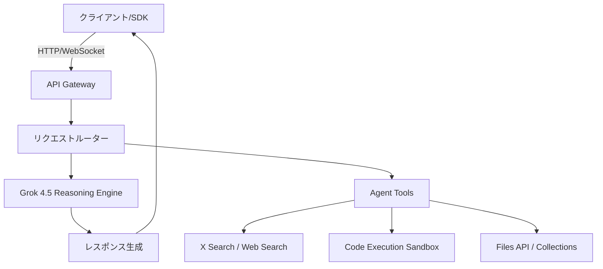

# **Grok 調査レポート**

## **1. 基本情報**

* **ツール名**: Grok
* **ツールの読み方**: グロック
* **開発元**: xAI
* **公式サイト**: [https://x.ai/grok](https://x.ai/grok)
* **関連リンク**:
  * ドキュメント: [https://docs.x.ai/](https://docs.x.ai/)
  * リリースノート: [https://docs.x.ai/docs/release-notes](https://docs.x.ai/docs/release-notes)
  * APIコンソール: [https://console.x.ai/](https://console.x.ai/)
* **カテゴリ**: 生成AI
* **概要**: xAIによって開発された、X(旧Twitter)のリアルタイム情報にアクセスできるAIモデル。真実の探求を目的とし、ユーモアや反骨精神を持つ回答スタイル（Fun Mode）も特徴の一つ。最新のGrok 4.5シリーズでは推論能力が大幅に強化されている。

## **2. 目的と主な利用シーン**

* **解決する課題**: リアルタイム情報の欠如や、過度な検閲による回答の質の低下。
* **想定利用者**:
  * 最新トレンドを追うマーケターやジャーナリスト
  * 高度な推論やコーディング支援を求める開発者
  * ユーモアのある対話を好む一般ユーザー
* **利用シーン**:
  * X上の投稿分析やトレンド検索
  * 複雑なプログラミングタスクのコード生成と実行
  * 画像内容の理解と分析（マルチモーダル）

## **3. 主要機能**

<!--
【ガイドライン】
- 5-10項目の主要機能を箇条書きで記述
- 各機能は1-2文で概要を説明
-->

* **Grok 4.5 (Reasoning Model)**: 高度な推論能力を持つフラッグシップモデル。複雑な問題解決に特化し、推論の度合い（Low, Medium, High）を設定可能。
* **リアルタイム検索 (Web / X Search)**: Web全体およびX上の投稿（ツイート）をリアルタイムに検索し、回答に反映。画像検索機能（Image Search）もサポート。
* **マルチモーダル**: テキスト入力に加え、画像の理解・分析が可能。Imagine機能により画像・動画の生成や編集も対応。
* **Files API & Collections**: PDFなどのドキュメントをアップロードし、RAG（検索拡張生成）として利用可能。ファイルをPublic URLとして公開する機能も提供。
* **Code Execution**: Pythonコードをサンドボックス環境で生成・実行し、計算やデータ処理を行う。
* **音声（Voice）**: Text-to-Speech、Speech-to-Textに加え、Voice Agent APIやカスタムボイスの作成（Custom Voices）機能を提供。
* **Context Compaction**: 長大なコンテキストを短く圧縮し、コスト削減とレスポンス高速化を実現。
* **Structured Outputs**: JSONスキーマに従った構造化データを出力可能。
* **Fun Mode**: ユーモアや皮肉を交えた、より人間らしい対話モード。


## **4. 動作原理・システム構成**

<!--
【ガイドライン】
- ツールの動作原理、システム構成（アーキテクチャ）、データの流れ、通信フローなどを記述
- クライアント・サーバー型、ローカルファースト、クラウド完結など、ツールのアーキテクチャ特性を明記
- 可能であればMermaidによる構成図やフロー図を含めること（Mermaid内のノードや説明テキストは原則日本語表記で作成する）
- 要素技術や内部で使われている仕組み（例：Docker、Git worktree、WebSockets、E2EEなど）を解説
- SaaS等の場合はわかる範囲で記述し、公開されていない場合は「非公開」とし、分かる範囲の処理フロー等を記載
-->

* **アーキテクチャ**: クラウド完結型SaaS。OpenAI互換のREST APIおよびWebSocketモードを提供。
* **主要コンポーネントとデータフロー**:
  * ユーザーのリクエストはAPI Gateway（API Consoleで管理）を経由してGrokのReasoning Engineに送られる。
  * Files APIやCollectionsにアップロードされたデータはxAIのクラウド上で管理され、RAG（検索拡張生成）のベクトル検索として利用される。
* **特筆すべき要素技術**:
  * **Context Compaction**: 長い会話履歴を圧縮してAPIリクエストのコストとレイテンシを削減する独自の最適化技術。
  * **Priority Processing**: 専用のサービスティアによる高優先度スケジューリングで、応答速度を担保。
  * **WebSocket Mode**: エージェント型ワークフローなどの高頻度・低レイテンシ通信向けに、ステートフルな接続を提供。



## **5. 開始手順・セットアップ**

* **前提条件**:
  * xAIアカウントの作成
  * API利用にはクレジットのチャージが必要
* **インストール/導入**:

  ```bash
  # Python SDKのインストール
  pip install xai-sdk
  ```

* **初期設定**:
  * APIキーを[Console](https://console.x.ai/)で発行し、環境変数に設定。

  ```bash
  export XAI_API_KEY="your_api_key"
  ```

* **クイックスタート**:
  * **curlでのリクエスト例**:

  ```bash
  curl https://api.x.ai/v1/responses \
  -H "Content-Type: application/json" \
  -H "Authorization: Bearer $XAI_API_KEY" \
  -d '{
      "input": [
          { "role": "system", "content": "You are Grok." },
          { "role": "user", "content": "Hello!" }
      ],
      "model": "grok-4.5"
  }'
  ```

## **6. 特徴・強み (Pros)**

* **圧倒的なリアルタイム性**: Xのプラットフォームと直結しており、ニュースやトレンドへの反応速度が非常に速い。
* **Reasoning (推論) 能力**: Grok 4.5は推論モデルとして設計されており、難解なタスクの処理能力が高い。
* **ツールの統合**: 検索、コード実行、ドキュメント検索などのエージェント機能がAPIレベルで統合されている。
* **開発者フレンドリー**: OpenAI互換のAPI仕様を持ち、既存のツールチェーンからの移行が容易。

## **7. 弱み・注意点 (Cons)**

* **Reasoningモデルの制約**: Grok 4.5などの推論モデルでは、`presencePenalty`などの一部パラメータがサポートされていない。
* **情報源のバイアス**: X上の情報を強く参照する場合、SNS特有のバイアスや不正確な情報が含まれるリスクがある。
* **日本語対応**: 日本語での対話は可能だが、ドキュメントや一部のシステムメッセージは英語が中心。

## **8. 料金プラン**

| プラン名 | 料金 | 主な特徴 |
|---------|------|---------|
| **無料プラン** | 無料 | Xユーザー向け。機能・回数制限あり。 |
| **X Premium** | 月額制 | Grokの基本機能が利用可能（Xアプリ内）。 |
| **API利用** | 従量課金 | 開発者向け。モデルとツール利用に応じた課金（例: Grok 4.5は入力$2/1M, 出力$6/1M）。 |

* **課金体系**: トークン課金 + ツール利用料
* **ツール利用料 (API)**:
  * **Web Search**: $5 / 1,000 requests
  * **X Search**: $5 / 1,000 requests
  * **Code Execution**: $5 / 1,000 executions
  * **Documents Search**: $2.50 / 1,000 requests

## **9. 導入実績・事例**

* **導入企業**: Replit（Replit AgentへのGrok統合）
* **導入事例**: ReplitのAIエージェント機能において、Grokの推論能力とコンテキスト理解が活用されている。
* **対象業界**: テック企業、メディア、開発ツールベンダー

## **10. サポート体制**

* **ドキュメント**: [xAI Docs](https://docs.x.ai/) - ガイド、APIリファレンス、Cookbookが充実。
* **コミュニティ**: Discordコミュニティがあり、開発者間の交流が活発。
* **公式サポート**: メールサポート (`support@x.ai`) およびステータスページを提供。

## **11. エコシステムと連携**

### **11.1 API・外部サービス連携**

* **API**: OpenAI互換のChat Completions APIおよび独自のResponses APIを提供。
* **外部サービス連携**:
  * **LangChain**: Python/JS向けの公式インテグレーションあり。
  * **Replit**: 開発環境へのネイティブ統合。

### **11.2 技術スタックとの相性**

| 技術スタック | 相性 | メリット・推奨理由 | 懸念点・注意点 |
|:---|:---:|:---|:---|
| **Python** | ◎ | 公式SDK (`xai-sdk`) およびLangChain対応が完備。 | 特になし |
| **Node.js / TS** | ◎ | OpenAI SDK互換およびLangChain JSで利用可能。 | 公式のJS専用SDKはPythonほど強調されていない。 |
| **LangChain** | ◎ | 公式プロバイダーとしてサポートされている。 | バージョンによる対応状況の確認が必要。 |

## **12. セキュリティとコンプライアンス**

* **認証**: API Keyによる認証（Bearer Token）。
* **データ管理**: エンタープライズAPIではデータプライバシーが考慮されているが、詳細な仕様は要確認。
* **準拠規格**: [console.x.ai](https://console.x.ai/)にて監査ログ(Audit Logs)の閲覧が可能。

## **13. 操作性 (UI/UX) と学習コスト**

* **UI/UX**: Xアプリ内蔵のGrokはチャット形式で誰でも使いやすい。APIコンソールもシンプルで管理しやすい。
* **学習コスト**: OpenAI互換APIのため、既存のLLM開発者であれば学習コストはほぼゼロ。

## **14. ベストプラクティス**

* **効果的な活用法 (Modern Practices)**:
  * **Cachingの活用**: 繰り返し使用するプロンプトにはキャッシュ機能（自動有効）を活用し、コストを削減する。
  * **Reasoningモデルの使い分け**: 複雑な論理的思考が必要な場合はGrok 4.5を使用し、単純な応答には軽量モデルを検討する。
* **Context Compactionの活用**: 長大なコンテキストを維持しつつコストを抑えるため、Context Compaction APIを積極的に活用する。
  * **WebSocketの利用**: ツール呼び出しが多いエージェント開発では、WebSocketモードを使用してオーバーヘッドを減らす。
* **陥りやすい罠 (Antipatterns)**:
  * **パラメータ設定**: Grok 4.5（推論モデル）に対して `presencePenalty` を指定するとエラーになるため注意（`reasoning_effort`は指定可能）。

## **15. ユーザーの声（レビュー分析）**

* **調査対象**: Google Play, App Store
* **総合評価**: 4.8/5.0 (Google Play)
* **ポジティブな評価**:
  * 「ニュースへの反応が他のAIより圧倒的に早い」
  * 「Fun Modeの回答が面白く、人間味がある」
* **ネガティブな評価 / 改善要望**:
  * 「画像生成時にエラーが出ることがある」
  * 「無料版の制限が厳しい」

## **16. 直近半年のアップデート情報**

* **2026-07-08**: **Grok 4.5**をリリース。コーディング、エージェントタスクに特化し、推論労力の設定が可能に。
* **2026-06-15**: **Priority Processing**を提供開始。テキスト推論エンドポイントで優先スケジューリングが可能に。
* **2026-06-10**: **Public URLs for Files**およびImagineの統合を発表。ファイルの無期限公開やImagineからの直接参照が可能に。
* **2026-05-29**: Streaming STTの**Smart Turn**、**Context Compaction** API、および**WebSocket Responses API Mode**をリリース。
* **2026-05-27**: Web Searchにおいて画像検索機能（Image Search）をサポート。
* **2026-05-14**: **Grok Build**のベータ版を提供開始。エージェント型コーディングワークフロー向けTUIを提供。
* **2026-05-01**: **Custom Voices**をリリース。短い音声からボイスクローンを作成可能に。
* **2026-04-30**: APIの各レスポンスにコスト情報を含める**Cost Tracking**機能を追加。
* **2026-03-10**: **Grok 4.5 Fast**をリリース。推論能力がさらに向上。
* **2026-01-20**: Agent Toolsが更に強化され、API利用での安定性が向上。

(出典: [Release Notes](https://docs.x.ai/docs/release-notes))

## **17. 類似ツールとの比較**

### **17.1 機能比較表 (星取表)**

| 機能カテゴリ | 機能項目 | Grok (xAI) | ChatGPT | Claude | Gemini |
|:---:|:---|:---:|:---:|:---:|:---:|
| **基本機能** | 推論能力 | ◎<br><small>Grok 4.5</small> | ◎<br><small>GPT-5.4/5.5</small> | ◎<br><small>Claude 4.8</small> | ◎<br><small>Gemini 3.5</small> |
| **リアルタイム性** | X検索 | ◎<br><small>ネイティブ統合</small> | △<br><small>Bing経由</small> | ×<br><small>非対応</small> | △<br><small>Google検索</small> |
| **ユーモア** | Fun Mode | ◎<br><small>独自機能</small> | △<br><small>プロンプトで可</small> | ×<br><small>安全性重視</small> | △<br><small>プロンプトで可</small> |
| **開発** | API互換性 | ◯<br><small>OpenAI互換</small> | ◎<br><small>標準</small> | △<br><small>独自API</small> | △<br><small>独自API</small> |

### **17.2 詳細比較**

| ツール名 | 特徴 | 強み | 弱み | 選択肢となるケース |
|---------|------|------|------|------------------|
| **Grok** | リアルタイム情報と「尖った」回答 | Xの全データへのアクセス権、検閲の少なさ。 | エコシステムがOpenAIほど巨大ではない。 | 最新のニュース分析や、エンタメ性の高い対話が必要な場合。 |
| **ChatGPT** | 業界標準のオールラウンダー | 圧倒的な実績と周辺ツールの充実度。 | 最新情報の取得はBing検索に依存。 | 安定性と汎用性を最優先する場合。 |
| **Claude** | 安全性と文章力 | 自然な日本語生成と高い安全性、長文読解。 | リアルタイム検索機能を持たない。 | 長文の要約や、コンプライアンス重視の業務利用。 |

## **18. 総評**

* **総合的な評価**:
  * Grokは「Xのリアルタイムデータ」という唯一無二の武器を持ち、Grok 4.5による推論能力の向上で実務レベルでも強力な選択肢となった。APIもOpenAI互換で導入しやすく、特に最新情報を扱うエージェント開発において優位性がある。
* **推奨されるチームやプロジェクト**:
  * SNSマーケティングやトレンド分析を行うチーム。
  * ニュースメディアやリアルタイム情報配信サービス。
  * 既存のOpenAIベースのアプリに、より「人間らしい」または「最新情報に強い」特徴を加えたい開発者。
* **選択時のポイント**:
  * **情報の鮮度**が最重要であればGrok一択。
  * **安定性とエコシステム**を重視するならChatGPT。
  * **文章の質と安全性**を重視するならClaude。
