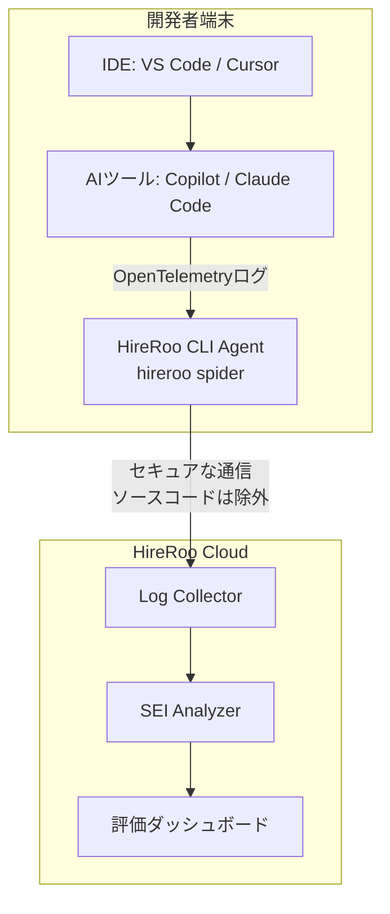

# **HireRoo 調査レポート**

## **1. 基本情報**

* **ツール名**: HireRoo
* **ツールの読み方**: ハイヤールー
* **開発元**: 株式会社ハイヤールー
* **公式サイト**: [https://hireroo.io/](https://hireroo.io/)
* **関連リンク**:
  * ドキュメント: [https://support.hireroo.io/](https://support.hireroo.io/)
* **カテゴリ**: 組織開発プラットフォーム
* **概要**: 採用・育成・評価のあらゆる場面でエンジニアの「AI協働力」を可視化するSaaS。外部委託への依存を減らし、組織のAIネイティブ化を一気通貫で支援する。

## **2. 目的と主な利用シーン**

* **解決する課題**: 従来のコーディング試験ではAIの利用によってスキル差が測れなくなったこと。また、組織におけるAIツールの導入による生産性向上の実態（AI活用の質）が定量化しにくいこと。
* **想定利用者**: 人事・採用担当者、エンジニアリングマネージャー（EM）、CTO、開発組織のリーダー
* **利用シーン**:
  * エンジニア採用時の技術試験（Skill Interview）
  * 社内エンジニアのAI活用レベルの評価とROIの可視化（Skill Assessment）
  * 社内のスキル格差を埋めるための個別最適化された学習プランの提供（Skill Development - 今後実装予定）

## **3. 主要機能**

* **Skill Interview（AI時代のコーディング試験）**: Claude Code や Codex 等が組み込まれた専用オンライン IDE を提供し、AIを使った実務に近い開発課題を受験者に提供する。
* **思考プロセスの可視化 (プレイバック)**: 候補者のプロンプト入力やファイル生成の試行錯誤をターンごとに記録し、タイムラインで再生できる。
* **Skill Assessment（AI活用量と質の可視化）**: 社内エンジニアの各ツールのトークン使用量・コストに加えて、AI協働力（SEI）による活用の「質」を計測する。
* **SEI（Software Engineering Index）による評価**: 317社の導入実績と学術論文を元にした独自指標。意図の仕様化、環境構築、共同推論、実行の統制、出力の品質保証の5領域で採点を行う。
* **CLIツールによる自動計測**: `hireroo spider` コマンドを実行するだけで、開発者の端末から既存のAIツール（Copilot, Cursor等）のログを収集し、スコアを自動算出する。
* **分析と改善アクションの提示**: 上位活用者（AI-champion）のプロンプトや環境設定を分析・型化し、組織全体への推奨アクションとして提示する。

## **4. 動作原理・システム構成**

* **アーキテクチャ**: クラウド完結型SaaS（評価ダッシュボード・IDE提供）およびローカルで稼働するCLIエージェントのハイブリッド構成
* **主要コンポーネントとデータフロー**:
  * **Skill Interview**: ブラウザベースの専用IDE上で候補者がコーディングを実行。バックエンド側でAIプロバイダとの通信、コードの自動採点、不審度検知、実行ログの記録を行う。
  * **Skill Assessment**: 開発者のローカル端末（Mac/Windows/Linux）上でCLIツール（`hireroo spider`）を動作させ、OpenTelemetryのテレメトリとしてログを収集する。
  * **データ処理**: 収集したログはハイヤールーのバックエンドで集計・分析され、スコアとしてダッシュボードに表示される。モデルの応答文やツールの実行結果等の生ログは評価スコア算出後に破棄される。
* **特筆すべき要素技術**:
  * **OpenTelemetry**: ローカルでのテレメトリ収集に使用。LLMへの直接のリクエスト自体はハイヤールーを経由しない設計となっており、高いプライバシー保護を実現。



## **5. 開始手順・セットアップ**

* **前提条件**:
  * Skill Interview: ブラウザのみで受験可能。
  * Skill Assessment: 開発者の端末にCLIツールのインストールが必要（Mac / Windows / Linux に対応）。
* **インストール/導入**:
  ```bash
  # ターミナルでセットアップコマンドを実行
  hireroo spider setup
  ```
* **初期設定**:
  * コマンド実行後、自動でローカルのAIツール（Copilot, Cursor等）を検出し、ログの収集を開始する。
* **クイックスタート**:
  * CLIを実行してログ収集を開始後、数時間でWeb上のアプリ（ダッシュボード）にAI協働力の評価スコアが可視化される。

## **6. 特徴・強み (Pros)**

* **「過程」を評価できる独自性**: 最終的なコードの正しさだけでなく、「AIとどのように壁打ちして解決したか」というプロセスそのものを定量化（SEI）できる。
* **導入の容易さ**: Skill AssessmentはCLIを1行実行するだけで、既存の開発フロー（CopilotやCursorの使用）を変えずに計測が開始できる。
* **豊富なベンチマークデータ**: 317社、116万件以上の評価データによる業界標準値と比較することで、自社の現在地を客観的に把握できる。
* **公平な試験環境**: Skill Interviewでは、候補者自身のAI課金状況に依存せず、HireRooが提供する同一のAI環境（Claude Code / Codex）で試験を行える。

## **7. 弱み・注意点 (Cons)**

* **料金が非公開**: 公式サイト上に具体的な金額の記載がなく、個別に見積もりを取る必要がある。
* **育成機能は未提供**: 個別最適学習を提供する「Skill Development」機能は現在「COMING SOON」の段階である。
* **ローカルへのCLIインストールへの心理的ハードル**: ソースコードは収集しない設計になっているものの、開発者のローカル端末に常駐するエージェントをインストールすることに対し、社内セキュリティ部門の理解を得る必要がある場合がある。

## **8. 料金プラン**

| プラン名 | 料金 | 主な特徴 |
|---------|------|---------|
| **スターター** | 要問い合わせ | 標準の試験形式、自動採点、プレイバック、メールサポート等の基本機能。小規模チーム向け。 |
| **スタンダード** | 要問い合わせ | AI協働形式、技術レビュー、相対評価、Slack通知等に対応。本格運用向け。 |
| **プロフェッショナル** | 要問い合わせ | AI自動評価、深堀り質問、導入・運用の伴走支援、即時サポートが含まれる。 |
| **エンタープライズ** | 要問い合わせ | SSO（SAML）、ATS連携、高度なセキュリティ要件に対応。大規模組織向け。 |

* **課金体系**: プラットフォーム利用料 ＋ 従量課金（試験数に応じた請求、および評価ID数に応じた請求の2階建て）。試験は100件から、IDは10名からまとめ買いが可能。
* **無料トライアル**: デモ環境での無料トライアルあり（デモ受験から申し込み）。段階導入の相談も可能。

## **9. 導入実績・事例**

* **導入企業**: DMM.com、GMO Internet Group、freee、coconala、弁護士ドットコム、出前館、PKSHA Technology 等
* **導入事例**:
  * **GREE (エンターテインメント / 51-200人)**: 現場EMの選考にかかる工数を劇的に改善し、技術力の可視化によりマッチング精度を向上。
  * **出前館 (フード・グルメ / 201-500人)**: システム設計力も網羅した試験により、エンジニアスキルの可視化でミスマッチを削減。
  * **弁護士ドットコム (ビジネスプラットフォーム / 51-200人)**: 書類通過率が2.3倍、内定承諾率が3.2倍になり、優秀な人材の確保と面接工数削減を同時に実現。
* **対象業界**: 業種を問わず、IT・Web系企業を中心に、ソフトウェアエンジニアの採用・評価を行う企業全般。

## **10. サポート体制**

* **ドキュメント**: [ヘルプセンター](https://support.hireroo.io/) にて利用ガイドやFAQを提供。
* **コミュニティ**: 公式コミュニティの記載はなし。
* **公式サポート**: お問い合わせフォームおよびメールでのサポート。プランによって返信時間（SLA）が異なり、スターターは3営業日以内、スタンダードは2営業日以内、プロフェッショナル以上は即時対応。

## **11. エコシステムと連携**

### **11.1 API・外部サービス連携**

* **API**: 公式サイト上にパブリックなAPIドキュメントの記載はないが、SaaS連携用の口は用意されている。
* **外部サービス連携**:
  * Slack（通知）
  * Google Workspace（Googleログイン）
  * 各種ATS（エンタープライズプランでの連携）

### **11.2 技術スタックとの相性**

| 技術スタック | 相性 | メリット・推奨理由 | 懸念点・注意点 |
|:---|:---:|:---|:---|
| **各種AIコーディングアシスタント**<br>(GitHub Copilot, Cursor, Claude Code, Codex) | ◎ | 既存の開発フローやツールをそのまま利用してログ収集が可能 | ツール側の仕様変更に伴う追従アップデートが必要になる可能性がある |
| **データ分析基盤**<br>(Google BigQuery, Snowflake, Amazon Redshift) | ◯ | 自社のデータストアと連携し、より詳細なログの深掘り分析が可能 | 個別のデータパイプライン構築が必要な場合がある |

## **12. セキュリティとコンプライアンス**

* **認証**: Googleログイン対応。エンタープライズプランではSSO (SAML) に対応。
* **データ管理**: Skill Assessmentにおいて、収集するのはOpenTelemetryのテレメトリのみで、LLMリクエスト自体はHireRooを経由せずAIプロバイダーへ直接送信される。モデルの応答文やツールの実行結果は評価に使用せず破棄し、評価に用いた生ログもスコア算出後に破棄され、ダッシュボードには集計スコアのみが保存される。個人情報はマスク可能。
* **準拠規格**: [セキュリティポリシー](https://hireroo.io/security-policy/)にて方針を公開しているが、ISO27001やSOC2などの特定の認証取得についての明記は公式サイト上には見当たらず。

## **13. 操作性 (UI/UX) と学習コスト**

* **UI/UX**: モダンで直感的なダッシュボードUIを採用。個人のスコア、チーム平均、業界標準との比較（ベンチマーク）がグラフィカルに表示され、経営層にも直感的に理解しやすい設計。
* **学習コスト**: 非常に低い。受検者（候補者）はブラウザから専用IDEにアクセスするだけで済み、環境構築が不要。社内エンジニアの評価もCLIを1行実行するだけで自動化されるため、導入障壁は低い。

## **14. ベストプラクティス**

* **効果的な活用法 (Modern Practices)**:
  * 同業他社とのベンチマーク機能を活用し、自社の位置と伸びしろを定量化して目標設定の基準とする。
  * 上位活用者（AI-champion）の利用パターンやプロンプトの「型」を抽出し、社内の集合知として他のメンバーに共有することで、組織全体のスキルを底上げする。
* **陥りやすい罠 (Antipatterns)**:
  * 評価スコア（AI協働力）を人事評価のみに直結させ、メンバー間の単純な優劣の比較に使ってしまうこと。あくまで「スキルの現在地を知り、改善するためのツール」として活用すべきである（現場の反発を防ぐため）。

## **15. ユーザーの声（レビュー分析）**

* **調査対象**: 公式導入事例、Techブログなど
* **総合評価**: 総合的なレビューサイトへの掲載はまだ少ないが、導入企業からは高い評価を得ている。
* **ポジティブな評価**:
  * 「現場のエンジニアリングマネージャーの選考工数が劇的に削減された」（GREE）
  * 「書類だけでは分からない実践的な問題解決プロセスを評価でき、ミスマッチが減った」（出前館）
  * 「候補者の母集団の数が1.6倍に増え、内定承諾率も大きく向上した」（弁護士ドットコム）
* **ネガティブな評価 / 改善要望**:
  * G2やITreview等の主要なレビューサイトに十分な件数の口コミがなく、第三者による定量的なネガティブ評価は確認できない。
* **特徴的なユースケース**:
  * 単なる採用テストとしてだけでなく、自社のAI投資効果（ROI）を経営層に説明するための材料として「トークン使用量」と「AI活用の質（SEI）」を組み合わせてレポートする用途で活用されている。

## **16. 直近半年のアップデート情報**

* **2026-08-28**: 25,115件の評価実績に基づく、SEI「AI協働力」ドメインのスコアアップデートレポート（2026年8月版）を公開。
* **2026-08-01**: Skill Interviewにおいて、AI自動評価「Roolar君」、AIプレイバック、AI試験作成アシスト(Beta) などの機能を拡充。
* **2026-07-01**: 累計評価実績が116万件、導入企業数が317社を突破したことを公表。

(出典: [HireRoo お役立ち資料](https://hireroo.io/whitepapers/) 等)

## **17. 類似ツールとの比較**

### **17.1 機能比較表 (星取表)**

| 機能カテゴリ | 機能項目 | 本ツール | Track Test | HackerRank |
|:---:|:---|:---:|:---:|:---:|
| **基本機能** | コーディング試験 | ◎<br><small>AI活用前提の実践課題</small> | ◯<br><small>標準的なアルゴリズム問題</small> | ◯<br><small>標準的なアルゴリズム問題</small> |
| **カテゴリ特定** | AI協働プロセスの評価 | ◎<br><small>独自指標SEIによる分析</small> | △<br><small>コードの結果評価が主</small> | △<br><small>AIによる採点補助はあるがプロセス評価は弱い</small> |
| **カテゴリ特定** | 社内エンジニアのスキル可視化 | ◎<br><small>CLIによる日常ログ収集</small> | △<br><small>学習プラットフォームとしての側面が強い</small> | ×<br><small>採用試験用途がメイン</small> |
| **エンタープライズ** | SSO (SAML) | ◯<br><small>エンタープライズプランで対応</small> | ◯<br><small>対応</small> | ◎<br><small>高度な対応</small> |
| **非機能要件** | 日本語対応 | ◎<br><small>国内発サービスであり完全対応</small> | ◎<br><small>国内発サービスであり完全対応</small> | △<br><small>一部日本語化のみ</small> |

### **17.2 詳細比較**

| ツール名 | 特徴 | 強み | 弱み | 選択肢となるケース |
|---------|------|------|------|------------------|
| **本ツール** | AI協働力の可視化に特化したプラットフォーム | AIを「どう使ったか」のプロセスを定量化できる点。導入の手軽さ。 | 料金が公開されておらず、育成機能はまだリリース前。 | エンジニア組織のAI活用を推進し、採用基準をモダンにアップデートしたい企業 |
| **Track Test** | 国内シェアの高いコーディング試験・学習プラットフォーム | アルゴリズムから実践的なフレームワーク問題まで幅広い問題群。新卒採用に強い。 | AI活用の「プロセス」の評価という点ではHireRooに譲る。 | 国内の新卒一括採用や、一般的なプログラミングスキルの足切りを行いたい場合 |
| **HackerRank** | グローバル標準の技術評価プラットフォーム | 圧倒的な問題数とグローバルでの知名度。大規模要件への対応。 | 日本語のサポートや日本の採用市場へのローカライズが不十分な場合がある。 | グローバル展開を行う企業や、海外のエンジニア候補者を大量に評価したい場合 |

## **18. 総評**

* **総合的な評価**:
  * AIによってコードを生成することが当たり前になった現代において、「コードが書けるか」ではなく「AIを使って課題を解決できるか（AI協働力）」を測定・可視化するというアプローチは非常に先進的であり、的を射ている。採用から社内の評価まで一気通貫でデータドリブンに開発組織を強化できる強力なプラットフォームである。
* **推奨されるチームやプロジェクト**:
  * すでにGitHub CopilotやCursorなどのAIコーディングアシスタントを導入しているが、その投資効果（ROI）が不透明だと感じている開発組織。
  * AI活用によって候補者の技術試験（コーディングテスト）の点数がインフレしてしまい、本来のスキル見極めが難しくなっている採用チーム。
* **選択時のポイント**:
  * 単なるアルゴリズムの知識を問う旧来のコーディング試験から脱却したい場合や、社内のエースエンジニアのAI活用ノウハウを形式知化して組織全体に波及させたい場合に、最有力な選択肢となる。