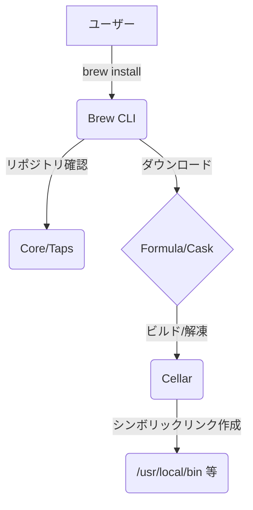

# **Homebrew 調査レポート**

## **1. 基本情報**

* **ツール名**: Homebrew
* **ツールの読み方**: ホームブリュー
* **開発元**: Homebrew contributors (Max Howellにより2009年作成)
* **公式サイト**: [https://brew.sh/](https://brew.sh/)
* **関連リンク**:
  * GitHub: [https://github.com/Homebrew/brew](https://github.com/Homebrew/brew)
  * DeepWiki: [https://deepwiki.com/Homebrew/brew](https://deepwiki.com/Homebrew/brew)
  * ドキュメント: [https://docs.brew.sh/](https://docs.brew.sh/)
* **カテゴリ**: パッケージ管理 / プラットフォーム
* **概要**: macOSおよびLinux上でソフトウェアのインストールを簡単にするフリーでオープンソースのパッケージ管理システムです。ターミナル（CLI）上でコマンドを入力するだけで、必要なツールのダウンロード、依存関係の解決、インストールを一括で行えます。

## **2. 目的と主な利用シーン**

* **解決する課題**: macOSには標準で搭載されていない開発用ツールやライブラリのインストール、GUIアプリケーションの管理、およびそれらの依存関係とバージョンの解決にかかる手間を軽減します。
* **想定利用者**: アプリケーション開発者、インフラエンジニア、システム管理者
* **利用シーン**:
  * 開発環境のセットアップ（言語ランタイムやツールのインストール）
  * macOS環境のクリーンインストール後のツールチェーンの一括導入
  * Homebrew Caskを用いた各種GUIアプリケーション（Webブラウザやエディタなど）のインストール・管理

## **3. 主要機能**

* **Formula（フォーミュラ）によるインストール**: Rubyスクリプトとして定義された手順に基づき、ソースからビルドしてソフトウェアをインストールします。
* **Bottles（ボトル）**: コンパイル済みのバイナリパッケージ。ビルド時間を省略し、高速なインストールを実現します。
* **Taps（タップ）**: サードパーティ製のパッケージリポジトリを追加・管理する機能。公式にないソフトウェアも簡単にインストールできます。
* **Homebrew Cask**: macOS用のGUIアプリケーション（.dmg, .pkg, .app）をコマンドラインからインストール・管理する拡張機能。
* **依存関係の自動解決**: インストールしようとするツールに必要な他のライブラリやパッケージを自動でダウンロードし、導入します。

## **4. 動作原理・システム構成**

* **アーキテクチャ**: ローカルファーストのCLIツールベースのシステム構成
* **主要コンポーネントとデータフロー**:
  * **Brew CLI**: ユーザーがコマンドを入力するインターフェース。
  * **Core/Taps**: FormulaやCaskが定義されたRubyスクリプトのリポジトリ（Taps）。
  * **Formula/Cask**: パッケージの依存関係やインストール手順が記載されたスクリプト。
  * **Cellar**: インストールされたパッケージ（Keg）が保存されるローカルのディレクトリ構造。
* **特筆すべき要素技術**:
  * **Ruby**: FormulaとCaskを定義するための言語。
  * **Git**: Taps（リポジトリ）の更新を管理。
  * **Symlinks**: Cellarにインストールされたバイナリを `/usr/local/bin` または `/opt/homebrew/bin` にシンボリックリンクして提供。



## **5. 開始手順・セットアップ**

* **前提条件**:
  * macOS（サポート対象の最新バージョンおよび直近2つのメジャーバージョン、例えばSonoma, Sequoia, Tahoeなど）またはLinux
  * macOSの場合はCommand Line Tools (CLT) for Xcodeが必要
* **インストール/導入**:

  ```bash
  # Homebrewのインストールコマンド（macOS/Linux共通）
  /bin/bash -c "$(curl -fsSL https://raw.githubusercontent.com/Homebrew/install/HEAD/install.sh)"
  ```

* **初期設定**:
  * インストール完了後、スクリプトの指示に従って`~/.zprofile`や`~/.bash_profile`などにHomebrewのパスを通す必要があります。
* **クイックスタート**:
  * `brew update` （パッケージリストの更新）
  * `brew search <パッケージ名>` （利用可能なパッケージの検索）
  * `brew install <パッケージ名>` （パッケージのインストール）

## **6. 特徴・強み (Pros)**

* macOS開発者にとって実質的なデファクトスタンダードであり、多くの開発ツールがHomebrewでのインストール方法を公式ドキュメントで提供しています。
* Rubyという身近な言語で書かれたFormulaにより、パッケージ（Formula）の自作やコミュニティへの貢献（PRの作成）が非常に容易です。
* 全てが`/opt/homebrew` (Apple Silicon) や `/usr/local` (Intel) 配下に収まり、システムファイルを汚さず綺麗にアンインストールや管理ができます。

## **7. 弱み・注意点 (Cons)**

* macOS特有の仕様変更（Apple Siliconへの移行など）によって一時的に対応が遅れる、または移行作業が必要になる場合があります。
* パッケージが頻繁に更新されるため、`brew upgrade`実行時に意図せずメジャーバージョンが上がり、既存の環境に影響を与える可能性があります。
* Linuxサポート（旧Linuxbrew）もありますが、APTやYUM/DNFなどのネイティブパッケージマネージャが主流であるため、Linux上でシステム全体を管理するには向いていません。

## **8. 料金プラン**

| プラン名 | 料金 | 主な特徴 |
|---------|------|---------|
| **無料プラン** | 無料 | オープンソースソフトウェアであり、全ての機能を無料で利用可能 |

* **課金体系**: なし (GitHub Sponsorsを通じた寄付を受け付けています)
* **無料トライアル**: 全て無料

## **9. 導入実績・事例**

* **導入企業**: ほぼすべてのIT企業、スタートアップからエンタープライズまで、macOSを開発端末として採用している組織で広く利用されています。
* **導入事例**:
  * 新入社員のオンボーディング用スクリプト（`Brewfile`を利用した一括セットアップ）
  * 開発者個人のローカル環境構築の自動化・コード化（Infrastructure as Codeのローカル版）
* **対象業界**: ソフトウェア開発、ITインフラ、教育機関など

## **10. サポート体制**

* **ドキュメント**: 公式サイトおよび`docs.brew.sh`に詳細なマニュアルが整備されており、`man brew`コマンドでも確認可能です。
* **コミュニティ**: GitHub Discussionsを中心とした非常に活発なコミュニティがあり、日々Issueの報告やPull Requestが行われています。
* **公式サポート**: オープンソースプロジェクトのため、ボランティアによるコミュニティベースのサポートが基本となります。

## **11. エコシステムと連携**

### **11.1 API・外部サービス連携**

* **API**: 外部から利用できるJSON APIを提供しており、FormulaやCaskの情報をプログラマティックに取得可能です。
* **外部サービス連携**: GitHub APIを密接に利用しており、パッケージのダウンロードやリポジトリの検索などが行われます。また、GitHub Packagesを通じてBottle（バイナリ）を配信しています。

### **11.2 技術スタックとの相性**

| 技術スタック | 相性 | メリット・推奨理由 | 懸念点・注意点 |
|:---|:---:|:---|:---|
| **macOS開発環境全般** | ◎ | 開発に必要なほぼ全てのCLIツールと主要GUIアプリが揃う | 複数バージョンの共存（例: Node.jsの複数バージョン）は可能だが、専用のバージョン管理ツール（nvmなど）と併用した方が無難な場合がある |
| **Linux環境** | △ | 最新のツールをユーザー権限で導入できるメリットがある | システムの標準パッケージ管理（APT等）と役割が被る可能性がある |

## **12. セキュリティとコンプライアンス**

* **認証**: 通常の利用において認証は不要ですが、API制限を回避するためにGitHubのPersonal Access Tokenを設定することができます。
* **データ管理**: インストール状況やエラーの匿名テレメトリデータ（Analytics）をInfluxDBに送信していますが、`brew analytics off`でオプトアウト可能です。
* **準拠規格**: OSSとしての透明性を保っており、パッケージごとのLicense情報（`brew info`で確認可能）やSBOMのサポートも進められています。

## **13. 操作性 (UI/UX) と学習コスト**

* **UI/UX**: シンプルで直感的なCLIインターフェース。コマンド体系が統一されており、ビールにちなんだ用語（Cellar, Keg, Tap, Bottle等）が独特ですが理解しやすいです。
* **学習コスト**: 基本操作（install, update, upgrade, uninstall）は数分で習得可能。独自のFormulaを作成する場合も、Rubyの基礎知識があれば比較的容易に学習できます。

## **14. ベストプラクティス**

* **効果的な活用法 (Modern Practices)**:
  * `Brewfile`を利用した`brew bundle`コマンドで、チーム内の開発環境をコードとして管理・共有する。
  * `brew autoremove`や`brew cleanup`を定期的に実行し、不要な依存関係や古いキャッシュを削除してストレージを確保する。
* **陥りやすい罠 (Antipatterns)**:
  * `sudo`を使って`brew`コマンドを実行する（Homebrewは基本的にユーザー権限での実行を前提としており、`sudo`は推奨されずエラーとなる場合があります）。
  * 依存するツールのバージョンが予期せず上がってしまうこと（必要に応じて`brew pin`で特定のバージョンを固定する）。

## **15. ユーザーの声（レビュー分析）**

* **調査対象**: GitHubのスター数、技術ブログ、開発者コミュニティ
* **総合評価**: macOS向けパッケージマネージャの事実上の標準であり、圧倒的な支持を得ています。
* **ポジティブな評価**:
  * 「Macを買ったら最初にインストールする必須ツール。これがないと開発が始まらない。」
  * 「Caskのおかげで、ブラウザやチャットツールなどのGUIアプリも含めてコマンド一発でセットアップできるのが最高。」
* **ネガティブな評価 / 改善要望**:
  * 「たまに依存関係が壊れて手動で修復が必要になることがある。」
  * 「`brew update`が遅いことがある（※最近のバージョンでJSON APIへの移行により改善傾向にあります）。」
* **特徴的なユースケース**:
  * CI環境（GitHub ActionsのmacOSランナー等）での必須ツールのセットアップ自動化。

## **16. 直近半年のアップデート情報**

* **2026-08-27**: 6.0.20リリース（バグ修正やFlatpak対応などの改善）
* **2026-08-24**: 6.0.19リリース（バグ修正やGCCバージョンの改善など）
* **2026-08-17**: 6.0.18リリース
* **2026-06-11**: 6.0.0リリース（HOMEBREW_ のシークレット対応など多数の変更を含むメジャーアップデート）
* **2026-04-07**: 5.1.5リリース（マイナーアップデートとバグ修正）
* **2025-11-12**: 5.0リリース（ダウンロードの並列化のデフォルト化、Linux ARM64/AArch64の公式サポート、macOS Intelサポートの非推奨化スケジュール等）
* **2025-08-05**: 4.6.0リリース（HOMEBREW_DOWNLOAD_CONCURRENCYによる並列ダウンロードのオプトイン導入、macOS 26 Tahoeの先行サポート、mcp-serverの内蔵）

(出典: [Homebrew Releases](https://github.com/Homebrew/brew/releases))


## **17. 類似ツールとの比較**

### **17.1 機能比較表 (星取表)**

| 機能カテゴリ | 機能項目 | Homebrew | npm | pnpm | Yarn |
|:---:|:---|:---:|:---:|:---:|:---:|
| **基本機能** | パッケージインストール | ◎<br><small>システムツール・CLI・GUI豊富</small> | ◎<br><small>JS/Node.js標準</small> | ◎<br><small>高速・ディスク効率良</small> | ◎<br><small>安定・ワークスペース対応</small> |
| **環境** | macOSサポート | ◎<br><small>デファクト標準</small> | ◯<br><small>OS非依存 (Node.js環境下)</small> | ◯<br><small>OS非依存 (Node.js環境下)</small> | ◯<br><small>OS非依存 (Node.js環境下)</small> |
| **機能拡張** | GUIアプリ管理 | ◎<br><small>Homebrew Cask</small> | ×<br><small>非対応</small> | ×<br><small>非対応</small> | ×<br><small>非対応</small> |
| **管理手法** | 依存関係解決 | ◯<br><small>自動解決 (Formulaベース)</small> | ◯<br><small>自動解決 (package.json)</small> | ◎<br><small>厳格な依存関係解決</small> | ◯<br><small>自動解決 (package.json)</small> |

### **17.2 詳細比較**

| ツール名 | 特徴 | 強み | 弱み | 選択肢となるケース |
|---------|------|------|------|------------------|
| **Homebrew** | macOSデファクトのパッケージマネージャ | システム全体で用いるCLIツール、GUIアプリを管理可能 | 言語専用のパッケージ（JSのライブラリなど）管理には向かない | macOSで開発環境を構築するほぼ全てのユーザー |
| **npm** | Node.js標準のパッケージマネージャ | JSエコシステムのデファクトスタンダード、初期導入不要 | 依存関係が肥大化しやすい、インストール速度がやや遅い | Node.jsベースの開発を行う際の標準的な選択肢 |
| **pnpm** | 高速でディスク効率の良いパッケージマネージャ | インストールが非常に高速、ディスク容量を大幅に節約 | 独自の構造のため、一部のツールで互換性問題が起きる場合がある | 大規模なモノレポ開発や、ディスク容量・速度を重視する場合 |
| **Yarn** | 安定性を重視したパッケージマネージャ | ワークスペース機能が強力、オフラインインストール対応 | npmとの差別化要因が少なくなってきている | 既存のプロジェクトでYarnが採用されている場合 |


## **18. 総評**

* **総合的な評価**:
  * Homebrewは、macOSユーザーにとって不可欠なツールであり、「Macのパッケージマネージャのデファクトスタンダード」という地位を確立しています。導入の容易さ、豊富なパッケージ数、そして活発なオープンソースコミュニティにより、開発者の生産性を大きく向上させています。
* **推奨されるチームやプロジェクト**:
  * macOSを主要な開発マシンとして利用している全ての開発チーム。
  * `Brewfile`を利用して、チーム全体で統一された開発環境を迅速に構築したいプロジェクト。
* **選択時のポイント**:
  * macOS環境での利用においては、特別な理由（Nixのような厳密な再現性が必要など）がない限り、第一選択肢となります。
