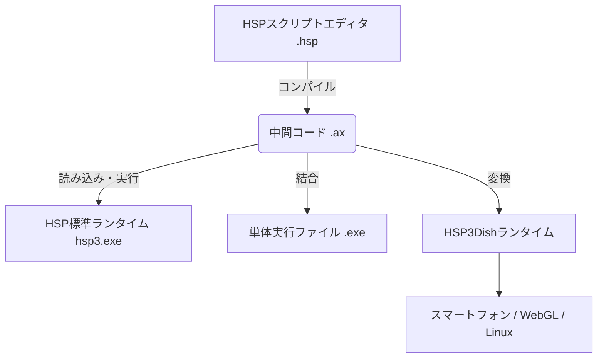

# **HSP3 調査レポート**

## **1. 基本情報**

* **ツール名**: HSP3 (Hot Soup Processor 3)
* **ツールの読み方**: エイチエスピースリー / ホットスーププロセッサ
* **開発元**: ONION software (おにたま)
* **公式サイト**: [https://hsp.tv/](https://hsp.tv/)
* **関連リンク**:
  * GitHub: [https://github.com/onitama/OpenHSP](https://github.com/onitama/OpenHSP)
  * ドキュメント: [https://hsp.tv/make/hsp3.html](https://hsp.tv/make/hsp3.html)
* **カテゴリ**: 言語ランタイム/実行環境
* **概要**: 1997年から開発が続けられている日本製のプログラミング言語です。BASICに似た簡単な文法で、Windowsアプリや2D/3Dゲームを誰でも手軽に作成・配布できることを目指して設計されています。

## **2. 目的と主な利用シーン**

* **解決する課題**:
  * プログラミング学習の初期段階における「環境構築の難しさ」と「文法の複雑さ」の解消。
  * Windows用の小規模なユーティリティツールやゲームを短時間で作成したいというニーズ。
  * 作成したソフトを手軽に配布可能な形式（EXEファイル）にしたいという要望。
* **想定利用者**:
  * プログラミング初心者（小中学生〜大人）。
  * 趣味でゲームやツールを作るホビープログラマー。
  * プログラミング教育を行う教育機関や指導者。
* **利用シーン**:
  * **学習・教育**: 「子どもIT未来塾」などのワークショップでのプログラミング体験教材として。
  * **インディーゲーム開発**: 2DシューティングやRPG、ノベルゲームなどの個人製作。
  * **業務効率化ツール**: ファイル整理や自動操作など、特定の業務を補助する小規模ツールの自作。

## **3. 主要機能**

* **GUIアプリケーション作成**: ボタン、入力ボックス、ウィンドウ表示などを数行のコマンドで実装可能。
* **2D描画機能**: 高速なスプライト描画、画像読み込み、アニメーション表示を標準サポート。
* **HGIMG4 (3D機能)**: 3Dモデル(.gpb)の表示、物理演算、シェーダー利用が可能な3Dゲームエンジンを同梱。
* **HSP3Dish**: Android, iOS, WebGL (HTML5), Linux向けに変換・出力するためのマルチプラットフォームランタイム。
* **EXEファイル生成**: 依存ランタイムのインストールを必要としない、単体動作可能な実行ファイルを作成可能。
* **COM/DLL連携**: Windows APIの呼び出しや、Excelなどの外部アプリケーション操作が可能。

## **4. 動作原理・システム構成**

* **アーキテクチャ**: ローカル環境（Windows等）で動作するインタープリタ/コンパイラ統合環境。
* **主要コンポーネントとデータフロー**:
  * スクリプト（.hsp）は、内部で中間コード（.ax）にコンパイルされる。
  * 実行時は、HSPランタイム（hsp3.exeなど）がこの中間コードを読み込んで動作する。
  * 実行ファイル（.exe）を作成する場合は、ランタイムと中間コードが1つのファイルに結合される。
* **特筆すべき要素技術**:
  * **OpenHSP**: コアとなるコンパイラ・ランタイム部分はオープンソース化されている。
  * **HSP3Dish**: マルチプラットフォーム向けランタイム。スマートフォン（iOS/Android）やブラウザ（WebGL/HTML5）、Linux/Raspberry Pi上でも動作を可能にする。
  * **HGIMG4**: 3Dグラフィック・物理演算用のエンジン。



## **5. 開始手順・セットアップ**

* **前提条件**:
  * OS: Windows 10/11 (推奨)
  * アカウント作成: 不要
* **インストール/導入**:
  公式サイトからインストーラー版またはZIP版をダウンロードして実行・解凍するのみ。
* **初期設定**:
  * 特になし（解凍後、`hsed3.exe` を起動すれば開発開始可能）。
* **クイックスタート**:
  1. エディタ (`hsed3.exe`) を起動。
  2. 以下のコードを入力。

     ```hsp
     mes "Hello World!"
     button "OK", *exit
     stop
     *exit
     end
     ```

  3. `F5` キーを押して実行。ウィンドウが表示される。

## **6. 特徴・強み (Pros)**

* **圧倒的な導入ハードルの低さ**: 環境構築でつまづく要素がほぼなく、日本語の親切なマニュアルが同梱されている。
* **配布の容易さ**: コンパイルしたEXEファイルは他のPCでもそのまま動作するため、友人に配ったりネットで公開したりしやすい。
* **豊富なユーザー資産**: 30年近い歴史の中で蓄積された大量のサンプルコード、プラグイン、ユーザーのノウハウがネット上に存在する。

## **7. 弱み・注意点 (Cons)**

* **言語仕様の独自性**: BASICライクな文法や `goto` 中心の制御構造は、現代的な言語（Python, JavaScript等）とは異なるため、応用が効きにくい面がある。
* **グローバル展開の弱さ**: 日本語話者向けに特化しているため、海外の最新技術情報やライブラリを取り込むハードルが高い。
* **大規模開発への不向き**: 名前空間の管理や型システムが緩いため、コード規模が大きくなると保守が難しくなる傾向がある。

## **8. 料金プラン**

| プラン名 | 料金 | 主な特徴 |
|---------|------|---------|
| **HSP3 フルセット** | 無料 | 機能制限なし、商用利用可、ソースコード改変可（ライセンス準拠） |

* **課金体系**: 完全無料
* **無料トライアル**: 該当なし（最初から全機能利用可能）

## **9. 導入実績・事例**

* **導入企業**: 具体的な企業名は公開されていないが、多くの個人開発者や同人サークルで利用されている。
* **導入事例**:
  * **「箱庭えくすぷろーらもあ」**: HSP3で開発され、SteamやNintendo Switch（移植）で発売されたアクションRPG。
  * **プログラミング教育**: 「子どもIT未来塾」や「CoderDojo」の一部などで、入門用言語として採用。
* **対象業界**: インディーゲーム業界、教育産業、個人のツール開発。

## **10. サポート体制**

* **ドキュメント**: 公式サイトに詳細なリファレンス、講座、サンプルが網羅されている。
* **コミュニティ**: 「HSP掲示板」等のユーザーコミュニティが活発で、初心者からの質問にも親切に回答が得られる文化がある。
* **公式サポート**: 基本的にコミュニティベースだが、不具合報告などは掲示板やGitHubで受け付けている。

## **11. エコシステムと連携**

### **11.1 API・外部サービス連携**

* **API**: 標準でHTTP通信機能を持っており、Web APIを叩くツールを作成可能。
* **外部サービス連携**: Arduino等のハードウェア制御モジュールや、Steamworks連携プラグインなどが存在する。

### **11.2 技術スタックとの相性**

| 技術スタック | 相性 | メリット・推奨理由 | 懸念点・注意点 |
|:---|:---:|:---|:---|
| **Visual Studio Code** | ◎ | 拡張機能によりシンタックスハイライト等が利用可能。標準エディタより快適。 | デバッグ機能などの完全な統合は限定的。 |
| **Windows API** | ◎ | DLL呼び出し機能により、OSの深部機能を直接利用可能。 | セキュリティソフトに誤検知されるリスクがある。 |
| **Excel (COM)** | ◯ | COMオートメーションで帳票作成ツール等が作れる。 | 実行環境にExcelが必要。 |

## **12. セキュリティとコンプライアンス**

* **認証**: ツール自体に認証機能はない。作成したアプリへの実装は開発者次第。
* **データ管理**: ローカルファイル操作が基本。暗号化プラグイン等を利用可能。
* **準拠規格**: 公式サイトで公開されていない。問い合わせが必要。作成されたEXEファイルにはデジタル署名を付与することが推奨される（誤検知回避のため）。

## **13. 操作性 (UI/UX) と学習コスト**

* **UI/UX**: 標準エディタはシンプルでメモ帳に近い感覚。F1キーでヘルプが出るなど初心者への配慮が行き届いている。
* **学習コスト**: **極めて低い**。プログラミングの概念（変数、条件分岐、ループ）を学ぶための最初のステップとして最適化されている。

## **14. ベストプラクティス**

* **効果的な活用法 (Modern Practices)**:
  * **モジュール機能の活用**: `module` 命令を使って変数のスコープを限定し、再利用性を高める。
  * **HSP3Dishの利用**: 最初からマルチプラットフォームを意識して記述することで、スマホやWebへの展開を容易にする。
* **陥りやすい罠 (Antipatterns)**:
  * **Gotoの多用**: スパゲッティコードになりやすいため、可能な限り `repeat-loop` や関数呼び出しを利用する。
  * **グローバル変数の乱用**: すべての変数がデフォルトでグローバルなため、命名規則で管理しないとバグの温床になる。

## **15. ユーザーの声（レビュー分析）**

* **調査対象**: Vector, X(Twitter), 技術ブログ
* **総合評価**: 長年のユーザーからは「実家のような安心感」「プログラミングの原点」として愛されている。
* **ポジティブな評価**:
  * 「書きたいと思ったその瞬間にウィンドウが出せるスピード感が最高。」
  * 「小学生の頃にHSPに出会ったおかげでエンジニアになれた。」
  * 「面倒な環境構築なしに配布用EXEが作れるのは唯一無二。」
* **ネガティブな評価 / 改善要望**:
  * 「今から覚えるならPythonやUnityの方が将来性があるのでは。」
  * 「オブジェクト指向的な書き方が独特で、他の言語からの移行だと戸惑う。」
* **特徴的なユースケース**:
  * 業務中のちょっとしたファイル操作自動化ツールを、休憩時間にササッと作って配布する。

## **16. 直近半年のアップデート情報**

* **2026-07-20**: **HSPプログラムコンテスト2026開催決定**。毎年恒例の自作ソフトの祭典が開催されることが発表された。
* **2026-07-01**: **HSP3.8β版 公開**。次期バージョンに向けた大幅な機能更新（64bit・UTF8への移行、新しいスクリプトエディタ、不具合の修正など）が行われた最新β版が公開された。
* **2026-01-28**: 開発者「おにたま」氏のインタビュー記事が公開。HSP3の30年の歴史と3.7の展望について語られている。
* **2025-09-05**: **HSP3.7 正式リリース**。標準機能の更新、HSP3Dishの機能拡充、HSPTV素材の追加などが行われた。

(出典: [HSPTV!](https://hsp.tv/))

## **17. 類似ツールとの比較**

### **17.1 機能比較表 (星取表)**

| 機能カテゴリ | 機能項目 | HSP3 | Node.js | Bun | Deno |
|:---:|:---|:---:|:---:|:---:|:---:|
| **基本機能** | 日本語対応 | ◎<br><small>完全対応</small> | ◯<br><small>一部ドキュメント等</small> | △<br><small>英語ベース</small> | △<br><small>英語ベース</small> |
| **配布** | 単体実行ファイル化 | ◎<br><small>標準機能(EXE)</small> | ◯<br><small>SEA機能(実験的)</small> | ◎<br><small>標準サポート</small> | ◎<br><small>`deno compile`</small> |
| **実行環境** | 実行の手軽さ | ◎<br><small>環境構築ほぼ不要</small> | △<br><small>インストール・設定要</small> | ◯<br><small>高速・オールインワン</small> | ◯<br><small>設定不要・セキュア</small> |
| **学習** | 難易度 | 低<br><small>入門に最適</small> | 中<br><small>エコシステムが複雑</small> | 中<br><small>JS/TSの知識要</small> | 中<br><small>JS/TSの知識要</small> |

### **17.2 詳細比較**

| ツール名 | 特徴 | 強み | 弱み | 選択肢となるケース |
|---------|------|------|------|------------------|
| **HSP3** | 導入が世界一簡単なテキスト言語。 | 環境構築不要、即EXE化、日本語情報。 | 独自文法、海外での通用度。 | プログラミング超初心者、小規模なWindowsツール自作。 |
| **Node.js** | サーバーサイドJavaScriptの標準。 | 圧倒的なエコシステム(npm)。 | 環境構築や依存関係管理が複雑になりがち。 | 豊富な既存のJSライブラリを活用して開発したい場合。 |
| **Bun** | 超高速なJS/TSランタイム。 | 起動・実行が高速、パッケージマネージャ内蔵。 | Node.js互換性が完全ではない場合がある。 | スクリプトの実行速度や開発体験(DX)を最優先する場合。 |
| **Deno** | セキュリティ・TSを重視したランタイム。 | デフォルトセキュア、TypeScript標準対応。 | Nodeエコシステムからの移行コスト。 | 安全な実行環境や、設定不要でTSを動かしたい場合。 |

## **18. 総評**

* **総合的な評価**:
  HSP3は、最新の技術トレンドとは異なる独自の進化を遂げていますが、「誰でも簡単にコンピュータを操れる」というBASIC時代の精神を現代に残す貴重なツールです。プログラミングの楽しさを知るための入り口として、また実用的な小規模ツールを素早く作る手段として、依然として高い価値を持っています。
* **推奨されるチームやプロジェクト**:
  * プログラミング初学者向けの教育カリキュラム。
  * 個人の趣味開発や、プロトタイピング。
  * 非エンジニアが業務改善ツールを自作する場合。
* **選択時のポイント**:
  「配布のしやすさ」と「日本語での安心感」を重視する場合はHSP3一択です。逆に、将来的なエンジニア就職や大規模開発を見据えるなら、Node.jsなどの汎用言語環境へのステップアップも視野に入れると良いでしょう。
