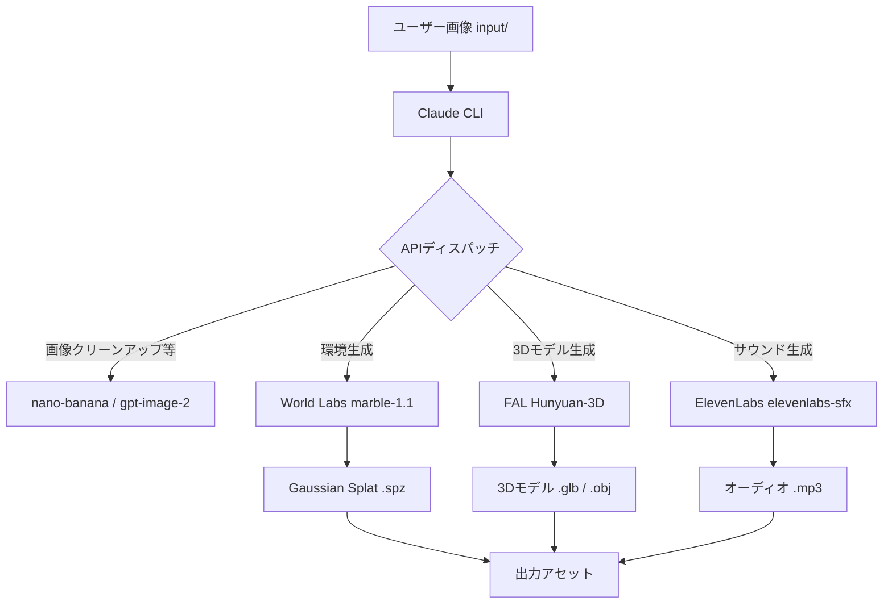

# **image-blaster 調査レポート**

## **1. 基本情報**

* **ツール名**: image-blaster
* **ツールの読み方**: イメージブラスター
* **開発元**: Neilson K-S
* **公式サイト**: [https://github.com/neilsonnn/image-blaster](https://github.com/neilsonnn/image-blaster)
* **関連リンク**:
  * GitHub: [https://github.com/neilsonnn/image-blaster](https://github.com/neilsonnn/image-blaster)
* **カテゴリ**: 3D/VTuber
* **概要**: 単一の画像を入力として、動的オブジェクトの3Dモデル（.glb, .obj）、静的環境のガウシアンスプラット（.spz）、および環境音やオブジェクト特有の物理効果音（.mp3）を数分で生成するオープンソースツール。Claudeのスキルセットとして動作する。

## **2. 目的と主な利用シーン**

* **解決する課題**: 2Dのコンセプトアートや写真から、3D空間・アセットを素早く構築し、プロトタイピングの時間を大幅に削減する。
* **想定利用者**: ゲーム開発者、3Dアーティスト、映像ロケーションスカウト、建築家
* **利用シーン**:
  * ビデオゲームのレベルコンセプトを即座に3D化する
  * 子供の頃の寝室など、思い出の写真を探索可能な3D空間にする
  * 映画や映像制作におけるバーチャルロケーションスカウト
  * 建築レンダリング画像の3Dモックアップ作成

## **3. 主要機能**

* **3Dモデル生成**: 入力画像から動的なオブジェクトの3Dメッシュ（.glb, .obj）を生成する。
* **環境生成 (Gaussian Splat)**: 静的な背景環境を表現するガウシアンスプラット（.spz）を生成する。
* **サウンドエフェクト生成**: 空間のアンビエントループ音や、オブジェクトごとの物理的な効果音（.mp3）を生成する。
* **Claudeスキル統合**: Claudeのコマンドラインツール（CLI）経由で、AIと対話しながら段階的に生成作業を進行できる。
* **ポリゴン最適化機能**: Hunyuan 3Dのパラメータを用いて、対象のポリゴン数（デフォルト50,000）やポリゴンタイプ（Triangle / Quadrilateral）の調整が可能。
* **PBRマテリアル対応**: 物理ベースレンダリング（PBR）に対応したテクスチャの生成。

## **4. 動作原理・システム構成**

* **アーキテクチャ**: ローカルクライアント（Claude CLI連携）と各種クラウドAI API（World Labs, FAL, ElevenLabsなど）を組み合わせた構成。
* **主要コンポーネントとデータフロー**:
  1. ユーザーがローカルディレクトリ（`input/`）に画像を配置。
  2. Claude CLIを通じて処理を指示。
  3. Claudeがスクリプトを実行し、画像編集（nano-banana等）、環境生成（World Labs API）、3Dメッシュ生成（FAL API経由のHunyuan 3D）、音声生成（ElevenLabs API）へデータを送信。
  4. 生成されたアセット（.glb, .spz, .mp3）がローカルに保存される。



* **特筆すべき要素技術**:
  * **Hunyuan 3D**: FAL経由で利用され、高品質な3Dモデル（PBR対応）を生成。
  * **World Labs (marble-1.1)**: 画像から探索可能な環境を構築するモデル。

## **5. 開始手順・セットアップ**

* **前提条件**:
  * Gitのインストール
  * Claude CLIツールのインストール
  * World Labs および FAL のAPIキー
* **インストール/導入**:

  ```bash
  git clone https://github.com/neilsonnn/image-blaster
  cd image-blaster
  curl -fsSL https://claude.ai/install.sh | bash
  ```

* **初期設定**:
  * Claudeを起動し、World LabsとFALのAPIキーを提供する。
* **クイックスタート**:
  1. `input/` ディレクトリにソース画像を配置する。
  2. Claudeに対して「画像をblast（変換）して、各ステップを確認して」と指示する。

## **6. 特徴・強み (Pros)**

* 世界最高峰の各種AIモデル（Hunyuan 3D, World Labs, ElevenLabs）の強みを自動で組み合わせるパイプラインが構築されている。
* 3D環境、モデル、音声という、ゲームエンジンに必要なアセットを一気通貫で生成できる。
* Unity, Unreal Engine, Godot, Blenderなど、既存のゲームエンジンやDCCツールへ簡単に組み込める汎用性の高い出力フォーマット。

## **7. 弱み・注意点 (Cons)**

* 完全なローカル動作ではなく、複数の外部有償API（World Labs, FAL, ElevenLabs）のAPIキーと利用枠（クレジット）が必要。
* オープンソースプロジェクトであり、エンタープライズ向けの公式な商用サポートは存在しない。
* 各種APIのアップデートや仕様変更に影響を受けやすい。
* 日本語での情報やサポートは存在しない。

## **8. 料金プラン**

| プラン名 | 料金 | 主な特徴 |
|---------|------|---------|
| **オープンソース版** | 無料 | ツールの利用自体は無料（MITライセンス）。ただしAPIの利用料金は別途必要。 |

* **課金体系**:
  * ツール本体: 無料
  * 外部API: World Labs, FAL, ElevenLabs等の各プロバイダーに準じた従量課金。
* **無料トライアル**: 各APIプロバイダーが提供する無料枠に依存。

## **9. 導入実績・事例**

* **導入企業**: 個人開発のオープンソースプロジェクトのため、企業名等の公開事例なし。
* **導入事例**: GitHubのスター数は5,000を超えており、個人開発者やクリエイターの間でプロトタイピング用途として広く注目を集めている。
* **対象業界**: インディーゲーム開発、映像制作、3Dアート。

## **10. サポート体制**

* **ドキュメント**: GitHubのREADMEにて、クイックスタートや使用されるモデルのパラメータ情報が提供されている。
* **コミュニティ**: GitHubのリポジトリ（Issues, Pull Requests）を通じて交流が行われている。
* **公式サポート**: 公式な企業サポートはなし。

## **11. エコシステムと連携**

### **11.1 API・外部サービス連携**

* **API**: ツール自体が外部APIを呼び出すクライアントとして機能する。
* **外部サービス連携**:
  * World Labs
  * FAL (AI推論プラットフォーム)
  * ElevenLabs
  * Claude (Anthropic)

### **11.2 技術スタックとの相性**

| 技術スタック | 相性 | メリット・推奨理由 | 懸念点・注意点 |
|:---|:---:|:---|:---|
| **Unity / Unreal / Godot** | ◎ | .glb, .obj, .mp3などの標準フォーマットで出力されるため、そのままインポート可能。 | 各エンジンのインポート設定等に依存 |
| **Blender / Maya** | ◎ | 業界標準フォーマットのため、後からの手動修正が容易。 | 特になし |
| **Three.js** | ◯ | Web上での3D表現にも活用可能。 | .spz (Gaussian Splat) の表示には対応ライブラリが必要 |

## **12. セキュリティとコンプライアンス**

* **認証**: 外部APIを呼び出すためのAPIキーをローカルで管理する。
* **データ管理**: 入力画像や生成されたデータは外部APIへ送信されるため、機密性の高い画像を使用する場合は各APIプロバイダーの利用規約（データ学習のオプトアウト等）を確認する必要がある。
* **準拠規格**: 公式サイトで公開されていない。

## **13. 操作性 (UI/UX) と学習コスト**

* **UI/UX**: 基本的にClaudeのCLIを介したチャットUI（対話型インターフェース）となるため、GUIベースのツールとは異なるが、自然言語で指示できる点は直感的。
* **学習コスト**: AIモデルのパラメータ（例: ポリゴン数の指定）をチャットで調整する感覚を掴む必要があるが、初期設定さえ終えれば非常に手軽。

## **14. ベストプラクティス**

* **効果的な活用法 (Modern Practices)**:
  * プロンプトで `generate-type` を指定し、初期プロトタイプは高速な `LowPoly` で生成、最終アセットは `Normal` でPBRテクスチャ付きにするなど、用途に応じた使い分け。
  * `app/` ディレクトリ内のReactビューアのコードをClaudeに変更させ、独自プレビュー環境を構築する。
* **陥りやすい罠 (Antipatterns)**:
  * クレジット（従量課金）の消費を意識せずに大量の画像をバッチ処理してしまうと、APIコストが高騰する可能性がある。

## **15. ユーザーの声（レビュー分析）**

* **調査対象**: GitHub, X (Twitter) 等のソーシャルメディア
* **総合評価**: レビューサイト（G2等）には未登録。GitHubでは5,000以上のスターを獲得しており評価は高い。
* **ポジティブな評価**:
  * 「1枚の画像から環境・モデル・音まで揃うワークフローは画期的。」
  * 「ゲームのモックアップを数分で作れるのは魔法のようだ。」
* **ネガティブな評価 / 改善要望**:
  * 「APIのセットアップが初心者には少しハードルが高い。」
  * 「たまにAPI側（FAL等）のタイムアウトで生成が失敗することがある。」
* **特徴的なユースケース**:
  * TRPGのマスターが、セッション用の探索空間を即座に生成するために活用。

## **16. 直近半年のアップデート情報**

* **2026-05-15**: リポジトリにMITライセンスを追加。
* **2026-05-14**: README.md の更新（使い方などの追記）。
* **2026-05-14**: プレビュー（Reactビューア）でのローディング状態表示、スポーン位置調整、ホバー状態の改善などUIの微調整。
* **2026-05-13**: スクリプトのクリーンアップ、オブジェクト生成プロンプトの改善など。

(出典: [image-blaster GitHub リポジトリ](https://github.com/neilsonnn/image-blaster))

## **17. 類似ツールとの比較**

### **17.1 機能比較表 (星取表)**

| 機能カテゴリ | 機能項目 | 本ツール | Hunyuan 3D | Luma AI |
|:---:|:---|:---:|:---:|:---:|
| **生成範囲** | 対象アセット | ◎<br><small>モデル+環境+音声</small> | ◯<br><small>高品質モデル+環境</small> | ◯<br><small>モデル</small> |
| **環境** | 実行形態 | △<br><small>CLI+API依存</small> | ◎<br><small>ローカル実行可(OSS)</small> | △<br><small>SaaSのみ</small> |
| **操作性** | インターフェース | ◯<br><small>Claudeとの対話</small> | ◯<br><small>Web UI提供</small> | ◎<br><small>使いやすいSaaS UI</small> |
| **コスト** | 無料枠/価格 | △<br><small>各APIの課金が必要</small> | ◎<br><small>OSS利用は無料</small> | ◯<br><small>無料枠あり</small> |

### **17.2 詳細比較**

| ツール名 | 特徴 | 強み | 弱み | 選択肢となるケース |
|---------|------|------|------|------------------|
| **本ツール** | 複数AI統合パイプライン | 1枚の画像から空間全て（音響含む）を構築可能 | 複数APIの管理が必要で完全ローカルではない | ゲーム等で包括的なアセット（環境、動的オブジェクト、音）を素早く揃えたい場合 |
| **Hunyuan 3D** | 高品質3D生成基盤モデル | PBR対応、OSSでローカルカスタマイズ可能 | 高スペックGPUが必要 | モデル生成自体を自社環境で制御し、高品質なアセットを内製したい場合 |
| **Luma AI** | 実写からの3D化・SaaS | 実写の質感再現が高く、導入が簡単 | パイプライン化や細かな制御が難しい | スマホ動画などから手軽にリアルな3Dモデルを得たい場合 |

## **18. 総評**

* **総合的な評価**:
  image-blasterは、個々のAIモデル（World Labs、Hunyuan 3D、ElevenLabs）の持つ力を、ClaudeというLLMの自律的な処理能力を用いて一つのワークフローに統合した非常に興味深い実験的ツールである。アセット制作の初期プロトタイピングにおいて、作業時間を劇的に短縮する可能性を秘めている。
* **推奨されるチームやプロジェクト**:
  * インディーゲーム開発者や、個人でハッカソンに参加するクリエイター。
  * 既存のコンセプトアートを素早く3Dのプロトタイプ空間に落とし込みたいプランナー。
* **選択時のポイント**:
  * 本ツールはあくまで各AI APIのオーケストレーターであるため、本格的に利用する場合は各プロバイダー（特にFALなど）のAPIコストを見積もる必要がある。完全な無料・ローカル運用を求める場合は、Hunyuan 3Dなどの単体モデルを自前でホストするアプローチが選択肢となる。
