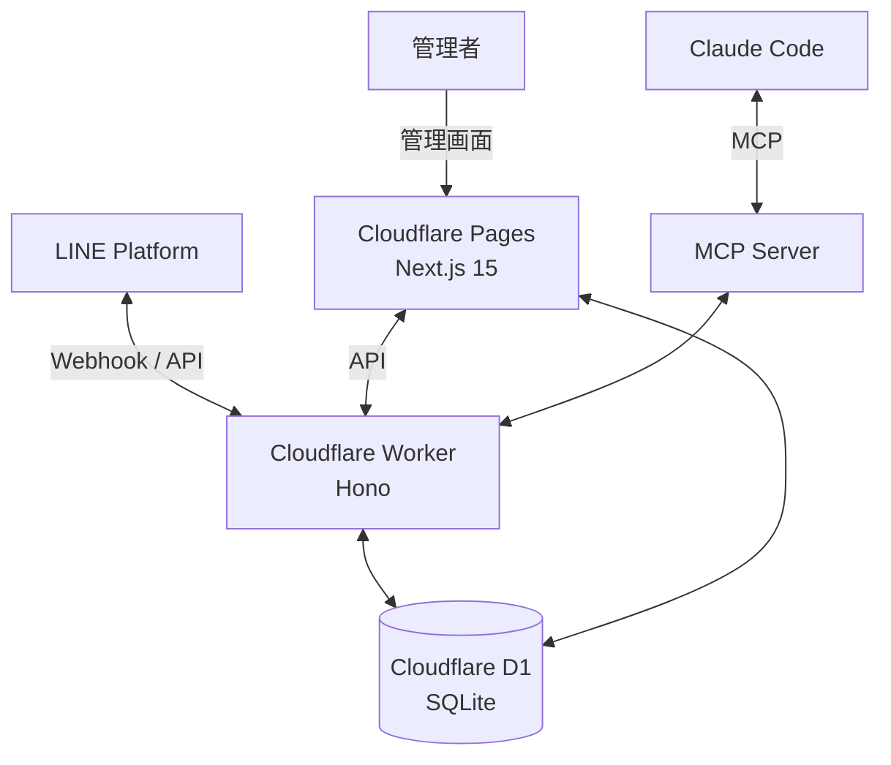

# **LINE Harness 調査レポート**

## **1. 基本情報**

* **ツール名**: LINE Harness
* **ツールの読み方**: ラインハーネス
* **開発元**: AIエージェント株式会社 / 野田修一 (Shudesu)
* **公式サイト**: [https://shudesu.github.io/line-harness-oss/](https://shudesu.github.io/line-harness-oss/)
* **関連リンク**:
  * GitHub: [https://github.com/Shudesu/line-harness-oss](https://github.com/Shudesu/line-harness-oss)
  * ドキュメント: [https://harness-wiki.pages.dev/](https://harness-wiki.pages.dev/)
* **カテゴリ**: CRM
* **概要**: LINE公式アカウントの完全オープンソースCRMツール。Cloudflareの無料枠を活用することでサーバー代0円で運用可能であり、ステップ配信やセグメント配信、リッチメニューの切り替えなど商用ツールと同等の機能を提供する。

## **2. 目的と主な利用シーン**

* **解決する課題**: 既存のLINE CRMツール（L社、U社など）は月額数万円のコストがかかるが、LINE HarnessはOSSとCloudflareを活用することでそのランニングコストをゼロにする。
* **想定利用者**: スタートアップ、個人開発者、マーケター、システムインテグレーター。
* **利用シーン**:
  * 自社サービスや店舗のLINE公式アカウントでの顧客管理とステップ配信。
  * アフィリエイター向けのリンク発行および成果計測システム（ASP）としての運用。
  * 複数アカウントの同時運用（BAN対策用プール機能など）。

## **3. 主要機能**

* **配信機能**: 分単位のステップ配信、タグ・セグメントに基づくブロードキャスト配信、リマインダー配信に対応。個別パーソナライズ（`{{name}}` 等）も可能。
* **CRM機能**: Webhookによる友だちの自動登録、タグ付け、行動ベースのリードスコア自動計算。
* **マーケティング機能**: ユーザー別/タグ別のリッチメニュー自動切替、LINE内完結フォーム（LIFF）、Google Calendar連携の予約システム。
* **アフィリエイト計測（ASP）**: アフィリエイター自身がLIFFからリンクを発行し、クリックからCVまでを時系列でトラッキング可能。
* **自動化とAPI**: 7種のトリガーと6種のアクションによるIF-THEN自動化。全機能のAPI公開とWebhook連携（Stripe等）。
* **マルチアカウント管理**: 複数のLINE公式アカウントを1つのダッシュボードで管理し、BAN検知時には自動で次のアカウントへ移行する機能を搭載。
* **AI統合**: MCP Server同梱により、Claude Codeから自然言語でシナリオ作成やメッセージ送信などの全操作が可能。

## **4. 動作原理・システム構成**

* **アーキテクチャ**: Cloudflare WorkersとNext.jsを活用したサーバーレス構成。データベースにはCloudflare D1（SQLite）を使用。
* **主要コンポーネントとデータフロー**:
  * LINE PlatformからのWebhookをCloudflare Worker（Hono）で受信し、API処理やLIFFのバックエンドとして機能する。
  * 配信処理はWorkerのCronトリガーで実行される。
  * フロントエンド（管理画面）はNext.js 15で構築され、Cloudflare Pagesにデプロイされる。
  * データベース（D1 SQLite）はWorkerおよびPagesと連携してデータを保存する。
* **特筆すべき要素技術**:
  * MCP Server (`@line-harness/mcp-server`) が同梱されており、Claude Codeから直接管理・操作が可能。



## **5. 開始手順・セットアップ**

* **前提条件**:
  * Cloudflareアカウント（無料枠でOK）
  * LINE公式アカウントとMessaging API channel
  * Node.js 22以上、pnpm
* **インストール/導入**:

  ```bash
  npx create-line-harness
  ```

* **クイックスタート**:
  上記のコマンド一つで、Cloudflare認証、D1データベース作成、Workerと管理画面のデプロイ、LINE credentialsの登録、LIFFアプリ作成、初回ログイン用ユーザー作成まで約5分で完了する。完了後、指定されたURLで管理画面にログインして運用開始。

## **6. 特徴・強み (Pros)**

* 商用のLINE CRMツール（月額1万円〜2万円）と同等の機能を無料で利用できる。
* Cloudflareのエコシステムにフルオンボードしているため、インフラ管理の手間が少なく、スケールしやすい。
* MCPをサポートしており、AI（Claude Codeなど）を活用した次世代の運用が可能。
* アフィリエイト（ASP）機能やマルチアカウント管理など、高度なマーケティングニーズに応える機能が標準搭載。

## **7. 弱み・注意点 (Cons)**

* 導入にはコマンドライン（CLI）やCloudflare、LINE Developersの基本的な設定知識が必要。完全な非エンジニアにはハードルが高い場合がある。
* オープンソースであるため、公式の商用サポート窓口はなく、自己責任での運用とコミュニティベースの解決が主となる。
* 無料運用はCloudflareの無料枠に依存するため、大規模な配信等で枠を超えた場合はCloudflare側の課金が発生する可能性がある。

## **8. 料金プラン**

| プラン名 | 料金 | 主な特徴 |
|---------|------|---------|
| **オープンソース (無料枠)** | 無料 | Cloudflareの無料枠内で運用。サーバー代0円で全機能利用可能。 |

* **課金体系**: ツールの利用自体は無料（MIT License）。Cloudflare等のインフラ利用枠に基づく。
* **無料トライアル**: 常時無料（オープンソース）。

## **9. 導入実績・事例**

* **導入企業**: 公開事例なし（OSSプロジェクトのため）。
* **導入事例**: 主に個人事業主、マーケター、アフィリエイターなどの間で利用が報告されており、サーバー代0円での運用が評価されている。
* **対象業界**: 業種を問わず、LINEを通じた顧客対応やマーケティングを行うすべての領域。

## **10. サポート体制**

* **ドキュメント**: 公式Wiki（[Harness Wiki](https://harness-wiki.pages.dev/)）やGitHubのREADMEが整備されている。YouTubeでのセットアップ動画（約20分）も提供。
* **コミュニティ**: GitHubのIssueやDiscussionsを通じてやり取りが行われている。
* **公式サポート**: 商用サポート窓口はなし。自己解決およびコミュニティサポート中心。

## **11. エコシステムと連携**

### **11.1 API・外部サービス連携**

* **API**: 全機能がAPIとして公開されており、TypeScript SDK (`@line-harness/sdk`) も提供されている。
* **外部サービス連携**: Webhook IN/OUTを通じて、Stripe（決済）やSlack（通知）、Google Calendar（予約）などと連携可能。

### **11.2 技術スタックとの相性**

| 技術スタック | 相性 | メリット・推奨理由 | 懸念点・注意点 |
|:---|:---:|:---|:---|
| **Cloudflare Workers / Pages** | ◎ | ネイティブサポートであり、CLIで一発デプロイ可能。 | 特になし |
| **Next.js** | ◎ | 管理画面がNext.jsで構築されており、親和性が高い。 | 特になし |
| **Node.js (TypeScript)** | ◎ | 公式SDKが提供されている。 | 特になし |

## **12. セキュリティとコンプライアンス**

* **認証**: 管理画面へのログイン機能（Owner / Admin / Staffの3ロール）。Cloudflareアカウント連携。
* **データ管理**: データはユーザー自身のCloudflareアカウント（D1データベース）に保存されるため、自社でデータを完全にコントロール可能。
* **準拠規格**: 公式サイトでは公開されていない。問い合わせが必要。

## **13. 操作性 (UI/UX) と学習コスト**

* **UI/UX**: Next.js 15で構築されたモダンなダッシュボード。19のセクションに分かれており、直感的な操作が可能。
* **学習コスト**: ツールの操作自体の学習コストは標準的だが、初期のCLIセットアップやCloudflare、LINE Developersのトークン設定には基礎的な技術知識が必要。

## **14. ベストプラクティス**

* **効果的な活用法 (Modern Practices)**:
  * MCP Serverを利用して、Claude Codeから自然言語でシナリオの作成やデータ抽出を行い、運用を自動化する。
  * 複数アカウント（トラフィックプール）を活用し、リスク分散とBAN対策を行う。
* **陥りやすい罠 (Antipatterns)**:
  * 複雑なシナリオを組みすぎて、ユーザーの意図しないタイミングでメッセージが送信される設定ミス。
  * Cloudflareの無料枠制限（リクエスト数やD1の読み書き回数）を監視せず、大規模配信時に制限に引っかかること。

## **15. ユーザーの声（レビュー分析）**

* **調査対象**: GitHub (Star数 532, Fork数 318)、X (Twitter)
* **総合評価**: G2やCapterraなどの商用レビューサイトには登録なし。OSSコミュニティでは高い評価を得ている。
* **ポジティブな評価**:
  * 「商用ツールで月数万円かかる機能が無料で使えるのは画期的。」（Xより引用要約）
  * 「1コマンドでCloudflareにデプロイできる手軽さが素晴らしい。」（Xより引用要約）
  * 「AIエージェント（MCP）連携など、モダンな機能がいち早く取り入れられている。」（GitHub/Xより要約）
* **ネガティブな評価 / 改善要望**:
  * 「CLIでの初期設定に少し戸惑った。」（Xより引用要約）
  * 商用サポートがないため、本番運用における自己解決能力が求められる点に対する懸念。
* **特徴的なユースケース**:
  * アフィリエイターが自身のASPとしてLINE Harnessを立ち上げ、紹介リンクの発行と成果計測を完全無料で行う運用。

## **16. 直近半年のアップデート情報**

* **2026-07-07**: v0.14.1 リリース (各種機能追加および安定性向上)

(出典: [GitHub Releases](https://github.com/Shudesu/line-harness-oss/releases) )

## **17. 類似ツールとの比較**

### **17.1 機能比較表 (星取表)**

| 機能カテゴリ | 機能項目 | LINE Harness | 商用ツールA (L社) | 商用ツールB (U社) |
|:---:|:---|:---:|:---:|:---:|
| **基本機能** | ステップ/セグメント配信 | ◎<br><small>分単位制御、無料</small> | ◯<br><small>標準対応</small> | ◯<br><small>標準対応</small> |
| **拡張機能** | AI（MCP）連携 | ◎<br><small>標準同梱</small> | ×<br><small>非対応</small> | ×<br><small>非対応</small> |
| **拡張機能** | アフィリエイト(ASP) | ◎<br><small>標準搭載</small> | △<br><small>上位プランのみ等</small> | △<br><small>上位プランのみ等</small> |
| **管理・運用** | マルチアカウント | ◎<br><small>標準搭載・プール対応</small> | △<br><small>別契約が必要</small> | △<br><small>別契約が必要</small> |
| **インフラ** | サーバー代・月額費用 | ◎<br><small>0円</small> | ×<br><small>数万円〜</small> | ×<br><small>1万円〜</small> |

### **17.2 詳細比較**

| ツール名 | 特徴 | 強み | 弱み | 選択肢となるケース |
|---------|------|------|------|------------------|
| **LINE Harness** | OSSのLINE CRM。Cloudflareで稼働。 | ランニングコストがゼロ。全機能がAPI化され、AI連携も可能。 | サポートがなく、初期構築に多少の技術知識が必要。 | コストを極力抑えたい、または自社でカスタマイズ・AI連携を行いたい場合。 |
| **商用ツール (L社/U社等)** | 広く使われているSaaS型LINE CRM。 | 導入が簡単で、手厚いカスタマーサポートがある。 | 月額費用が高額になる場合があり、アカウント追加ごとのコストがかさむ。 | 非エンジニアのみで運用し、導入時のサポートや運用コンサルティングが必要な場合。 |

## **18. 総評**

* **総合的な評価**:
  商用ツールで高額な月額費用が発生するLINEのCRM・マーケティング機能を、Cloudflareの無料枠を活用することで完全にランニングコスト0円で実現した画期的なオープンソースソフトウェアである。単なる無料代替にとどまらず、MCP ServerによるAI連携やマルチアカウントプール機能など、最新の技術トレンドを取り入れている点も高く評価できる。
* **推奨されるチームやプロジェクト**:
  初期コストやランニングコストを抑えたいスタートアップや個人開発者。自社でデータをコントロールし、APIベースの柔軟な連携を行いたいエンジニアリングチーム。
* **選択時のポイント**:
  非エンジニア主体のチームで手厚いサポートを必要とする場合は既存のSaaSツールが適しているが、技術的リテラシーが一定以上あり、運用コストの削減と拡張性を重視する場合には、LINE Harnessが圧倒的に強力な選択肢となる。
