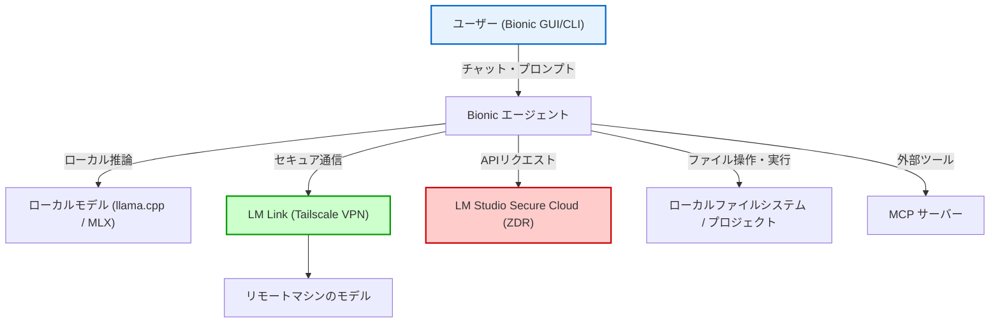

# **LM Studio 調査レポート**

## **1. 基本情報**

* **ツール名**: LM Studio
* **ツールの読み方**: エルエムスタジオ
* **開発元**: Element Labs, Inc.
* **公式サイト**: [https://lmstudio.ai/](https://lmstudio.ai/)
* **関連リンク**:
  * ドキュメント: [https://lmstudio.ai/docs/welcome](https://lmstudio.ai/docs/welcome)
  * 公式ブログ: [https://lmstudio.ai/blog](https://lmstudio.ai/blog)
  * Discord: [https://discord.gg/lmstudio](https://discord.gg/lmstudio)
* **カテゴリ**: LLMプラットフォーム
* **概要**: オープンソースの大規模言語モデル（LLM）をユーザーのローカルマシンやサーバー上で、プライベートかつオフラインで実行するためのプラットフォーム。直感的なGUIに加え、v0.4.0からはCLIのみで動作するヘッドレスモードも搭載。さらに、2026年7月のメジャーアップデートで自律型AIエージェント「Bionic」が統合され、開発からデプロイまで幅広く対応する。

## **2. 目的と主な利用シーン**

* **解決する課題**: クラウドLLM利用時のコスト、レイテンシ、データプライバシーの懸念を解消し、手軽かつ安全に最新モデルを利用可能な環境を提供する。
* **想定利用者**: AIエンジニア、ソフトウェア開発者、研究者、機密データを扱う企業（金融、医療など）。
* **利用シーン**:
  * 機密文書を用いたRAG（Retrieval-Augmented Generation）システムの構築
  * コストを気にせずに行うLLMを用いたアプリケーションのプロトタイピング
  * インターネット接続が制限された環境でのAI利用
  * サーバー上でのヘッドレスLLMAPIサーバーの運用
  * 並列リクエスト処理を活用したバッチ処理や高スループット推論

## **3. 主要機能**

* **GUI & CLI両対応**: 直感的なデスクトップアプリと、ターミナル完結のCLI (`lms`) の両方を提供。
* **ヘッドレスモード (llmster)**: GUIなしで動作するデーモンプロセスとして実行可能。Linuxサーバーやクラウドインスタンスへのデプロイに最適。
* **並列リクエスト処理**: 連続バッチ処理により、同一モデルに対する複数の同時リクエストを並列に処理可能。
* **モデル検索と管理**: Hugging Face上のGGUF形式モデルを簡単に検索・ダウンロード・管理できる。
* **OpenAI互換API**: ワンクリックまたはコマンド一つでOpenAI互換のAPIサーバーを起動し、既存のアプリやツールと連携可能。
* **ステートフルチャットAPI**: `/v1/chat` エンドポイントにより、会話履歴を保持したままAPI経由で対話が可能。
* **RAGとドキュメント対話**: ローカルのファイル（PDF, テキストなど）を読み込ませて対話が可能。
* **開発者ツール**: チャットのエクスポート、分割画面（Split View）、開発者モードなどの支援機能が充実。
* **自律型AIエージェント「Bionic」**: ローカルのコードベースやファイルを読み込み、ワークスペース上で自律的にタスクを実行できるエージェント機能（v1.0.0で追加）。

## **4. 動作原理・システム構成**

* **アーキテクチャ**: ローカルファーストのクライアント・サーバー構成、および暗号化P2Pメッシュネットワーク（LM Link）、クラウドオプションのハイブリッドアーキテクチャ。
* **主要コンポーネントとデータフロー**:
  * 推論エンジンには `llama.cpp` とApple Silicon向けの `MLX` を採用。
  * **Bionic Agent**: フロントエンドとして機能し、プロジェクト（Coding / Document）ごとにコンテキストやスキルを管理。
  * **LM Link**: デバイス間でTailscaleベースのVPNトンネルを構築し、インターネットにポートを公開することなく別マシンのLLMを直接呼び出す。
  * **クラウド推論**: LM Studio Secure CloudへのAPIリクエスト。ユーザープロンプトや応答はZDR（Zero Data Retention）ポリシーで保護され、保存されない。
* **特筆すべき要素技術**:
  * **Tailscale**: LM LinkにおいてセキュアなP2P接続を提供。
  * **Pyodide**: エージェントのサンドボックス環境として利用され、暗号化などの処理を安全に実行（v1.0.6以降）。



## **5. 開始手順・セットアップ**

* **前提条件**:
  * OS: Windows, macOS (Apple Silicon推奨), Linux
  * ハードウェア: 十分なRAM/VRAMを推奨（モデルサイズに依存）
* **インストール/導入**:
  * **Mac/Linux**:

    ```bash
    curl -fsSL https://lmstudio.ai/install.sh | bash
    ```

  * **Windows**:

    ```powershell
    irm https://lmstudio.ai/install.ps1 | iex
    ```

* **初期設定**:
  * GUI版は起動後に推奨モデルを自動提案。
  * CLI版は `lms init` 等で初期設定を確認。
* **クイックスタート**:

  ```bash
  # モデルの検索とダウンロード
  lms get llama-3.2

  # チャットの開始
  lms chat

  # サーバーの起動
  lms server start
  ```

## **6. 特徴・強み (Pros)**

* **柔軟な運用形態**: 手軽なGUI利用から、サーバーでの本格的なヘッドレス運用まで、開発フェーズに合わせた使い方が可能。
* **完全なプライバシー**: データが外部に送信されず、すべてローカルで完結するため、機密情報の取り扱いに最適。
* **コストパフォーマンス**: 基本機能は無料で利用でき、API利用料が発生しないため、実験や検証のコストを大幅に削減できる。
* **高い互換性**: OpenAI互換APIを提供しているため、LangChainやAutoGPTなどの既存エコシステムと容易に連携可能。
* **最新技術への追随**: 並列推論や新しいモデルアーキテクチャへの対応が迅速。

## **7. 弱み・注意点 (Cons)**

* **ハードウェアリソースへの依存**: 高性能なモデルを高速に動作させるには、高性能なGPUや大量のメモリが必要。
* **オープンソースではない**: アプリケーションのコア部分はプロプライエタリであり、透明性を最重視するユーザーにはJanなどの完全OSS製品が好まれる場合がある。
* **日本語ドキュメントの不足**: 公式情報は英語が中心であり、日本語での一次情報は少ない。

## **8. 料金プラン**

| プラン名 | 料金 | 主な特徴 |
|---------|------|---------|
| **Free** | 無料 | Bionicエージェント、ローカルモデル（llama.cpp/MLX）の実行、ローカル音声認識、最大5デバイスのLM Link、制限付きWeb検索が含まれる。 |
| **Bionic+** | $20/月 | Freeプランのすべての機能に加え、クラウド上のオープンソースモデル（Kimi K3, GLM 5.3, DeepSeek V4 Flash等）の利用、トークンの割引購入、Web検索およびページ抽出の利用。 |
| **Pro** | $100/月 | Bionic+のすべての機能に加え、5倍の利用制限（クレジット）、トークンの割引購入、新機能への早期アクセス。 |
| **Enterprise / Team** | 要問い合わせ | 組織的なデプロイ管理、チーム向けの集中課金設定、セキュリティ強化など（順次展開予定）。 |

* **課金体系**: サブスクリプションに加え、クラウドモデル使用時の従量課金用「クラウドクレジット」がある（ローカル・リモートモデルの実行はクレジットを消費しない）。
* **無料トライアル**: Freeプランとして無期限でローカル機能を利用可能。

## **9. 導入実績・事例**

* **導入企業**: Stripe, Apple, Atlassian, NVIDIA, Airbnb, Dell, PayPal, Uber, Microsoft, Google など、テクノロジー大手での利用実績（公式サイト掲載）。
* **導入事例**:
  * 開発者のローカル環境でのコード生成・補完アシスタントとしての利用。
  * 企業内でのセキュアなドキュメント検索・QAシステムのバックエンド。
  * CI/CDパイプライン内でのLLMを用いた自動テストやコードレビュー。
* **対象業界**: テクノロジー、金融、医療、製造など幅広い業界。

## **10. サポート体制**

* **ドキュメント**: [Developer Docs](https://lmstudio.ai/docs/welcome) が充実しており、SDKやCLIの使い方が網羅されている。
* **コミュニティ**: [Discord](https://discord.gg/lmstudio) には大規模なコミュニティがあり、活発な質疑応答が行われている。
* **公式サポート**: Enterpriseプラン契約者向けに専任サポートが提供される。Standardプランはコミュニティサポートが基本。

## **11. エコシステムと連携**

### **11.1 API・外部サービス連携**

* **API**: OpenAI互換のREST APIを提供。`/v1/chat/completions`, `/v1/embeddings` など標準的なエンドポイントに加え、ステートフルな `/v1/chat` も利用可能。
* **外部サービス連携**:
  * **MCP (Model Context Protocol) サーバー連携**: LM Studio内でMCPサーバーをインストール・接続し、ローカルモデルを用いて外部ツールやデータソースと連携可能。
  * **LM Link**: 別端末にあるLM Studioインスタンスへセキュアにリモート接続し、ローカルにあるかのようにモデルを呼び出し・操作が可能。
  * **Cursor / VS Code**: ローカルAPIサーバーを指定することで、コーディングアシスタントのバックエンドとして利用可能。
  * **LangChain / LlamaIndex**: OpenAIクラスを用いてシームレスに接続可能。
  * **Continue**: IDE拡張機能との連携が容易。

### **11.2 技術スタックとの相性**

| 技術スタック | 相性 | メリット・推奨理由 | 懸念点・注意点 |
|:---|:---:|:---|:---|
| **Python (LangChain)** | ◎ | OpenAI互換APIにより、コード変更ほぼなしで移行可能。 | 特になし |
| **JavaScript/TypeScript** | ◎ | 公式SDK (`@lmstudio/sdk`) が提供されており、統合が容易。 | 特になし |
| **Node.js** | ◎ | SDKおよびAPI経由での利用がスムーズ。 | 大量のリクエストを処理する場合、マシンスペックに注意 |
| **Docker** | ◯ | ヘッドレスモードによりコンテナ内での実行が可能に。 | GPUパススルーの設定が必要 |

## **12. セキュリティとコンプライアンス**

* **認証**: デフォルトでは認証なしだが、v0.4.0よりサーバーアクセス制御のための**Permission Keys**機能が追加された。
* **データ管理**: 全てのデータ（モデル、チャットログ、埋め込みベクトル）はローカル環境に保存される。外部への送信はない。
* **準拠規格**: ソフトウェア自体がオフライン動作するため、GDPRやHIPAAなどのコンプライアンス要件を満たすシステムの一部として組み込みやすい。

## **13. 操作性 (UI/UX) と学習コスト**

* **UI/UX**: モダンで洗練されたインターフェース。ドラッグ＆ドロップでの分割画面や、開発者モードの切り替えなど、ユーザビリティが高い。
* **学習コスト**: GUI利用であれば学習コストはほぼゼロ。CLIやAPI利用もドキュメントが整備されており、標準的な開発スキルがあれば容易に習得可能。

## **14. ベストプラクティス**

* **効果的な活用法 (Modern Practices)**:
  * **ヘッドレス運用**: 開発はGUIで行い、本番に近い環境や共有サーバーでは `llmster` を使用してリソースを節約する。
  * **並列リクエスト**: 複数のエージェントやユーザーからのリクエストを処理する場合、並列数を調整してスループットを最大化する。
  * **モデルの使い分け**: コーディングにはDeepSeek-Coder、一般的な対話にはLlama 3など、用途に応じて最適なGGUFモデルを切り替える。
* **陥りやすい罠 (Antipatterns)**:
  * **VRAM超過**: GPUメモリに収まらないサイズのモデルを無理にGPUオフロード設定で動かすと、極端に速度が低下する。
  * **過剰な並列数**: マシンスペックを超えた並列リクエストを設定すると、レイテンシが悪化する可能性がある。

## **15. ユーザーの声（レビュー分析）**

* **調査対象**: X (Twitter), Discord, Reddit, GitHub Issues
* **総合評価**: G2、Capterra、ITreviewにレビューの登録なし。ローカルLLMユーザーからは非常に高い評価を得ている。特にBionicエージェントの追加や、v0.4.0でのヘッドレス対応は待望の機能として歓迎されている。
* **ポジティブな評価**:
  * 「ヘッドレスモードがついに来た！これでサーバー運用が捗る」
  * 「UIがさらに使いやすくなった。Split Viewが便利」
  * 「無料でこれだけの機能が使えるのは信じられない」
* **ネガティブな評価 / 改善要望**:
  * 「アップデート直後はバグが残っていることがある（ベータ版など）」
  * 「一部の特殊なモデルアーキテクチャへの対応が遅れる場合がある」
  * 「高性能なPC（特にRAM/VRAM）が要求されるため、古いPCでは快適に動作しない」
* **特徴的なユースケース**:
  * 社内LAN内でのプライベートなAIチャットボットサーバーとしての運用。
  * 飛行機や新幹線など、オフライン環境でのプログラミング補助。

## **16. 直近半年のアップデート情報**

* **2026-09-15 (Bionic v1.1.3)**: Linux向けのローカル音声認識対応。llama.cpp 2.38.0拡張パックの更新、MTP推論（Speculative Decoding）のサポート追加、エンタープライズ向けの組織管理MCPサーバー対応。
* **2026-09-08 (Bionic v1.1.2)**: Bionic for Linux（x64およびARM64）の提供開始。セッションの読み込みやタブ切り替えに関するUIパフォーマンスの大幅な改善。
* **2026-08-31 (Bionic v1.1.0)**: プロジェクトなしのチャット機能を追加。シェルコマンドの自動レビュー機能、ビジョンサブエージェント（テキスト専用モデルに画像認識能力を付与）の追加。
* **2026-07-30 (Bionic v1.0.4)**: Bionicエージェント向けに、推論レベルのサブメニューやUI改善、コーディングプロジェクトにおけるファイル検索の高速化などを提供。
* **2026-07-22 (v0.4.20)**: エンタープライズ向けの内部ネットワークモデルエンドポイント機能のサポート追加や、LM Link経由で別端末のモデルをBionicエージェントから利用する機能を追加。
* **2026-07-16 (Bionic v1.0.0)**: 自律型AIエージェント「LM Studio Bionic」の初期リリース。
* **2026-03-26 (v0.4.8)**: OpenAI互換の /v1/chat/completions API において `reasoning_effort` および `reasoning_tokens` のサポートを追加。
* **2026-02-27 (v0.4.6)**: 「LM Link」をリリース。Tailscaleと提携し、リモートのLM Studioインスタンスへエンドツーエンド暗号化で接続してローカル同様に利用できる機能を実装。
* **2026-02-06 (v0.4.2)**: MLXエンジン1.0.0を用いたParallel Requests（連続バッチング）に対応。
* **2026-01-30 (v0.4.1)**: Anthropic互換のAPIエンドポイント `/v1/messages` を追加し、Claude Codeとの連携が可能に。
* **2026-01-28 (v0.4.0)**: 次世代メジャーアップデート。GUIなしで動作する`llmster`デーモン、並列リクエスト処理、ステートフルREST API、UI刷新などを実装。

(出典: [LM Studio Changelog](https://lmstudio.ai/changelog))

## **17. 類似ツールとの比較**

### **17.1 機能比較表 (星取表)**

| 機能カテゴリ | 機能項目 | LM Studio | Ollama | GPT4All | Jan |
|:---:|:---|:---:|:---:|:---:|:---:|
| **基本機能** | GUI操作 | ◎<br><small>洗練されたUI</small> | ×<br><small>CLI/APIのみ</small> | ◯<br><small>シンプル</small> | ◎<br><small>OSSで拡張性高</small> |
| **拡張機能** | エージェント機能 | ◎<br><small>Bionic内蔵</small> | △<br><small>外部連携前提</small> | ×<br><small>非対応</small> | △<br><small>拡張機能依存</small> |
| **拡張機能** | クラウド/リモート実行 | ◎<br><small>LM Link / Secure Cloud</small> | ×<br><small>非対応</small> | ×<br><small>非対応</small> | ×<br><small>非対応</small> |
| **デプロイ** | ヘッドレス運用 | ◎<br><small>v0.4.0で対応</small> | ◎<br><small>標準機能</small> | △<br><small>Serverモードあり</small> | △<br><small>基本はDesktop</small> |
| **API** | OpenAI互換 | ◎<br><small>互換性高い</small> | ◎<br><small>標準対応</small> | ◯<br><small>対応</small> | ◯<br><small>対応</small> |
| **ライセンス** | オープンソース | ×<br><small>プロプライエタリ</small> | ◯<br><small>MIT License</small> | ◯<br><small>Apache 2.0</small> | ◯<br><small>AGPL v3</small> |

### **17.2 詳細比較**

| ツール名 | 特徴 | 強み | 弱み | 選択肢となるケース |
|---------|------|------|------|------------------|
| **LM Studio** | 高機能なGUIと自律型エージェント | 直感的なGUIに加え、Bionicエージェントを内蔵し、自律的なタスク実行も可能。 | OSSではない。 | GUIでの快適な操作と、自律型エージェントによる開発支援を求める場合。 |
| **Ollama** | シンプルなCLIツール | セットアップが極めて簡単。Modelfileによるカスタマイズが強力。 | 純正GUIがない（サードパーティ製が必要）。 | ターミナル操作に慣れており、スクリプトやアプリへの組み込みを最優先する場合。 |
| **GPT4All** | CPU推論に強い | GPUがない環境でも比較的高速に動作する。 | 機能面では他ツールよりシンプル。 | 一般的なスペックのPCで手軽に試したい場合。 |
| **Jan** | 拡張性の高いOSS GUI | 完全にオープンソース。ローカルAIのカスタマイズ性が高い。 | LM Studioに比べると動作の安定性や機能実装速度で劣る場合がある。 | 完全なOSS環境にこだわりたい場合。 |

## **18. 総評**

* **総合的な評価**:
  v0.4.0のリリースにより、LM Studioは単なる「使いやすいGUIツール」から「本格的なローカルAIプラットフォーム」へと進化した。ヘッドレスモードと並列処理の追加により、開発者の手元での実験からサーバーへのデプロイまでをシームレスにカバーできるようになった点は非常に高く評価できる。
* **推奨されるチームやプロジェクト**:
  * セキュリティ要件が厳しく、外部クラウドを利用できないエンタープライズ開発チーム。
  * ローカルLLMを用いたアプリケーション開発を行うエンジニア。
  * 最新のオープンソースモデルをGUIで手軽に評価・検証したい研究者。
* **選択時のポイント**:
  * **GUIの完成度と機能性**を求めるならLM Studio一択。
  * **完全なOSS**であることや**軽量さ**を求めるならOllamaやJanと比較検討すると良い。
