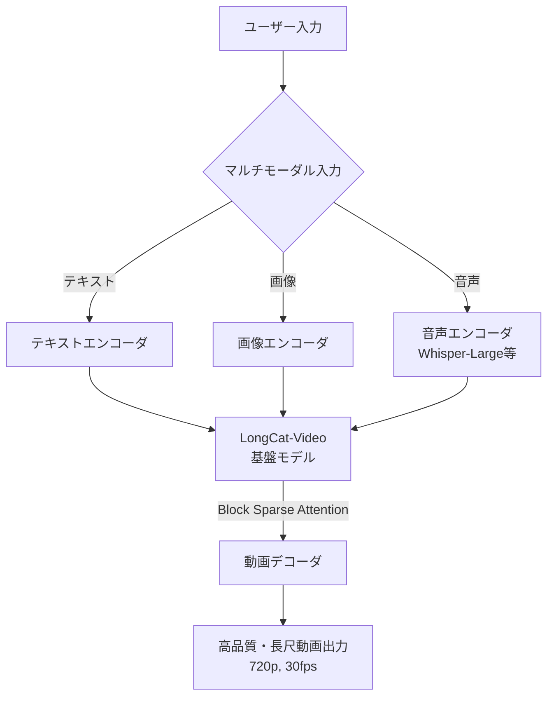

# **LongCat-Video 調査レポート**

## **1. 基本情報**

* **ツール名**: LongCat-Video
* **ツールの読み方**: ロングキャットビデオ
* **開発元**: Meituan LongCat Team
* **公式サイト**: [https://github.com/meituan-longcat/LongCat-Video](https://github.com/meituan-longcat/LongCat-Video)
* **関連リンク**:
  * GitHub: [https://github.com/meituan-longcat/LongCat-Video](https://github.com/meituan-longcat/LongCat-Video)
  * ドキュメント: [https://arxiv.org/abs/2510.22200](https://arxiv.org/abs/2510.22200)
* **カテゴリ**: 動画生成
* **概要**: LongCat-Videoは、136億パラメータを持つオープンソースの動画生成基盤モデルです。単一のフレームワークでText-to-Video、Image-to-Video、Video-Continuation（動画の続きを生成する機能）などを統合的にサポートし、特に高品質で効率的な「長尺動画生成」に優れています。最新のAvatarモデルでは、音声駆動によるキャラクターのアニメーション生成にも対応しています。

## **2. 目的と主な利用シーン**

* **解決する課題**: 複数の動画生成タスク（テキストからの生成、画像からの生成、続きの生成）を別々のモデルで行う非効率さを解消し、単一の強力なモデルで一貫性のある高品質な長尺動画を生成する。
* **想定利用者**: 映像制作クリエイター、AI技術の研究者、動画生成機能を自社サービスに組み込みたい開発者。
* **利用シーン**:
  * テキストプロンプトからの高品質なショートビデオやストックフッテージの作成
  * 静止画像（イラストや写真）を動かすことによるアニメーション制作
  * 提供された音声と画像から、リップシンク（口パク）を合わせたキャラクターのトーキングヘッド動画の生成

## **3. 主要機能**

* **Text-to-Video**: テキストプロンプトから720p・30fpsの動画を生成する機能。
* **Image-to-Video**: 参照画像とテキストプロンプトを組み合わせて動画を生成する機能。
* **Video-Continuation**: 既存の動画の続きを自然に生成し、数分間に及ぶ長尺動画を作成する機能。
* **Interactive Video Generation**: ユーザーの操作や条件に応じた動画の生成。
* **Audio-driven Human Video Generation (Avatar)**: 音声入力（シングル/マルチストリーム）に基づいて、キャラクターの口の動き（リップシンク）や自然な動作を含む動画を生成する機能。

## **4. 動作原理・システム構成**

* **アーキテクチャ**: ローカル環境（またはクラウドGPU）で実行するDense（密）アーキテクチャの動画生成基盤モデル。
* **主要コンポーネントとデータフロー**:
  * テキスト、画像、または音声（Avatarモデルの場合）を入力として受け取り、統一された動画生成フレームワーク内で処理します。
  * 時間軸と空間軸の両方に沿った coarse-to-fine（粗密）生成戦略と Block Sparse Attention を採用し、高解像度での推論効率を向上させています。
* **特筆すべき要素技術**:
  * 13.6BパラメータのDenseアーキテクチャモデル。
  * **GRPO (Group Relative Policy Optimization)**: 複数報酬のRLHF（強化学習）により、出力品質を向上。
  * Avatarモデル（v1.5）では、音声エンコーダとしてWhisper-Largeを採用し、高精度なリップシンクを実現。ステップ蒸留（Step distillation）により、推論ステップを8ステップに短縮して高速化しています。



## **5. 開始手順・セットアップ**

* **前提条件**:
  * CUDA対応のNVIDIA GPU
  * Python 3.10環境、Conda
* **インストール/導入**:

  ```bash
  # リポジトリのクローンと環境構築
  git clone --single-branch --branch main https://github.com/meituan-longcat/LongCat-Video
  cd LongCat-Video
  conda create -n longcat-video python=3.10
  conda activate longcat-video

  # PyTorchとFlash Attentionのインストール
  pip install torch==2.6.0+cu124 torchvision==0.21.0+cu124 torchaudio==2.6.0 --index-url https://download.pytorch.org/whl/cu124
  pip install ninja psutil packaging flash_attn==2.7.4.post1
  pip install -r requirements.txt
  ```

* **初期設定**:
  * Hugging Face CLI等を使用して、必要なモデルの重み（LongCat-Video, LongCat-Video-Avatar 等）をダウンロードし、ローカルに配置します。
* **クイックスタート**:
  * Text-to-Videoの実行例：
    ```bash
    torchrun run_demo_text_to_video.py --checkpoint_dir=./weights/LongCat-Video --enable_compile
    ```

## **6. 特徴・強み (Pros)**

* **統一されたアーキテクチャ**: Text-to-Video、Image-to-Video、動画継続生成など、すべてのタスクを単一のモデルでネイティブにサポートしている。
* **長尺動画への適性**: 動画継続タスクで事前学習されており、色ズレや品質劣化を起こさずに数分間の動画を生成できる。
* **高いリップシンク精度と高速化 (Avatar 1.5)**: Whisper-Largeの採用で音声同期が向上し、ステップ蒸留とINT8量子化サポートによって、より少ないVRAMと高速な推論（8ステップ）が可能。

## **7. 弱み・注意点 (Cons)**

* **高いハードウェア要件**: パラメータ数が136億と大きく、ローカルで実行するには十分なVRAM（数十GBクラス）を備えた高性能なGPU環境が必要。
* **UIの不足**: デモ用のStreamlit UIは提供されていますが、基本はスクリプト実行ベースであり、非エンジニアにはハードルが高い。
* **日本語対応**: モデル自体は英語プロンプトをベースに学習されていると推測され、自然な日本語プロンプトでの理解度は未知数。

## **8. 料金プラン**

| プラン名 | 料金 | 主な特徴 |
|---------|------|---------|
| **オープンソース（セルフホスト）** | 無料 | MITライセンス。機能制限なく利用可能。実行環境（GPU）はユーザー側で用意が必要。 |

* **課金体系**: 完全無料（オープンソース）
* **無料トライアル**: 該当なし

## **9. 導入実績・事例**

* **導入企業**: 商用のSaaSではないため、公式な導入事例の記載はありませんが、GitHubで公開されており多くの開発者に注目されています（Stars 8.7k）。
* **導入事例**: コミュニティによって、生成の高速化を図る「CacheDiT」との連携などが提案・開発されています。
* **対象業界**: 映像制作、AI開発、エンターテインメント

## **10. サポート体制**

* **ドキュメント**: GitHubリポジトリのREADMEおよび、arXivで公開されているTechnical Reportにて詳細な仕様が説明されています。
* **コミュニティ**: GitHubのIssuesおよびWeChatグループでの交流が行われています。
* **公式サポート**: GitHub Issuesを通じた対応が中心です。

## **11. エコシステムと連携**

### **11.1 API・外部サービス連携**

* **API**: クラウドAPIとしては提供されておらず、Pythonスクリプトによるローカル実行が前提です。
* **外部サービス連携**: Hugging Face (モデルウェイトのホスティング), Streamlit (簡易UIの提供)

### **11.2 技術スタックとの相性**

| 技術スタック | 相性 | メリット・推奨理由 | 懸念点・注意点 |
|:---|:---:|:---|:---|
| **Python / PyTorch** | ◎ | ネイティブ実装であり、親和性が最も高い。 | 依存関係（Flash-Attn-2など）のバージョン管理が必要。 |
| **Streamlit** | ◎ | リポジトリ内に`run_streamlit.py`が用意されており、GUIをすぐに立ち上げ可能。 | 特になし。 |
| **Node.js** | × | 直接の対応はなし。APIサーバーをPythonで構築し、そこへ通信する必要あり。 | - |

## **12. セキュリティとコンプライアンス**

* **認証**: オープンソースソフトウェアのため、認証機能は組み込まれていません。
* **データ管理**: すべてローカル環境で処理されるため、データが外部のクラウドサーバーに送信されることはなく、機密性の高い動画生成に適しています。
* **準拠規格**: 特になし。

## **13. 操作性 (UI/UX) と学習コスト**

* **UI/UX**: `run_streamlit.py` を実行することで簡易的なWeb UI（Streamlit）が利用できますが、基本的な操作はCLIからのコマンド実行になります。
* **学習コスト**: PyTorchやHugging Faceモデルの扱いに慣れているエンジニアにとっては導入が容易ですが、動画編集ソフトしか使ったことがないクリエイターにとっては学習コストが非常に高いです。

## **14. ベストプラクティス**

* **効果的な活用法 (Modern Practices)**:
  * **プロンプトの工夫**: 短いプロンプトよりも、キャラクターの外見、行動、シーンの背景など、詳細で豊かなプロンプトを与える方が一貫性と自然さが向上します。
  * **反復動作の軽減**: `--ref_img_index` や `--mask_frame_range` のパラメータを調整することで、Avatarモデル特有の動作の繰り返しを軽減できます。
* **陥りやすい罠 (Antipatterns)**:
  * 非常に巨大なモデルのため、十分なGPUメモリがない環境で動かそうとするとOOM (Out Of Memory) エラーが発生します。INT8量子化(`--use_int8`)やステップ蒸留(`--use_distill`)を活用してVRAM使用量と生成時間を抑えることが推奨されます。

## **15. ユーザーの声（レビュー分析）**

* **調査対象**: GitHub (Star: 8.7k)
* **総合評価**: 該当するレビューサイトへの登録はありませんが、オープンソースコミュニティからは高い関心を集めています。
* **ポジティブな評価**:
  * 「オープンソースの動画生成モデルとして、Soraや商用モデルに肉薄する性能を持っている」
  * 「1つのモデルでText-to-Videoから長尺生成、Avatarまでサポートしている汎用性が素晴らしい」
  * 「Avatarモデルはリップシンク精度が高く、トーキングヘッド動画作成に最適」
* **ネガティブな評価 / 改善要望**:
  * 「環境構築（CUDA、Flash-Attnのバージョン合わせなど）がやや煩雑」
  * 「モデルサイズが大きいため、メモリの少ないGPUでは動かせない」
* **特徴的なユースケース**:
  * キャッシュ機構(CacheDiT)と組み合わせて推論を大幅に高速化するコミュニティ研究など。

## **16. 直近半年のアップデート情報**

* **2026-05-21**: `LongCat-Video-Avatar-1.5` をリリース。音声エンコーダにWhisper-Largeを採用してリップシンク精度を向上させ、ステップ蒸留による高速化（8ステップ）を実現。
* **2025-12-16**: 音声駆動でキャラクターアニメーションを生成する `LongCat-Video-Avatar` をリリース。
* **2025-10-25**: 基盤動画生成モデル `LongCat-Video` の初版リリース。

(出典: [LongCat-Video GitHub Releases](https://github.com/meituan-longcat/LongCat-Video))

## **17. 類似ツールとの比較**

### **17.1 機能比較表 (星取表)**

| 機能カテゴリ | 機能項目 | 本ツール (LongCat-Video) | Luma AI | video-use |
|:---:|:---|:---:|:---:|:---:|
| **基本機能** | 動画品質 | ◎<br><small>長尺動画にも対応する高品質</small> | ◎<br><small>物理法則に忠実な高品質</small> | -<br><small>動画生成ではなく編集</small> |
| **入力モダリティ** | 音声駆動(リップシンク) | ◎<br><small>Avatarモデルで高精度に対応</small> | △<br><small>他社ツールの併用が必要</small> | -<br><small>該当なし</small> |
| **環境** | ローカル実行 | ◎<br><small>完全なローカル実行が可能</small> | ×<br><small>クラウドAPIのみ</small> | ◎<br><small>ローカル実行が可能</small> |
| **価格** | 利用料金 | ◎<br><small>無料 (OSS)</small> | △<br><small>クレジット消費制</small> | ◎<br><small>無料 (OSS)</small> |

### **17.2 詳細比較**

| ツール名 | 特徴 | 強み | 弱み | 選択肢となるケース |
|---------|------|------|------|------------------|
| **本ツール** | マルチタスク対応のOSS動画生成モデル | 長尺動画生成と音声駆動(Avatar)の統合、完全無料 | 実行に高スペックなGPU環境が必要 | 自社サーバー内で動画生成やAvatar生成を完結させたい場合 |
| **Luma AI** | 高品質な動画生成とAPI | 自然言語での編集とAPIの充実度 | 料金体系の複雑さ、クラウド依存 | 開発者が自社アプリにAPI経由で手軽に動画生成を組み込む場合 |
| **video-use** | AIエージェントと対話して編集するOSSツール | 自然言語によるフルオートメーション。OSSで無料・カスタマイズ可能 | 環境構築が必要。動画の新規生成ではなく編集に特化 | 既存の動画をAIエージェントに自動でカット編集・テロップ追加させたい場合 |

## **18. 総評**

* **総合的な評価**:
  LongCat-Videoは、Text-to-VideoやImage-to-Videoにとどまらず、長尺動画生成やAvatar（音声駆動リップシンク）までを包括的にサポートする、非常に強力なオープンソースモデルです。商用クラウドサービスに依存せず、自社環境で高品質な動画生成パイプラインを構築したい開発者にとって、最高クラスの選択肢となります。
* **推奨されるチームやプロジェクト**:
  * AI研究開発チーム、映像制作の内製化を目指す企業。
  * Vtuberやデジタルヒューマンのトーキングヘッド動画を自動生成したいプロジェクト。
* **選択時のポイント**:
  * 最大のハードルは推論に必要なGPUリソースです。クラウドAPI（Luma AIなど）の手軽さと比較し、ランニングコストとデータプライバシーの観点から自社でGPUを運用するメリットがある場合に選択すべきです。
