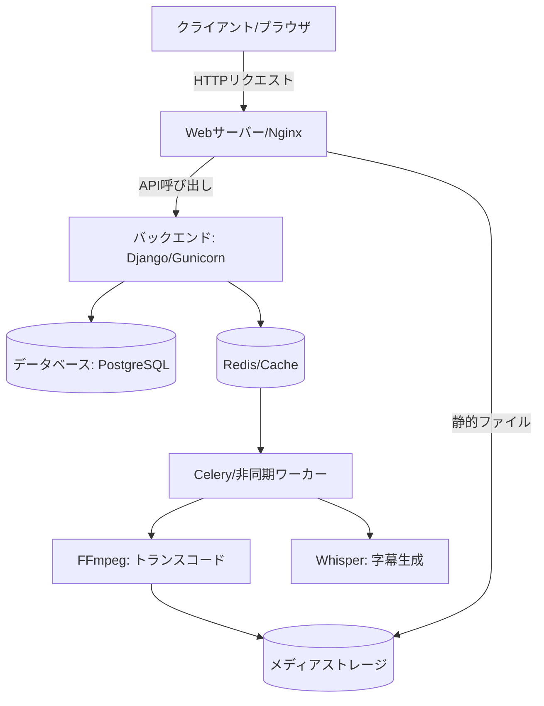

# **MediaCMS 調査レポート**

## **1. 基本情報**

* **ツール名**: MediaCMS
* **ツールの読み方**: メディアシーエムエス
* **開発元**: Markos Gogoulos / MediaCMS.io
* **公式サイト**: [https://mediacms.io/](https://mediacms.io/)
* **関連リンク**:
  * GitHub: [https://github.com/mediacms-io/mediacms](https://github.com/mediacms-io/mediacms)
  * ドキュメント: [https://github.com/mediacms-io/mediacms/tree/main/docs](https://github.com/mediacms-io/mediacms/tree/main/docs)
  * デモサイト: [https://demo.mediacms.io/](https://demo.mediacms.io/)
* **カテゴリ**: 動画/メディア
* **概要**: YouTubeのような動画共有サイトを自前で構築できる、モダンなオープンソースCMS。Python (Django) と React で開発されており、レスポンシブなデザイン、強力な検索機能、多様なメディア形式への対応を備えています。

## **2. 目的と主な利用シーン**

* **解決する課題**:
  * YouTubeなどの外部プラットフォームに依存せず、自社で動画データを管理・配信したい。
  * 社内限定や特定コミュニティ向けのクローズドな動画共有サイトを構築したい。
  * 広告なしで、UI/UXをカスタマイズ可能な動画ポータルが必要。
* **想定利用者**:
  * 大学・教育機関（講義動画の配信）
  * 企業（社内研修動画、マニュアル動画の共有）
  * 独立系メディア、コミュニティ運営者
* **利用シーン**:
  * **社内研修ポータル**: 社員向けの研修動画をアップロードし、部門ごとに視聴権限を管理する。
  * **大学の講義アーカイブ**: 講義の録画を学生向けに公開し、字幕やコメントで学習を支援する。
  * **特定の趣味・関心コミュニティ**: 公開プラットフォームでは削除されやすい、ニッチなコンテンツの共有場所として。

## **3. 主要機能**

* **マルチメディア対応**: 動画だけでなく、音声、画像、PDFファイルにも対応。
* **アダプティブストリーミング**: HLS (HTTP Live Streaming) プロトコルに対応し、通信環境に応じて最適な画質で再生。
* **権限管理 (RBAC)**: ユーザーごとに閲覧・編集権限を細かく設定可能（公開、限定公開、非公開、カスタムグループ）。
* **トランスコーディング**: アップロードされた動画を複数の解像度（144p〜1080p）とプロファイルに自動変換。
* **プレイヤー機能**: 再生速度変更、画質選択、字幕表示、ピクチャーインピクチャーに対応した高機能プレイヤー。
* **エンゲージメント**: コメント、いいね/低評価、共有、埋め込みコード生成、レポート機能。
* **自動文字起こし連携**: OpenAIのWhisperと連携し、ローカルで自動的に字幕を生成可能。
* **検索機能**: Elasticsearch等を利用した高速で高度な検索機能。
* **プレイリスト**: 動画や音声をまとめたプレイリストの作成と共有。
* **SAML認証**: 企業利用で必須となるSAMLによるシングルサインオン (SSO) に対応。

## **4. 動作原理・システム構成**

* **アーキテクチャ**: クライアント・サーバー構成（集中型SaaSまたはセルフホスト構成）
* **主要コンポーネントとデータフロー**:
  * **バックエンド (Django)**: API提供、データベース連携（PostgreSQLなど）、ユーザーおよび権限の管理を実行する。
  * **フロントエンド (React)**: ユーザーインターフェースを提供し、バックエンドAPIと通信して動画一覧やプレイヤーを描画する。
  * **トランスコーディング**: Celeryを用いた非同期処理により、アップロードされたメディアファイル（動画・音声・画像・ドキュメント）のエンコード・最適化を行う（ffmpeg等を利用）。
* **特筆すべき要素技術**: HLSによるアダプティブストリーミング配信。Whisperを用いたローカルでの自動字幕生成。



## **5. 開始手順・セットアップ**

* **前提条件**:
  * OS: Ubuntu 20.04/22.04 推奨
  * ハードウェア: 最小 4GB RAM, 2-4 CPUs
  * ストレージ: 動画容量の約3倍（オリジナル＋エンコード済みファイル）
* **インストール/導入**:
  MediaCMSはDocker Composeまたはシングルサーバー用のインストールスクリプトで導入可能です。

  ```bash
  # シングルサーバーへのインストール例 (Ubuntu)
  git clone https://github.com/mediacms-io/mediacms
  cd mediacms
  sudo bash install.sh
  ```

  または Docker Compose を使用:

  ```bash
  git clone https://github.com/mediacms-io/mediacms
  cd mediacms
  docker-compose up -d
  ```

* **初期設定**:
  * `local_settings.py` または環境変数で、サイト名、ロゴ、メール設定などをカスタマイズ。
* **クイックスタート**:
  * インストール完了後、ブラウザでアクセスし、初期管理者アカウントでログイン。
  * 「アップロード」ボタンから動画を投稿し、エンコード完了後に再生を確認。

## **6. 特徴・強み (Pros)**

* **データ主権の確保**: 自社サーバーでデータを管理できるため、プラットフォームによる検閲やアカウント停止のリスクがない。
* **モダンな技術スタック**: バックエンドにDjango、フロントエンドにReactを採用しており、カスタマイズや機能拡張がしやすい。
* **コスト効率**: 完全なオープンソース（AGPLv3）であり、ライセンス費用がかからない。
* **ユーザー体験**: YouTubeに慣れたユーザーなら説明なしで使える、直感的で洗練されたUI。

## **7. 弱み・注意点 (Cons)**

* **インフラ管理の負担**: 自前でホスティングするため、サーバーの維持管理、セキュリティ対策、バックアップが必要。特に動画のトランスコードや配信はサーバーリソースを消費する。
* **CDNの別途手配**: 大規模な配信を行う場合、自前でCDN（コンテンツデリバリネットワーク）を構成する必要がある。
* **日本語対応**: UIの多言語化は進んでいるが、コミュニティベースの翻訳であるため、一部不自然な箇所や未翻訳部分が残っている可能性がある。

## **8. 料金プラン**

| プラン名 | 料金 | 主な特徴 |
|---------|------|---------|
| **Community Edition** | **無料** | オープンソース版。全機能を利用可能。サポートはコミュニティ（GitHub Discussions等）のみ。 |
| **Professional Services** | 要問合せ | 開発元による導入支援、トレーニング、カスタマイズ開発、マネージドホスティング。 |

* **課金体系**: ソフトウェア自体は無料。ホスティング費用は自己負担。開発元の有償サポートやホスティングサービスもあり。

## **9. 導入実績・事例**

* **導入企業/団体**:
  * **Cinemata**: 非営利のメディア、技術、文化団体。
  * **Critical Commons**: 公共メディアアーカイブとフェアユース擁護ネットワーク。
  * **SurgeryU (AAGL)**: 婦人科腹腔鏡手術の動画ライブラリ。
  * 複数の大学等で教育用ビデオポータルとして利用されている。

## **10. サポート体制**

* **ドキュメント**: GitHub上に管理者向け、開発者向け、ユーザー向けのドキュメントが整備されている。
* **コミュニティ**: GitHub Discussions で活発に議論やQ&Aが行われている。
* **公式サポート**: 開発チーム（MediaCMS.io）による有償の導入支援、開発、保守サービスが提供されている。

## **11. エコシステムと連携**

### **11.1 API・外部サービス連携**

* **API**: Django Rest Framework ベースの REST API を提供。動画のアップロード、管理、ユーザー情報の取得などがプログラムから可能。Swaggerによるドキュメントあり。
* **外部サービス連携**:
  * **認証**: SAML, LDAP, Google OAuth等に対応。
  * **ストレージ**: ローカルファイルシステムのほか、S3互換オブジェクトストレージへの保存も設定可能。
  * **AI**: OpenAI Whisper と連携した字幕自動生成。

### **11.2 技術スタックとの相性**

| 技術スタック | 相性 | メリット・推奨理由 | 懸念点・注意点 |
|:---|:---:|:---|:---|
| **Python (Django)** | ◎ | コア部分がDjangoで書かれており、Pythonエンジニアには拡張が容易。 | 特になし。 |
| **React** | ◎ | フロントエンドはReactで構築されており、コンポーネントのカスタマイズが可能。 | ビルド環境のセットアップが必要。 |
| **Docker** | ◎ | 公式でDocker Compose構成が提供されており、デプロイが容易。 | 本番運用時はパフォーマンスチューニングが必要。 |

## **12. セキュリティとコンプライアンス**

* **認証**: 標準のユーザー認証に加え、SAML 2.0 によるSSO、LDAP連携に対応。2段階認証については要確認。
* **データ管理**: データは自社管理のサーバー/ストレージに保存されるため、GDPR等のデータ主権要件を満たしやすい。
* **準拠規格**: オープンソースソフトウェアであり、特定の認証取得主体はないが、利用企業側でセキュリティ要件に合わせて構成可能。

## **13. 操作性 (UI/UX) と学習コスト**

* **UI/UX**: YouTubeを意識したデザインで、サイドバー、グリッド表示、プレーヤーの操作系など、一般的な動画サイトの標準的なUIを踏襲しているため非常に使いやすい。ダークモードにも対応。
* **学習コスト**:
  * **エンドユーザー**: ほぼ学習不要。
  * **管理者**: Django管理画面の知識があると設定がスムーズ。

## **14. ベストプラクティス**

* **効果的な活用法 (Modern Practices)**:
  * **S3互換ストレージの利用**: 動画データは容量が大きくなるため、ローカルディスクではなくMinIOやAWS S3などのオブジェクトストレージを利用してスケーラビリティを確保する。
  * **GPUの活用**: トランスコード処理にGPUを利用できる設定（ffmpegのオプション調整など）を行うと、処理時間を短縮できる（環境による）。
* **陥りやすい罠 (Antipatterns)**:
  * **低スペックサーバーでの運用**: トランスコードはCPU負荷が高いため、メモリやCPUが不足するとサーバー全体が応答不能になる可能性がある。推奨スペック以上を用意する。
  * **バックアップの軽視**: データベースだけでなく、メディアファイル自体のバックアップ戦略も重要。

## **15. ユーザーの声（レビュー分析）**

* **調査対象**: GitHub Star/Fork数, GitHub Discussions, インターネット上の紹介記事
* **総合評価**: GitHub Stars 4.7k (2026年2月時点) と非常に人気が高い。
* **ポジティブな評価**:
  * 「YouTubeの完全な代替として機能する。デザインが綺麗で使いやすい。」
  * 「セットアップがDocker一発で簡単。」
  * 「商用利用も可能なライセンス（AGPLだが自社利用なら問題なし）で助かる。」
* **ネガティブな評価 / 改善要望**:
  * 「大規模運用時のドキュメントがもう少し欲しい。」
  * 「機能が多すぎて設定項目が複雑に見えることがある。」
* **特徴的なユースケース**:
  * 大学でのオンライン授業プラットフォームとして、Zoom録画のアーカイブ先として利用。

## **16. 直近半年のアップデート情報**

* **2026-08-25 (v8.4.0 / v8.3.5)**: リリースのトリガー機能の追加および、字幕エラーのバグ修正が行われた。
* **2026-07-15 (v8.3.4)**: `shutil` の使用によるバグ修正等が行われた。
* **2026-06-19 (v8.3.0)**: Moodleプラグインの分割と、関連ドキュメントの整備が行われた。
* **2026-05-31 (v8.2.0)**: SAMLConfigurationを介したSP証明書と秘密鍵の設定機能が追加された。
* **2026-05-17 (v8.1.0)**: アップロード時のポスター等に `x-accell` ヘッダーを導入する機能が追加された。
* **2026-05-11 (v8.0.1)**: LTI 1.3への完全対応およびMoodleプラグインの追加。また、アプリケーションサーバーとしてuWSGIからGunicornへの移行が行われた。

(出典: [製品アップデート情報](https://github.com/mediacms-io/mediacms/releases))

## **17. 類似ツールとの比較**

### **17.1 機能比較表 (星取表)**

| 機能カテゴリ | 機能項目 | MediaCMS | OBS Studio | DaVinci Resolve |
|:---:|:---|:---:|:---:|:---:|
| **基本機能** | 動画配信・再生 | ◎<br><small>HLS対応CMS</small> | ◯<br><small>配信プロトコル送信</small> | ×<br><small>編集・エクスポート専用</small> |
| **アーキテクチャ** | 構成 | 集中型<br><small>Django+React</small> | デスクトップ<br><small>ローカルエンコード</small> | デスクトップ<br><small>高負荷編集処理</small> |
| **エンタープライズ** | 権限管理 (RBAC) | ◎<br><small>詳細設定可</small> | ×<br><small>配信キー管理</small> | ◯<br><small>コラボレーション機能</small> |
| **コスト** | ライセンス/料金 | ◎<br><small>無料 (OSS)</small> | ◎<br><small>無料 (OSS)</small> | ◯<br><small>無料版あり/有償Studio</small> |
| **非機能要件** | データ主権 | ◎<br><small>完全自社管理</small> | ◎<br><small>ローカル</small> | ◎<br><small>ローカル</small> |

### **17.2 詳細比較**

| ツール名 | 特徴 | 強み | 弱み | 選択肢となるケース |
|---------|------|------|------|------------------|
| **MediaCMS** | モダンなWeb技術(Django/React)で作られた単一組織向けのCMS。 | UIがYouTubeライクで親しみやすい。カスタマイズ性が高い。 | 大規模配信にはインフラ増強が必要。分散機能はない。 | **社内や学内など、特定の組織・管理下で動画ポータルを構築したい場合。** |
| **OBS Studio** | オープンソースのライブ配信・録画ソフトウェア。 | 高度なシーン構成や、多数のプラットフォームへの安定した配信が可能。 | メディアをホスティングして提供するCMS機能はない。 | 動画コンテンツをリアルタイムで生成し、外部プラットフォームへ配信したい場合。 |
| **DaVinci Resolve** | ハリウッド水準のプロフェッショナル動画編集ソフト。 | 強力なカラーグレーディングと高度な編集機能。 | CMSとしての機能はなく、高スペックのPC環境が必須となる。 | 動画プラットフォームへアップロードする前の、高品質な動画制作を行いたい場合。 |

## **18. 総評**

* **総合的な評価**:
  MediaCMSは、**「自前でYouTubeを作りたい」というニーズに対して、現在最もバランスの取れたオープンソースソリューション**です。DjangoとReactというポピュラーな技術スタックを採用しているため、エンジニアにとって扱いやすく、UIも洗練されています。機能面でもトランスコード、ストリーミング、権限管理など必要なものはほぼ揃っており、完成度が高いです。
* **推奨されるチームやプロジェクト**:
  * **社内研修やナレッジ共有を進めたい企業**: セキュリティと権限管理を自社でコントロールできます。
  * **教育機関**: 学生向けの講義動画アーカイブとして、安価かつ高機能なシステムを構築できます。
  * **Django/Reactの技術力がある開発チーム**: ニーズに合わせて容易に機能拡張できます。
* **選択時のポイント**:
  * **OBS StudioやDaVinci Resolveとの比較**: OBS Studio等のツールが動画の「制作」や「リアルタイム配信」に特化しているのに対し、MediaCMSは制作された動画ファイルを「蓄積・管理・共有（ホスティング）」するプラットフォーム（ポータル）として機能します。用途に合わせてこれらを組み合わせて利用することが推奨されます。
  * **インフラ**: 動画変換と配信にはそれなりのサーバーリソースが必要です。運用コスト（サーバー代、保守工数）とSaaS利用料を比較検討することをお勧めします。
