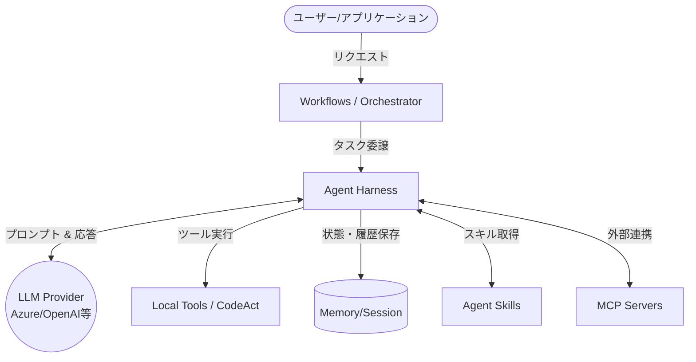

# **Microsoft Agent Framework 調査レポート**

## **1. 基本情報**

* **ツール名**: Microsoft Agent Framework
* **ツールの読み方**: マイクロソフト エージェント フレームワーク
* **開発元**: Microsoft
* **公式サイト**: [https://learn.microsoft.com/en-us/agent-framework/](https://learn.microsoft.com/en-us/agent-framework/)
* **関連リンク**:
  * GitHub: [https://github.com/microsoft/agent-framework](https://github.com/microsoft/agent-framework)
  * DeepWiki: [https://deepwiki.com/microsoft/agent-framework](https://deepwiki.com/microsoft/agent-framework)
  * CodeWiki: [https://codewiki.google/github.com/microsoft/agent-framework](https://codewiki.google/github.com/microsoft/agent-framework)
* **カテゴリ**: エージェント開発基盤
* **概要**: Microsoft Agent Framework (MAF) は、堅牢で将来性のあるAIエージェントソリューションを構築するためのオープンソースフレームワークです。単一エージェントから複雑なマルチエージェントオーケストレーションまで、Pythonと.NETの双方で一貫した開発基盤を提供します。

## **2. 目的と主な利用シーン**

* **解決する課題**: 複雑化するAIアプリケーションにおける、複数エージェント間の連携、状態管理、ワークフローの可視化と制御の難しさを解消します。
* **想定利用者**: ソフトウェアエンジニア、AI開発者、エンタープライズ企業
* **利用シーン**:
  * 自律型エージェントによるオープンエンドなタスクの解決
  * グラフベースや宣言型（YAML）のワークフローを用いた、複数エージェントや機能の連携処理
  * 人間参加型（Human-in-the-loop）を含む長期的なAIタスクの実行と管理
  * GitHub Copilotの機能を活用した高度なコーディングエージェントの構築

## **3. 主要機能**

* **Agents (エージェント)**: LLMを利用して入力を処理し、ツールやMCPサーバーを呼び出して応答を生成する個別のエージェントを作成できます。
* **Agent Harness (エージェントハーネス)**: モデルをエージェント化するための足場となる機能。計画立案、ツール呼び出しループ、履歴永続化、承認管理などを標準搭載したランタイムを提供します。
* **Workflows (ワークフロー)**: エージェントと機能をグラフベースで接続し、マルチステップタスクを構築できます。Sequential、Concurrent、Group chat、Handoff、Magentic等のオーケストレーションパターンを備えています。
* **Declarative Workflows (宣言型ワークフロー)**: YAML形式でエージェントの調整や状態変化、分岐などを明示的に定義でき、コードからオーケストレーションを分離できます。
* **Agent Skills (エージェントスキル)**: 特定ドメインの知識（指示、参照資料、スクリプト）をパッケージ化し、エージェントが必要な時にオンデマンドで動的に読み込んで利用できる機能です。
* **Tools & MCP Server Support**: MCP（Model Context Protocol）クライアントや各種ツールとの統合により、エージェントの機能を容易に拡張できます。
* **State Management (状態管理)**: 長期間実行されるシナリオや、人間の介入を必要とするプロセス向けに、堅牢なセッション状態の管理を提供します。
* **Telemetry & Middleware**: エージェントの動作をインターセプトするミドルウェアや、エンタープライズ向けのOpenTelemetry統合機能をサポートします。

## **4. 動作原理・システム構成**

* **アーキテクチャ**: アプリケーション組み込み型のライブラリ/フレームワークであり、クライアント環境（Python / .NET）で動作します。エージェントが各LLMプロバイダーのAPIを呼び出し、ツールやMCPサーバーと連携して処理を進めます。
* **主要コンポーネントとデータフロー**:
  * アプリケーションが `Agent`（または `HarnessAgent`）をインスタンス化し、LLMクライアント（Azure OpenAI等）を接続します。
  * `Agent Harness` がプロンプトの構築、ツールのルーティング、状態（メモリやセッション）の管理を行います。
  * `Workflows` が複数のエージェントをオーケストレーションし、人間（Human-in-the-loop）の承認や、外部ツール（MCP経由など）からの情報取得を制御します。



* **特筆すべき要素技術**:
  * **Magentic Orchestration**: マネージャーエージェントが目標とスペシャリストを与えられ、ラウンドごとに計画の見直しや作業の割り当てを自律的に行う動的オーケストレーション手法。
  * **CodeAct (Hyperlight/Monty)**: エージェントがサンドボックス内でPythonコード等を記述・実行し、計算や動的処理を行う仕組み。

## **5. 開始手順・セットアップ**

* **前提条件**:
  * Python (3.11以上) または .NET 8+ 環境
  * Azure OpenAI, OpenAI などの LLMプロバイダーのアカウントおよびAPIキー
* **インストール/導入**:

  ```bash
  # Pythonの場合
  pip install agent-framework

  # GitHub Copilot連携機能を使う場合
  pip install agent-framework-github-copilot
  ```

  ```bash
  # C# (.NET)の場合
  dotnet add package Microsoft.Agents.AI
  ```

* **初期設定**:
  * `AZURE_OPENAI_ENDPOINT` や `FOUNDRY_PROJECT_ENDPOINT` などの環境変数を設定します。
* **クイックスタート**:
  公式ドキュメントに従い、`Agent` クラスや `create_harness_agent` を初期化して `run` メソッドを呼び出します。

## **6. 特徴・強み (Pros)**

* **安定した主要コンポーネント**: Declarative Workflows、Harness、Agent Skillsなど、多くの主要機能が1.0の安定版としてリリースされており、本番環境での利用が推奨されています。
* **柔軟なオーケストレーションパターン**: Sequential、Handoffから高度なMagenticまで、用途に応じた制御モデルを選択でき、さらにYAMLによる宣言的定義も可能です。
* **Pythonと.NETの強力なデュアルサポート**: 双方の言語で一貫したAPIや機能を提供しており、Microsoft技術スタックと親和性が高い。
* **GitHub Copilot統合**: GitHub Copilot CLI/SDKをバックエンドとして利用し、Copilotの強力なコーディング機能（シェル実行、ファイル操作等）を活かしたエージェントを構築できます。

## **7. 弱み・注意点 (Cons)**

* **エコシステムの学習曲線**: 多機能かつエンタープライズ向けのアーキテクチャであるため、単純なチャットスクリプトを書くだけの用途ではオーバーヘッドとなる場合があります。
* **ドキュメントと情報の偏り**: ドキュメントやコミュニティのやり取りは主に英語であり、日本語でのトラブルシューティング情報は発展途上です。
* **急速な進化**: 非常に活発に開発が進んでおり、一部の実験的機能（Labs）などは仕様変更が頻繁に行われる可能性があります。

## **8. 料金プラン**

| プラン名 | 料金 | 主な特徴 |
|---------|------|---------|
| **オープンソース** | 無料 | GitHubで公開されており、誰でも利用可能（※別途利用するLLMやクラウドサービスの利用料は必要） |

* **課金体系**: フレームワーク自体の利用は無料です。連携するAIモデル（Azure OpenAI, GitHub Copilot等）の利用に応じた従量課金やサブスクリプション費用が発生します。
* **無料トライアル**: フレームワーク自体は完全無料のオープンソースです。

## **9. 導入実績・事例**

* **導入企業**: Microsoftのエコシステム内や、Azureを活用するエンタープライズ企業で導入が進められています。
* **導入事例**: AIソリューションの基盤として、社内ツール、サポートデスクのルーティング（自動対応）、コーディングアシスタントの構築などに活用されています。
* **対象業界**: 業界を問わず、AIを活用したシステム開発を行うあらゆる企業。

## **10. サポート体制**

* **ドキュメント**: Microsoft Learnにて、詳細なチュートリアル、アーキテクチャガイド、APIリファレンスが提供されています。
* **コミュニティ**: GitHubリポジトリにて活発な開発が行われており、Discordでのコミュニティや定期的なOffice Hours（公開ミーティング）も実施されています。
* **公式サポート**: Microsoftの標準的なサポートチャネルおよびGitHub Issueでの対応が基本となります。

## **11. エコシステムと連携**

### **11.1 API・外部サービス連携**

* **API**: PythonおよびC#向けのライブラリSDKとして提供されます。
* **外部サービス連携**: Azure OpenAI、OpenAI、Anthropic、Ollamaなどの主要なLLMプロバイダー。MCPサーバーを利用した多様な外部ツールとの連携。**GitHub Copilot**との統合によるコーディングエージェント構築など。

### **11.2 技術スタックとの相性**

| 技術スタック | 相性 | メリット・推奨理由 | 懸念点・注意点 |
|:---|:---:|:---|:---|
| **Python** | ◎ | SDKが完全にサポートされており、データサイエンスやAI開発の標準スタックと直結 | 特になし |
| **C# (.NET)** | ◎ | Microsoft技術スタックのファーストクラスサポートであり、エンタープライズシステムへの組み込みが容易 | 特になし |
| **JavaScript/TypeScript** | △ | 現時点では主要なサポート対象として明記されていない | 他の言語への対応状況に依存 |

## **12. セキュリティとコンプライアンス**

* **認証**: Azure Identityなど、各クラウドプロバイダーの標準的な認証メカニズムと統合可能。
* **データ管理**: アプリケーション側で管理。Azure環境と統合する場合はAzureのエンタープライズグレードのセキュリティに準拠可能。
* **準拠規格**: ユーザーのインフラストラクチャ（Azure等）に依存。

## **13. 操作性 (UI/UX) と学習コスト**

* **UI/UX**: 開発者向けのSDK/フレームワークですが、DevUIなどの統合UIツールを用いることで、エージェントのデバッグやテストなどの開発体験が向上します。
* **学習コスト**: Semantic KernelやAutoGenの経験があれば移行しやすいですが、グラフベースのワークフローや宣言型（YAML）定義など独自の概念の理解には一定の学習が必要です。

## **14. ベストプラクティス**

* **効果的な活用法 (Modern Practices)**:
  * 単純なチャットには `Agent` を、オーケストレーションのロジックが明確な場合は `Declarative Workflows`（YAML）を使用してコードと分離する。
  * 頻繁に変更される特定のドメイン知識は `Agent Skills` としてパッケージ化し、エージェントに動的に読み込ませる。
* **陥りやすい罠 (Antipatterns)**:
  * 全ての知識をシステムプロンプトに詰め込み、コンテキストウィンドウを肥大化させること（代わりに Agent Skills や RAG を活用する）。

## **15. ユーザーの声（レビュー分析）**

* **調査対象**: GitHub、開発者コミュニティ
* **総合評価**: 評価中（レビューサイトでの集計はなし。活発なOSSプロジェクトとして機能拡充への期待度が高い）
* **ポジティブな評価**:
  * Semantic KernelとAutoGenの利点を統合した強力な基盤への期待。
  * ワークフローによる明示的な制御のしやすさ、Magenticパターンの柔軟性。
  * GitHub Copilot Agentとの統合に対する利便性の高さ。
* **ネガティブな評価 / 改善要望**:
  * 初期段階におけるドキュメントの不足や、頻繁なアップデートへの追従の手間（ただし主要機能の1.0化により改善傾向）。
* **特徴的なユースケース**:
  * 既存のSemantic KernelやAutoGenベースのプロジェクトからの移行。コーディング作業の自律化。

## **16. 直近半年のアップデート情報**

* **2026-08-04**: .NETのv1.17.0リリース。Durable TaskとAzure Functionsの連携の改善や宣言型ワークフローでのエラーハンドリング強化等。
* **2026-07-30**: Pythonのv1.13.0および.NETのv1.16.0リリース。GitHub Copilot Agentが安定版となり、MCPスキルのディスカバリー機能等が強化された。
* **2026-07-23**: PythonのGitHub Copilotパッケージが安定版（1.0.0）としてリリース。
* **2026-07-23**: 宣言型ワークフロー（Declarative Workflows）が1.0に到達し、YAMLによるオーケストレーション管理がPythonおよび.NETで安定版に。
* **2026-07-22**: エージェントハーネス（Agent Harness）が安定版としてリリースされ、計画立案やツール呼び出しのループ、メモリ管理等の足場が提供された。
* **2026-07-15**: Python向けのAgent Skillsがリリース。ドメイン知識のパッケージ化と動的読み込みが安定化。
* **2026-07-08**: Sequential、Concurrent、Group chat、Handoff、Magenticなどの主要なオーケストレーションパターンが1.0に到達し安定化。
* **2026-02-20**: Microsoft LearnにてAgent Frameworkのドキュメント（パブリックプレビュー）が更新・公開されました。

(出典: [Microsoft Agent Framework Releases](https://github.com/microsoft/agent-framework/releases) / [Microsoft Dev Blogs](https://devblogs.microsoft.com/agent-framework/))

## **17. 類似ツールとの比較**

### **17.1 機能比較表 (星取表)**

| 機能カテゴリ | 機能項目 | 本ツール | LangChain | Dify |
|:---:|:---|:---:|:---:|:---:|
| **基本機能** | エージェント構築 | ◎<br><small>SKとAutoGenの統合、Harness搭載</small> | ◎<br><small>豊富なエコシステム</small> | ◯<br><small>ノーコード/ローコード</small> |
| **カテゴリ特定** | ワークフロー制御 | ◎<br><small>宣言型(YAML)や多彩なパターン(1.0)</small> | ◎<br><small>LangGraphによる強力な制御</small> | ◎<br><small>ビジュアルワークフロー</small> |
| **エンタープライズ** | 状態管理・監視 | ◎<br><small>強力なセッション管理、OpenTelemetry</small> | ◯<br><small>LangSmithによる運用監視</small> | ◯<br><small>組み込みの管理</small> |
| **非機能要件** | 日本語対応 | △<br><small>ドキュメントは主に英語</small> | ◯<br><small>コミュニティ情報豊富</small> | ◎<br><small>UI/ドキュメント対応</small> |

### **17.2 詳細比較**

| ツール名 | 特徴 | 強み | 弱み | 選択肢となるケース |
|---------|------|------|------|------------------|
| **本ツール** | Microsoftの次世代AIフレームワーク | C#とPythonの強力なサポート、宣言型ワークフロー、GitHub Copilot連携 | JavaScript/TypeScriptのエコシステムは発展途上 | エンタープライズ向けの堅牢なエージェントシステムをC#/Pythonで構築する場合 |
| **LangChain** | 最も普及しているAI開発フレームワーク | 圧倒的な連携機能とコミュニティ、LangGraphによる制御 | 抽象化が複雑になりがち、学習コスト高 | 既存の豊富なインテグレーションを活用したい場合 |
| **Dify** | LLMアプリケーション開発プラットフォーム | GUIベースで直感的に開発可能、BaaSとして機能 | コードベースの細かな制御に制限 | ノーコード/ローコードで素早く開発・運用したい場合 |

## **18. 総評**

* **総合的な評価**:
  Microsoft Agent Frameworkは、AutoGenの使いやすさとSemantic Kernelのエンタープライズ向け機能を融合させた、非常に有望な次世代AIフレームワークです。Agent Harness、Declarative Workflows、多彩なオーケストレーションパターンが安定版1.0に到達したことで、本番環境での利用へのハードルが大きく下がりました。
* **推奨されるチームやプロジェクト**:
  * 大規模なマルチエージェントシステムを構築する開発チーム。
  * すでにC# (.NET) やPythonでMicrosoftエコシステムを活用しているエンタープライズプロジェクト。
  * GitHub Copilotの機能を活用したカスタムコーディングエージェントを開発したいチーム。
* **選択時のポイント**:
  * 宣言型ワークフロー（YAML）を活用してオーケストレーションのロジックをコードから分離したい場合や、Agent Skillsを用いて動的に知識をロードさせる高度なアーキテクチャを指向する場合に、極めて強力な選択肢となります。
