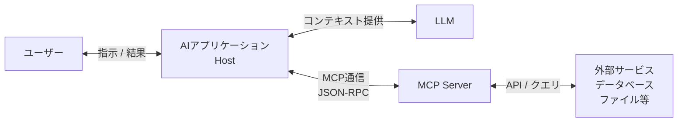

# **Model Context Protocol (MCP) 調査レポート**

## **1. 基本情報**

* **ツール名**: Model Context Protocol
* **ツールの読み方**: モデルコンテキストプロトコル
* **開発元**: Anthropic (オープンソースコミュニティ)
* **公式サイト**: [https://modelcontextprotocol.io/](https://modelcontextprotocol.io/)
* **関連リンク**:
  * GitHub: [https://github.com/modelcontextprotocol](https://github.com/modelcontextprotocol)
  * ドキュメント: [https://modelcontextprotocol.io/docs](https://modelcontextprotocol.io/docs)
* **カテゴリ**: MCPサーバー/基盤 / AIプロトコル
* **概要**: Model Context Protocol (MCP) は、AIモデルと外部のデータ、ツール、プロンプトを接続するためのオープン標準プロトコルです。これまでAIアプリケーションごとに個別に実装されていた統合（インテグレーション）を標準化し、一度サーバーを構築すれば、CursorやClaude Desktopなど、あらゆるMCP対応クライアントから利用可能にします。いわば「AIアプリケーションのためのUSBポート」のような役割を果たします。

## **2. 目的と主な利用シーン**

* **解決する課題**:
  * **サイロ化**: AIツールごとに異なるAPI統合を書く必要がある（n×m問題）。
  * **コンテキスト不足**: AIがローカルファイルや社内データベースなどの最新情報にアクセスできない。
  * **開発コスト**: 新しいデータソースを追加するたびに、すべてのAIツールに対してコネクタを開発するのは非効率。
* **想定利用者**:
  * AIアプリケーション開発者（クライアント側）
  * ツール・サービス開発者（サーバー側）
  * 日々の業務でAIを活用するエンジニア
* **利用シーン**:
  * **ローカル開発**: プロジェクト内のファイル構造やコードベースをAIに読み込ませてコーディング支援を受ける。
  * **データベース操作**: SQLクエリを実行したり、スキーマ情報を取得して分析する。
  * **外部API連携**: Linearのタスク管理、Slackのメッセージ送信、GitHubの操作などをAIから行う。
  * **情報検索**: Web検索や社内Wiki（Notion等）の内容を取得して回答の根拠にする。

## **3. 主要機能**

* **MCPサーバー**: データやツールを公開する軽量なサーバー。ローカルPC上やリモートサーバーで動作する。
* **MCPクライアント (Host)**: サーバーに接続し、ツールやリソースを利用するAIアプリケーション（例: Claude Desktop, Cursor, Zed）。
* **リソース (Resources)**: サーバーが提供する読み取り専用のデータ（ファイル、ログ、DBレコードなど）。
* **ツール (Tools)**: AIが実行可能な関数やアクション（APIコール、計算、データ操作など）。
* **プロンプト (Prompts)**: サーバー側で定義された、再利用可能なプロンプトテンプレート。
* **トランスポート層**: JSON-RPC 2.0を用いた通信。Stdio（標準入出力）またはSSE（Server-Sent Events）をサポート。

## **4. 動作原理・システム構成**

* **アーキテクチャ**: クライアント・サーバー構成（C/Sモデル）。Host（AIアプリケーション）とClient（プロトコル処理層）がServer（データ・ツール提供側）とJSON-RPC 2.0を用いて通信する。
* **主要コンポーネントとデータフロー**:
  * **Host / Client**: AIアプリケーション側。ユーザーの指示を受け、LLMと連携しながら必要な情報をMCPサーバーに要求する。
  * **Server**: データソースやツールと直接やり取りし、その結果をプロトコルに従ってクライアントに返す。
  * **トランスポート層**: Stdio（標準入出力）を利用したローカルプロセス間通信、またはSSE（Server-Sent Events）を利用したHTTPベースの通信。
* **特筆すべき要素技術**:
  * **JSON-RPC 2.0**: シンプルで軽量なリモートプロシージャコール。
  * **サンドボックス化**: サーバープロセスは限定された権限・環境で動作可能にし、AIがホストシステム全体にアクセスするのを防ぐ設計（Human-in-the-loopの推奨）。



## **5. 開始手順・セットアップ**

* **前提条件**:
  * Node.js または Python 環境（SDK利用時）
  * MCP対応クライアント（Claude Desktop, Cursorなど）
* **インストール/導入**:
  各クライアントの設定ファイルに、使用したいMCPサーバーのコマンドを記述する。
  例（Claude Desktopの場合 `~/Library/Application Support/Claude/claude_desktop_config.json`）:

  ```json
  {
    "mcpServers": {
      "sqlite": {
        "command": "uvx",
        "args": ["mcp-server-sqlite", "--db-path", "/path/to/db.sqlite"]
      }
    }
  }
  ```

* **初期設定**:
  * 必要なMCPサーバーをインストール（`npm install` や `pip install`、あるいは `npx`/`uvx` で直接実行）。
  * 設定ファイルを編集してクライアントを再起動。
* **クイックスタート**:
  * 公式の [Quickstart Guide](https://modelcontextprotocol.io/quickstart) に従い、シンプルなMCPサーバーを作成・接続する。
  * 既存のコミュニティ製サーバー（GitHub, Google Drive, PostgreSQLなど）を利用する。

## **6. 特徴・強み (Pros)**

* **エコシステムの統一**: 「一度書けばどこでも動く（Write once, run anywhere）」を実現。開発者は特定のAIモデルに依存せずにツールを作成できる。
* **セキュリティ**: サーバーはサンドボックス化されており、AIがアクセスできる範囲を明確に制御可能。
* **柔軟性**: ローカルのCLIツールからクラウドサービスまで、あらゆるものをAIに接続できる。
* **主要プレイヤーの支持**: Anthropicが主導し、Microsoft, Google, Zed, Replitなどがサポートや関心を表明しており、将来性が高い。

## **7. 弱み・注意点 (Cons)**

* **クライアントの対応状況**: 急速に普及しているものの、すべてのAIツールがMCPに対応しているわけではない。
* **設定の手間**: 現状ではJSON設定ファイルを手動で編集する必要があるケースが多く、非エンジニアにはハードルが高い（Smitheryなどのインストーラーで改善されつつある）。
* **ローカルサーバーの管理**: ローカルで多数のサーバーを動かす場合、リソース消費や管理が煩雑になる可能性がある。

## **8. 料金プラン**

Model Context Protocol 自体はオープンソース（MITライセンス）であり、完全に無料。

| プラン名 | 料金 | 主な特徴 |
|---------|------|---------|
| **OSS** | 無料 | 仕様、SDK、サンプルコードがすべて公開されている。 |

* **課金体系**: なし（ただし、接続先の外部APIやサービス利用料は別途発生する）。

## **9. 導入実績・事例**

* **導入企業**: Anthropic (Claude), Cursor, Windsurf (Codeium), Zed, Replit, Sourcegraph (Cody) などがクライアントとして対応。
* **サーバー実装**: Google Drive, Slack, GitHub, PostgreSQL, Linear, Notion などの主要サービスのMCPサーバーが公開されている。
* **コミュニティ**: 発表直後から数多くのコミュニティ製サーバー（mcp-servers）が開発されている。

## **10. サポート体制**

* **ドキュメント**: 公式ドキュメントが充実しており、チュートリアルやAPIリファレンスが整備されている。
* **コミュニティ**: DiscordサーバーやGitHub Discussionsが活発。
* **公式サポート**: 特定の企業による商用サポートはないが、エコシステム全体でサポートが行われている。

## **11. エコシステムと連携**

### **11.1 API・外部サービス連携**

* **API**: JSON-RPCベースのシンプルなプロトコル。
* **外部サービス連携**: 基本的にあらゆるAPIをラップしてMCPサーバー化できるため、連携範囲は無限大。

### **11.2 技術スタックとの相性**

| 技術スタック | 相性 | メリット・推奨理由 | 懸念点・注意点 |
|:---|:---:|:---|:---|
| **TypeScript / Node.js** | ◎ | 公式SDKがあり、エコシステムが最も充実している。 | 特になし。 |
| **Python** | ◎ | 公式SDKがあり、データ分析やAI系ライブラリとの親和性が高い。 | 環境構築（venv等）が必要。 |
| **Java / Kotlin** | ◯ | コミュニティ製SDKが存在する。 | 公式SDKほどの更新頻度ではない可能性。 |

## **12. セキュリティとコンプライアンス**

* **認証**: プロトコル自体には認証機構は含まれないが、トランスポート層やサーバー実装側でAPIキー等の管理を行う。
* **データ管理**: クライアント（Host）がユーザーの承認を得てからツールを実行するモデル（Human in the loop）が推奨されており、勝手にデータを送信したり破壊的な操作を行ったりすることを防ぐ仕組みがある。
* **準拠規格**: オープン標準として透明性が高い。

## **13. 操作性 (UI/UX) と学習コスト**

* **UI/UX**: ユーザーはチャットインターフェースから自然言語で指示するだけで、裏側でMCPツールが動くため、体験は非常にシームレス。
* **学習コスト**: サーバー開発者にとっては、シンプルなRPCサーバーを書くだけなので学習コストは低い。SDKが複雑さを隠蔽してくれる。

## **14. ベストプラクティス**

* **効果的な活用法 (Modern Practices)**:
  * **Smitheryの利用**: MCPサーバーの検索・インストールにCLIツール `smithery` を使うと設定が楽になる。
  * **単一責任の原則**: 1つのMCPサーバーに機能を詰め込みすぎず、機能ごとにサーバーを分ける。
  * **MCP Appsの活用**: UI拡張機能を利用してインタラクティブなコンポーネントを提供する。
* **陥りやすい罠 (Antipatterns)**:
  * **重すぎる処理**: タイムアウトを考慮せず、長時間かかる処理を同期的に実行させる。
  * **過剰な権限**: `rm -rf` のような危険なコマンドをガードなしで実行できるようにする。

## **15. ユーザーの声（レビュー分析）**

* **調査対象**: X (Twitter), GitHub, Tech Blog
* **総合評価**: 「AIのiPhoneモーメント」「これこそ待ち望んでいた標準化」といった絶賛の声が多い。
* **ポジティブな評価**:
  * 「CursorとClaudeで同じツールが使えるのが最高」
  * 「自分専用のツールを簡単に作ってAIに組み込める」
* **ネガティブな評価 / 改善要望**:
  * 「Windowsでのセットアップが少し面倒（パスの問題など）」
  * 「まだ対応していないエディタがある」

## **16. 直近半年のアップデート情報**

* **2026-08-31**: コアサーバー実装（`server-filesystem`, `server-memory`, `server-sequential-thinking` 等）の大型アップデートとなる Release 2026.8.31 を公開。
* **2026-08-18**: サーバー実装（`server-everything`, `mcp-server-time`, `mcp-server-fetch`, `mcp-server-git` 等）のアップデートとなる Release 2026.8.18 を公開。
* **2026-07-28**: Model Context Protocol の 2026-07-28 リビジョンとなる Stable Release を公開。仕様が最新化される。
* **2026-04-08**: メンテナー体制の拡充（Core MaintainerおよびLead Maintainerの追加）
* **2026-03-16**: ツールアノテーションに関する機能追加と議論の進展
* **2026-01-26**: 公式拡張機能としての「MCP Apps」のリリース

(出典: [Model Context Protocol Blog](https://blog.modelcontextprotocol.io/) / [GitHub Releases (Specification)](https://github.com/modelcontextprotocol/specification/releases) / [GitHub Releases (Servers)](https://github.com/modelcontextprotocol/servers/releases))

## **17. 類似ツールとの比較**

### **17.1 機能比較表 (星取表)**

| 機能カテゴリ | 機能項目 | MCP | Agent Skills | LangChain |
|:---:|:---|:---:|:---:|:---:|
| **標準化** | 共通プロトコル/フォーマット | ◎<br><small>サーバー接続の業界標準</small> | ◯<br><small>スキル定義の標準</small> | △<br><small>FW依存のツール定義</small> |
| **ポータビリティ** | クライアント間移動 | ◎<br><small>設定のみで可</small> | ◎<br><small>YAML等で共有可能</small> | △<br><small>コード修正要</small> |
| **実装言語** | SDK対応 | ◎<br><small>TS/Python他</small> | ◯<br><small>言語非依存(設定ファイル)</small> | ◎<br><small>TS/Python</small> |
| **ローカル連携** | ローカルファイル/プロセス | ◎<br><small>Stdio接続による強固な連携</small> | △<br><small>エージェントの実装に依存</small> | ◯<br><small>実装次第</small> |

### **17.2 詳細比較**

| ツール名 | 特徴 | 強み | 弱み | 選択肢となるケース |
|---------|------|------|------|------------------|
| **Model Context Protocol** | オープンな接続プロトコル | クライアントとサーバーがN:Mで接続可能。ローカルリソースとの連携に極めて強い。 | クライアント側の対応が必要。 | 汎用的なツールを作り、複数のAIエディタや環境で使い回したい場合。 |
| **Agent Skills** | スキル定義の標準フォーマット | エージェントの「能力」を再利用・共有しやすい。 | ランタイム側のサポートが必要。 | 複雑なワークフローや専門知識をエージェント間で共有したい場合。 |
| **LangChain** | アプリ開発FW内のツール定義 | LangChainのエコシステム内でリッチな連鎖が可能。 | LangChainというフレームワークへの依存が発生する。 | LangChainを使って独自のAIアプリケーションを構築する場合。 |

## **18. 総評**

* **総合的な評価**:
  Model Context Protocolは、AIとツールの連携における「共通言語」を確立した革命的な技術である。これまで分断されていたAIエコシステムをつなぎ、開発者が一度の労力で最大の価値を提供できる環境を整えた。
* **推奨されるチームやプロジェクト**:
  * 社内ツールや独自のデータソースをAIに安全に接続したい企業。
  * AI開発ツールやエージェントを作成しているベンダー。
* **選択時のポイント**:
  * 独自のツールを開発する場合、まずはMCPサーバーとして実装することを強く推奨する。それにより、Cursor, Claude, Windsurfなど多くのプラットフォームですぐに利用可能になるからだ。
